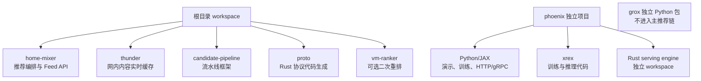
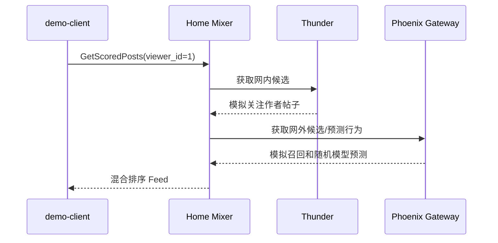
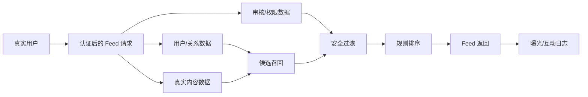
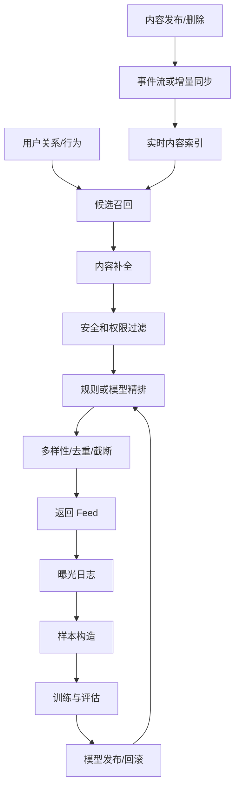
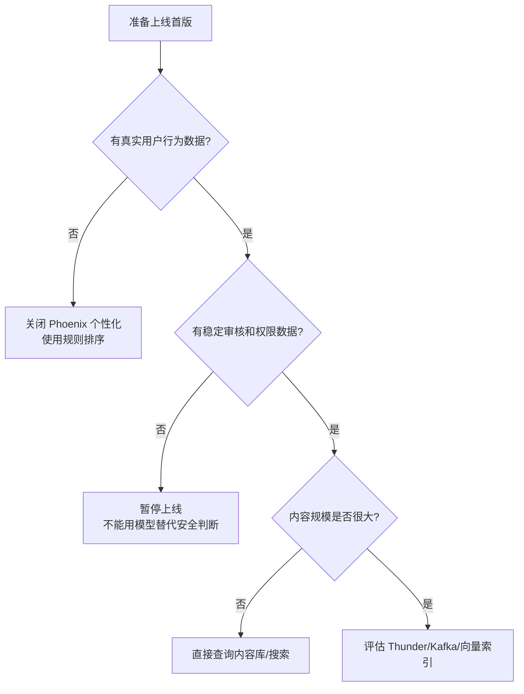

# 00. 目标、边界和阶段

> **状态**：`runbook`
>
> 本文先回答一个最重要的问题：到底什么叫“当前仓库完整运行起来”。如果不先划清边界，很容易出现服务端口都监听了，却没有真实数据、没有安全判断、没有有效模型的情况。

## 1. 项目不是一个单体程序

当前仓库实际上包含三条能力线：



| 模块 | 业务职责 | 启动时是否必须 | 没有它会怎样 |
|---|---|---:|---|
| `home-mixer` | 接收 Feed 请求，编排召回、补全、过滤、排序和返回 | 是 | 没有推荐入口 |
| `thunder` | 保存并查询关注网络的近期帖子 | L2 Demo 是 | 没有网内候选 |
| `phoenix` | 机器学习召回、精排和模型服务 | L2 Demo 是 | 只能走规则/降级路径 |
| `candidate-pipeline` | 提供各阶段接口和容错语义 | 编译时是 | Home Mixer 无法组装 |
| `proto` | 生成 Rust gRPC 类型 | 编译时是 | 服务之间无法通信 |
| `vm-ranker` | 二次重排和作者/内容多样性 | 否 | 不影响主推荐链路 |
| `grox` | 独立安全/任务流 | 否 | 不影响主推荐链路 |

## 2. 五个运行阶段

### 阶段 A：代码可编译

目标：确认机器、工具链、依赖和协议生成正常。

```text
准备工具 → 安装依赖 → 编译 → 单元测试
```

这一阶段不需要任何业务数据。

### 阶段 B：模型可运行

目标：单独验证 Phoenix 的精排和召回。

```text
模型初始化 → 构造模拟输入 → 前向计算 → 输出预测/相似度
```

默认权重是随机的，因此这里只验证张量和代码，不验证推荐质量。

### 阶段 C：模拟端到端

目标：三个主要服务在本地相互调用并返回非空 Feed。



这个阶段不需要 Kafka、Redis、真实用户服务、真实内容服务或 GPU。

### 阶段 D：真实数据 MVP

目标：把演示客户端替换成真实业务数据接口，并保证安全、去重和可解释。



这一阶段可以先不用机器学习模型，也可以不用 Thunder。优先证明业务闭环正确。

### 阶段 E：生产规模系统

目标：稳定承载真实流量，并能够持续更新内容、模型和配置。



## 3. 当前代码可以承诺什么

| 能力 | 当前代码事实 | 能否直接用于生产 |
|---|---|---:|
| Rust workspace 编译 | 已提供 | 不能单凭编译证明生产可用 |
| Phoenix 本地推理 | 已提供 | 需要真实权重、特征和容量验证 |
| Phoenix 训练 | 已提供模拟/离线路径 | 不包含生产数据和调度平台 |
| Thunder Demo | 已提供内置种子 | 不等同于 Kafka 生产摄入 |
| Home Mixer Demo | 已提供 Demo 客户端 | 不等同于真实用户/内容服务 |
| Business Feed | 已提供规则链路和 gRPC 客户端 | 需要真实 mrpyq/推荐数据服务 |
| SocialGraph 反向屏蔽 | 已提供端口、Hydrator 和测试 | 没有真实 Adapter，暂不能启用 |
| 内容安全 | Demo 可显式放行 | 生产必须接权威审核/可见性结果 |
| 曝光记录 | 有接口/目标设计 | 需要真实存储、schema、幂等和保留策略 |

## 4. 必须先做的业务选择

### 选择一：先做哪种 Feed

| 选项 | 适合场景 | 最少依赖 |
|---|---|---|
| 规则型业务 Feed | 有明确业务内容、账号和互动指标 | 推荐数据服务、内容服务 |
| For You 帖子 Feed | 有用户关注关系和帖子内容 | 用户关系、内容、审核、行为数据 |
| 纯网内 Feed | 只展示关注作者内容 | 关注关系、内容服务 |
| 全站发现 Feed | 强调探索和兴趣发现 | 内容池、热度、向量/模型召回 |

### 选择二：哪些能力可以暂时屏蔽



可以关闭，但要写清楚代价：

| 可关闭项 | 关闭后的代价 |
|---|---|
| Phoenix 精排 | 个性化下降，但可用规则排序替代 |
| Phoenix Retrieval | 缺少非关注内容发现 |
| Thunder | 不能高效提供关注网络实时内容，可先查内容库 |
| VM Ranker | 少一层复杂重排，主排序仍可用 |
| Kafka | 内容更新可能不够实时，但可先轮询或批量同步 |
| SocialGraph 候选级查询 | 只能依赖已有用户级关系快照，可能漏掉相关作者关系 |
| 作者冷启动 | 新作者曝光机会较少，可先用简单新鲜度策略 |

不能随意关闭：

- 身份认证；
- 删除/审核/权限判断；
- 基础拉黑和静音；
- 曝光日志；
- 基本去重；
- 空结果和错误监控。

## 5. 推荐的实施原则

1. **先让真实内容安全地返回，再追求模型效果。**
2. **先复用已有服务，不急着新建 Kafka、Redis、向量库和 Feature Store。**
3. **每个外部服务都通过客户端接口接入，业务代码不直接写网络细节。**
4. **未提供协议、认证和错误语义的外部能力，只保留接口和文档，不写假实现。**
5. **每个阶段单独验收、单独提交，便于回滚和判断收益。**
6. **协议同步不等于功能启用；字段存在不代表业务已经消费。**
