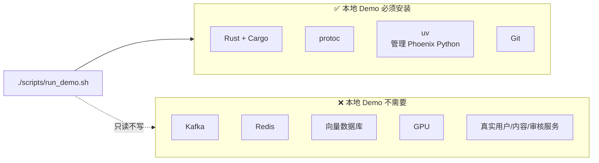
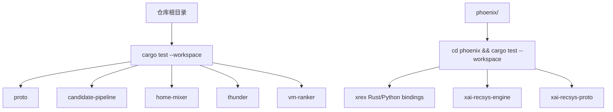
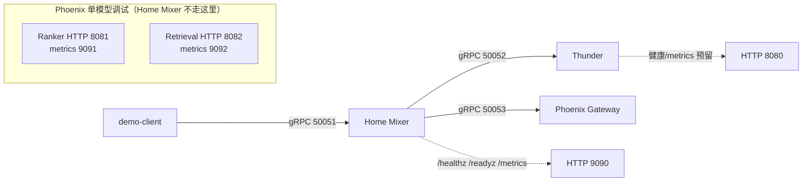

# 01. 环境和基础设施准备

> **状态**：`runbook`
>
> 本文只解决“开始运行前要准备什么”。读完你能知道：本地演示需要装哪 4 个工具、哪些东西**不用装**、两个 Rust workspace 为什么分开编译、9 个默认端口分别被谁占用。
>
> 先按 L0/L1/L2 本地演示准备；真实数据和生产环境的额外依赖见 [05-真实数据和业务依赖接入](./05-真实数据和业务依赖接入.md) 和 [07-生产化、验收和故障排查](./07-生产化验收和故障排查.md)。

## 0. 一图看懂：要装什么、不用装什么



## 1. 本地演示的最小准备

### 1.1 必须安装

| 工具 | 建议版本/要求 | 用途 | 缺失时的表现 |
|---|---|---|---|
| Rust + Cargo | 使用当前 stable，项目使用 Edition 2021/2024 crate | 编译 Home Mixer、Thunder、协议和 VM Ranker | `cargo` 找不到或编译失败 |
| `protoc` | 可执行文件可在 PATH 中找到 | 根据 `.proto` 生成 Rust/Python 类型 | build script 找不到 protoc |
| `uv` | 最新稳定版 | 管理 Phoenix Python 3.11+ 环境和依赖 | Phoenix 脚本无法启动 |
| Git | 能访问当前仓库 | 获取代码、查看版本和回滚 | 无法固定代码版本 |

### 1.2 不需要安装

只跑本地 Demo 时不需要：

- Kafka；
- Redis；
- 向量数据库；
- GPU；
- 真实用户服务；
- 真实内容服务；
- 真实审核服务；
- SocialGraph；
- MRpyq 推荐数据服务。

### 1.3 安装示例

#### macOS

```bash
# Rust
curl --proto '=https' --tlsv1.2 -sSf https://sh.rustup.rs | sh

# protoc（Homebrew）
brew install protobuf

# uv
curl -LsSf https://astral.sh/uv/install.sh | sh

# 重新加载 shell 配置后检查
rustc --version
cargo --version
protoc --version
uv --version
```

#### Ubuntu/Debian

```bash
sudo apt-get update
sudo apt-get install -y build-essential pkg-config libssl-dev protobuf-compiler curl git
curl --proto '=https' --tlsv1.2 -sSf https://sh.rustup.rs | sh
curl -LsSf https://astral.sh/uv/install.sh | sh

rustc --version
cargo --version
protoc --version
uv --version
```

## 2. Python 环境

Phoenix 要求 Python `>=3.11`。不要直接使用系统 Python，尤其是 macOS 上可能仍是 Python 3.9。

```bash
cd phoenix
uv sync --dev --group service
uv run python --version
uv run pytest
```

当前依赖分为：

| 依赖组 | 用途 |
|---|---|
| 项目默认依赖 | JAX、Haiku、NumPy、Optax、gRPC、Parquet、checkpoint 等 |
| `dev` | pytest、requests、类型检查工具 |
| `service` | FastAPI、uvicorn、grpcio、protobuf、服务运行依赖 |
| `engine` extra | Rust/PyO3 推理引擎和 Linux CUDA 相关依赖 |
| `telemetry` extra | W&B、ClickHouse、OTel 等可选观测能力 |

如果本地环境对缓存目录没有写权限：

```bash
cd phoenix
UV_CACHE_DIR=/tmp/uv-cache uv sync --dev --group service
UV_CACHE_DIR=/tmp/uv-cache uv run pytest
```

## 3. Rust workspace 边界

根目录和 Phoenix 是两个独立 workspace：



根 workspace 的 `Cargo.toml` 明确排除了 `phoenix/`，所以必须分别执行两套命令。

## 4. 端口规划

先用一张图看清楚 Demo 跑起来后谁占哪个端口：



记住三个端口就能跑通 Demo：**50051（Home Mixer）、50052（Thunder）、50053（Phoenix）**。其余端口都是手动启动单模型调试服务时才会用到。

### 4.1 默认端口

| 服务 | 默认端口 | 协议 | 用途 |
|---|---:|---|---|
| Home Mixer gRPC | 50051 | gRPC | `GetScoredPosts`、`GetForYouFeed` |
| Home Mixer HTTP | 9090 | HTTP | 管理端口：`/healthz`、`/readyz`、`/metrics`（Prometheus） |
| Thunder gRPC | 50052 | gRPC | 网内候选查询 |
| Thunder HTTP | 8080 | HTTP | 健康/metrics 预留端口，路由仍为空 |
| Phoenix gRPC Gateway | 50053 | gRPC | Home Mixer 调用的召回和预测服务 |
| Phoenix Ranker HTTP | 8081 | HTTP | 单独调试精排模型 |
| Phoenix Retrieval HTTP | 8082 | HTTP | 单独调试召回模型 |
| Phoenix Ranker metrics | 9091 | HTTP | HTTP 精排服务指标 |
| Phoenix Retrieval metrics | 9092 | HTTP | HTTP 召回服务指标 |

### 4.2 启动前检查

```bash
for port in 50051 50052 50053 8080 8081 8082 9090 9091 9092; do
  lsof -iTCP:"$port" -sTCP:LISTEN || true
done
```

如果使用 `./scripts/run_demo.sh`，它会检查 50051、50052、50053。其他端口由手动启动的服务使用。

## 5. 磁盘和内存

本地 Demo 需要：

- Rust 编译缓存空间；
- Python 虚拟环境和 JAX 依赖空间；
- Phoenix 首次 JAX 编译的临时空间；
- 训练时的 checkpoint 输出目录。

建议：

| 场景 | 建议 |
|---|---|
| 只跑 Demo | 至少预留 10 GB 磁盘和 4 GB 可用内存 |
| 本地训练 nano | 至少预留 10 GB 磁盘和 8 GB 可用内存 |
| 真实大数据训练 | 不能使用本地 Demo 规格，按数据量和模型大小单独规划 |
| Rust/PyO3 测试 | 使用 `PYO3_PYTHON` 指向 uv 管理的 Python |

## 6. 环境检查清单

```bash
# 代码位置和分支
git rev-parse --show-toplevel
git branch --show-current

# 必须工具
command -v cargo
command -v protoc
command -v uv

# 版本
rustc --version
cargo --version
protoc --version
uv --version

# 根 workspace
cargo metadata --no-deps --format-version 1 >/dev/null
cargo build --workspace

# Phoenix Python
cd phoenix
uv sync --dev --group service
uv run python --version
uv run pytest
cd ..
```

全部成功后，才进入 [02-本地编译和单模块验证](./02-本地编译和单模块验证.md)。

## 7. 企业网络、代理和离线准备

如果不能直接访问 crates.io、PyPI 或 GitHub，需要提前准备：

| 内容 | 要准备什么 | 用在哪里 |
|---|---|---|
| Rust registry 镜像 | Cargo registry/index 镜像地址 | `cargo build` / `cargo test` |
| Python index 镜像 | `UV_INDEX_URL` 或组织内镜像 | `uv sync` |
| Git 镜像 | 仓库和子模块可访问 | 初始化代码 |
| 依赖缓存 | CI 或开发机缓存目录 | 加快重复构建 |
| 证书 | 企业 CA 和系统信任链 | HTTPS 下载和远程服务 |
| 代理 | HTTP/HTTPS 代理地址 | 依赖下载、模型/数据访问 |

不要把账号、密码、token 写进仓库、`.proto`、启动脚本或 Dockerfile。使用环境变量、Secret Manager 或运行平台的密钥注入能力。
