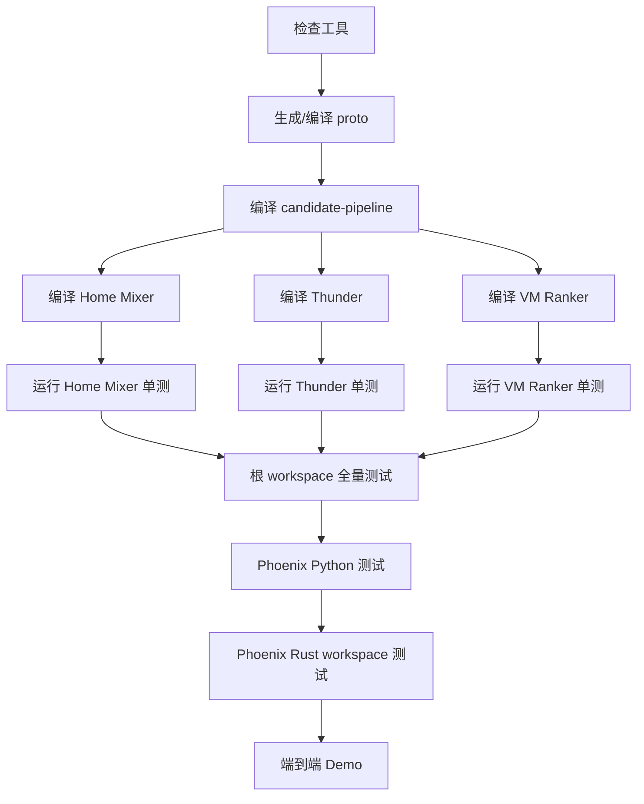

# 02. 本地编译和单模块验证

> **状态**：`current-code` + `runbook`
>
> 本文给出从“小范围确认”到“完整测试”的顺序。这样失败时能知道是工具问题、协议问题、某个服务问题，还是端到端装配问题。

## 1. 建议验证顺序



## 2. 协议先行验证

仓库中的协议源文件主要在：

```text
proto/definitions/*.proto
```

根 workspace 的 `proto` crate 会在构建时调用 `protoc` 生成 Rust 类型：

```bash
cargo test -p x-algorithm-proto
```

查看可用包名：

```bash
cargo metadata --no-deps --format-version 1 \
  | jq -r '.packages[] | [.name, .manifest_path] | @tsv'
```

Phoenix 有独立的 proto crate：

```bash
cd phoenix
cargo test -p xai-recsys-proto
```

Python proto 由 `phoenix/python/common/xai-proto/hatch_build.py` 在构建时生成，源文件是：

```text
phoenix/python/common/xai-proto/proto/recsys.proto
```

## 3. 局部编译和测试

### 3.1 Home Mixer

```bash
cargo test -p home-mixer
cargo build -p home-mixer
```

它验证：

- 请求解析和 QueryBuilder；
- Candidate Pipeline 装配；
- Hydrator、Filter、Scorer、Selector；
- Phoenix/Thunder 客户端边界；
- For You Feed 和 Business Feed 的 RPC 接口。

### 3.2 Thunder

```bash
cargo test -p thunder
cargo build -p thunder
```

它验证：

- 内存帖子存储；
- 创建和删除事件处理；
- 网内候选查询；
- gRPC 请求和响应；
- Demo 种子数据。

### 3.3 Candidate Pipeline

```bash
cargo test -p candidate-pipeline
cargo build -p candidate-pipeline
```

重点确认：

- Hydrator 保持输入输出数量对应；
- 单个组件失败不会破坏整条链路；
- Filter、Scorer、Selector 的顺序和容错语义没有变化；
- 缓存和 SideEffect 没有反向阻塞主请求。

### 3.4 VM Ranker

```bash
cargo test -p vm-ranker
cargo build -p vm-ranker
```

VM Ranker 不是主链路必需项，默认不启动。先验证服务自身，再决定是否接入 Home Mixer。

## 4. 根 workspace 全量验证

```bash
cargo fmt --all -- --check
cargo test --workspace
```

建议在 CI 中再执行：

```bash
cargo clippy --workspace --all-targets -- -D warnings
```

当前项目的根 workspace 与 Phoenix 分开，因此根目录测试不会覆盖 Phoenix。

## 5. Phoenix Python 验证

```bash
cd phoenix
uv sync --dev --group service
uv run pytest
```

验证范围包括：

- 精排模型张量形状；
- attention mask；
- 召回模型；
- gRPC 契约；
- 策略装配；
- 数据预处理；
- checkpoint 基础读写。

运行单模型演示：

```bash
uv run scripts/run_ranker.py
uv run scripts/run_retrieval.py
```

## 6. Phoenix Rust workspace 验证

普通情况下：

```bash
cd phoenix
PYO3_PYTHON="$PWD/.venv/bin/python3" cargo test --workspace
```

如果 `.venv` 不存在：

```bash
cd phoenix
uv sync --dev --group service
PYO3_PYTHON="$PWD/.venv/bin/python3" cargo test --workspace
```

macOS 常见问题是 PyO3 测试二进制链接到了系统 Python framework，而不是 uv 环境。出现 `dyld`、`Python3.framework`、`no LC_RPATH` 时，优先使用上面的绝对路径。

## 7. 协议修改后的额外验证

修改 `.proto` 后至少执行：

```bash
# Rust
cd phoenix
cargo test -p xai-recsys-proto

# Python 构建和解析
uv run python -m grpc_tools.protoc \
  -I python/common/xai-proto/proto \
  --python_out=/tmp/xai_proto_check \
  --pyi_out=/tmp/xai_proto_check \
  --grpc_python_out=/tmp/xai_proto_check \
  python/common/xai-proto/proto/recsys.proto
```

还要确认 Rust 和 Python 两份源文件一致：

```bash
cmp -s \
  phoenix/crates/serving/xai-recsys-proto/proto/recsys.proto \
  phoenix/python/common/xai-proto/proto/recsys.proto
```

## 8. 验收结果如何判断

| 结果 | 含义 | 下一步 |
|---|---|---|
| `cargo build` 失败 | 工具链、依赖或协议生成问题 | 先不要启动服务 |
| 局部 crate 测试失败 | 组件内部问题 | 只处理该模块 |
| 根 workspace 通过、Phoenix 失败 | 两个 workspace 或 PyO3 环境问题 | 单独处理 Phoenix |
| 单模型通过、gRPC 失败 | 服务包装或协议问题 | 检查端口和 proto |
| 三个服务都启动、Feed 为空 | 装配、模拟数据、过滤或外部依赖问题 | 查各服务日志和阶段计数 |
| Feed 非空但内容无意义 | 模型随机权重或数据是 Demo | 不要把 Demo 分数当业务效果 |

## 9. 通过后的里程碑

完成本文后，可以标记：

```text
L0 编译层：完成
L1 模型层：基本完成
```

然后进入 [03-Phoenix 模型、训练和产物](./03-Phoenix模型训练和产物.md)。
