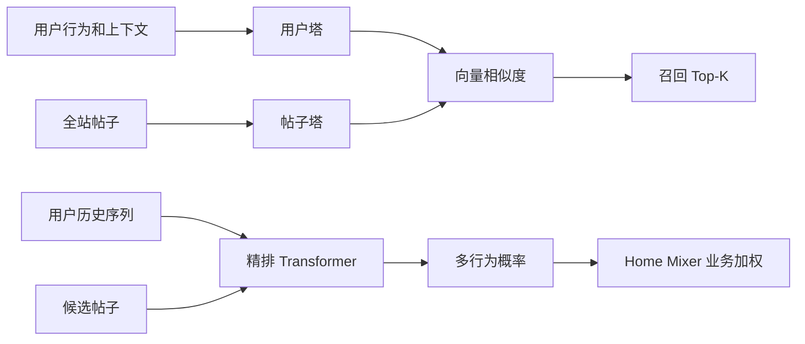
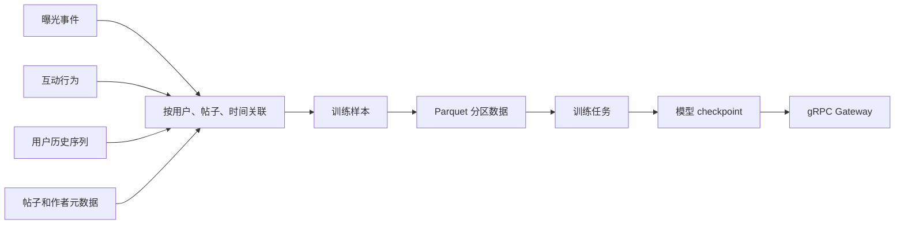
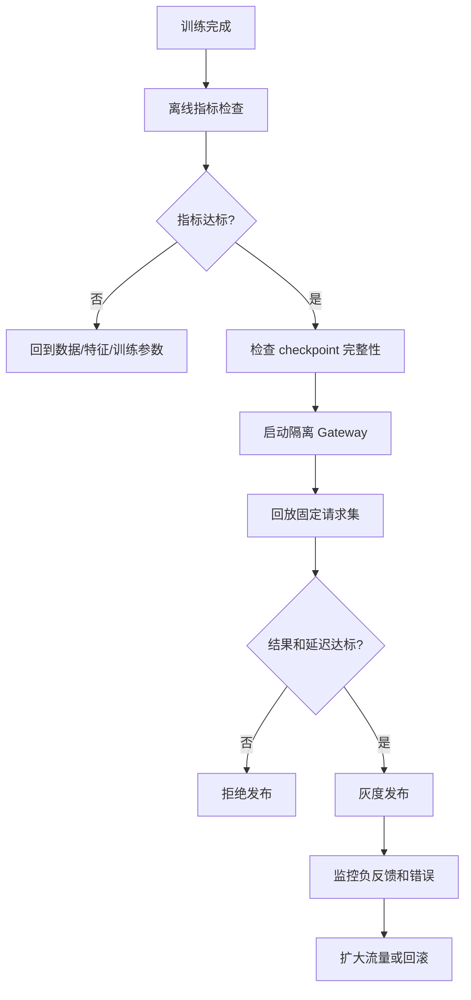

# 03. Phoenix 模型、训练和产物

> **状态**：`current-code` + `runbook`
>
> 本文讲 Phoenix 的模型、训练和产物。读完你能知道：为什么默认分数都是 0.5（随机权重）、从训练数据到 checkpoint 到 gRPC 服务是怎么串起来的、模型发布前要检查什么。
>
> Phoenix 既包含单模型演示，也包含训练和 gRPC 网关。三者解决的问题不同：
>
> - 单模型演示：确认代码和张量能运行；
> - 训练：生成有业务意义的模型产物；
> - gRPC 网关：让 Home Mixer 在端到端链路中调用模型。

## 1. Phoenix 的两条模型链



| 链路 | 输入 | 输出 | 当前可用状态 |
|---|---|---|---|
| Retrieval 双塔召回 | 用户 + 内容候选池 | 相关内容 Top-K | Demo 可用，候选池和权重可为模拟 |
| Ranking 精排 | 用户历史 + 候选帖子 | 多种行为概率和 dwell | Demo 可用，默认随机权重 |

## 2. 单模型演示

```bash
cd phoenix
uv run scripts/run_ranker.py
uv run scripts/run_retrieval.py
```

默认输出中的概率接近 `0.5` 是正常的，因为没有附带预训练权重。此时只能确认：

- Python 环境可用；
- JAX/Haiku 可初始化；
- 输入张量形状正确；
- attention mask 正常；
- 模型能输出结果。

不能据此判断：

- 推荐质量；
- 用户兴趣是否被理解；
- 模型是否比规则排序更好；
- 线上延迟是否达标。

## 3. HTTP 模型服务

启动两个单模型 HTTP 服务：

```bash
cd phoenix
uv run scripts/run_services.py all
```

服务：

| 服务 | 地址 | 接口 |
|---|---|---|
| Ranker | `http://localhost:8081` | `POST /v1/rank` |
| Retrieval | `http://localhost:8082` | `POST /v1/retrieve` |
| 健康检查 | 两个服务各自的 `/health` | 服务状态 |
| API 文档 | `http://localhost:8081/docs` | FastAPI 文档 |

示例：

```bash
curl -s -X POST http://localhost:8081/v1/rank \
  -H 'Content-Type: application/json' \
  -d '{"user_id":"user_1","candidate_ids":["post_a","post_b","post_c"]}'

curl -s -X POST http://localhost:8082/v1/retrieve \
  -H 'Content-Type: application/json' \
  -d '{"user_id":"user_1","top_k":5}'
```

HTTP 服务适合人工调试；Home Mixer 使用的是 Phoenix gRPC Gateway。

## 4. gRPC Gateway

随机权重启动：

```bash
cd phoenix
uv run scripts/run_grpc_gateway.py --corpus-size 1000
```

可选参数：

| 参数 | 作用 |
|---|---|
| `--port` | 默认 50053 |
| `--artifacts-dir` | 加载一套发布产物，优先于单独 checkpoint 参数 |
| `--ranker-checkpoint` | 精排模型参数文件 |
| `--retrieval-checkpoint` | 召回模型参数文件 |
| `--emb-tables` | 用户/帖子/作者嵌入表 |
| `--corpus-size` | Demo 候选池大小，`run_demo.sh` 使用 1000；提供 `--corpus-path` 时忽略 |
| `--corpus-path` | `scripts/build_retrieval_index.py` 产出的召回索引（`.npz`）。不传则合成演示 ID，召回结果在 mrpyq 水合不到、会被 `CoreDataHydrationFilter` 丢弃 |
| `--corpus-refresh-seconds` | 索引文件热替换的检查周期；文件被离线任务重建（mtime 变化）后在检索锁内原子切换，加载失败保留旧池 |

使用训练产物：

```bash
uv run scripts/run_grpc_gateway.py \
  --ranker-checkpoint checkpoints/model_params_step200.npz \
  --retrieval-checkpoint checkpoints_retrieval/retrieval_params_step200.npz \
  --emb-tables checkpoints/embedding_tables.npz
```

真实候选池：先离线编码可推荐帖子，再让网关加载并定时刷新。索引与 retrieval checkpoint 一一对应，网关拒绝加载模型版本不一致的索引；`corpus-version` trailing metadata（`model@built_at_ms:size`）标出回答请求的是哪一份索引。

网关广播的 `model-version` 是 `<标签>@<12 位内容哈希>`（`services/model_contract.py::checkpoint_model_version`）：标签是 bundle 目录名（如 `step-000200`）或平铺文件的 stem（如 `retrieval_params_step200`），哈希覆盖参数文件和实际加载的嵌入表。两次训练同名 step、或只换嵌入表，都会得到不同版本；`train_ranker.py` 把同一个值写进 `metadata.json` 的 `model_version`，网关启动时重新计算并拒绝不一致的 bundle。home-mixer 的 `PHOENIX_EXPECTED_MODEL_VERSION` 就钉这个字符串，直接从 `metadata.json` 或训练日志里抄。

```bash
# 输入至少两列 post_id / author_id（24 位 hex ObjectId：mrpyq feed_id / creator_member_id），
# 可选 created_at_ms；默认只保留最近 48 小时（与 home-mixer AgeFilter 一致）
uv run scripts/build_retrieval_index.py \
  --posts data/recommendable_posts.parquet \
  --retrieval-checkpoint checkpoints_retrieval/retrieval_params_step200.npz \
  --emb-tables checkpoints_retrieval/embedding_tables.npz \
  --output indexes/retrieval_index.npz

uv run scripts/run_grpc_gateway.py \
  --retrieval-checkpoint checkpoints_retrieval/retrieval_params_step200.npz \
  --emb-tables checkpoints_retrieval/embedding_tables.npz \
  --corpus-path indexes/retrieval_index.npz \
  --corpus-refresh-seconds 300
```

帖子清单由 mrpyq 侧提供（当前 `RecommendationDataService` 没有按时间枚举全部可推荐帖子的接口，这是接入前提）。

### 4.1 管道验证（不依赖真实模型）

在真实训练数据到位之前，可以先用模拟数据训一套"非随机"产物，把"索引 → 网关 → home-mixer 合同 → mrpyq 水合"这条管道跑通。产物的分数没有业务意义，只用来验证接线，不能上真实流量：

```bash
cd phoenix
# 1. 精排 bundle（v1 head 集合），召回 checkpoint 复用同一张嵌入表
uv run scripts/train_ranker.py --steps 20 --batch-size 4 --save-every 20 \
  --observed-actions favorite,reply,report --ckpt-dir /tmp/plumbing/ckpt
uv run scripts/train_retrieval.py --steps 20 --batch-size 8 --save-every 20 \
  --ckpt-dir /tmp/plumbing/ckpt --resume-emb
# 2. 用 mrpyq 导出的真实 feed_id / creator_member_id 建索引
uv run scripts/build_retrieval_index.py --posts recommendable_posts.csv \
  --retrieval-checkpoint /tmp/plumbing/ckpt/retrieval_params_step20.npz \
  --emb-tables /tmp/plumbing/ckpt/step-000020/embedding_tables.npz \
  --output /tmp/plumbing/retrieval_index.npz
# 3. 网关：ranker bundle + 召回 checkpoint + 索引
uv run scripts/run_grpc_gateway.py --port 50053 \
  --ranker-checkpoint /tmp/plumbing/ckpt/step-000020 \
  --retrieval-checkpoint /tmp/plumbing/ckpt/retrieval_params_step20.npz \
  --corpus-path /tmp/plumbing/retrieval_index.npz --corpus-refresh-seconds 300
```

网关日志里 `ranker=step-000020@…  retrieval=retrieval_params_step20@…` 两个版本都不是 `random`，trailing metadata 为 `random-weights=false`、`supported-actions=1,2,18`，home-mixer 非 demo 模式会接受。随后以 degraded 模式启动 home-mixer（`MRPYQ_RECOMMENDATION_DATA_ADDR` + `HOME_MIXER_REDIS_URL` + `PHOENIX_RETRIEVAL_GRPC_ADDR` / `PHOENIX_PREDICT_GRPC_ADDR`），用 `uas-worker` 从 stdin 给测试皮投影几条行为后请求 Feed，检查 `PhoenixSource` 的候选在 `CoreDataHydrationFilter` 之后仍然存活——这一步只有索引里的 ID 是 mrpyq 真实 `feed_id` 时才成立。

## 5. 训练数据需要准备什么

真正有意义的训练至少需要三类数据：



### 5.1 曝光事件

| 字段 | 含义 |
|---|---|
| `user_id` | 被推荐的用户 |
| `impression_time` | 曝光时间 |
| `candidate_post_ids[]` | 该次展示的帖子顺序 |
| `candidate_author_ids[]` | 对应作者 ID |
| `product_surface` | 首页、关注流、搜索、话题等场景 |

### 5.2 互动日志

| 字段 | 含义 |
|---|---|
| `user_id` | 用户 |
| `post_id` | 帖子 |
| `action_type` | favorite、reply、click、dwell 等 |
| `action_time` | 行为时间 |
| `dwell_seconds` | 停留时长 |

当前模型训练使用 19 个行为目标，具体字段和索引以 [训练数据规格](../training/training_data_spec.md) 为准。MVP 至少保证：

- favorite；
- reply；
- repost；
- click；
- dwell。

### 5.3 历史行为序列

每个用户按行为时间倒序取最近 32 条，短的补零：

```text
user_id
post_id
author_id
action_vector[19]
product_surface
action_time
```

## 6. 训练数据形状

| 数据 | 形状 | 说明 |
|---|---|---|
| `user_hashes` | `[B, 2]` | 2 路用户哈希 |
| `history_post_hashes` | `[B, 32, 2]` | 最近 32 条历史帖子 |
| `history_author_hashes` | `[B, 32, 2]` | 历史作者 |
| `history_actions` | `[B, 32, 19]` | 历史行为向量 |
| `candidate_post_hashes` | `[B, 8, 2]` | 训练候选帖子 |
| `candidate_author_hashes` | `[B, 8, 2]` | 训练候选作者 |
| `labels` | `[B, 8, 19]` | 候选行为标签 |

重要约束：

- 0 是 padding，不要把有效 ID 哈希成 0；
- 嵌入表第 0 行必须全零；
- 训练和推理必须使用同一套哈希规则；
- 训练候选长度默认 8，在线网关可以分块处理更多候选；
- `dwell_time` 是连续值，不要当成普通二分类标签处理。

## 7. 先用模拟数据训练

```bash
cd phoenix
uv run scripts/train_ranker.py --steps 200 --batch-size 8
uv run scripts/train_retrieval.py --steps 200
```

这一步只验证：

- 数据加载；
- loss 计算；
- 梯度更新；
- checkpoint 保存；
- 恢复训练；
- 服务加载产物。

模拟数据的标签没有业务意义。

## 8. 使用真实数据训练

现有工具链示意：

```bash
cd phoenix
uv run examples/generate_example_data.py
uv run data_preprocessor.py \
  --behavior-dir data/behavior_logs \
  --post-meta data/post_metadata.parquet \
  --date 2024-01-01
uv run scripts/train_ranker.py \
  --data-dir ./data/training_samples \
  --steps 2000
```

大数据量时使用流式模式：

```bash
uv run scripts/train_ranker.py \
  --data-dir ./data/training_samples \
  --streaming \
  --steps 20000
```

线上事件接入后用曝光模式训练：`scripts/build_training_inputs.py` 把 home-mixer 的服务端曝光事件（`docs/implementation/served-candidates-event-contract.md`）和 UAS 行为事件（`docs/implementation/uas-event-contract.md`）整理成 `behavior_logs/`（一行一个行为事件，不预聚合）、`impressions/`（每条下发候选 + 归因窗口内的标签）和兜底的 `post_metadata.parquet`；`data_preprocessor.py --impressions-dir` 则按"一次下发请求一条样本"构造，负样本是同一请求里看到但没互动的候选，历史只取请求前 7 天，并以请求时间为截止按帖子聚合（与线上 `DefaultAggregator` 同构）——请求之后发生的行为是这次曝光的标签，不会混进历史 mask。

```bash
uv run scripts/build_training_inputs.py \
  --served-events data/raw/served/ --behavior-events data/raw/uas/ \
  --output-dir data/ --attribution-window-minutes 30
uv run data_preprocessor.py \
  --behavior-dir data/behavior_logs --impressions-dir data/impressions \
  --post-meta data/post_metadata.parquet --output-dir data/training_samples
```

没有曝光表时仍是旧模式：每条互动一条样本，负样本从元数据池随机采，模型学到的是"互动 vs 随机"而不是"看到并互动 vs 看到没互动"。

真实训练前必须先确认：

- 曝光事件和行为事件时钟是否一致；
- 行为归因窗口如何定义；
- 删除内容是否从训练样本中排除；
- 负样本如何采样；
- 用户隐私和数据保留是否允许；
- 训练、验证、测试用户是否隔离；
- 线上特征和训练特征是否采用同一套编码。

## 9. Checkpoint 产物

精排通常需要：

```text
checkpoints/
├── model_params_step200.npz
└── embedding_tables.npz
```

召回通常需要：

```text
checkpoints_retrieval/
└── retrieval_params_step200.npz
```

模型参数和嵌入表必须来自同一次训练或兼容版本。不要只替换其中一个文件。

## 10. 模型发布前检查



至少检查：

- loss 是否正常下降；
- 验证集指标是否优于规则基线；
- 正负反馈是否分离；
- 不同用户群是否出现异常；
- checkpoint 能否加载；
- gRPC 请求和响应字段是否匹配；
- 推理耗时和内存峰值；
- 模型不可用时是否回到规则排序。

## 11. 当前不建议提前准备的 Phoenix 能力

除非有明确规模证据，否则先不要准备：

- 多机 checkpoint 流式加载；
- 大规模向量索引；
- MoE；
- VM Ranker 二次重排；
- Feature Store；
- 自动模型注册和热更新平台。

先获得真实曝光数据和规则基线，再决定模型复杂度是否值得。
