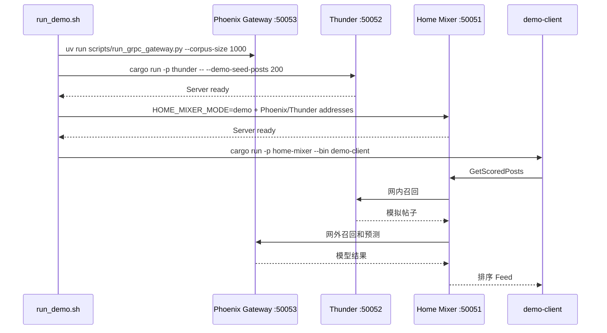
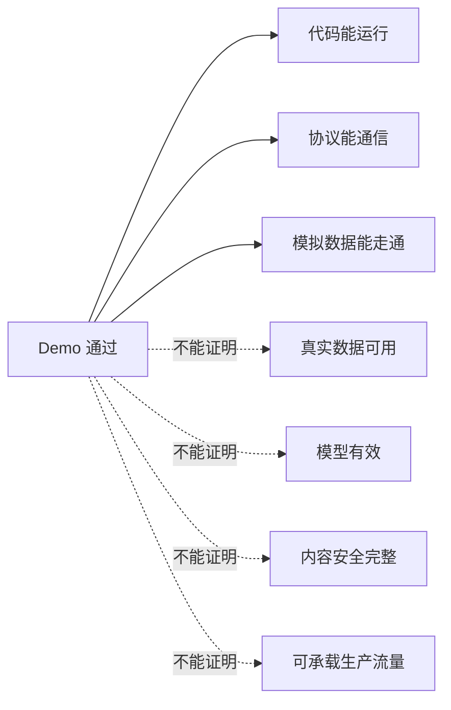

# 04. 端到端演示启动

> **状态**：`current-code`
>
> 本文的目标是：不准备任何外部业务系统，在一台机器上启动 Thunder、Phoenix、Home Mixer，并请求一次排序 Feed。读完你能知道：一条命令跑通 Demo、每个服务分别负责什么、Demo 通过后哪些结论**不能**下。
>
> 一句话：**Demo 证明的是“链路和协议能跑”，不是“推荐效果好”。**

## 1. 一键运行

在仓库根目录执行：

```bash
cd phoenix && uv sync --dev --group service && cd ..
./scripts/run_demo.sh
```

脚本会：

1. 检查 `cargo` 和 `uv`；
2. 检查 50051、50052、50053 端口；
3. 编译 Thunder、Home Mixer 和 demo-client；
4. 启动 Phoenix gRPC Gateway；
5. 启动带 200 条模拟帖子的 Thunder；
6. 启动 `HOME_MIXER_MODE=demo` 的 Home Mixer；
7. 请求一次 Feed；
8. 默认清理进程。



## 2. 预期结果

输出会包含：

- 帖子 ID；
- 作者 ID；
- 得分；
- 是否网内；
- 候选来源；
- 总条数和来源统计。

看到“端到端链路验证通过”即可说明 L2 演示链路成功。

不要用以下现象判断模型质量：

- 分数是不是很高；
- 是否每次排序一样；
- 具体作者是否符合个人兴趣。

Demo 使用随机权重和模拟行为，验证的是调用和数据形状。

## 3. 保持服务运行

```bash
./scripts/run_demo.sh --keep
```

另开终端请求：

```bash
cargo run -p home-mixer --bin demo-client
```

停止：

```text
Ctrl+C
```

脚本会清理自己启动的进程。

## 4. 可选演示路径

```bash
# 话题推荐
./scripts/run_demo.sh --topic-id 10

# 缓存帖子演示
./scripts/run_demo.sh --cached-posts 8

# For You 最终 Feed 服务
./scripts/run_demo.sh --final-feed
```

以下参数属于 `demo-client`，不能直接作为 `run_demo.sh` 参数使用：

```bash
# 先保持服务运行，再单独调用
cargo run -p home-mixer --bin demo-client -- --in-network-only
```

## 5. 手动启动

### 终端 1：Phoenix gRPC Gateway

```bash
cd phoenix
uv run scripts/run_grpc_gateway.py --corpus-size 1000
```

### 终端 2：Thunder Demo

```bash
RUST_LOG=info cargo run -p thunder -- \
  --demo-seed-posts 200 \
  --grpc-port 50052
```

### 终端 3：Home Mixer Demo

```bash
RUST_LOG=info \
HOME_MIXER_MODE=demo \
THUNDER_GRPC_ADDR=http://localhost:50052 \
PHOENIX_PREDICT_GRPC_ADDR=http://localhost:50053 \
PHOENIX_RETRIEVAL_GRPC_ADDR=http://localhost:50053 \
cargo run -p home-mixer
```

### 终端 4：请求

```bash
cargo run -p home-mixer --bin demo-client
```

## 6. 服务之间分别做什么

| 服务 | Demo 数据 | 真实系统替代 |
|---|---|---|
| Thunder | 启动时生成 200 条帖子 | Kafka 内容事件 + 内容缓存/索引 |
| Phoenix Retrieval | 现场生成模拟候选池 | 离线编码 + 向量索引 |
| Phoenix Ranking | 随机参数 | 真实行为数据训练的 checkpoint |
| Home Mixer 用户资料 | 固定 Demo 账号和关注关系 | 用户/关系服务 |
| Home Mixer 行为序列 | 合成 32 条浏览记录 | 用户行为序列服务 |
| Home Mixer 内容 | 占位文本 | 权威内容服务 |
| Home Mixer 审核 | Demo 显式 Allow | 真实审核/可见性服务 |

## 7. 日志位置

```text
/tmp/demo-thunder.log
/tmp/demo-home-mixer.log
/tmp/demo-phoenix-gateway.log
```

快速检查：

```bash
tail -100 /tmp/demo-thunder.log
tail -100 /tmp/demo-home-mixer.log
tail -100 /tmp/demo-phoenix-gateway.log
```

## 8. Demo 通过后的检查

```bash
# 检查监听端口
lsof -iTCP:50051 -sTCP:LISTEN
lsof -iTCP:50052 -sTCP:LISTEN
lsof -iTCP:50053 -sTCP:LISTEN

# 查看进程
ps aux | grep -E 'home-mixer|thunder|run_grpc_gateway' | grep -v grep
```

## 9. Demo 不代表生产



Demo 通过后进入 [05-真实数据和业务依赖接入](./05-真实数据和业务依赖接入.md)。
