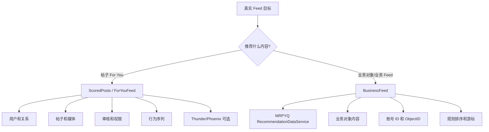
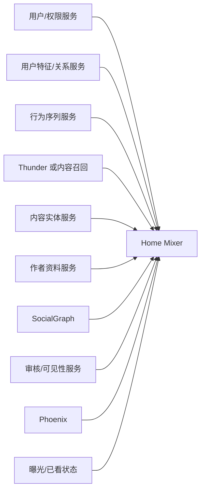
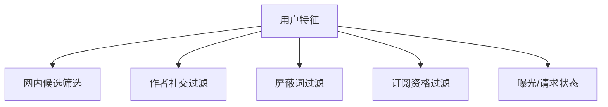
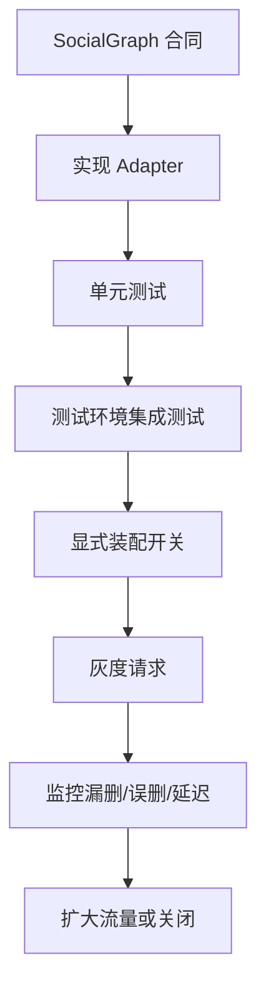
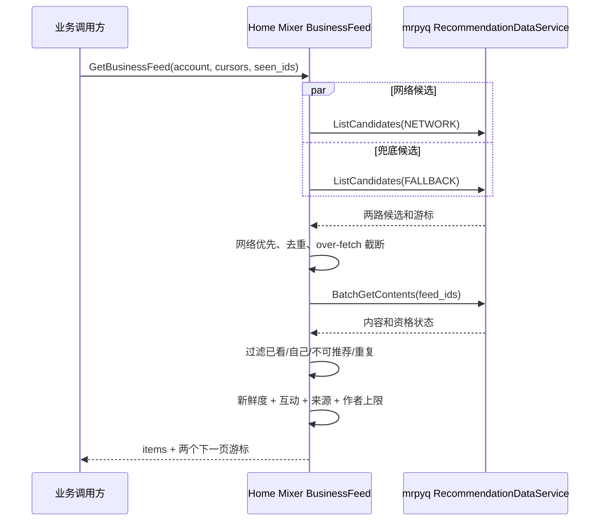
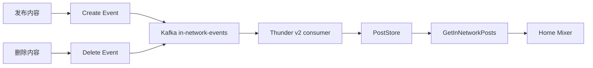

# 05. 真实数据和业务依赖接入

> **状态**：`runbook` + `design`
>
> 本文回答三个问题：
>
> 1. 真实运行要准备哪些业务系统？
> 2. 每个系统具体提供什么数据？
> 3. 哪些系统可以先屏蔽，屏蔽后损失什么？

## 1. 先选择真实运行路线

当前仓库有两条不同的 Feed 路线，不要把它们的依赖混在一起。



| 路线 | API | 主要对象 | 首版建议 |
|---|---|---|---|
| 帖子推荐 | `ScoredPostsService` / `ForYouFeedService` | Tweet/Post | 需要内容、关系、审核；模型可以先关 |
| 业务 Feed | `BusinessFeedService` | mrpyq ObjectID 字符串 | 已有推荐数据服务时优先使用规则排序 |

## 2. For You 帖子 Feed 的外部依赖

### 2.1 依赖全景



### 2.2 依赖准备表

| 依赖 | 需要准备的内容 | 给谁使用 | 能否暂时屏蔽 | 屏蔽后的影响 |
|---|---|---|---:|---|
| 用户身份/Viewer | 用户 ID、账号状态、For You 资格、请求方身份 | QueryBuilder、权限判断 | 否 | 无法确认推荐对象和访问权限 |
| 用户特征/关系 | 关注、屏蔽、静音、订阅作者、屏蔽词 | 网内召回和过滤 | 部分可以 | 没有关系过滤，用户体验和安全性下降 |
| UAS 行为序列 | 最近行为、行为时间、帖子 ID、作者 ID、场景 | Phoenix 精排/召回 | 可以 | 模型个性化失效，规则排序仍可运行 |
| 内容实体/TES | 正文、作者、转推/引用关系、媒体、语言、互动数、删除状态 | Hydrator、过滤和响应 | 不建议 | 内容无法展示，或候选被全部过滤 |
| 作者资料 | 作者名称、粉丝数、账号状态 | 展示、冷启动、排序 | 可以但不推荐 | 展示不完整，作者冷启动不可用 |
| SocialGraph | “哪些相关作者反向屏蔽 viewer” | `BlockedByHydrator` | 可以 | 只能使用 Query 级关系快照，可能漏掉转推/引用作者的反向屏蔽 |
| 内容审核/VF | 内容是否允许展示、引用/转推附属内容是否安全 | 最终过滤 | 否 | 不能证明内容可安全展示 |
| Phoenix | 预测互动概率、网外召回 | 精排和探索 | 可以 | 关闭个性化模型，使用规则或网内 Feed |
| Thunder | 关注作者最新帖子 | 网内候选 | 可以 | 需要其他内容查询或暂时没有网内实时召回 |
| 曝光状态 | seen IDs、served IDs、布隆过滤器或近期记录 | 去重 | 首版可简化 | 刷新和跨设备可能重复 |
| 曝光/互动日志 | 曝光、点击、停留、正负反馈 | 评估和训练 | 不应屏蔽 | 没有数据闭环，无法判断效果 |

## 3. 每个 Adapter 需要准备的合同

所有外部依赖都应该落在 `home-mixer/clients/` 的 trait 后面。实现 Adapter 前，不仅要有“能访问的 URL”，还要确认以下内容：

| 合同项 | 要回答的问题 |
|---|---|
| 地址和协议 | gRPC、HTTP、Kafka、数据库还是 SDK？生产和测试地址是什么？ |
| 输入 | 用户 ID、帖子 ID、批量大小、分页游标是什么？ |
| 输出 | 缺失数据如何表达？字段是否可以为空？ |
| 身份认证 | mTLS、JWT、服务账号还是网络白名单？ |
| 超时 | 单次请求、连接建立、批量请求分别是多少？ |
| 重试 | 哪些错误可重试？最多重试几次？是否会产生重复写入？ |
| 限流 | 单批最大 ID 数、QPS、并发数是什么？ |
| 一致性 | 数据是实时、最终一致还是带版本号？ |
| 降级 | 服务不可用时保留候选、删除候选，还是回到兜底 Feed？ |
| 监控 | 成功率、延迟、空结果、错误类型如何统计？ |
| 数据安全 | 用户数据是否允许进入日志、缓存和训练集？保留多久？ |
| 版本 | schema 如何演进，如何兼容旧客户端？ |

没有这些答案时，只能保留 trait 和 fake 测试，不能进入生产装配。

## 4. 当前 Home Mixer 客户端对应关系

### 4.1 Strato / 用户特征

当前接口：`home-mixer/clients/strato_client.rs`

业务上至少需要返回：

```text
mutedKeywords
blockedUserIds
mutedUserIds
followedUserIds
subscribedUserIds
```

使用关系：



当前 `DisabledStratoClient` 返回空特征，Demo 返回固定的 Demo 作者列表。真实接入时可以使用：

- 用户微服务；
- Redis/KV；
- 现有关系网关；
- 数据库聚合接口。

不要求复制 Strato 的服务名称和实现方式，只要求满足 Home Mixer 需要的业务字段。

### 4.2 User Action Sequence

当前接口：`home-mixer/clients/uas_fetcher.rs`

最少字段：

```text
user_id
action_time_ms
tweet_id
author_id
action_type
```

模型需要的行为序列：

- 按时间倒序；
- 最近 32 条；
- 没有数据时返回明确空序列；
- 不要把服务失败伪装成“用户没有行为”。

这是一个重要区别：

| 情况 | 业务含义 |
|---|---|
| 用户确实没有历史行为 | 冷启动用户 |
| UAS 服务失败 | 依赖故障，应该记录并走降级 |
| 用户被隐私策略限制 | 合规限制，不等同于服务失败 |

### 4.3 TES 内容实体

当前接口：`home-mixer/clients/tweet_entity_service_client.rs`

至少要支持：

- 批量查询帖子核心数据；
- 批量查询媒体实体；
- 查询订阅作者；
- 正文和作者 ID；
- 转推/引用关系；
- 发布时间；
- 删除和可展示状态。

`CoreDataHydrationFilter` 对核心数据缺失非常敏感。真实服务如果返回缺失帖子，必须定义：

```text
缺失 = 删除/不可见/暂时故障?
```

不能把三种情况混为一个空对象。

### 4.4 作者资料

当前接口：`home-mixer/clients/gizmoduck_client.rs`

最少字段：

- 用户 ID；
- screen name 或展示名；
- followers count；
- 账号是否有效；
- 账号是否被停用。

首版不需要一次接入所有用户资料字段，只接 Feed 展示和当前排序真正用到的字段。

### 4.5 SocialGraph 反向屏蔽

当前端口：`home-mixer/clients/socialgraph_client.rs`

当前能力代码会一次接收一批用户 ID，返回其中反向屏蔽 viewer 的用户集合：

```text
输入：viewer_id + [author_id, retweeted_user_id, quoted_user_id]
输出：blocked_by_user_ids
```

当前已完成：

- 领域端口；
- `BlockedByHydrator`；
- 作者、转推原作者、引用作者判断；
- ID 去重；
- fake-backed 单测。

当前未完成：

- 真实网络协议；
- 认证；
- 超时和批量限制；
- 真实 Adapter；
- 服务装配。

拿到真实合同后，优先按以下路径接入：



### 4.6 Phoenix

Home Mixer 通过以下环境变量连接 Phoenix：

```bash
PHOENIX_PREDICT_GRPC_ADDR=http://phoenix-host:50053
PHOENIX_RETRIEVAL_GRPC_ADDR=http://phoenix-host:50053
```

未设置时：

- 预测返回明确不可用；
- Scorer 隔离错误；
- 主链可以保留规则排序或其他候选；
- 网外召回不可用时可以只返回网内候选。

这使得 Phoenix 可以延后，但不能让随机权重承担真实生产排序。

## 5. Business Feed 接入

### 5.1 当前实现

Business Feed 位于：

```text
home-mixer/business_feed/
home-mixer/clients/mrpyq_recommendation_data_client.rs
```

对外 RPC：

```text
BusinessFeedService.GetBusinessFeed
```

客户端通过：

```bash
MRPYQ_RECOMMENDATION_DATA_ADDR=http://mrpyq-service:port
```

配置超时：

```bash
MRPYQ_RECOMMENDATION_DATA_TIMEOUT_MS=...
```

默认没有地址时，Business Feed 使用 Disabled Client，并返回 `failed_precondition`，不会伪造空的成功结果。

### 5.2 mrpyq 服务必须提供的 RPC

```proto
service RecommendationDataService {
  rpc ListRecommendationCandidates(
      ListRecommendationCandidatesReq)
      returns (ListRecommendationCandidatesReply);

  rpc BatchGetRecommendationContents(
      BatchGetRecommendationContentsReq)
      returns (BatchGetRecommendationContentsReply);
}
```

### 5.3 候选查询合同

请求：

| 字段 | 说明 |
|---|---|
| `account_id` | 当前业务账号，NETWORK 来源必填 |
| `source` | `NETWORK` 或 `FALLBACK` |
| `page_size` | 客户端默认按请求量三倍 over-fetch，最多 200 |
| `page_token` | 不透明游标，原样传回 |

响应：

| 字段 | 说明 |
|---|---|
| `feed_id` | ObjectID 字符串，不能为空 |
| `source` | 必须与请求来源一致 |
| `source_score` | 上游来源分，可用于规则排序 |
| `next_page_token` | 下一页游标 |
| `source_ready` | 网络源是否已准备好，Fallback 必须 ready |

### 5.4 内容补全合同

批量请求最多 200 个 feed ID，响应需要为每个有效 ID 返回：

- `feed_id`；
- `creator_account_id`；
- `creator_member_id`；
- `created_at_ms`；
- `like_count`；
- `comment_count`；
- `gift_value`；
- `recommendation_eligible`。

当前客户端会拒绝：

- 空 feed ID；
- 重复 feed ID；
- 候选来源不匹配；
- 无效响应。

### 5.5 Business Feed 内部流程



### 5.6 Business Feed 可以屏蔽什么

| 能力 | 是否可屏蔽 | 结果 |
|---|---:|---|
| NETWORK 候选 | 可以 | 只用 FALLBACK，但仍需保留网络游标重试语义 |
| FALLBACK 候选 | 不可以 | 当前实现把它视为最小可用来源，失败会返回错误 |
| 内容补全 | 不可以 | 没有权威内容和资格状态，不能安全返回 |
| 规则排序 | 不建议 | 当前是 Business Feed 的可解释兜底排序 |
| seen IDs | 首版可为空 | 会出现重复推荐 |
| source_score | 可以置 0 | 少一个上游排序信号 |

## 6. 内容事件和 Thunder

如果要让 Thunder 使用真实数据，需要：



当前 v2 事件使用 Protobuf：

- topic：`in-network-events`；
- create：`TweetCreateEvent`；
- delete：`TweetDeleteEvent`；
- 包装：`InNetworkEvent`。

Thunder 启动参数主要包括：

```bash
cargo run -p thunder -- \
  --kafka-brokers localhost:9092 \
  --kafka-group-id thunder-consumer \
  --kafka-num-threads 4 \
  --kafka-batch-size 1000 \
  --grpc-port 50052 \
  --http-port 8080
```

真实 Kafka 接入前必须确认：

- broker 地址；
- topic 是否已创建；
- 分区数；
- consumer group；
- SASL/TLS；
- offset 策略；
- 删除事件是否可靠；
- 低流量时如何判定 ready；
- 多线程是否真的分区消费，而不是多个 group 重复消费。

## 7. 真实数据接入顺序

推荐顺序：

1. 先接权威内容和审核状态；
2. 再接用户身份、关注、拉黑、静音；
3. 用规则排序返回第一版真实 Feed；
4. 开始记录曝光和互动；
5. 数据积累后接 UAS；
6. 再接 Phoenix 精排；
7. 内容规模和实时性确实成为瓶颈时，再接 Kafka/Thunder；
8. 最后再考虑全站向量召回、VM Ranker 和复杂模型编排。

不要反过来先建设模型平台，再发现没有可靠内容和反馈数据。
