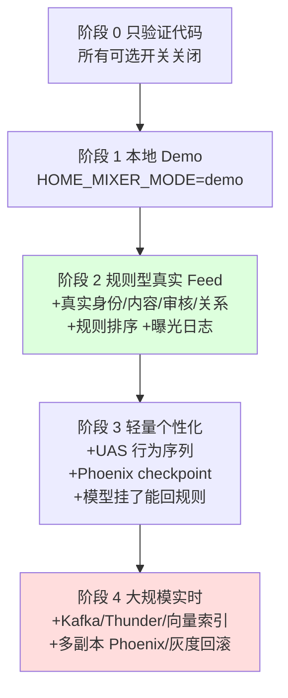
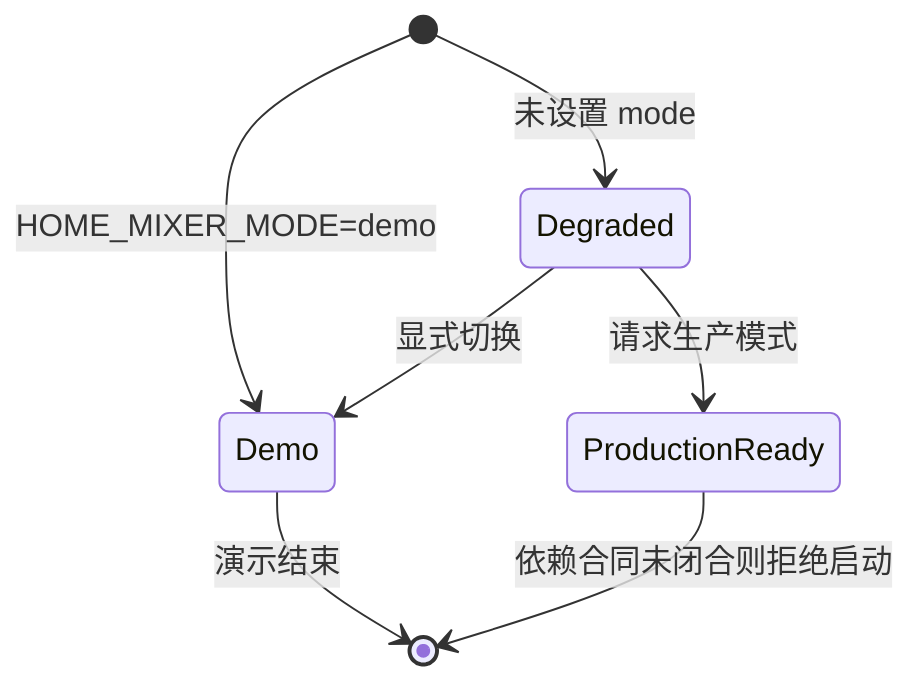
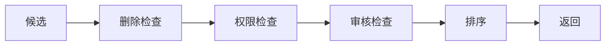
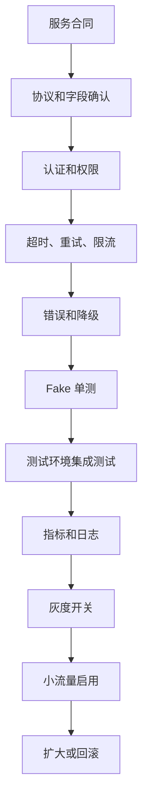

# 06. 分阶段屏蔽和启用策略

> **状态**：`runbook`
>
> 本文用于做范围决策：哪些内容现在必须打开，哪些可以关闭，关闭后会损失什么，什么时候应该重新打开。读完你能知道：7 个 `HOME_MIXER_ENABLE_*` 开关首版该不该开、每个阶段必须打开什么、哪些能力**永远不能关**。

## 0. 一图看懂：能力阶梯

每一级只加「业务指标证明有价值」的能力，不要一次全开：



绿色是「大多数项目首版应该停在这里」；红色是「只有真的遇到规模问题才进」。

## 1. 总原则

```text
能跑 ≠ 能推荐
能推荐 ≠ 推荐有效
推荐有效 ≠ 可以承载生产流量
```

关闭能力时必须写清楚：

1. 关闭的业务能力是什么；
2. 请求会走什么替代路径；
3. 用户会损失什么；
4. 哪个指标恶化时必须重新打开；
5. 重新打开前需要补什么合同。

## 2. 当前 Home Mixer 可选开关

所有开关默认关闭，只有显式设置为 `1`、`true`、`yes` 或 `on` 才会打开。

| 环境变量 | 能力 | 是否建议首版打开 | 依赖 | 关闭后的替代 |
|---|---|---:|---|---|
| `HOME_MIXER_ENABLE_PHOENIX_MOE` | Phoenix MoE 召回 | 否 | `PHOENIX_MOE_GRPC_ADDR` 和真实服务合同 | 普通 Phoenix 或规则候选 |
| `HOME_MIXER_ENABLE_REQUEST_CACHE_SIDE_EFFECT` | 请求缓存写回 | 否 | 存储 schema、幂等、保留策略 | 客户端 seen IDs 或无持久化 |
| `HOME_MIXER_ENABLE_DEBUG_RPC` | Debug Scored Posts RPC | 仅内部 | `HOME_MIXER_DEBUG_TOKEN` | 普通请求和日志 |
| `HOME_MIXER_ENABLE_UNSIGNED_CACHED_POSTS` | 允许未签名缓存帖子 | 仅 Demo | 仅允许 `HOME_MIXER_MODE=demo` | 拒绝未签名缓存帖子 |
| `HOME_MIXER_ENABLE_VM_RANKER` | VM Ranker 二次重排 | 否 | `VM_RANKER_GRPC_ADDR`、模型和 DPP 产物 | 主排序结果 |
| `HOME_MIXER_ENABLE_AUTHOR_COLD_START` | 新作者冷启动提升 | 有真实曝光数后再开 | `view_count`、作者粉丝数 | 普通排序 |
| `HOME_MIXER_ENABLE_COLD_START_THOMPSON_SAMPLING` | Thompson Sampling 冷启动 | 否，除非上项已开 | `AUTHOR_COLD_START` 同时开启 | 冷启动规则 |

## 3. 运行模式

| `HOME_MIXER_MODE` | 用途 | 数据来源 | 是否生产可用 |
|---|---|---|---:|
| `demo` | 本地端到端演示 | Demo UAS、Strato、TES、Gizmoduck | 否 |
| `degraded` | 缺少外部依赖时继续运行 | Disabled 客户端/有限规则 | 否，只适合开发和诊断 |
| `production_ready` | 试图进入生产就绪装配 | 真实依赖 | 当前会主动拒绝启动 |



`HOME_MIXER_DEMO=1` 是旧别名。不要同时把它和非 Demo 的 `HOME_MIXER_MODE` 一起设置。

## 4. 分阶段建议

### 4.1 阶段 0：只验证代码

打开：

```text
无可选能力
```

执行：

```bash
cargo test --workspace
cd phoenix && uv run pytest
```

### 4.2 阶段 1：本地演示

打开：

```bash
HOME_MIXER_MODE=demo
```

保留关闭：

- VM Ranker；
- Phoenix MoE；
- 请求缓存写回；
- 真实 SocialGraph；
- 真实审核服务；
- 真实 Kafka。

### 4.3 阶段 2：规则型真实 Feed

必须准备并打开：

- 真实身份；
- 真实内容数据；
- 基础删除/审核/权限判断；
- 基础关注、拉黑、静音；
- 规则排序；
- 曝光日志。

可以继续关闭：

- Phoenix 精排；
- Phoenix Retrieval；
- VM Ranker；
- MoE；
- 在线 UAS；
- Kafka/Thunder。

### 4.4 阶段 3：轻量个性化

在阶段 2 稳定后准备：

- 真实行为日志；
- UAS 或等价行为序列服务；
- 可验证的训练样本；
- Phoenix checkpoint；
- 模型不可用时的规则 fallback；
- 离线和线上对照指标。

### 4.5 阶段 4：大规模实时推荐

只有遇到规模问题才增加：

- Kafka；
- Thunder；
- 向量索引；
- 离线编码；
- 多副本 Phoenix；
- checkpoint registry；
- 模型灰度和回滚；
- 分布式曝光状态。

## 5. 不建议关闭的能力

用大白话：**下面这些能力就算关掉模型也不能关**，因为它们决定“推荐出来的东西能不能看、合不合法、是谁点的”。

### 5.1 身份和权限

没有身份和权限就不知道：

- 为谁推荐；
- 用户是否允许访问；
- 是否可以查看某些内容。

### 5.2 删除、审核和可见性

模型分数不能证明内容可以展示。内容安全应先于排序：



### 5.3 基础拉黑、静音和已看去重

这些是用户明确表达的意图，不应该被模型的高分覆盖。用大白话：**用户点了“不感兴趣”，模型不能因为分数高就再推一次。**

### 5.4 曝光日志

没有曝光日志，后续所有模型效果都无法解释。至少记录：

- 请求 ID；
- 用户 ID；
- 内容 ID；
- 返回位置；
- 实际曝光时间；
- 后续互动。

## 6. 可屏蔽能力的决策表

| 业务问题 | 可以先屏蔽什么 | 屏蔽的代价 | 重新打开条件 |
|---|---|---|---|
| 没有真实行为数据 | Phoenix 精排 | 个性化不足 | 曝光和互动样本稳定积累 |
| 内容量还不大 | 向量召回 | 探索范围有限 | 普通查询无法满足召回覆盖 |
| 更新量不大 | Kafka/Thunder | 新鲜度和实时删除较慢 | 内容更新压力或延迟要求上升 |
| 没有 SocialGraph Adapter | 候选级反向屏蔽 | 相关作者关系可能漏判 | 明确协议、认证、批量和超时 |
| 没有作者统计 | 冷启动提升 | 新作者不容易被发现 | 有稳定曝光数和作者指标 |
| 没有多机训练 | 流式 checkpoint | 大模型训练效率有限 | OOM、多机恢复或保存瓶颈出现 |
| 没有模型二次重排 | VM Ranker | 多样性优化少一层 | 实验明确证明收益大于复杂度 |

## 7. 外部能力的启用门槛

外部 Adapter 进入装配前必须完成：



如果缺少其中一项，不要通过“默认返回空数据”的方式掩盖缺口。

## 8. 当前迁移项目的特别说明

当前已迁移的 SocialGraph 反向屏蔽代码处于：

```text
接口完成
领域逻辑完成
Fake 测试完成
真实 Adapter 未完成
默认装配关闭
```

因此它可以作为后续接入的基础，但还不能对外宣称“生产已支持”。
