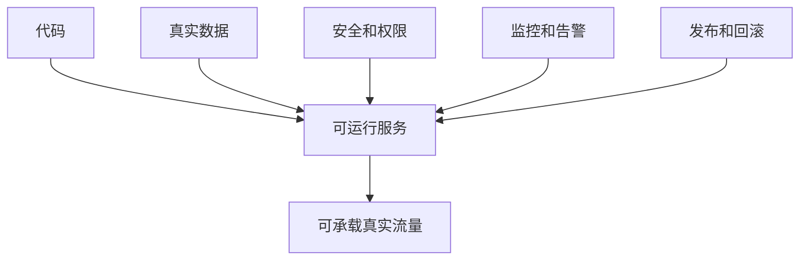
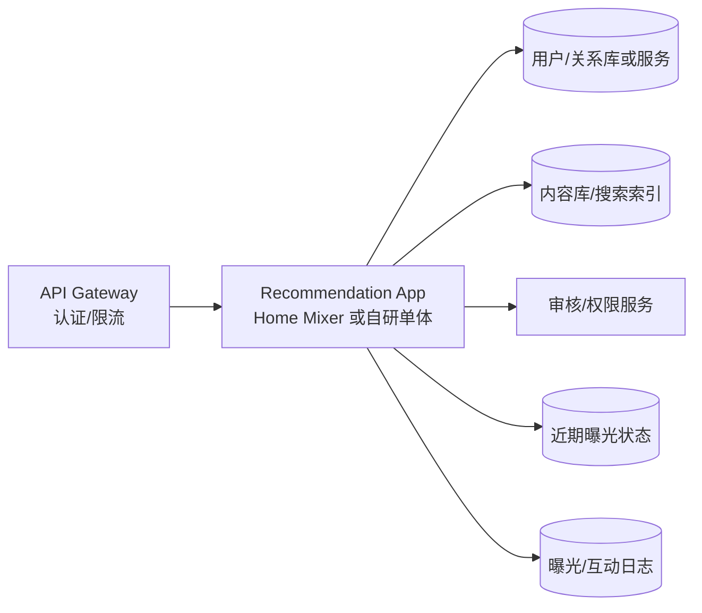
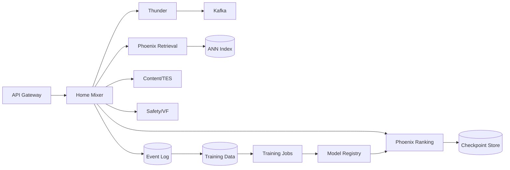
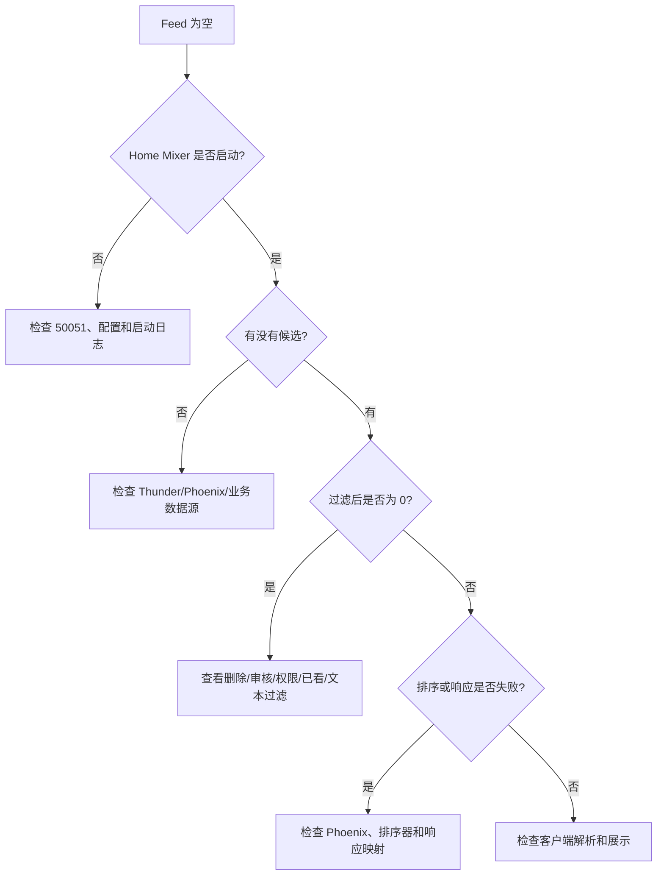
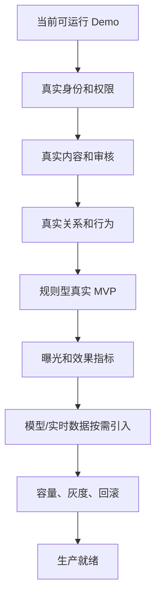

# 07. 生产化、验收和故障排查

> **状态**：`runbook`
>
> 当前仓库能跑通 Demo，但 `production_ready` 模式会主动拒绝启动。本文给出从真实 MVP 到生产系统还需要补齐什么，以及出现问题时如何定位。读完你能知道：生产化要做哪 5 件事、上线前检查清单、以及 Feed 为空/报错时按什么顺序查。
>
> 一句话：**“服务返回 200”不等于“业务可用”——生产化是认证、监控、容量、灰度、回滚五件事都齐。**

## 1. 生产化不是“把进程放到服务器”

生产化至少包含五件事：



缺少其中任何一项，都可能出现“服务返回 200，但业务不可用”。

## 2. 生产就绪检查清单

### 2.1 请求和身份

- [ ] 调用方有认证凭证；
- [ ] 用户 ID 来自可信调用方，不接受客户端随意伪造；
- [ ] 账号状态和 Feed 资格可查询；
- [ ] 敏感请求和 debug RPC 有单独权限；
- [ ] 日志不打印 token、完整用户隐私数据和敏感行为内容；
- [ ] 请求 ID 能贯穿 Home Mixer、外部服务和日志。

### 2.2 内容和安全

- [ ] 删除状态来自权威内容服务；
- [ ] 内容审核结果有明确版本和时效；
- [ ] 权限判断先于排序；
- [ ] 引用/转推附属内容有单独处理；
- [ ] SocialGraph 关系失败不会误判为业务事实；
- [ ] 任何“未查询到审核结果”的处理规则已由产品/安全确认；
- [ ] 安全服务超时有明确 fail-open 或 fail-closed 决策；
- [ ] 生产环境不使用 Demo Allow、随机模型或占位正文。

### 2.3 推荐质量

- [ ] 有规则排序基线；
- [ ] 有非空率、重复率和负反馈基线；
- [ ] 有按用户群、地区、设备和内容类型的切片指标；
- [ ] 模型结果与规则结果可回放对照；
- [ ] 模型不可用时可回退；
- [ ] 新模型有灰度和回滚；
- [ ] 训练集、验证集、测试集和线上用户隔离；
- [ ] 训练数据有行为归因窗口和时间穿越防护。

### 2.4 依赖和容量

- [ ] 每个远程依赖都有连接超时；
- [ ] 每个远程依赖都有请求超时；
- [ ] 可重试错误和不可重试错误已区分；
- [ ] 批量大小和并发限制已确认；
- [ ] 外部服务故障时不会无限等待；
- [ ] 有候选数量、响应大小和内存上限；
- [ ] 已测试单实例 QPS、延迟和峰值内存；
- [ ] 已决定是否需要 Kafka、Thunder、向量索引和多副本 Phoenix。

### 2.5 运维和发布

- [ ] 有 readiness 和 liveness；
- [ ] 有结构化日志；
- [ ] 有核心指标和告警；
- [ ] 有配置和 Secret 注入方案；
- [ ] 有容器或进程重启策略；
- [ ] 有版本、模型、索引和数据快照记录；
- [ ] 有灰度比例和回滚命令；
- [ ] 有事故处理负责人和升级路径。

## 3. 推荐的生产部署拓扑

### 3.1 规则型 MVP



首版不需要把每个模块拆成独立服务。推荐应用内部保留领域边界即可。

### 3.2 模型化和大规模阶段



## 4. 推荐的服务启动顺序

### 4.1 本地 Demo

```text
Phoenix Gateway → Thunder → Home Mixer → demo-client
```

### 4.2 真实规则 MVP

```text
用户/内容/审核依赖 → 推荐数据接口 → 推荐应用 → 曝光日志 → 监控
```

### 4.3 模型化系统

```text
内容和行为数据 → 样本任务 → 训练 → 评估 → checkpoint 发布
→ Phoenix Gateway → Home Mixer 灰度 → 线上反馈
```

## 5. 最小监控指标

### 5.1 请求层

| 指标 | 说明 | 异常意味着什么 |
|---|---|---|
| 请求量 | 每秒/每分钟请求数 | 流量变化或网关问题 |
| p50/p95/p99 延迟 | 用户等待时间 | 某个依赖变慢或批量过大 |
| 错误率 | 5xx、超时、业务失败 | 服务或依赖故障 |
| 空结果率 | 没有返回内容的请求比例 | 候选、过滤、内容或权限问题 |
| 返回条数 | 每次实际返回数量 | 候选不足或过滤过严 |

### 5.2 推荐层

| 指标 | 说明 |
|---|---|
| 各来源候选数 | 网内、网外、业务 Feed、兜底池分别有多少 |
| 各过滤器移除数 | 哪条规则删除最多候选 |
| 重复率 | 同一会话或用户近期重复内容 |
| 作者集中度 | 前 N 条中同一作者占比 |
| 新鲜度 | 返回内容年龄分布 |
| 负反馈率 | 不感兴趣、屏蔽、举报等 |
| 点击率/停留 | 仅在曝光口径可靠时使用 |

### 5.3 依赖层

| 指标 | 说明 |
|---|---|
| SocialGraph 成功率/延迟 | 反向屏蔽判断是否可用 |
| TES 批量成功率 | 内容补全是否稳定 |
| Phoenix 预测成功率 | 精排是否在工作 |
| Thunder 查询延迟 | 网内召回是否成为瓶颈 |
| Kafka lag | 内容事件是否积压 |
| 模型加载耗时 | 发布和重启风险 |
| checkpoint 读写峰值内存 | 是否需要流式加载 |

## 6. 常见故障定位图



## 7. 常见问题

### 7.1 `cargo` 找不到

```bash
source "$HOME/.cargo/env"
cargo --version
```

如果仍然失败，重新打开 shell 或检查 rustup 安装。

### 7. `protoc` 找不到

```bash
command -v protoc
protoc --version
```

macOS：

```bash
brew install protobuf
```

Ubuntu：

```bash
sudo apt-get install protobuf-compiler
```

### 7. `uv sync` 或 `uv run` 权限错误

```bash
cd phoenix
UV_CACHE_DIR=/tmp/uv-cache uv sync --dev --group service
UV_CACHE_DIR=/tmp/uv-cache uv run pytest
```

### 7. Phoenix PyO3 测试出现 `dyld` 或 Python framework 错误

```bash
cd phoenix
PYO3_PYTHON="$PWD/.venv/bin/python3" cargo test --workspace
```

使用 uv 管理的 Python，不要使用系统 Python 3.9。

### 7. Home Mixer 启动后返回空 Feed

按顺序检查：

1. 是否设置 `HOME_MIXER_MODE=demo`；
2. Thunder 是否使用 `--demo-seed-posts 200`；
3. Phoenix 50053 是否监听；
4. `THUNDER_GRPC_ADDR` 是否为 `http://localhost:50052`；
5. `PHOENIX_*_GRPC_ADDR` 是否为 `http://localhost:50053`；
6. `/tmp/demo-*.log` 是否有连接错误；
7. 是否误用了 `degraded` 模式；
8. 是否使用了 `--cached-posts` 却没有允许 Demo 未签名缓存。

### 7.5 Phoenix 网关启动很慢

JAX 第一次编译可能需要较长时间。先等待日志和 50053 监听，不要重复启动多个进程。

### 7.6 Thunder 没有 ready

当前 Thunder v2 的 ready 语义与“Kafka 已追平”不同，通常在处理完首个满批次后才通知 ready。低流量场景可能长期攒不满 batch：

```bash
cargo run -p thunder -- \
  --kafka-batch-size 10 \
  --kafka-brokers localhost:9092
```

生产环境还需要修订或明确 ready、lag 和低流量刷新语义。

### 7.7 SocialGraph 失败

当前没有真实 SocialGraph Adapter。未来接入时必须明确：

- 超时是否跳过候选级关系检查；
- 是否保留 Query 级关系过滤；
- 是否记录降级指标；
- 是否允许灰度关闭；
- 是否不能因为服务失败而误删内容。

### 7.8 模型分数都是 0.5

这通常表示使用随机权重，不是模型服务坏了。需要训练并加载真实 checkpoint，且用离线指标和规则基线比较。

## 8. 回滚策略

### 8.1 代码回滚

- 使用不可变镜像或 commit 版本；
- 不在服务器上直接修改源码；
- 保留上一个可启动版本；
- 回滚后重新执行健康检查和固定请求回放。

### 8.2 模型回滚

模型至少记录：

```text
model_version
training_data_version
feature_schema_version
checkpoint_uri
embedding_table_version
created_at
validation_metrics
```

模型异常时只切换到上一个已验证版本，不要删除当前产物。

### 8.3 索引回滚

向量索引需要记录：

- 内容快照时间；
- 编码模型版本；
- 索引构建版本；
- 内容数量；
- 删除同步位置；
- 可恢复的上一个索引地址。

## 9. 发布前固定回放集

准备一组脱敏、固定、可重复的请求：

| 场景 | 要验证什么 |
|---|---|
| 普通活跃用户 | 正常召回和排序 |
| 冷启动用户 | 是否有兜底内容 |
| 没有关注用户 | 是否退化到热门/探索 |
| 有大量屏蔽关系用户 | 过滤是否正确 |
| 有已看内容用户 | 去重是否生效 |
| 内容服务部分缺失 | 是否按约定降级 |
| Phoenix 不可用 | 是否回到规则排序 |
| 审核服务超时 | 是否符合安全策略 |
| 大量候选 | 批量、内存和延迟是否可控 |

回放结果至少比较：

- 返回数量；
- 内容 ID；
- 过滤原因；
- 排序顺序；
- 总耗时；
- 外部调用次数；
- 错误和降级标记。

## 10. 当前仓库达到生产前还缺什么



当前仓库不能直接跳到最后一步。最合理的路径是逐阶段关闭不必要的复杂能力，每一阶段只引入能够被业务指标证明有价值的下一项能力。
