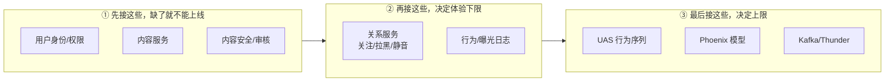
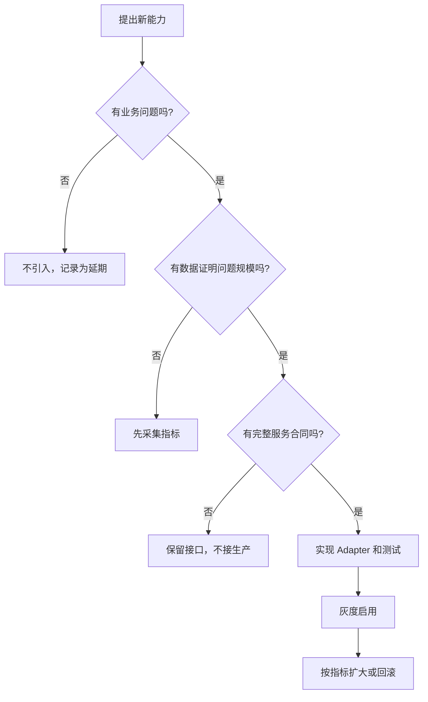

# 08. 准备清单模板

> **状态**：`runbook`
>
> 复制本文到项目评审或上线 checklist 中，逐项填写负责人、地址、字段、验收证据和是否屏蔽。不要只写“已有接口”，要写清楚接口能否支撑推荐业务。

## 0. 一句话用法 + 依赖接入顺序

**这份清单不是让你一次填完的，是按上线前评审的节奏逐项打勾的。** 推荐的依赖接入顺序（和业务价值/风险排序一致）：



顺序不能反：**先证明内容安全、能返回，再谈个性化，最后才谈实时和规模。**

## 1. 项目范围

| 项目 | 填写内容 |
|---|---|
| 产品名称 |  |
| Feed 类型 | 帖子 For You / 纯网内 / 业务 Feed / 其他 |
| 首版目标用户 |  |
| 首版目标流量 | QPS、DAU、请求峰值 |
| 首屏条数 |  |
| 翻页方式 | page token / offset / cursor |
| 是否允许跨设备重复 | 是/否，允许多久 |
| 是否需要实时新内容 | 秒级/分钟级/小时级 |
| 是否需要非关注内容 | 是/否 |
| 首版是否使用模型 | 是/否 |
| 首版是否接 Kafka | 是/否 |
| 首版是否接 Thunder | 是/否 |

## 2. 业务验收指标

| 指标 | 目标值 | 统计口径 | 负责人 |
|---|---:|---|---|
| 推荐接口成功率 |  | 仅统计已认证请求 |  |
| p95 延迟 |  | 从网关到响应 |  |
| 空 Feed 比例 |  | 无合格 item 的请求 |  |
| 重复内容比例 |  | 会话/用户窗口 |  |
| 删除内容泄漏数 | 0 | 安全事件口径 |  |
| 审核失败泄漏数 | 0 | 安全事件口径 |  |
| 点击率 |  | 真实曝光分母 |  |
| 有效停留率 |  | 先定义有效停留 |  |
| 不感兴趣率 |  | 推荐内容后的负反馈 |  |
| 举报率 |  | 推荐内容后的举报 |  |
| 内容新鲜度 |  | P50/P95 内容年龄 |  |

## 3. 依赖准备清单

### 3.1 用户和权限

- [ ] 用户 ID 的来源和格式已确定：`u64`、字符串或其他；
- [ ] 调用方身份认证方式已确定；
- [ ] 账号不存在、停用、封禁的处理已确定；
- [ ] 用户是否有资格访问该 Feed 的判断已确定；
- [ ] 权限失败和服务故障已经区分；
- [ ] 不允许把客户端传来的任意用户 ID 当成可信身份。

负责人：

接口地址：

测试账号：

验收证据：

### 3.2 内容服务

- [ ] 可以批量查询内容；
- [ ] 能返回正文、作者、创建时间；
- [ ] 能返回删除和下线状态；
- [ ] 能返回转推、引用和回复关系；
- [ ] 能返回媒体和视频时长；
- [ ] 缺失内容和服务失败有不同状态；
- [ ] 有批量上限和超时；
- [ ] 有内容版本或更新时间字段。

负责人：

接口地址：

最大批量：

数据延迟：

验收证据：

### 3.3 内容安全和权限

- [ ] 有内容审核状态；
- [ ] 有内容可见性和业务权限状态；
- [ ] 审核结果有时间和版本；
- [ ] 引用/转推附属内容有处理规则；
- [ ] 审核服务超时的处理规则已确认；
- [ ] “没有审核结果”不是默认 Allow；
- [ ] 有安全事件告警和人工处理流程。

负责人：

接口地址：

超时策略：

超时后：保留/删除/兜底

验收证据：

### 3.4 关系服务

- [ ] 关注关系可查询；
- [ ] 拉黑关系可查询；
- [ ] 静音关系可查询；
- [ ] 转推原作者和引用作者关系可查询；
- [ ] 反向屏蔽语义已确认；
- [ ] 批量 ID 限制已确认；
- [ ] 失败时不会把“未知”误判为“已屏蔽”；
- [ ] 隐私和缓存保留规则已确认。

当前仓库对应端口：

```text
SocialGraphClientOps::check_blocked_by
```

负责人：

接口地址：

认证方式：

验收证据：

### 3.5 行为和曝光数据

- [ ] 请求 ID 能贯穿推荐、曝光和行为日志；
- [ ] 记录实际曝光，而不是只记录服务返回；
- [ ] 记录展示位置和候选来源；
- [ ] 记录点击、停留、点赞、回复、分享；
- [ ] 记录不感兴趣、屏蔽、静音、举报；
- [ ] 规定归因窗口；
- [ ] 规定数据保留期限；
- [ ] 规定隐私脱敏和访问权限；
- [ ] 能按推荐请求关联后续行为。

日志表/Topic：

负责人：

数据保留：

验收证据：

## 4. 是否引入复杂能力

| 能力 | 当前是否需要 | 业务证据 | 若关闭的替代 | 负责人 | 重新打开条件 |
|---|---:|---|---|---|---|
| Phoenix 精排 |  |  | 规则排序 |  |  |
| Phoenix Retrieval |  |  | 关注/热门候选 |  |  |
| Thunder |  |  | 内容库查询 |  |  |
| Kafka |  |  | 定时同步/轮询 |  |  |
| 向量索引 |  |  | 关键词/分类/热门 |  |  |
| UAS 行为序列 |  |  | 离线用户画像 |  |  |
| VM Ranker |  |  | 主排序 |  |  |
| MoE |  |  | 普通召回 |  |  |
| SocialGraph 候选级反向屏蔽 |  |  | Query 级关系快照 |  |  |
| checkpoint 流式加载 |  |  | 普通加载 |  |  |

判断流程：



## 5. 发布前签字项

### 产品

- [ ] Feed 的内容范围已确认；
- [ ] 排序规则和推荐原因可解释；
- [ ] 负反馈后的处理已确认；
- [ ] 空结果时的兜底已确认；
- [ ] 是否允许推荐广告或业务对象已确认。

产品负责人：

### 内容安全

- [ ] 删除、审核、权限过滤已验证；
- [ ] 超时和未知状态策略已验证；
- [ ] 有安全回滚开关；
- [ ] 有事故响应人。

安全负责人：

### 技术

- [ ] 固定请求回放通过；
- [ ] 压测通过；
- [ ] 所有外部依赖有超时；
- [ ] 所有远程错误有降级；
- [ ] 有版本和回滚方案；
- [ ] 日志和指标可查。

技术负责人：

### 数据

- [ ] 曝光和行为日志可关联；
- [ ] 样本字段和 schema 已固定；
- [ ] 隐私、保留、删除流程已确认；
- [ ] 训练集不会混入未来信息；
- [ ] 训练和线上特征定义一致。

数据负责人：

## 6. 最终状态记录

| 项目 | 结果 |
|---|---|
| 当前代码版本 |  |
| 当前配置版本 |  |
| 当前模型版本 |  |
| 当前内容索引版本 |  |
| 当前数据快照版本 |  |
| 已启用能力 |  |
| 已关闭能力 |  |
| 已知风险 |  |
| 回滚版本 |  |
| 值班负责人 |  |
| 上线时间 |  |

只有当上述信息能被另一个人复核时，才算完成一次可交接的启动准备。
