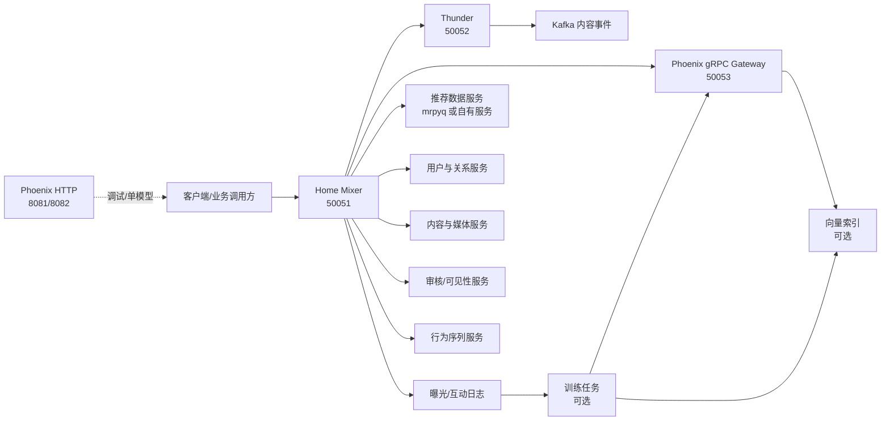
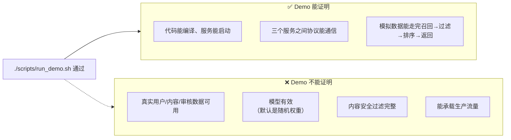
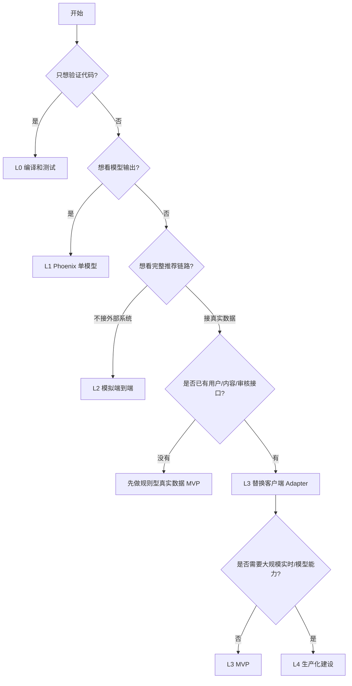

# 推荐系统完整启动与建设手册

> **状态**：`runbook` + `current-code`
>
> **适用对象**：需要在本地跑通当前仓库、接入真实业务数据，或者评估哪些外部系统必须准备、哪些能力可以暂时关闭的开发者、架构师和项目负责人。
>
> **重要边界**：本仓库可以跑通完整演示链路，但 X 开源的是算法和服务骨架，不是完整生产系统。本手册把“能启动”“能返回结果”“能接真实数据”“可以承担生产流量”分开描述，不能把它们混为一谈。

## 1. 先看结论

一句话：这套手册带你从「代码能编译」走到「生产能扛流量」，中间每一步该装什么、开什么、关什么、验收什么，都有对应的一篇文档。

用大白话记住三句话就够了：

1. **能跑 ≠ 能推荐**：Demo 用的是随机模型和假数据，分数没有任何业务意义。
2. **proto 里有这个字段 ≠ 代码真的在用它**：协议同步了不代表功能已经启用。
3. **缺外部服务时先关模型，不能关安全**：删帖、审核、拉黑、曝光日志永远不能让位于个性化。

当前仓库有四种运行层级：

| 层级 | 目标 | 是否依赖外部业务系统 | 当前状态 |
|---|---|---:|---|
| L0 编译层 | Rust 和 Python 环境准备好，代码能编译 | 否 | 可执行 |
| L1 模型层 | 单独运行 Phoenix 精排/召回模型 | 否 | 可执行，默认随机权重 |
| L2 端到端演示 | Thunder + Phoenix + Home Mixer 返回推荐 Feed | 否 | 可执行，使用模拟数据 |
| L3 真实数据 MVP | 用真实用户、内容、关系和审核数据返回 Feed | 是 | 需要实现 Adapter |
| L4 生产系统 | 认证、监控、容量、灰度、回滚、数据和模型闭环 | 是 | 当前未完成 |

最短路径：

```bash
# 1. 准备 Rust、protoc、uv
# 2. 安装 Phoenix 依赖
cd phoenix && uv sync --dev --group service && cd ..
# 3. 从仓库根目录跑完整演示
./scripts/run_demo.sh
```

## 2. 推荐阅读顺序

| 顺序 | 文档 | 你会得到什么 |
|---:|---|---|
| 0 | [00-目标、边界和阶段](./00-目标、边界和阶段.md) | 知道“完整运行”到底指哪一层，避免把 Demo 当生产 |
| 1 | [01-环境和基础设施准备](./01-环境和基础设施准备.md) | 知道本机和服务器需要安装什么、检查什么 |
| 2 | [02-本地编译和单模块验证](./02-本地编译和单模块验证.md) | 按顺序验证根 workspace、Phoenix、协议和测试 |
| 3 | [03-Phoenix 模型、训练和产物](./03-Phoenix模型训练和产物.md) | 知道随机模型、训练数据、checkpoint 和模型服务的关系 |
| 4 | [04-端到端演示启动](./04-端到端演示启动.md) | 手动或一键启动 Thunder、Phoenix、Home Mixer |
| 5 | [05-真实数据和业务依赖接入](./05-真实数据和业务依赖接入.md) | 逐项准备用户、内容、关系、审核、行为和 Feed 数据 |
| 6 | [06-分阶段屏蔽和启用策略](./06-分阶段屏蔽和启用策略.md) | 决定哪些能力保留、关闭或延后，并知道代价 |
| 7 | [07-生产化、验收和故障排查](./07-生产化验收和故障排查.md) | 从 MVP 走到可承载真实流量，并处理常见故障 |
| 8 | [08-准备清单模板](./08-准备清单模板.md) | 在项目评审或上线前逐项填写负责人、合同和验收证据 |
| 9 | [09-P0-P1 执行清单](./09-P0-P1执行清单.md) | 当前三仓库可直接执行的验证与 rec-bff 合同验收清单；需业务方提供数据 / 地址 / 决策的事项只登记不假实现 |

## 3. 总体架构



## 4. “完整运行”的判断标准

先用一张图说清楚「Demo 跑通」到底证明了什么：



### 4.1 本地演示完成

满足以下条件即可说“本地链路跑通”：

- `cargo build --workspace` 成功；
- Phoenix Python 依赖安装成功；
- `./scripts/run_demo.sh` 返回非空 Feed；
- 返回结果中能看到网内和网外候选；
- 日志中没有服务启动失败；
- 认识到模型是随机权重，分数不代表推荐质量。

### 4.2 真实数据 MVP 完成

还必须满足：

- 用户身份是真实的；
- 内容正文和删除状态来自权威内容服务；
- 关注、拉黑、静音关系可查询；
- 内容审核和权限结果可查询；
- 曝光和互动日志可以关联到推荐请求；
- 推荐结果可以去重、过滤和解释；
- 外部服务失败时有明确降级；
- 不依赖随机模型承担业务排序。

### 4.3 生产就绪

还必须满足：

- 调用方身份认证和授权完成；
- 所有远程依赖都有超时、重试、熔断或降级；
- 关键指标、日志和告警可用；
- 有容量测试和压力测试；
- 有灰度、回滚和模型/索引版本管理；
- 有数据保留、隐私和安全审核；
- `production_ready` 不再因关键合同缺失而拒绝启动。

## 5. 运行级别和依赖选择



## 6. 当前项目的关键事实

- 根目录 Rust workspace 包含 `home-mixer`、`thunder`、`candidate-pipeline`、`proto`、`vm-ranker`；`phoenix/` 是独立 workspace。
- 演示不需要 Kafka、Redis 或 GPU。
- Phoenix 没有附带有业务意义的预训练权重。
- Home Mixer 默认使用 `degraded` 模式；`HOME_MIXER_MODE=demo` 才会注入演示客户端。
- `HOME_MIXER_MODE=production_ready` 当前会主动拒绝启动，因为真实依赖合同未闭合。
- VM Ranker、Phoenix MoE、请求缓存副作用、作者冷启动等可选能力默认关闭。
- 本地新增的 SocialGraph 反向屏蔽能力已有端口、Hydrator 和测试，但没有真实 SocialGraph Adapter，因此仍不能算生产启用。

## 7. “能跑”到“能生产”的距离
```text
能跑（Demo 通过）
  ↓  +真实用户/内容/审核
能推荐（规则排序返回真实安全的内容）
  ↓  +曝光/互动日志 +训练数据
推荐有效（模型效果优于规则基线）
  ↓  +认证/监控/容量/灰度/回滚
可以承载生产流量
```

这套手册的 00–08 就是按这条路径组织的：01–04 解决「能跑」，05–06 解决「能推荐」，03 和 07–08 解决「推荐有效」和「承载生产流量」。

## 8. 一套最小验收命令

```bash
# 根 workspace
cargo fmt --all -- --check
cargo test --workspace

# Phoenix Python
cd phoenix
uv sync --dev --group service
uv run pytest

# Phoenix Rust workspace（包含 PyO3 crate 时，使用 uv 的 Python）
PYO3_PYTHON="$PWD/.venv/bin/python3" cargo test --workspace
cd ..

# 端到端演示
./scripts/run_demo.sh
```

如果只是查看单个模块，优先执行对应的局部测试，不必每次都跑完整套件。完整命令、验收门槛和故障排查见后续文档。
