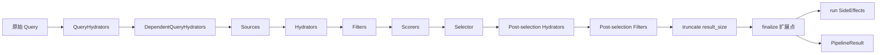

# candidate-pipeline 框架总览

## 1. 框架定位

`candidate-pipeline` 是一个 Rust trait 组合框架，用来把“候选获取 -> 补全 -> 过滤 -> 打分 -> 选择 -> 后处理”这条通用链路标准化。它本身不关心推荐领域细节，也不内置任何业务规则；它只约束：

- 各阶段的执行顺序
- 哪些阶段并行、哪些阶段串行
- 阶段之间如何传递和合并数据
- 某个组件失败时是否中断整条流水线

从职责上看，它更接近“推荐编排内核”，而不是“推荐算法本体”。

## 2. 模块结构

`candidate-pipeline/` 目录下的文件可以按职责分成两层：

| 文件 | 作用 |
| --- | --- |
| `candidate_pipeline.rs` | 定义 `CandidatePipeline` 主 trait、`execute()` 默认执行流程、`PipelineStage`、`PipelineResult` |
| `query_hydrator.rs` | 查询补全 trait |
| `source.rs` | 候选召回 trait |
| `hydrator.rs` | 候选补全 trait |
| `filter.rs` | 过滤 trait |
| `scorer.rs` | 打分 trait |
| `selector.rs` | 排序/截断 trait |
| `side_effect.rs` | 副作用 trait |
| `feature_switch.rs` | 特性开关控制抽象与辅助扩展 |
| `pipeline_summary.rs` | 每请求分阶段聚合统计与摘要日志 |
| `util.rs` | 通用工具，目前主要是日志展示用的类型名缩短 |

## 3. 核心数据模型

### 3.1 泛型参数

框架核心以两个泛型类型为中心：

- `Q`：请求或查询对象
- `C`：候选对象

两者都被要求满足：

- `Clone`
- `Send`
- `Sync`
- `'static`

这说明框架默认假设：

- 组件之间会复制 `Q` / `C`
- 组件实现需要在异步环境中并发执行
- 返回结果和副作用输入可能被跨任务持有

### 3.2 `HasRequestId`

查询对象 `Q` 额外要求实现 `HasRequestId`，用于日志和追踪。框架所有阶段日志都依赖这个 request id。

### 3.3 `PipelineResult<Q, C>`

框架最终返回的是：

- `retrieved_candidates`：完成 hydrate 后、进入 filter 前的候选集
- `filtered_candidates`：被 pre-selection filter 和 post-selection filter 移除的候选集合并结果
- `selected_candidates`：最终返回结果
- `query`：hydrate 完成后的查询对象，包装成 `Arc<Q>`

这里有两个容易忽略的点：

- `retrieved_candidates` 不是 source 原始输出，而是 hydrate 之后的结果
- `filtered_candidates` 把前置过滤和后置过滤的 removed 候选混在一起返回，不区分来源阶段

## 4. 核心抽象及职责边界

| 抽象 | 典型职责 | 是否可丢弃候选 | 是否要求返回等长结果 |
| --- | --- | --- | --- |
| `QueryHydrator<Q>` | 补全查询上下文 | 否 | 不适用 |
| `Source<Q, C>` | 从外部系统召回候选 | 否 | 不适用 |
| `Hydrator<Q, C>` | 给候选补字段 | 否 | 是 |
| `Filter<Q, C>` | 基于规则剔除候选 | 是 | 否 |
| `Scorer<Q, C>` | 计算或更新得分字段 | 否 | 是 |
| `Selector<Q, C>` | 排序、截断、重排 | 是，通常通过裁剪实现 | 不适用 |
| `SideEffect<Q, C>` | 打点、缓存、异步写回 | 否 | 不适用 |

### 4.1 组件共性

所有阶段组件（含 `Selector`）都支持：

- `enable(&self, query: &Q)` 或 `enable(&self, query: Arc<Q>)`；`Selector::enable()` 返回 false 时直接透传候选，不排序也不裁剪
- `name()`，默认来自组件类型名

这意味着运行期开关全部是“按请求动态决定”的，而不是全局静态装配。

### 4.2 Merge 模型

`QueryHydrator`、`Hydrator`、`Scorer` 都不是直接原地修改输入，而是：

1. 基于输入构造一个“局部更新结果”
2. 框架再调用 `update()` 或 `update_all()` 合并回原对象

这个模型要求每个组件只负责自己拥有的字段，否则很容易互相覆盖。

## 5. 执行阶段总览

当前框架中的执行顺序是固定的：

框架源码中的 `PipelineStage` 覆盖全部阶段，共 10 个变体：

- `QueryHydrator`
- `DependentQueryHydrator`
- `Source`
- `Hydrator`
- `PostSelectionHydrator`
- `Filter`
- `PostSelectionFilter`
- `Scorer`
- `Selector`
- `SideEffect`

selector 和 side effect 同样有框架级 stage 日志（`select()` 输出 `input/selected/non_selected/elapsed_ms`，`run_side_effects()` 逐个记录成功/失败），`pipeline_summary.rs` 的每请求聚合摘要覆盖全部 10 个变体。

## 6. 运行时假设

### 6.1 Tokio 运行时

框架会在 `run_side_effects()` 中使用 `tokio::spawn`，因此实际运行默认依赖 Tokio runtime。当前仓库里这点由 tonic server 满足。

### 6.2 组件独立性

同一阶段内的多个 `Hydrator` 和多个 `QueryHydrator` 是并行跑的，因此同阶段组件之间不应该存在显式数据依赖。这个约束不是“建议”，而是框架正确性的前提。

### 6.3 组件幂等性和弱一致性

多数阶段失败后都会被记录日志并跳过，而不是中断整条链路，所以组件最好满足：

- 失败可降级
- 局部缺失不导致后续 panic
- 默认值语义清晰

## 7. 这套框架适合什么，不适合什么

### 适合

- 候选规模中等、阶段清晰的推荐/搜索编排
- 需要多 Source 并发召回
- 需要把规则过滤和模型打分解耦
- 允许局部失败时整条链路继续返回结果

### 不适合

- 强依赖阶段内前置结果的复杂 DAG
- 需要严格事务语义或失败即中断的场景
- 需要 post-selection 过滤后自动回填结果的场景

后两类限制在当前实现里不是配置问题，而是框架语义本身决定的。
