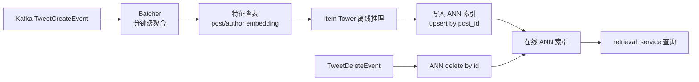
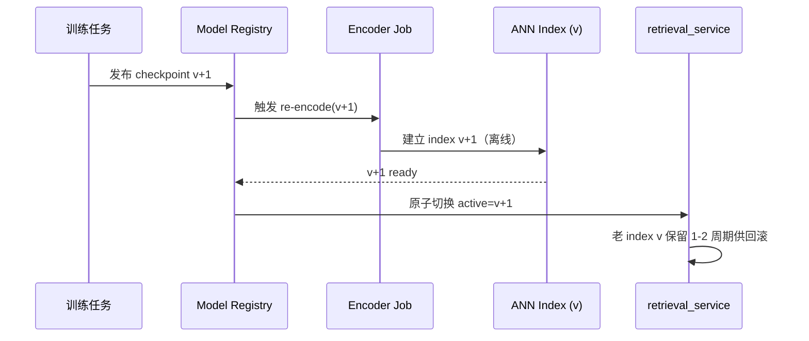
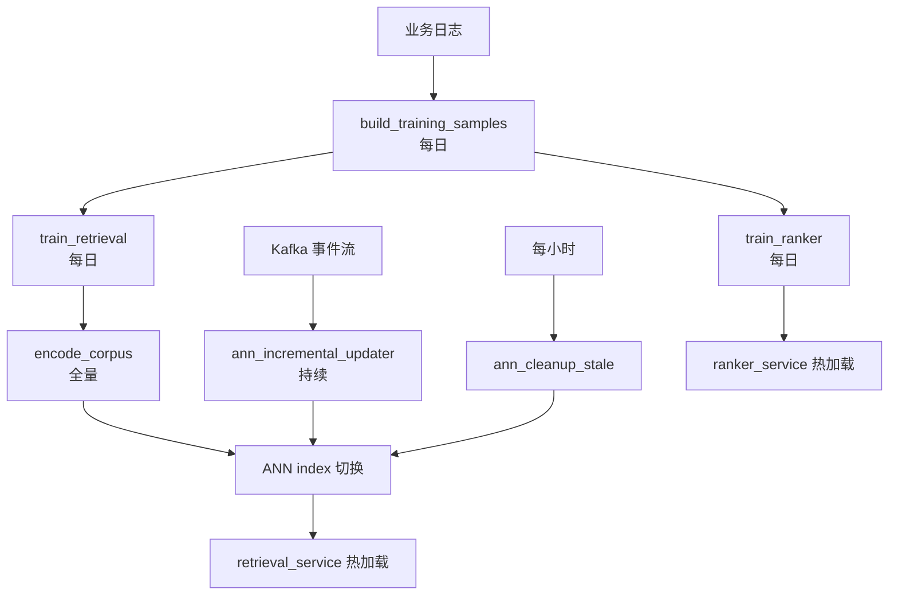

# 数据准备规范（Data Preparation Spec）

本文档定义"为你推荐"Feed 在生产环境下的**数据生命周期**——哪些数据是全量的、哪些是增量的、哪些需要周期性重做，以及它们与模型训练节奏之间的耦合关系。

本文是 `docs/training_data_spec.md`（训练样本字段规格）的互补文档：前者回答"训练样本长什么样"，本文回答"候选池 / 索引 / 模型 / 样本分别怎么更新"。

---

## 目录

- [1. 数据对象全景](#1-数据对象全景)
- [2. 网内数据（Thunder）](#2-网内数据thunder)
- [3. 网外数据（Phoenix Retrieval）](#3-网外数据phoenix-retrieval)
- [4. 模型训练节奏](#4-模型训练节奏)
- [5. 训练与索引的耦合规则](#5-训练与索引的耦合规则)
- [6. 离线任务编排建议](#6-离线任务编排建议)
- [7. 数据契约与表结构](#7-数据契约与表结构)
- [8. 监控与降级](#8-监控与降级)
- [9. 常见误区](#9-常见误区)

---

## 1. 数据对象全景

生产环境里有 **6 类**彼此独立更新的数据对象，不要把它们混为一谈：

| # | 对象 | 载体 | 更新节奏 | 谁消费 |
| :-- | :-- | :-- | :-- | :-- |
| 1 | 网内帖子缓存 | `thunder` 进程内存 | 实时 Kafka 流 | `ThunderSource` |
| 2 | 用户行为序列（UAS） | 上游业务存储 / Strato | 请求时拉取最近 N 条 | `UserActionSeqQueryHydrator` |
| 3 | Item embedding（物品向量） | ANN 索引（FAISS/Milvus/…） | 增量入库 + 周期重建 | `PhoenixRetrievalClient` |
| 4 | 用户塔权重 / 物品塔权重 | checkpoint 文件 | 日级 / 周级重训 | `retrieval_service` |
| 5 | 精排模型权重 | checkpoint 文件 | 日级 / 周级重训 | `ranker_service` |
| 6 | 训练样本 | 按日分区 Parquet | 每日追加 | 离线训练任务 |

**核心原则**：这 6 个对象的更新节奏**不必对齐**，但存在硬依赖（见 §5）——尤其"模型权重变化 ⇒ 物品向量必须全量重算"。

---

## 2. 网内数据（Thunder）

### 2.1 现状

`thunder` 是**进程内内存缓存**，承担"用户关注账号的最近帖子"这一单一职责。

- **保留窗口**：`thunder/args.rs` 中 `post_retention_seconds` 默认 `172800s = 2 天`；`thunder/posts/post_store.rs` 的 `insert_posts` 强制丢弃 `created_at` 超出窗口的记录。
- **每作者上限**：`MAX_ORIGINAL_POSTS_PER_AUTHOR / MAX_REPLY_POSTS_PER_AUTHOR / MAX_VIDEO_POSTS_PER_AUTHOR`，防止高产作者撑爆内存。
- **下游再收窄**：`home-mixer/params.rs` 的 `MAX_POST_AGE = 48h` 会过滤 48 小时以上的候选；Thunder 保留 2 天只是为了容忍重启和偶发消费延迟。
- **增量方式**：Kafka 实时消费 `TweetCreateEvent` / `TweetDeleteEvent`，见 `thunder/kafka/tweet_events_listener.rs`。
- **冷启动**：`auto_offset_reset = "earliest"`，重启时从 Kafka 保留期内最老 offset 一路 replay 到 now，`PostStore::finalize_init` 再做一次排序和修剪。

### 2.2 生产建议

| 项 | 建议值 | 理由 |
| :-- | :-- | :-- |
| Thunder 保留窗口 | **48–72 小时** | 大于下游 `MAX_POST_AGE`，容忍 24h 重启/重放 |
| Kafka 保留期 | **≥ Thunder 保留窗口** | 否则重启无法恢复到稳态 |
| 是否需要定期全量重做 | **否** | 进程重启即是天然重做 |
| 是否需要 backfill | **仅 schema 变更时** | 字段新增、编码变更需要重放历史 |

### 2.3 不要做的事

- **不要**把 Thunder 拉到"永久全量历史"——它是内存 cache，不是归档库。
- **不要**把老帖子用 Thunder 召回——那是网外（Phoenix）的职责。

---

## 3. 网外数据（Phoenix Retrieval）

这是"海量内容是否需要全量？能否增量？"的核心关注对象。

### 3.1 物品池的定义

候选池**不是**平台所有历史帖子，而是"近期仍有被推荐价值"的子集。生产环境候选池建议用**活跃窗口策略**：

```text
候选池 = 最近 N 天活跃帖 ∪ 长青优质帖
       N 推荐 7–14 天
```

扩充规则：

- **基础窗口**：`created_at >= now - N 天`，保证新鲜度。
- **长青补充**（可选）：按 `engagement_score * time_decay` 排序 Top-M 老帖。
- **硬过滤**：已删除 / nullcast / 作者被封禁的帖子必须即时从索引剔除。

### 3.2 Item embedding 的增量流程



关键实现点：

- **入口复用 Kafka**：`thunder/kafka/tweet_events_listener.rs` 的同一份事件流可以 fork 一条给 "embedding indexer" 任务使用，或直接消费上游原始 topic。
- **物品塔调用**：对应 `phoenix/recsys_retrieval_model.py` 的 `CandidateTower`；服务端接口是 `RecsysRetrievalInferenceRunner.encode_candidates`（见 `docs/phoenix/03-retrieval-pipeline.md` §7）。
- **入库原子性**：用 `post_id` 作为主键 upsert，删除事件立即 `delete by id`。
- **批大小**：推荐分钟级聚合到 batch（如 1000 条）再过物品塔，平衡吞吐和时效。

### 3.3 ANN 索引的更新节奏

**HNSW / IVF / PQ 这类近似索引在大量增量 upsert 后会退化**（尤其是 HNSW 的图结构对删除尤其敏感）。因此需要 **增量 + 周期性 rebuild** 的双层机制：

| 操作 | 节奏 | 目的 |
| :-- | :-- | :-- |
| **增量 upsert 新帖向量** | 分钟 / 秒级 | 新内容秒级可召回 |
| **增量删除过期 / 违规帖** | 实时 | 避免召回到已删除内容 |
| **周期性全量 rebuild** | **每日 1 次** | 修复图结构退化；并且在每次模型重训后必须触发 |
| **窗口外老帖定期清理** | 每小时 | 收敛索引规模，匹配活跃窗口策略 |

### 3.4 User embedding 不需要"增量"

用户向量**请求时实时算**，不落盘：

- `home-mixer/sources/phoenix_source.rs:20-32` 调用 `retrieve(user_id, sequence, max_results)` 时把 UAS 序列一并传入；
- 服务端 `encode_user(batch, embeddings)` 即时跑用户塔；
- 因此"用户历史"的更新等于 UAS 拉取的更新，和 ANN 索引无关。

窗口大小参考 `home-mixer/params.rs`：`UAS_WINDOW_TIME_MS = 7 天`，`UAS_MAX_SEQUENCE_LENGTH = 300`。

---

## 4. 模型训练节奏

### 4.1 三种"训练"要分清

生产环境中"训练"实际上是三件事，粒度从粗到细：

| 概念 | 参数初始化 | 数据窗口 | 频率 | 何时触发 |
| :-- | :-- | :-- | :-- | :-- |
| **新训练（train from scratch）** | 全部随机重置 | 大窗口（90–180 天） | 季度 / 年度 | 架构 / 特征 / 标签定义大改 |
| **重训（retrain, warm-start）** | 加载上一次 checkpoint 继续训 | 滑动窗口（30–60 天） | 日 / 周 | 线上数据分布漂移、定期迭代 |
| **Embedding 刷新（re-encode）** | 参数不变 | 只看当前候选池 | 分钟 / 小时 | 新帖入库，增量 |

### 4.2 典型的日常节奏

```text
每 N 分钟：  新帖 → 物品塔（老参数）→ ANN upsert        （Embedding 刷新）
每   1 日：  昨日样本 → 重训 checkpoint → 全量 re-encode  （重训）
每   Q 次：  架构 / 特征大改 → 新训练 + 全量 re-encode    （新训练）
```

### 4.3 召回 vs 精排训练的节奏不同

| 模型 | 对样本时效性要求 | 建议重训频率 |
| :-- | :-- | :-- |
| 双塔召回 | 中。向量空间稳定即可 | **每 1–3 天** |
| 精排 Phoenix | 高。直接影响 CTR | **每日** 或 **每小时**（成熟阶段） |

精排迭代比召回频繁，这就是为什么生产中通常把 ranker 和 retrieval 的 checkpoint 分开管理（`phoenix/services/model_registry.py` 已经是独立的 registry 设计）。

---

## 5. 训练与索引的耦合规则

这是最容易被忽视但最关键的一条规则。

### 5.1 硬约束

**只要物品塔参数变了，整个 corpus 的 item embedding 必须全量重算。**

原因：

1. 双塔召回依赖"用户向量 · 物品向量"的点积，两侧必须用**同一组**物品塔参数产出。
2. 新老参数编码出的向量分布在不同空间，点积没有可比性。
3. 即使只更新了一小步（warm-start），向量空间也会整体平移。

所以：

```text
重训 checkpoint 发布 →  物品塔参数变化  →  corpus 全量 re-encode  →  ANN rebuild  →  原子切流
```

### 5.2 原子切流策略

为避免"新用户塔 × 旧物品向量"这种跨版本污染，必须做**版本化 + 原子切换**：



实现上两个要点：
- `services/model_registry.py` 的 checkpoint 版本号和 VectorIndex 的版本号**必须对齐**。
- retrieval_service 持有的 `(params, corpus_embeddings)` 是一对不可分割的绑定，切换时整对切。

### 5.3 增量期只允许"参数冻结"

```text
checkpoint = v 期间 →  只能用 v 对应的物品塔做增量 encode  →  写入 v 对应的 ANN index
```

绝对不要用"新 checkpoint 对新帖，旧 checkpoint 对老帖"的拼接策略——向量空间不可比。

---

## 6. 离线任务编排建议

### 6.1 任务清单

| 任务 | 触发方式 | 频率 | 输入 | 输出 |
| :-- | :-- | :-- | :-- | :-- |
| `ingest_posts_to_kafka` | 业务侧 CDC | 实时 | 业务库 `posts` 表 | Kafka `tweet_events` |
| `build_training_samples` | 按天调度 | 每日 | 曝光日志 + 互动日志 + UAS | `training_data/date=YYYY-MM-DD/*.parquet` |
| `train_retrieval` | 按天 / 按周 | 每日 / 每周 | 最近 30–60 天 parquet | `checkpoints/retrieval/vN/` |
| `train_ranker` | 按天 | 每日 | 最近 30–60 天 parquet | `checkpoints/ranker/vN/` |
| `encode_corpus` | train_retrieval 完成后触发 | 跟随重训 | 当前活跃窗口帖子 + checkpoint vN | `vector_index/retrieval/vN/` |
| `ann_incremental_updater` | Kafka 流式 | 持续运行 | `tweet_events` + 当前活跃 vN checkpoint | 向 `vN` 索引 upsert/delete |
| `ann_daily_rebuild` | 按天调度（重训后触发更好） | 每日 | 当前活跃窗口帖子 | 刷新 `vector_index/retrieval/vN/` |
| `ann_cleanup_stale` | 按小时调度 | 每小时 | `created_at < now - N天` | 从 index 中删除 |

### 6.2 编排依赖图



### 6.3 关键编排约束

- `encode_corpus` 必须**在 retrieval_service 切换到新 checkpoint 之前**完成，否则服务会跑 "新用户塔 × 旧物品向量"。
- `ann_incremental_updater` 必须监听 checkpoint 版本变化，**切版后立即停止写入旧 index、开始写入新 index**，或者直接在切换前暂停几分钟。
- 所有离线产物建议带版本号 + ready 标记文件（例如 `_SUCCESS`），避免下游读到半成品。

---

## 7. 数据契约与表结构

### 7.1 上游必须提供的事件 / 日志

| 表 / Topic | 内容 | 时效要求 |
| :-- | :-- | :-- |
| `tweet_events`（Kafka） | 帖子创建 / 删除事件 | 实时（秒级） |
| `impressions`（Parquet 按日分区） | 每次曝光的 user × 候选列表 × 场景 | T+1 |
| `action_log`（Parquet 按日分区） | 用户互动明细 | T+1 |
| `user_action_sequence`（在线查询） | 最近 N 天行为序列 | 查询时拉取最近 |
| `post_features`（每日快照或实时） | 帖子元数据 + 原始 embedding 输入 | T+1 或实时 |
| `user_features`（每日快照） | 用户元数据 | T+1 |

`impressions` / `action_log` / `user_action_sequence` 的字段定义见 `docs/training_data_spec.md` §2.1 / §2.2 / §2.3。

### 7.2 训练样本产出物

按日分区 Parquet（参考 `docs/training_data_spec.md` §6）：

```text
training_data/
  date=2026-04-22/
    part-00000.parquet
    part-00001.parquet
    _SUCCESS
  date=2026-04-23/
    ...
```

### 7.3 模型产物

```text
checkpoints/
  retrieval/
    v20260423/
      params.pkl
      config.json
      _SUCCESS
  ranker/
    v20260423/
      ...

vector_index/
  retrieval/
    v20260423/
      embeddings.npy     # [N, D]
      post_ids.npy       # [N]
      ann.index          # faiss 序列化
      _SUCCESS
```

**版本号建议用日期前缀 + 递增**，不要用纯自增整数——肉眼能看出时间顺序更利于排查。

---

## 8. 监控与降级

### 8.1 必须监控的指标

| 指标 | 阈值 | 含义 |
| :-- | :-- | :-- |
| Kafka `tweet_events` lag | < 30s | 否则新帖进不了索引 |
| ANN 增量延迟（帖子创建 → 可召回） | < 5min | 时效性核心 |
| 每日 `encode_corpus` 任务成功率 | 100% | 失败则无法切新 checkpoint |
| 活跃窗口内帖子数 vs ANN 索引 size | 偏差 < 1% | 检测索引漂移 |
| retrieval_service checkpoint 版本和 ANN 版本 | 必须相等 | 防止跨版本污染 |

### 8.2 降级策略

| 场景 | 降级动作 |
| :-- | :-- |
| Phoenix retrieval 服务不可用 | 全量回退到 Thunder 网内候选（`query.in_network_only = true`，见 `home-mixer/sources/phoenix_source.rs:16-18`） |
| 新 checkpoint 训出来指标恶化 | Model Registry 回滚到上一版本，对应 ANN 索引也回滚 |
| ANN 增量任务挂掉 | 服务仍用最近一次全量重建的索引；监控告警后手动拉起 |
| encode_corpus 失败 | 跳过本次 checkpoint 发布，继续用旧版本 |

---

## 9. 常见误区

### 误区 1：想把所有历史帖子都放进召回索引

**错。** 候选池只放"活跃窗口 + 长青优质"即可。超出窗口的老帖在 `MAX_POST_AGE` 过滤下也到不了最终 Feed，放进索引只是浪费存储并拉低 ANN 精度。

### 误区 2：模型参数小改不需要全量 re-encode

**错。** 只要物品塔参数变了一步，向量空间就平移，必须全量重算。warm-start 也不例外。

### 误区 3：Thunder 可以当归档库用

**错。** Thunder 是 in-memory cache，拉长保留期会直接撑爆进程。老内容交给 Phoenix ANN。

### 误区 4：训练样本越多越好

**不完全对。** 滑动窗口（30–60 天）通常优于全量历史——早期分布和当下分布差异太大反而有害。新训练可以开到 90–180 天，日常重训不需要。

### 误区 5：增量和全量二选一

**错。** 生产环境必须是**增量 + 周期性全量 rebuild** 的组合：增量保时效，rebuild 保精度和参数对齐。

---

## 10. 一张速查表

| 问题 | 答案 |
| :-- | :-- |
| 网内历史数据需要多少？ | 48–72h 滑动窗口，实时 Kafka 增量，无需定期全量 |
| 网外候选池需要全量吗？ | 否，最近 7–14 天活跃帖 |
| 网外能增量更新吗？ | 能，分钟级增量 upsert 到 ANN |
| 需要定期全量重做吗？ | 需要，每日一次 rebuild + 每次模型重训后强制触发 |
| 模型重训和新训练什么关系？ | 重训是 warm-start 日常迭代；新训练是架构大改时从零训 |
| 参数变化后怎么处理向量？ | 全量 re-encode，不允许跨版本拼接 |
| 用户向量要入库吗？ | 不需要，在线请求时实时算 |

---

## 参考

- `docs/data_operations_runbook.md`：**本文档的操作层姊妹篇**，具体的部署步骤、调度任务、故障处理
- `docs/training_data_spec.md`：训练样本字段规格
- `docs/phoenix/03-retrieval-pipeline.md`：召回链路设计
- `docs/phoenix/06-training-and-data.md`：训练侧能力评估
- `thunder/args.rs` / `thunder/posts/post_store.rs`：网内缓存的保留窗口实现
- `home-mixer/params.rs`：Feed 编排期的窗口参数
- `phoenix/services/retrieval_service.py`：`VectorIndex` / `set_corpus` 入口
