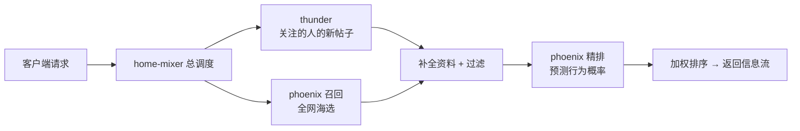

# 这个项目是什么

> **这篇解决什么问题**：用大白话讲清楚这个仓库是干什么的、能跑到什么程度。
> **读完你能做到什么**：知道自己该往下读哪一篇。
> **前置条件**：无。

## 一句话版本

这是 X（推特）公开的"为你推荐"信息流算法的一个可运行移植版：你打开首页看到的那列帖子，就是这套系统挑出来、排好序的。

## 推荐系统在做一件很朴素的事

想象你是一家报社的编辑，每天要给每位读者装一份专属报纸：

1. **海选（召回）**：从海量稿件里先粗筛几百篇可能感兴趣的。
2. **补全资料（水合）**：把每篇稿件的正文、作者、配图找齐。
3. **过滤**：删掉读者已经看过的、拉黑作者写的、太旧的。
4. **打分排序（精排）**：预测读者对每篇稿件"会不会点赞/评论/举报"，加权算出总分，按分数排版。

这个仓库的四个模块就是在分工做这件事：

| 模块 | 大白话 | 技术形态 |
| --- | --- | --- |
| `thunder/` | "你关注的人最新发了什么"的货架，全部放在内存里，查起来极快 | Rust 服务，消费 Kafka 事件 |
| `phoenix/` | 会打分的 AI 模型：一个负责海选（从全网找你可能喜欢的），一个负责精排（预测你对每条帖子的行为概率） | Python/JAX 模型 + 服务 |
| `home-mixer/` | 总调度：接到"给我刷新首页"的请求后，指挥上面两位干活，把结果串成最终的信息流 | Rust gRPC 服务 |
| `candidate-pipeline/` | 流水线骨架：定义"先海选、再补全、再过滤、再打分"的执行顺序和容错规则 | Rust 库 |

## 诚实地说：这套系统能跑到什么程度

X 开源的是核心算法代码，不是完整的生产系统。原版依赖的内部服务（用户资料库、内容审核、行为日志等）没有开源，本仓库用"桩代码 + 演示模式"补齐了缺口。按能力分级：

| 级别 | 内容 | 状态 |
| --- | --- | --- |
| Level 0 | 全部代码编译通过 | 可以 |
| Level 1 | 单独跑通模型推理（假数据、随机权重） | 可以，见[第一步](./02-第一步-跑通模型演示.md) |
| Level 2 | 模型变成 HTTP 服务，训练出自己的模型 | 可以，见[第二步](./03-第二步-把模型变成服务.md)、[第三步](./04-第三步-训练自己的模型.md) |
| Level 3 | 完整推荐链路在本机跑通，请求一次返回真实排序的信息流 | 可以（演示模式），见[第四步](./05-第四步-跑通完整推荐链路.md) |
| Level 4 | 接入你自己平台的真实数据和服务 | 需要开发工作，缺口清单见[从演示到真实系统](./06-从演示到真实系统.md) |

"演示模式"的意思是：帖子是启动时生成的模拟数据，模型可以用随机权重（或你自己训练的权重），用户资料是内置的假账号。链路是真的，数据是假的。

## 阅读路线

按顺序读、照着敲命令即可：

1. [01-准备环境](./01-准备环境.md) —— 装三个工具，10 分钟
2. [02-第一步-跑通模型演示](./02-第一步-跑通模型演示.md) —— 5 分钟看到模型输出
3. [03-第二步-把模型变成服务](./03-第二步-把模型变成服务.md) —— 用 curl 调用打分接口
4. [04-第三步-训练自己的模型](./04-第三步-训练自己的模型.md) —— 训练并加载自己的权重
5. [05-第四步-跑通完整推荐链路](./05-第四步-跑通完整推荐链路.md) —— 一条命令跑通全链路
6. [06-从演示到真实系统](./06-从演示到真实系统.md) —— 接真实数据还差什么

想深入理解某个模块的代码，再去看 [docs 总目录](../README.md) 里的模块文档。
