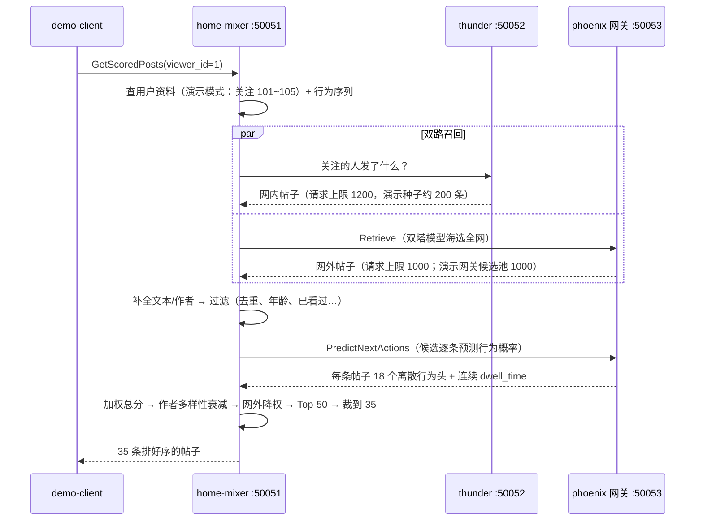

# 第四步：跑通完整推荐链路

> **这篇解决什么问题**：把三个服务（thunder、phoenix、home-mixer）一起跑起来，像真实客户端一样请求一次"刷新首页"，拿到一列排好序的帖子。
> **读完你能做到什么**：一条命令跑通端到端链路，并理解每个环节在干什么。
> **前置条件**：完成 [01-准备环境](./01-准备环境.md)（即 `cargo build` 和 `uv sync --group service` 都成功过）。

## 一键运行

在仓库根目录：

```bash
./scripts/run_demo.sh
```

脚本会依次：编译 → 启动 Phoenix gRPC 网关（50053）→ 启动 thunder 演示模式（50052）→ 启动 home-mixer（50051）→ 用演示客户端请求一次推荐 Feed → 打印结果 → 清理进程。预期最后看到：

```text
#    帖子 ID                作者       得分         网内         来源
1    2079102310290007235  212      0.0031     否          Phoenix 网外
2    ...
34   2079100111060730041  101      0.0008     是          Thunder 网内
...
共 35 条：网内 4 条 + 网外 31 条。链路打通。
[demo] 端到端链路验证通过。
```

> 条数与得分量级由上游 `47c1bcd` 真值参数决定（最终结果 35 条、TopK 50、
> 负分偏移 0.001）。演示模型是随机权重，网内/网外比例会随权重真值波动，
> 只要两类来源都出现且链路打通即为通过。

加 `--keep` 可以让三个服务保持运行，方便反复请求：

```bash
./scripts/run_demo.sh --keep
# 另开终端，随时再来一次：
cargo run -p home-mixer --bin demo-client
```

脚本还支持几条可选验证路径（主路径不需要）：

```bash
./scripts/run_demo.sh --topic-id 10      # 话题推荐
./scripts/run_demo.sh --cached-posts 8   # 缓存降级（未签名 fixture，仅 demo）
./scripts/run_demo.sh --final-feed       # ForYou 最终 Feed 服务
```

`run_demo.sh` 只认识上面这些参数。`--in-network-only` / `--addr` / `--viewer-id` 是 `demo-client` 自己的开关，加在脚本后面会直接退出；服务起来后用：

```bash
cargo run -p home-mixer --bin demo-client -- --in-network-only
```

服务日志在 `/tmp/demo-{thunder,home-mixer,phoenix-gateway}.log`。

## 这 35 条帖子是怎么来的



看结果时能验证几个算法行为：

- **网内 + 网外混合**：`Thunder 网内`来自"你关注的作者"（101~105），`Phoenix 网外`是模型从候选池海选的（作者 201~240）。
- **网外降权**：普通请求里网外帖子的总分乘 0.75（`OON_WEIGHT_FACTOR`）；带 `--topic-id` 的话题请求才乘 0.5。
- **作者多样性**：同一作者第 2、3 条分数按 `(1 - 0.25) × 0.5^出现次数 + 0.25` 衰减，大约是 ×0.625、×0.4375，避免刷屏。

## 手动分步启动（理解每个环节）

一键脚本做的事，等价于开四个终端。网关要带上和脚本相同的候选池大小，否则网外比例会对不上：

```bash
# 终端 1：Phoenix gRPC 网关（模型打分 + 网外召回）
cd phoenix && uv run scripts/run_grpc_gateway.py --corpus-size 1000
# 想用第三步训练的模型：
#   uv run scripts/run_grpc_gateway.py \
#     --ranker-checkpoint checkpoints/model_params_step200.npz \
#     --emb-tables checkpoints/embedding_tables.npz

# 终端 2：Thunder 演示模式（内置 200 条模拟帖子，不需要 Kafka）
RUST_LOG=info cargo run -p thunder -- --demo-seed-posts 200 --grpc-port 50052

# 终端 3：home-mixer（演示模式 + 指向前两个服务）
RUST_LOG=info \
HOME_MIXER_MODE=demo \
THUNDER_GRPC_ADDR=http://localhost:50052 \
PHOENIX_PREDICT_GRPC_ADDR=http://localhost:50053 \
PHOENIX_RETRIEVAL_GRPC_ADDR=http://localhost:50053 \
cargo run -p home-mixer

# 终端 4：请求一次
cargo run -p home-mixer --bin demo-client
```

几个开关的含义：

| 开关 | 作用 | 不设置会怎样 |
| --- | --- | --- |
| `--demo-seed-posts 200` | thunder 启动时生成 200 条模拟帖子灌进内存，跳过 Kafka | thunder 会等待 Kafka 消息，没有 Kafka 就一直卡在启动 |
| `HOME_MIXER_MODE=demo` | home-mixer 装配时注入演示客户端，提供关注列表、行为序列、帖子文本 | 默认 `degraded` 使用 disabled adapter：关注列表为空、帖子没有文本，结果可能为空 |
| `PHOENIX_*_GRPC_ADDR` | home-mixer 连接真实的 Phoenix 模型服务 | 相应能力显式 Unavailable：跳过网外召回 / 保留候选并走规则排序 |

## 排查

- **返回 0 条帖子**：demo-client 会打印排查提示。最常见原因是 thunder 没用演示模式启动，或 `HOME_MIXER_MODE=demo` 没设置。
- **端口被占用**：脚本会直接报出是哪个 gRPC 口。三个服务分别是 50051 / 50052 / 50053；home-mixer 还听 HTTP 9090，thunder 还听 HTTP 8080，两条都是空路由，没有 `/metrics`。
- **Phoenix 网关起得慢**：JAX 首次编译模型需要约 1 分钟，属正常。

下一篇：[06-从演示到真实系统](./06-从演示到真实系统.md)——搞清楚演示模式"假"在哪，换成真实数据要做什么。
