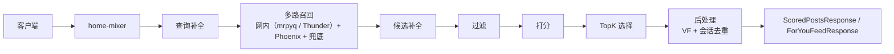
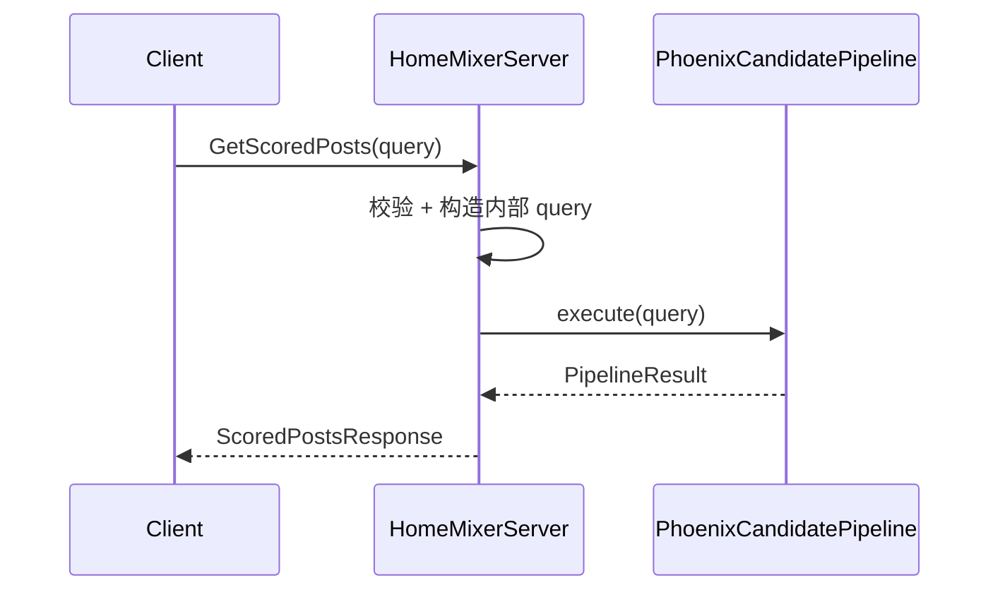
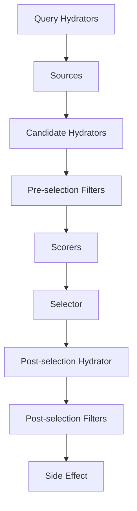
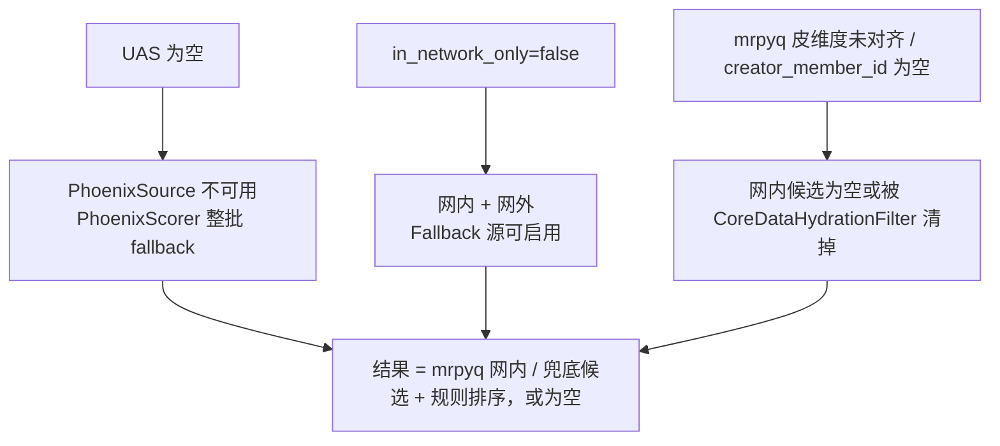

# home-mixer 总览手册

这是一份面向“一次读懂 `home-mixer`”的主文档。

如果只读一篇，先读这一篇；如果需要查细节，再跳到附录索引 [appendices.md](./appendices.md)。

## 1. 一句话定义

`home-mixer` 是首页 Feed 的在线编排层：它接收客户端请求，补齐用户上下文，并行召回网内与网外候选，完成候选补全、过滤、打分、选择和安全后处理，最终返回一页已排序结果。

## 2. 系统边界

### 2.1 `home-mixer` 负责什么

- 接收 `ScoredPostsService` 的 Get/Debug 请求和 `ForYouFeedService` 的 legacy/V2 请求
- 由 `QueryBuilder` 构造内部 `ScoredPostsQuery` 与请求/预测身份
- 通过上游命名 Query Hydrator owners 获取 scoring/retrieval sequence 和 user feature fields
- 从网内源（非 demo：mrpyq 关注收件箱；demo：Thunder）、Phoenix 和兜底池取候选
- 对候选做补全、过滤、打分、选择
- 响应前等待异步记录本次下发的帖子（`ServedPersistence`），再返回 `ScoredPost`

### 2.2 `home-mixer` 不负责什么

- 帖子事件消费与网内缓存维护：`thunder/`
- 模型训练和推理实现：`phoenix/`
- 通用 pipeline 框架：`candidate-pipeline/`
- proto 生成：`proto/`

## 3. 一次请求怎么流动

请求入口的 tonic trait 实现在 `home-mixer/server.rs`（`impl ScoredPostsService for ScoredPostsServer`、`impl ForYouFeedService for ForYouFeedServer`），打分与响应映射在 `scored_posts_server.rs`，核心流程固定：

1. `QueryBuilder` 校验并映射 proto 请求
2. 调用内层 `PhoenixCandidatePipeline::execute()`
3. 将 scored candidates 映射为 `ScoredPost`
4. ForYou 请求再进入外层 `ForYouCandidatePipeline`；Debug 请求从同一次内层执行返回 typed stage data

## 4. Pipeline 的真实阶段

`home-mixer` 的业务装配在 `home-mixer/candidate_pipeline/phoenix_candidate_pipeline.rs`，执行语义由 `candidate-pipeline/candidate_pipeline.rs` 提供。

### 4.1 阶段顺序

1. Query Hydrators
2. Sources
3. Candidate Hydrators
4. Pre-selection Filters
5. Scorers
6. Selector
7. Post-selection Hydrator
8. Post-selection Filters
9. Side Effect

### 4.2 并行与串行

- 并行：QueryHydrator、Source、Hydrator、SideEffect
- 串行：Filter、Scorer、Selector、Post-selection Filter

## 5. 两个核心数据对象

### 5.1 `ScoredPostsQuery`

它是请求上下文容器，包含：

- 原始请求字段：用户、语言、国家、已看过、已投递、翻页标记
- hydrated 字段：`user_action_sequence`、`user_features`
- 追踪字段：`request_id`

### 5.2 `PostCandidate`

它是候选共享状态容器，包含：

- 标识与关系：`tweet_id`、`author_id`、reply/retweet 关系、`ancestors`
- 内容与展示：`tweet_text`、`video_duration_ms`、screen name
- 排序：`phoenix_scores`、`weighted_score`、`score`
- 来源与安全：`served_type`、`in_network`、`visibility_decision`

## 6. 召回策略

`home-mixer` 默认是多路召回，演示里还会加上话题源。

### 6.1 ThunderSource

- 负责网内候选；名字沿用上游，实际依赖 `InNetworkPostsClient`：非 demo 是 mrpyq NETWORK 关注收件箱（`MRPYQ_RECOMMENDATION_DATA_ADDR` 必填），demo 是整数 Thunder
- 非 demo 候选只带帖子 ID，作者 / 正文 / 时间靠 TES（同一 mrpyq 服务）补全；demo 的 Thunder 候选另带 reply / conversation 关系
- 在来源处就标 `in_network = Some(true)`
- 请求带未签名 cached posts 时关闭

### 6.2 PhoenixSource

- 负责网外候选
- 输入依赖 retrieval sequence
- 设 `PHOENIX_RETRIEVAL_GRPC_ADDR` 后真连网关；没设就跳过这一路
- 网内限定、严格话题、或已有 cached posts 时关闭

### 6.3 FallbackSource

- 负责兜底候选（非 demo：mrpyq FALLBACK 池；demo：合成数据），在来源处标 `in_network = Some(false)`
- 网内限定或已有 cached posts 时关闭

产品默认是全网 For You，网络范围只有一个真源：请求的 `in_network_only`。只有它显式为 `true` 才切到网内专用路径并关闭 `PhoenixSource` 与 `FallbackSource`。QueryBuilder 不依赖 Gizmoduck viewer RPC；Gizmoduck 只在候选水合阶段补作者资料，当前非 demo 资料为空。Demo 还会装配 `PhoenixTopicsSource`。`CachedPostsSource` 一直在列表里，只有显式打开未签名 fixture 才会出数。

## 7. 补全、过滤和排序

### 7.1 Candidate Hydrators

当前主要补：

- `in_network`（来源未标定时）
- `author_id`（mrpyq 候选来源留空，由 TES 补回）、`tweet_text`、`created_at_ms`
- `recommendation_eligible`（mrpyq 一级不可推荐标志）
- `retweeted_*`
- `video_duration_ms`
- `author_screen_name`（非 demo 为空）
- `visibility_decision`（后补全，区分 Allowed / Restricted / Unchecked / Unavailable）

### 7.2 Filters

当前过滤链主要解决：

- 重复内容
- 内容不完整
- 业务一级不可推荐（删除 / 未公开 / 审核未过）
- 过旧内容（`created_at_ms`，缺失时回退 ObjectId 时间戳）
- viewer 自己的内容
- 已看过 / 已投递
- 屏蔽关键词
- 拉黑 / 静音作者
- VF 删除（未验证的候选默认也删除）
- 会话级去重

引用 / 转推 / 订阅三类产品不存在的专用过滤器已按 U5 删除。

### 7.3 Scorers

排序链为：

1. `PhoenixScorer`
2. `RankingScorer`（内部依次组合 Weighted、AuthorDiversity、OON 行为）
3. `RuleFallbackScorer`（Phoenix 头缺失时整批改用规则分）
4. 可选 `VMRanker`、`AuthorColdStartScorer`（仅 demo，且要显式开开关）

含义是：

- 先预测行为概率
- 再加权合成相关性
- 再做作者多样性衰减
- 最后给网外内容降权；网内回复/转发默认也乘同一因子
- 模型不可用（无行为序列、超时、契约校验失败）时整批换成“新鲜度 + 网内 + 互动数”的规则分

## 8. 网内召回源为什么重要

非 demo 的网内源是 mrpyq 关注收件箱，demo 是 Thunder；两者对 `home-mixer` 的价值都不是“直接返回排好序的网内 Feed”，而是：

- 快速给出一批网内轻量候选
- 提供 reply / retweet / conversation 关系
- 用新鲜度做初步排序

但它不负责：

- 文本补全
- 个性化排序
- 用户级去重
- 安全过滤

所以 `home-mixer` 必须继续跑后续整条 pipeline。

## 9. 外部依赖现状

从当前仓库真实状态看：

| 依赖 | 当前状态 |
| --- | --- |
| InNetworkPostsClient（网内 / 兜底） | 非 demo `MrpyqInNetworkPostsClient`（`MRPYQ_RECOMMENDATION_DATA_ADDR` 必填，缺失则启动失败）；demo `ThunderClient`（`THUNDER_GRPC_ADDR`） |
| TESClient | 非 demo `MrpyqTESClient`（mrpyq `BatchGetRecommendationContents`）；demo `DemoTESClient`（演示文本） |
| VisibilityFilteringClient | 非 demo `MrpyqFirstStageEligibilityClient`（只有帖子维度的一级 `recommendation_eligible`，无 viewer 级判定）；demo 显式 Allow。未验证候选按 `HOME_MIXER_VF_FAILURE_POLICY`，默认 `fail_closed` 删除 |
| StratoClient | 非 demo `MrpyqStratoClient`（mrpyq `ViewerRelationService`，后端尚未实现，当前调用失败、关系为空）；demo `DemoStratoClient`（演示关注列表） |
| PhoenixRetrievalClient | 设 `PHOENIX_RETRIEVAL_GRPC_ADDR` 后真连 gRPC 网关；缺失时显式 Unavailable 并跳过该召回路；非 demo 拒绝随机权重 |
| PhoenixPredictionClient | 设 `PHOENIX_PREDICT_GRPC_ADDR` 后真连 gRPC 网关并校验 serving metadata；缺失或校验失败时整批走 `RuleFallbackScorer`；非 demo 拒绝随机权重 |
| UserActionSequenceOps | 非 demo `RedisUserActionSequenceStore`（读取 `uas-worker` 投影到 Redis 的最近 7 天行为，`UAS_REDIS_URL` 缺省复用 `HOME_MIXER_REDIS_URL`；没有投影数据时序列为空）；demo `DemoUserActionSequenceFetcher`（合成行为序列） |
| GizmoduckClient | 仅补作者资料；非 demo `DisabledGizmoduckClient` 返回空，demo 合成昵称 / 粉丝数 |
| ServedPersistence | `FeedStateServedPersistence`：业务模式写共享 Redis，Demo 默认进程内存 |

这意味着：

- 框架和装配已经完整
- 非 demo 已经真实接到 mrpyq 的内容与网内 / 兜底召回，行为序列由 `uas-worker` → Redis → `RedisUserActionSequenceStore` 承载（真实埋点事件流仍待接入验收），作者资料、viewer 关系后端和持久化曝光仍缺；配好演示组合可端到端跑通（见 [getting-started 第四步](../getting-started/05-第四步-跑通完整推荐链路.md)）

## 10. 当前默认运行行为

默认 `degraded` 配上 mrpyq 地址后，最常见的不是“候选被清空”，而是“链路只走了一小段”：

1. 没有 `user_action_sequence`，`PhoenixScorer` 整批标 `phoenix_missing_sequence`，所有请求由 `RuleFallbackScorer` 排序
2. 请求未显式限定网内，因此 `FallbackSource` 可启用；`PhoenixSource` 仍会因缺少行为序列而不可用
3. mrpyq 收件箱以皮 `member_id` 作为 `account_id` 查询，皮维度对齐落地前候选供给可能为空；`creator_member_id` 为空的帖子被 `CoreDataHydrationFilter` 清掉

`HOME_MIXER_MODE=demo` 正是针对这些缺口注入演示数据，让链路不依赖外部平台也能出结果。

## 11. 当前最值得关注的风险

### 11.1 结果为空、过少或“只有规则排序”

主要由非 demo 仍缺的适配器（UAS、viewer 关系后端、作者资料）和 mrpyq 皮维度契约未落地叠加导致。

### 11.2 同 stage hydrator 依赖问题

因为同一 stage 的 hydrator 并行执行，彼此看不到这一轮刚写入的新字段。

### 11.3 post-selection 删除后不回补

- selector 先取 Top 50
- post-selection 再删
- 最终截断到 35（`RESULT_SIZE`）
- 不会回补第 51 名之后的候选

### 11.4 观测能力偏弱

当前主要依赖 request_id + stage 日志，没有完整 metrics 体系。

## 12. 配置和参数怎么影响行为

配置来源主要有三类：

- CLI 参数：端口等
- 环境变量：如 `HOME_MIXER_MODE`、`MRPYQ_RECOMMENDATION_DATA_ADDR`、`PHOENIX_*_GRPC_ADDR`、`HOME_MIXER_VF_FAILURE_POLICY`；demo 另有 `THUNDER_GRPC_ADDR`
- `params/` 常量：召回上限、权重、Age、TopK、ResultSize、mrpyq 超时与召回预算

最重要的参数组是：

- `THUNDER_MAX_RESULTS`
- `PHOENIX_MAX_RESULTS`
- `MAX_POST_AGE`
- `TOP_K_CANDIDATES_TO_SELECT`
- `RESULT_SIZE`
- 各类行为权重
- `OON_WEIGHT_FACTOR`
- `AUTHOR_DIVERSITY_*`

## 13. 怎么排障

当前最实用的排障路径：

1. 看请求入口日志
2. 看最终返回条数
3. 看 `stage=Source` 日志
4. 看 `stage=Filter kept/removed`
5. 看 post-selection 是否缩水

如果结果为空，优先怀疑：

- `PhoenixSource` 因缺少 `user_action_sequence` 不可用，或请求显式设置 `in_network_only=true` 后 `PhoenixSource` / `FallbackSource` 被关闭
- `ThunderSource` 的 mrpyq 收件箱 `source_ready=false`、皮维度未对齐或召回预算耗尽（日志 `mrpyq adapter recall ...`）
- `CoreDataHydrationFilter` 因 `creator_member_id` / 正文为空清空候选
- `VFFilter` 在默认 `fail_closed` 下删掉了所有 `Unavailable` 候选（日志 `visibility unavailable for N candidates`）

## 14. 推荐阅读方式

### 14.1 想快速理解系统

读这篇主文档即可。

### 14.2 想查实现细节

去附录索引 [appendices.md](./appendices.md)。

### 14.3 想看逐字段或逐组件说明

- 字段字典：[12-field-dictionary.md](./12-field-dictionary.md)
- 组件索引：[08-component-index.md](./08-component-index.md)

### 14.4 想看完整请求样例

- [10-end-to-end-example.md](./10-end-to-end-example.md)

## 15. 一句话结论

`home-mixer` 当前已经是一套结构完整的首页编排系统骨架：链路、阶段、策略位点都很清楚，非 demo 也已经真实接到 mrpyq 的内容与网内 / 兜底召回；真正限制它可用性的，不是主流程缺失，而是行为序列、viewer 关系、作者资料、持久化曝光这几个适配器仍是 stub，以及 mrpyq 皮维度契约尚未落地。Gizmoduck 仅负责作者资料，网络范围由请求显式控制。
