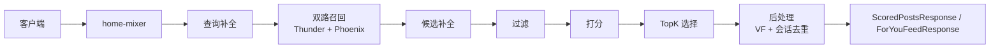
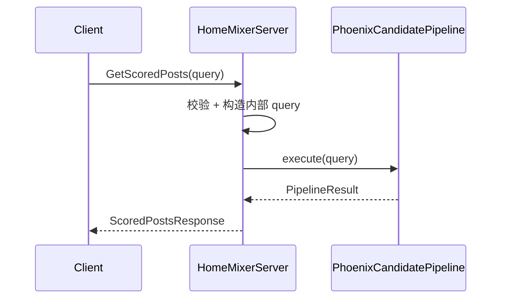
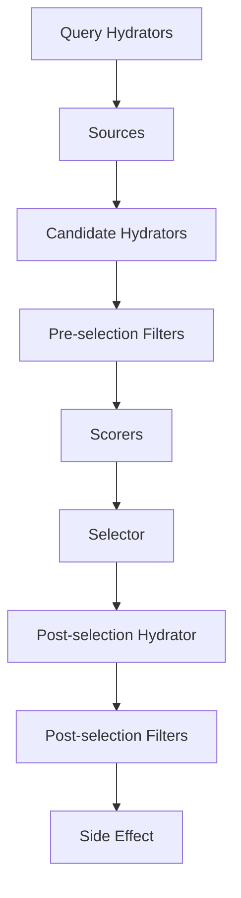
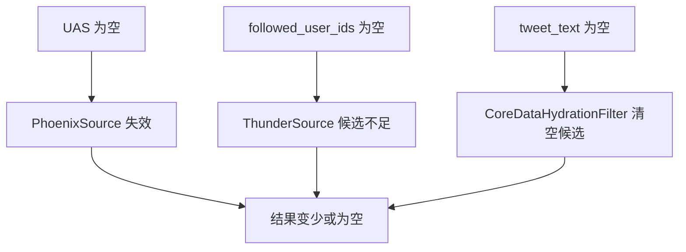

# home-mixer 总览手册

这是一份面向“一次读懂 `home-mixer`”的主文档。

如果只读一篇，先读这一篇；如果需要查细节，再跳到附录索引 [appendices.md](./appendices.md)。

## 1. 一句话定义

`home-mixer` 是首页 Feed 的在线编排层：它接收客户端请求，补齐用户上下文，并行召回网内与网外候选，完成候选补全、过滤、打分、选择和安全后处理，最终返回一页已排序结果。

## 2. 系统边界

### 2.1 `home-mixer` 负责什么

- 接收 `ScoredPostsService` 的 Get/Debug 请求和 `ForYouFeedService` 的 legacy/V2 请求
- 由 `QueryBuilder` 构造内部 `ScoredPostsQuery` 与请求/预测身份
- 通过上游命名 Query Hydrator owners 获取 scoring/retrieval sequence 和 user feature fields
- 从 Thunder / Phoenix 取候选
- 对候选做补全、过滤、打分、选择
- 将结果映射为 `ScoredPost`

### 2.2 `home-mixer` 不负责什么

- 帖子事件消费与网内缓存维护：`thunder/`
- 模型训练和推理实现：`phoenix/`
- 通用 pipeline 框架：`candidate-pipeline/`
- proto 生成：`proto/`

## 3. 一次请求怎么流动

请求入口在 `home-mixer/server.rs`，核心流程固定：

1. `QueryBuilder` 校验并映射 proto 请求
2. 调用内层 `PhoenixCandidatePipeline::execute()`
3. 将 scored candidates 映射为 `ScoredPost`
4. ForYou 请求再进入外层 `ForYouCandidatePipeline`；Debug 请求从同一次内层执行返回 typed stage data

## 4. Pipeline 的真实阶段

`home-mixer` 的业务装配在 `home-mixer/candidate_pipeline/phoenix_candidate_pipeline.rs`，执行语义由 `candidate-pipeline/candidate_pipeline.rs` 提供。

### 4.1 阶段顺序

1. Query Hydrators
2. Sources
3. Candidate Hydrators
4. Pre-selection Filters
5. Scorers
6. Selector
7. Post-selection Hydrator
8. Post-selection Filters
9. Side Effect

### 4.2 并行与串行

- 并行：QueryHydrator、Source、Hydrator、SideEffect
- 串行：Filter、Scorer、Selector、Post-selection Filter

## 5. 两个核心数据对象

### 5.1 `ScoredPostsQuery`

它是请求上下文容器，包含：

- 原始请求字段：用户、语言、国家、已看过、已投递、翻页标记
- hydrated 字段：`user_action_sequence`、`user_features`
- 追踪字段：`request_id`

### 5.2 `PostCandidate`

它是候选共享状态容器，包含：

- 标识与关系：`tweet_id`、`author_id`、reply/retweet 关系、`ancestors`
- 内容与展示：`tweet_text`、`video_duration_ms`、screen name
- 排序：`phoenix_scores`、`weighted_score`、`score`
- 来源与安全：`served_type`、`in_network`、`visibility_decision`

## 6. 召回策略

`home-mixer` 当前是双路召回。

### 6.1 ThunderSource

- 负责网内候选
- 输入依赖 `followed_user_ids`
- 输出轻量候选，附带 reply / conversation 关系

### 6.2 PhoenixSource

- 负责网外候选
- 输入依赖 `user_action_sequence`
- 当前仓库里 retrieval client 默认仍是 stub

## 7. 补全、过滤和排序

### 7.1 Candidate Hydrators

当前主要补：

- `in_network`
- `tweet_text`
- `retweeted_*`
- `video_duration_ms`
- `subscription_author_id`
- `author_screen_name`
- `visibility_decision`（后补全，区分 Allowed / Restricted / Unchecked / Unavailable）

### 7.2 Filters

当前过滤链主要解决：

- 重复内容
- 内容不完整
- 过旧内容
- viewer 自己的内容
- retweet 去重
- 订阅权限
- 已看过 / 已投递
- 屏蔽关键词
- 拉黑 / 静音作者
- VF 删除
- 会话级去重

### 7.3 Scorers

排序链为：

1. `PhoenixScorer`
2. `RankingScorer`（内部依次组合 Weighted、AuthorDiversity、OON 行为）

含义是：

- 先预测行为概率
- 再加权合成相关性
- 再做作者多样性衰减
- 最后给网外内容统一降权

## 8. Thunder 为什么重要

Thunder 对 `home-mixer` 的价值不是“直接返回排好序的网内 Feed”，而是：

- 快速给出一批网内轻量候选
- 提供 reply / retweet / conversation 关系
- 用新鲜度做初步排序

但它不负责：

- 文本补全
- 个性化排序
- 用户级去重
- 安全过滤

所以 `home-mixer` 必须继续跑后续整条 pipeline。

## 9. 外部依赖现状

从当前仓库真实状态看：

| 依赖 | 当前状态 |
| --- | --- |
| ThunderClient | 相对可用（`THUNDER_GRPC_ADDR`） |
| PhoenixRetrievalClient | 设 `PHOENIX_RETRIEVAL_GRPC_ADDR` 后真连 gRPC 网关；缺失时显式 Unavailable 并跳过该召回路 |
| PhoenixPredictionClient | 设 `PHOENIX_PREDICT_GRPC_ADDR` 后真连 gRPC 网关；缺失时显式 Unavailable 并走规则排序 |
| StratoClient | `DisabledStratoClient`；`HOME_MIXER_MODE=demo` 时装配层注入 `DemoStratoClient`（演示关注列表） |
| TESClient | `DisabledTESClient`；演示模式注入 `DemoTESClient`（演示文本） |
| UserActionSequenceOps | `DisabledUserActionSequenceFetcher`；演示模式注入 `DemoUserActionSequenceFetcher`（合成行为序列） |
| GizmoduckClient | disabled + Demo adapter；未知 viewer policy 只允许网内 |
| VisibilityFilteringClient | disabled + Demo adapter；不可用时拒绝网外、保留网内 |

这意味着：

- 框架和装配已经完整
- 不配置环境变量时业务链大量退化；配好演示组合可端到端跑通（见 [getting-started 第四步](../getting-started/05-第四步-跑通完整推荐链路.md)）

## 10. 当前默认运行行为

默认 `degraded` 的 disabled adapter 组合下，最常见的不是“排序不理想”，而是“候选很容易被清空”。

核心原因通常是三条：

1. 没有 `user_action_sequence`，Phoenix 召回/打分不起作用
2. 没有 `followed_user_ids`，Thunder 候选供给不足
3. 没有 `tweet_text`，`CoreDataHydrationFilter` 会把候选清掉

`HOME_MIXER_MODE=demo` 正是针对这三条缺口注入演示数据，让链路不依赖外部平台也能出结果。

## 11. 当前最值得关注的风险

### 11.1 结果为空或过少

主要由外部依赖 stub 叠加导致。

### 11.2 同 stage hydrator 依赖问题

因为同一 stage 的 hydrator 并行执行，彼此看不到这一轮刚写入的新字段。

### 11.3 post-selection 删除后不回补

- selector 先取 Top 50
- post-selection 再删
- 最终截断到 50
- 不会回补第 101 名之后的候选

### 11.4 观测能力偏弱

当前主要依赖 request_id + stage 日志，没有完整 metrics 体系。

## 12. 配置和参数怎么影响行为

配置来源主要有三类：

- CLI 参数：端口等
- 环境变量：如 `THUNDER_GRPC_ADDR`、`APP_ENV`
- `params.rs` 常量：召回上限、权重、Age、TopK、ResultSize

最重要的参数组是：

- `THUNDER_MAX_RESULTS`
- `PHOENIX_MAX_RESULTS`
- `MAX_POST_AGE`
- `TOP_K_CANDIDATES_TO_SELECT`
- `RESULT_SIZE`
- 各类行为权重
- `OON_WEIGHT_FACTOR`
- `AUTHOR_DIVERSITY_*`

## 13. 怎么排障

当前最实用的排障路径：

1. 看请求入口日志
2. 看最终返回条数
3. 看 `stage=Source` 日志
4. 看 `stage=Filter kept/removed`
5. 看 post-selection 是否缩水

如果结果为空，优先怀疑：

- `PhoenixSource` 缺少 `user_action_sequence`
- `ThunderSource` 因 following 为空拿不到候选
- `CoreDataHydrationFilter` 清空候选

## 14. 推荐阅读方式

### 14.1 想快速理解系统

读这篇主文档即可。

### 14.2 想查实现细节

去附录索引 [appendices.md](./appendices.md)。

### 14.3 想看逐字段或逐组件说明

- 字段字典：[12-field-dictionary.md](./12-field-dictionary.md)
- 组件索引：[08-component-index.md](./08-component-index.md)

### 14.4 想看完整请求样例

- [10-end-to-end-example.md](./10-end-to-end-example.md)

## 15. 一句话结论

`home-mixer` 当前已经是一套结构完整的首页编排系统骨架：链路、阶段、策略位点都很清楚；真正限制它可用性的，不是主流程缺失，而是外部依赖仍大量处于 stub 状态。
