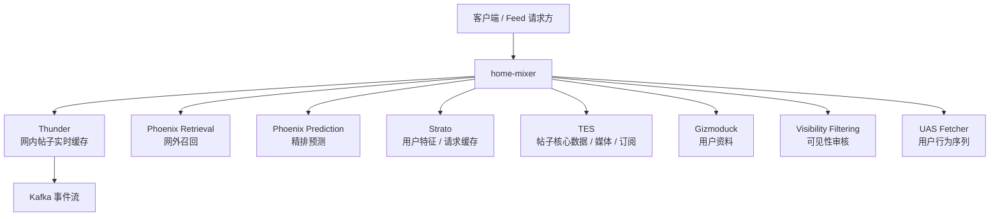
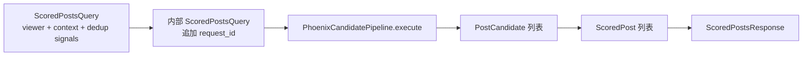

# 01. 系统定位与问题域

## 1. `home-mixer` 在整套系统里的位置

`home-mixer` 对外暴露三个 gRPC 服务：`ScoredPostsService` 提供 Get/Debug，`ForYouFeedService` 提供 legacy ScoredPostsQuery 与 additive `ForYouFeedQuery` V2，`BusinessFeedService` 提供 `GetBusinessFeed`（独立的商业 Feed 垂直链路，本组文档聚焦前两个推荐主链服务）。它本身不存帖子、不训练模型、不消费 Kafka，而是把多个上游系统的能力拼成同步 Feed 请求链路。

可以把它理解成“请求时在线编排层”：

- Thunder 负责快
- Phoenix 负责找更相关的内容
- TES / Gizmoduck / Strato 负责补数据
- VF 负责安全与展示约束
- `home-mixer` 负责把这些结果合成最终可返回的 Feed

## 2. 它要解决的核心问题

`home-mixer` 实际上同时在解决六类问题。

### 2.1 多路供给融合

单一来源不够：

- 只有 Thunder，会偏向关注网络，探索性弱
- 只有 Phoenix Retrieval，会缺少“你关注的人刚发的内容”

所以它把两路候选合并：

- `ThunderSource` 召回网内内容
- `PhoenixSource` 召回网外内容

### 2.2 请求级个性化

同样一批帖子，对不同用户排序应不同。为此它在请求早期补两类用户上下文：

- `user_action_sequence`：用户近期行为序列，给 Phoenix Retrieval 和 Phoenix Scorer 使用
- `user_features`：关注、屏蔽、静音、订阅、关键词等，给多个过滤和判定组件使用

### 2.3 候选清洗

原始候选并不适合直接排序，需要先解决：

- 重复内容
- 超时内容
- 自己发的内容
- 被静音/拉黑作者
- 已看过、已下发过的内容
- 订阅权限不匹配的内容

### 2.4 排序统一化

来自不同来源的候选必须进入一套统一排序逻辑，否则无法比较：

- `PhoenixScorer` 生成互动行为概率
- `RankingScorer` 在一个上游命名边界内组合加权、作者多样性和网外曝光调整

### 2.5 结果安全与展示可用性

排序前高分不代表最终可展示，结果还要经过：

- 可见性审核
- 会话树去重
- 响应结构映射

### 2.6 请求间连续性

用户连续刷新、下滑时，需要避免重复看到同样内容，因此它还处理：

- `seen_ids`
- `served_ids`
- Bloom Filter 去重
- 生产环境下的已下发缓存回写

## 3. 系统边界

`home-mixer` 的边界比较清晰。

### 3.1 它负责的事

- 接收 Feed 请求
- 拼装请求上下文
- 触发多路召回
- 做候选补全、过滤、打分、选择
- 输出 `ScoredPostsResponse`

### 3.2 它不负责的事

- 帖子实时事件采集与缓存维护：`thunder/`
- 模型训练与推理实现：`phoenix/`
- Proto 生成：`proto/`
- 通用 pipeline 执行框架：`candidate-pipeline/`

## 4. 对外请求与返回

`home_mixer.proto` 定义的接口很简单，但含义很重。

| 类型 | 关键字段 | 用途 |
| --- | --- | --- |
| `ScoredPostsQuery` | `viewer_id` | 请求面向哪个用户 |
| `ScoredPostsQuery` | `seen_ids` / `served_ids` / `bloom_filter_entries` | 去重与翻页连续性 |
| `ScoredPostsQuery` | `in_network_only` | 是否只保留网内内容 |
| `ScoredPostsQuery` | `country_code` / `language_code` / `client_app_id` | 上下文与安全审核输入 |
| `ScoredPost` | `tweet_id` / `author_id` | 内容主标识 |
| `ScoredPost` | `score` | 最终排序分数 |
| `ScoredPost` | `served_type` | 候选来自哪一路召回 |
| `ScoredPost` | `visibility_reason` | 若被安全系统标记，带回原因 |

## 5. 总体结构的一个关键判断

从代码上看，`home-mixer` 不是“模型中心”设计，而是“编排中心”设计：

- 排序模型只是其中一个 scorer
- 安全、去重、订阅、静音、翻页连续性都在同一条请求链里显式实现
- 最终结果质量取决于整条编排链，而不是单个模型

这也解释了为什么理解 `home-mixer`，不能只看 `scorers/`，必须连同 `sources/`、`filters/`、`candidate_hydrators/` 和外部客户端一起看。
