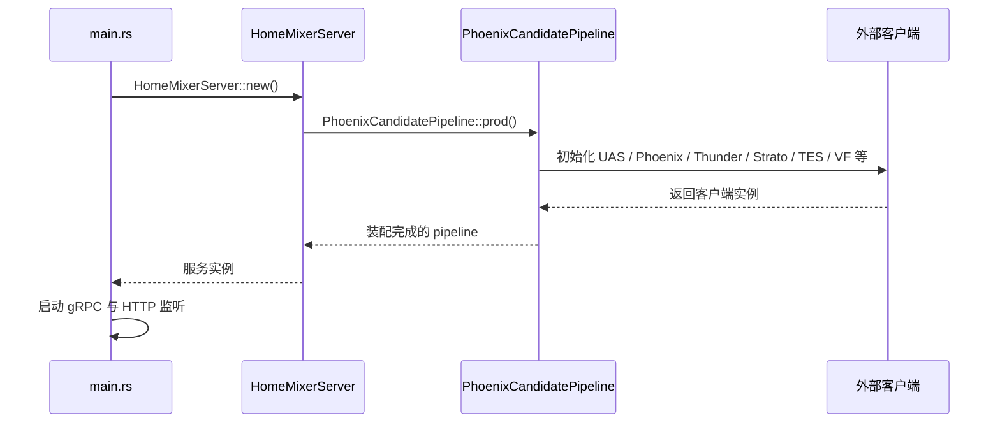
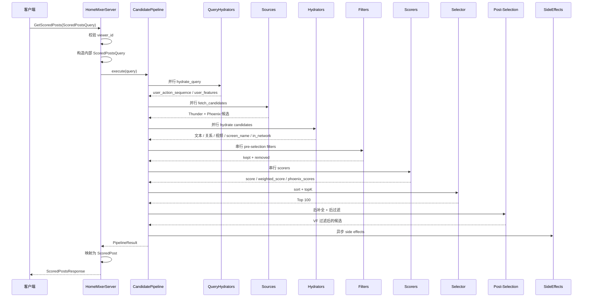
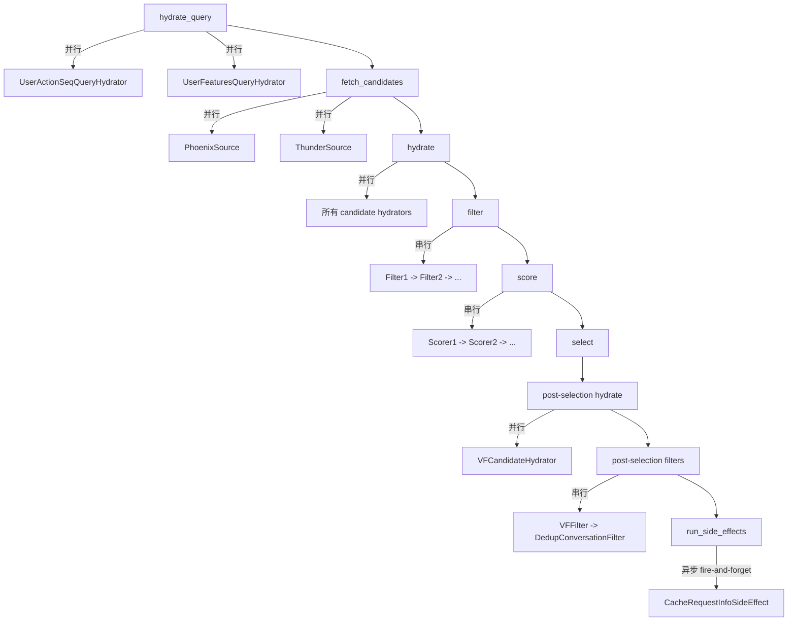

# 02. 请求生命周期

本篇按真实代码路径说明一次请求从进来到出去经过什么。

## 1. 启动期：服务是怎样被组起来的

启动入口在 `home-mixer/main.rs`，流程如下：

1. 解析命令行参数
2. 初始化日志
3. `HomeMixerServer::new().await`
4. 在 `new()` 里创建 `PhoenixCandidatePipeline::prod().await`
5. `prod()` 初始化所有客户端并装配 pipeline
6. 注册 gRPC 服务与 reflection
7. 启动一个空的 HTTP 端口用于 health/metrics 占位

## 2. 请求入口：`get_scored_posts`

真正处理请求的是 `server.rs` 里的 `get_scored_posts()`。

它做四件事：

1. 解包 proto 请求
2. 校验 `viewer_id != 0`
3. 构造内部 `ScoredPostsQuery`
4. 调用 `self.phx_candidate_pipeline.execute(query).await`

然后把最终候选映射回 proto `ScoredPost`。

## 3. 一次请求的完整时序

## 4. 阶段语义：哪些并行，哪些串行

这是理解行为的关键，因为它会直接影响数据依赖是否成立。

### 4.1 并行阶段

- `QueryHydrator`
- `Source`
- `Hydrator`
- `Post-selection Hydrator`
- `SideEffect`

### 4.2 串行阶段

- `Filter`
- `Scorer`
- `Selector`
- `Post-selection Filter`

## 5. 关键的错误处理语义

`candidate-pipeline` 的策略整体偏“尽量给结果”，不是 fail-fast。

| 阶段 | 失败后的行为 | 对主链路影响 |
| --- | --- | --- |
| QueryHydrator | 记录错误，跳过该 hydrator 输出 | 不终止 |
| Source | 记录错误，忽略该 source 结果 | 不终止 |
| Hydrator | 记录错误，保留旧候选 | 不终止 |
| Filter | 记录错误，回滚到该 filter 执行前 | 不终止 |
| Scorer | 记录错误，保留当前得分字段 | 不终止 |
| Selector | 无统一 `Result` 包装 | 依赖业务实现自身稳定性 |
| SideEffect | 异步执行，结果被丢弃 | 不影响响应返回 |

## 6. 返回路径：最终响应是如何拼出来的

`server.rs` 最后会把 `selected_candidates` 映射为 `ScoredPost`：

- `tweet_id`
- `author_id`
- `retweeted_tweet_id`
- `retweeted_user_id`
- `in_reply_to_tweet_id`
- `score`
- `in_network`
- `served_type`
- `last_scored_timestamp_ms`
- `prediction_request_id`
- `ancestors`
- `screen_names`
- `visibility_reason`

这里有两个要点：

1. 返回的是 pipeline 最终保留下来的 `selected_candidates`，不是召回原始结果。
2. `visibility_reason` 会被带回响应，但真正会被 `VFFilter` 删除的内容通常已经不在结果里了。

## 7. 一个容易忽略的事实

整个请求链是同步等待到 post-selection 结束才返回，但 side effect 不是。

也就是说：

- 召回、过滤、排序都在响应关键路径上
- 缓存回写不在响应关键路径上

这符合 Feed 服务的典型设计：优先保证首页返回，不阻塞在写回动作上。
