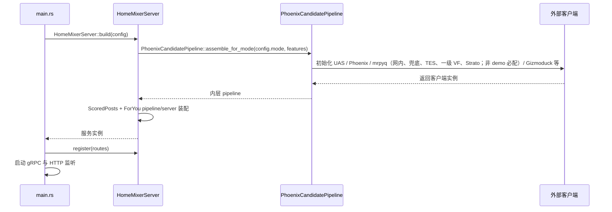
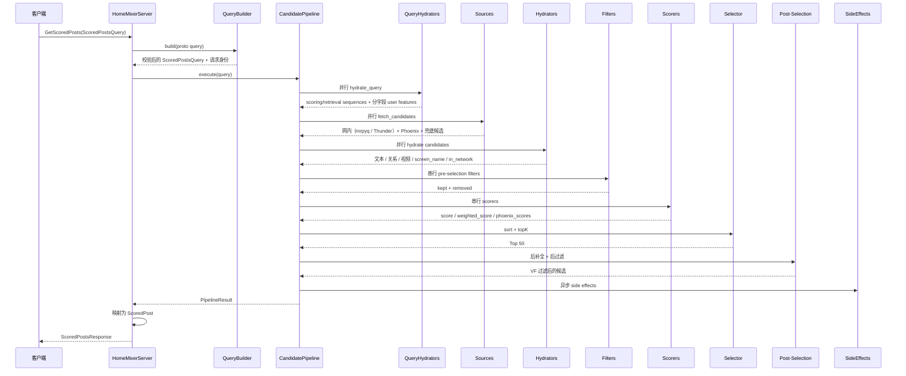
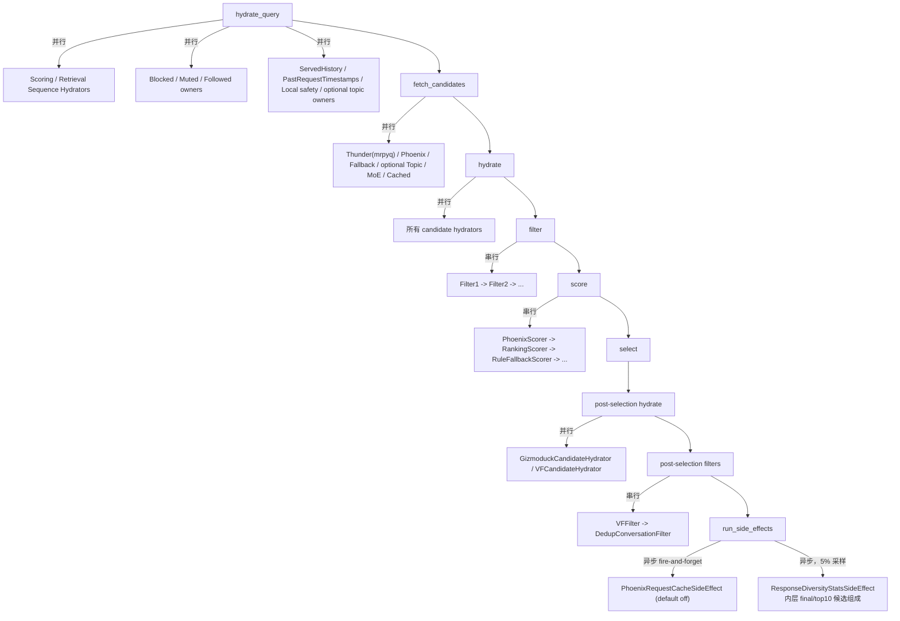

# 02. 请求生命周期

本篇按真实代码路径说明一次请求从进来到出去经过什么。

## 1. 启动期：服务是怎样被组起来的

启动入口在 `home-mixer/main.rs`。运行模式与启动不变量位于 `runtime_config.rs`，协议映射位于 `query_builder.rs`，gRPC 装配 facade 位于 `server.rs`。流程如下：

1. 初始化日志（`env_logger::init()`）
2. 解析 CLI 参数，再从环境变量解析 `HomeMixerConfig`
3. `HomeMixerServer::build(config).await`
4. 构造共享 `QueryBuilder`、内层 `PhoenixCandidatePipeline`、`ScoredPostsServer`
5. 构造外层 `ForYouCandidatePipeline` 与 `ForYouFeedServer`
6. `main.rs` 构造 gRPC reflection 服务；`HomeMixerServer::register` 注册两个 gRPC 服务（`ScoredPostsService`/`ForYouFeedService`，带压缩和消息大小限制），随后 `main.rs` 把 reflection 加入 routes
7. 启动 gRPC，以及空的 health/metrics HTTP 监听（端口开着，没有 `/health` 或 `/metrics` 路由）

## 2. 请求入口：`get_scored_posts`

真正处理请求的是各自 application server 的 tonic trait 实现，`HomeMixerServer` 只负责构建和注册。所有入口先经过共享 `QueryBuilder`：

1. 校验 `viewer_id` 是非空、非 NIL 的 24 位小写 hex ObjectId
2. 把 `seen_ids` / `served_ids` / `impressed_post_ids` 解析为 `PostId`，非法串丢弃并计数
3. 合并 viewer/feature policy
4. 生成 request ID、prediction ID 和 request time
5. 调用对应内层或外层 pipeline

`DebugScoredPosts` 与普通 ScoredPosts 共享一次 pipeline 执行，但默认返回 `Unavailable`；只有显式启用并通过 `x-home-mixer-debug-token` 校验才会执行和返回过滤前/后的 ID。`GetForYouFeedV2` 只增加 `ForYouFeedQuery` wrapper，原 RPC 保持不变。

QueryBuilder 不请求 Gizmoduck viewer RPC。`in_network_only` 只取客户端显式值：`true` 只走网内，`false` 同时允许网内和网外。请求携带未签名 `cached_posts` 默认被拒绝，只有显式 Demo fixture 开关可使用。

## 3. 一次请求的完整时序

## 4. 阶段语义：哪些并行，哪些串行

这是理解行为的关键，因为它会直接影响数据依赖是否成立。

### 4.1 并行阶段

- `QueryHydrator`
- `Source`
- `Hydrator`
- `Post-selection Hydrator`
- `SideEffect`

### 4.2 串行阶段

- `Filter`
- `Scorer`
- `Selector`
- `Post-selection Filter`

## 5. 关键的错误处理语义

`candidate-pipeline` 的策略整体偏“尽量给结果”，不是 fail-fast。

| 阶段 | 失败后的行为 | 对主链路影响 |
| --- | --- | --- |
| QueryHydrator | 记录错误，跳过该 hydrator 输出 | 不终止 |
| Source | 记录错误，忽略该 source 结果 | 不终止 |
| Hydrator | 记录错误，保留旧候选 | 不终止 |
| Filter | 记录错误，回滚到该 filter 执行前 | 不终止 |
| Scorer | 记录错误，保留当前得分字段 | 不终止 |
| Selector | 无统一 `Result` 包装 | 依赖业务实现自身稳定性 |
| SideEffect | 异步执行，框架记录成功、失败和耗时 | 主响应不等待完成 |

## 6. 返回路径：最终响应是如何拼出来的

`scored_posts_server.rs` 最后会把 `selected_candidates` 映射为 `ScoredPost`：

- `tweet_id`
- `author_id`
- `retweeted_tweet_id`
- `retweeted_user_id`
- `in_reply_to_tweet_id`
- `score`
- `in_network`
- `served_type`
- `last_scored_timestamp_ms`
- `prediction_request_id`
- `ancestors`
- `screen_names`
- `visibility_reason`
- `brand_safety_verdict`
- `tweet_text`

这里有两个要点：

1. 返回的是 pipeline 最终保留下来的 `selected_candidates`，不是召回原始结果。
2. 只有 `Restricted` 且候选最终仍保留时才映射 `visibility_reason`；`Unchecked/Unavailable`（含成功响应缺帖）由 `VFFilter` 按 `HOME_MIXER_VF_FAILURE_POLICY` 处理，默认 `fail_closed` 删除，即便配置 `allow_all` 保留也不会伪造审核原因。
3. 响应之前先同步调用 `ServedPersistence::persist` 记录本次下发的帖子；落库失败返回 gRPC `Unavailable` 而不是返回 Feed。当前实现是进程内存。

## 7. 一个容易忽略的事实

整个请求链是同步等待到 post-selection 结束才返回，但 side effect 不是。

也就是说：

- 召回、过滤、排序都在响应关键路径上
- 缓存回写不在响应关键路径上

这符合 Feed 服务的典型设计：优先保证首页返回，不阻塞在写回动作上。
