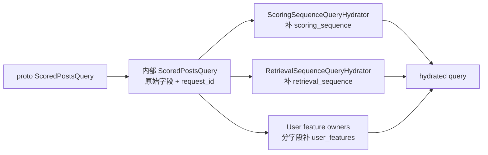
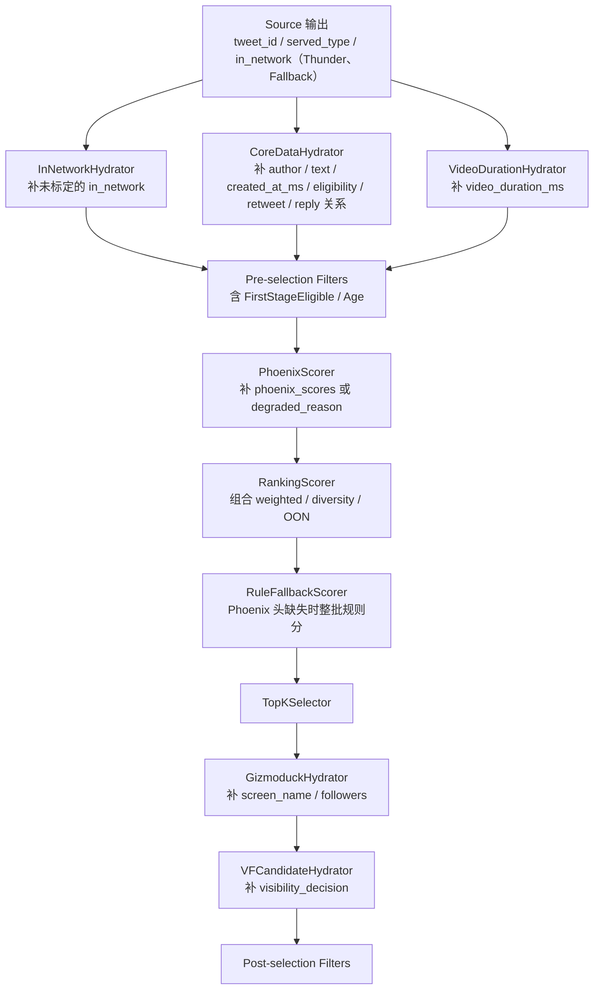
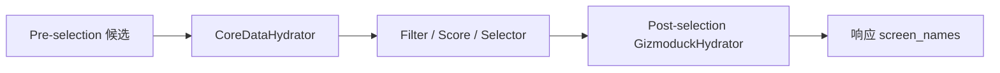

# 03. 数据模型与 Pipeline 装配

理解 `home-mixer`，核心不是背诵组件名字，而是理解两类对象：

- 请求对象 `ScoredPostsQuery`
- 候选对象 `PostCandidate`

以及它们如何被 pipeline 逐阶段改写。

## 1. `ScoredPostsQuery`：请求上下文容器

内部请求结构定义在 `home-mixer/models/query.rs`。

### 1.1 字段分层

| 类别 | 字段 | 来源 |
| --- | --- | --- |
| 原始请求字段 | `user_id` `client_app_id` `country_code` `language_code` | 来自 gRPC 请求 |
| 去重与分页字段 | `seen_ids` `served_ids` `bloom_filter_entries` `is_bottom_request` | 来自 gRPC 请求 |
| 召回控制字段 | `in_network_only` | 来自 gRPC 请求 |
| QueryHydrator 补全字段 | `scoring_sequence` `retrieval_sequence` | `ScoringSequenceQueryHydrator` / `RetrievalSequenceQueryHydrator` |
| QueryHydrator 补全字段 | `user_features` | 三个上游 user-id owner（Blocked / Muted / Followed）+ 本地 safety owner |
| 历史状态补全字段 | `served_ids`（合并）`past_request_timestamps_ms` | 两个 QueryHydrator 共用一次请求内的 `FeedStateStore` 快照；业务模式 Redis，Demo 默认内存 |
| 追踪字段 | `request_id` `prediction_id` `request_time_ms` | `QueryBuilder` |

### 1.2 查询对象的演化

### 1.3 `request_id` 的作用

`request_id`、`prediction_id` 和 `request_time_ms` 由 `QueryBuilder` 一次生成，贯穿阶段日志和模型打分结果。因为 pipeline 大量采用“失败但不中断”的降级策略，没有稳定的请求身份就很难定位是哪一阶段退化。

## 2. `PostCandidate`：流水线共享状态对象

`PostCandidate` 定义在 `home-mixer/models/candidate.rs`。它不是一个“固定结构体”，而是一份被逐阶段补齐的共享状态。

### 2.1 字段按作用划分

| 类别 | 字段 | 主要由谁写入 |
| --- | --- | --- |
| 标识 | `tweet_id`（`PostId`）`author_id`（`UserId`） | Source；mrpyq 候选的 `author_id` 由 CoreDataHydrator 补回 |
| 关系 | `in_reply_to_tweet_id` `retweeted_tweet_id` `retweeted_user_id` `ancestors` | Source / CoreDataHydrator |
| 文本与内容 | `tweet_text` `created_at_ms` `video_duration_ms` `favorite_count` `reply_count` | TES 相关 Hydrator |
| 业务准入 | `recommendation_eligible` | CoreDataHydrator（mrpyq 一级 eligibility） |
| 用户展示 | `author_screen_name` `retweeted_screen_name` | GizmoduckHydrator |
| 用户侧派生 | `in_network` | Thunder / Fallback Source 直接标定；其他来源由 InNetworkCandidateHydrator 推断 |
| 排序相关 | `phoenix_scores` `weighted_score` `score` `degraded_reason` | 各类 Scorer |
| 追踪 | `prediction_request_id` `last_scored_at_ms` | PhoenixScorer |
| 安全 | `visibility_decision` `visibility_action` | VFCandidateHydrator |
| 来源 | `served_type` | Source |
| U5 保留位 | `quoted_*` `subscription_author_id` `drop_ancillary_posts` | 无写入方，恒为空；相关过滤分支无操作 |

### 2.2 候选对象在各阶段的变化

## 3. Pipeline 的真实装配顺序

`home-mixer` 有两层：内层 `PhoenixCandidatePipeline` 负责帖子召回和打分；外层 `ForYouCandidatePipeline` 用 `BlenderSelector` 把帖子和可选模块（广告 / 关注推荐 / Prompt，默认都关）编成最终 Feed。`GetScoredPosts` 只走内层，`GetForYouFeed` 再走外层。

### 3.1 Query Hydrators

1. `ServedHistoryQueryHydrator`（`ScoredPostsServer::with_state` 装配时插到首位，合并本地已下发历史）
2. `PastRequestTimestampsQueryHydrator`（同上，第二位）
3. `ScoringSequenceQueryHydrator`
4. `RetrievalSequenceQueryHydrator`
5. `BlockedUserIdsQueryHydrator`
6. `MutedUserIdsQueryHydrator`
7. `FollowedUserIdsQueryHydrator`
8. `UserSafetyFeaturesQueryHydrator`（本地 additive owner）
9. `UserTopicsQueryHydrator`（显式注入 Topic adapter 时）

### 3.2 Sources

1. `ThunderSource`（有 `InNetworkPostsClient` 时装配：非 demo 为 mrpyq NETWORK 收件箱，demo 为整数 Thunder）
2. `PhoenixSource`
3. `FallbackSource`（有兜底客户端时装配：非 demo 为 mrpyq FALLBACK 池，demo 为 `DemoFallbackPostsClient`）
4. `PhoenixTopicsSource`（可选）
5. `PhoenixMoeSource`（可选）
6. `CachedPostsSource`

### 3.3 Pre-selection Hydrators

1. `InNetworkCandidateHydrator`
2. `CoreDataCandidateHydrator`
3. `VideoDurationCandidateHydrator`
4. `HasMediaHydrator`
5. `FilteredTopicsHydrator`（topic request / excluded topics）
6. `LanguageCodeHydrator`
7. 仅 demo 且 `HOME_MIXER_ENABLE_AUTHOR_COLD_START` 时再加一个 `GizmoduckCandidateHydrator`（探索前补粉丝数）

### 3.4 Pre-selection Filters

1. `DropDuplicatesFilter`
2. `CoreDataHydrationFilter`
3. `FirstStageEligibleFilter`
4. `AgeFilter`
5. `SelfTweetFilter`
6. `PreviouslySeenPostsFilter`
7. `PreviouslySeenPostsBackupFilter`
8. `PreviouslyServedPostsFilter`
9. `ViewerMutedKeywordFilter`
10. `AuthorSocialgraphFilter`
11. `VideoFilter`
12. `TopicIdsFilter`
13. `NewUserTopicIdsFilter`

### 3.5 Scorers

1. `PhoenixScorer`
2. `RankingScorer`（内部保留 Weighted / AuthorDiversity / OON 行为）
3. `RuleFallbackScorer`（批内有候选缺 Phoenix 头时整批改用规则分并标 `degraded_reason`）
4. 可选 `VMRanker`（仅 demo：`HOME_MIXER_ENABLE_VM_RANKER` + `VM_RANKER_GRPC_ADDR`）
5. 可选 `AuthorColdStartScorer`（仅 demo，且 `HOME_MIXER_ENABLE_AUTHOR_COLD_START`）

### 3.6 Selector

- `TopKScoreSelector`

### 3.7 Post-selection

- Hydrators: `GizmoduckCandidateHydrator`, `VFCandidateHydrator`
- Filters: `VFFilter`, `DedupConversationFilter`

### 3.8 Side Effect

- `PhoenixRequestCacheSideEffect`（默认关闭）
- `ResponseDiversityStatsSideEffect`（默认装配，非空响应按 5% 采样；记录 final/top10 的作者、来源和网内比例，不改变排序）

## 4. 一个最重要的语义：同 stage 的 hydrator 彼此看不到新字段

同一 stage 的 hydrator 基于同一份旧候选快照并行执行，字段依赖必须跨 stage。当前装配已将 `GizmoduckCandidateHydrator` 从 pre-selection 移到 post-selection，因此它能看到 `CoreDataCandidateHydrator` 已写回的 `retweeted_user_id`，并且只批量查询 Selector 保留的候选。

新增 Hydrator 时仍不能依赖同 stage 的执行顺序；需要使用后续 stage 或共享 provider 明确表达字段依赖。

## 5. 关键依赖链

| 上游写入 | 下游依赖 |
| --- | --- |
| `scoring_sequence` / `retrieval_sequence`（各自缺失时都回退 `user_action_sequence`；UAS 失败时三者皆 `None`） | `PhoenixScorer`（无序列 → `phoenix_missing_sequence`）/ `PhoenixSource`（无序列 → 失败） |
| `user_features.followed_user_ids` | `InNetworkCandidateHydrator`（仅对来源未标 `in_network` 的候选）；demo `ThunderClient` 请求 |
| `tweet_text` / `has_media` | `CoreDataHydrationFilter`、`ViewerMutedKeywordFilter` |
| `created_at_ms` | `AgeFilter`（缺失时回退 ObjectId 时间戳）、`RuleFallbackScorer` 新鲜度项 |
| `recommendation_eligible` | `FirstStageEligibleFilter`（只丢 `Some(false)`） |
| `retweeted_tweet_id` | `PhoenixScorer`（模型输入与 lookup key 优先用原帖） |
| `video_duration_ms` | `RankingScorer` 内部 VQV 权重、`VideoFilter` |
| `in_network` | `RankingScorer` 内部 OON 调整、`RuleFallbackScorer`、`VFCandidateHydrator`、`VFFilter`（`in_network_only` 策略） |
| `degraded_reason` | `RuleFallbackScorer`（有任一候选带标记即整批规则分） |
| `visibility_decision` / `visibility_action` | `VFFilter`（Restricted Drop 删除；Unchecked / Unavailable 按 `HOME_MIXER_VF_FAILURE_POLICY`，默认 `fail_closed` 删除） |
| `score` | `TopKScoreSelector`、`DedupConversationFilter` |

## 6. 这个数据模型的优点和代价

### 优点

- 所有阶段共享一份统一候选对象，扩展方便
- 响应映射简单
- 适合快速新增字段和策略

### 代价

- 字段是否可用依赖阶段顺序和并发语义
- 很容易出现“结构上有字段，运行时却还没补出来”的误判
- 调试时必须同时看字段定义和装配顺序
