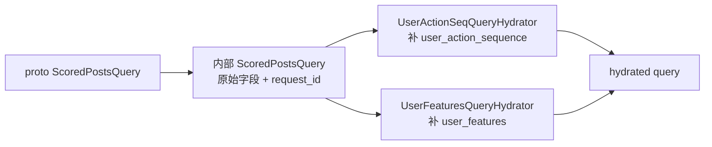
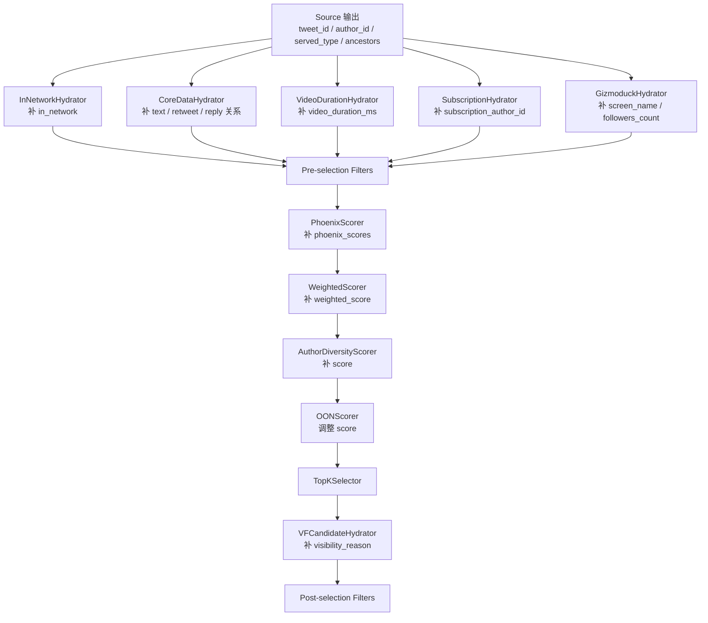
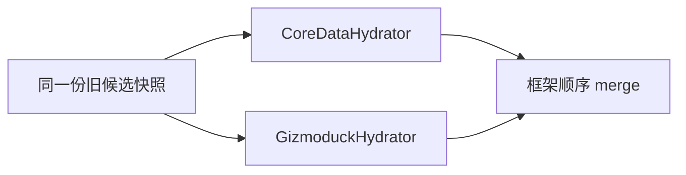

# 03. 数据模型与 Pipeline 装配

理解 `home-mixer`，核心不是背诵组件名字，而是理解两类对象：

- 请求对象 `ScoredPostsQuery`
- 候选对象 `PostCandidate`

以及它们如何被 pipeline 逐阶段改写。

## 1. `ScoredPostsQuery`：请求上下文容器

内部请求结构定义在 `home-mixer/candidate_pipeline/query.rs`。

### 1.1 字段分层

| 类别 | 字段 | 来源 |
| --- | --- | --- |
| 原始请求字段 | `user_id` `client_app_id` `country_code` `language_code` | 来自 gRPC 请求 |
| 去重与分页字段 | `seen_ids` `served_ids` `bloom_filter_entries` `is_bottom_request` | 来自 gRPC 请求 |
| 召回控制字段 | `in_network_only` | 来自 gRPC 请求 |
| QueryHydrator 补全字段 | `user_action_sequence` | `UserActionSeqQueryHydrator` |
| QueryHydrator 补全字段 | `user_features` | `UserFeaturesQueryHydrator` |
| 追踪字段 | `request_id` | 本地生成 |

### 1.2 查询对象的演化

### 1.3 `request_id` 的作用

`request_id` 由本地生成的唯一 ID 与 `user_id` 拼接，贯穿所有阶段日志。因为 pipeline 大量采用“失败但不中断”的降级策略，没有稳定的 request_id 就很难排查到底是哪一阶段退化了。

## 2. `PostCandidate`：流水线共享状态对象

`PostCandidate` 定义在 `home-mixer/candidate_pipeline/candidate.rs`。它不是一个“固定结构体”，而是一份被逐阶段补齐的共享状态。

### 2.1 字段按作用划分

| 类别 | 字段 | 主要由谁写入 |
| --- | --- | --- |
| 标识 | `tweet_id` `author_id` | Source |
| 关系 | `in_reply_to_tweet_id` `retweeted_tweet_id` `retweeted_user_id` `ancestors` | Source / CoreDataHydrator |
| 文本与内容 | `tweet_text` `video_duration_ms` | TES 相关 Hydrator |
| 用户展示 | `author_screen_name` `retweeted_screen_name` | GizmoduckHydrator |
| 用户侧派生 | `in_network` `subscription_author_id` | InNetwork / Subscription Hydrator |
| 排序相关 | `phoenix_scores` `weighted_score` `score` | 各类 Scorer |
| 追踪 | `prediction_request_id` `last_scored_at_ms` | PhoenixScorer |
| 安全 | `visibility_reason` | VFCandidateHydrator |
| 来源 | `served_type` | Source |

### 2.2 候选对象在各阶段的变化

## 3. Pipeline 的真实装配顺序

`home-mixer` 当前只装了一条主 pipeline：`PhoenixCandidatePipeline`。

### 3.1 Query Hydrators

1. `UserActionSeqQueryHydrator`
2. `UserFeaturesQueryHydrator`

### 3.2 Sources

1. `PhoenixSource`
2. `ThunderSource`

### 3.3 Pre-selection Hydrators

1. `InNetworkCandidateHydrator`
2. `CoreDataCandidateHydrator`
3. `VideoDurationCandidateHydrator`
4. `SubscriptionHydrator`
5. `GizmoduckCandidateHydrator`

### 3.4 Pre-selection Filters

1. `DropDuplicatesFilter`
2. `CoreDataHydrationFilter`
3. `AgeFilter`
4. `SelfTweetFilter`
5. `RetweetDeduplicationFilter`
6. `IneligibleSubscriptionFilter`
7. `PreviouslySeenPostsFilter`
8. `PreviouslyServedPostsFilter`
9. `MutedKeywordFilter`
10. `AuthorSocialgraphFilter`

### 3.5 Scorers

1. `PhoenixScorer`
2. `WeightedScorer`
3. `AuthorDiversityScorer`
4. `OONScorer`

### 3.6 Selector

- `TopKScoreSelector`

### 3.7 Post-selection

- Hydrator: `VFCandidateHydrator`
- Filters: `VFFilter`, `DedupConversationFilter`

### 3.8 Side Effect

- `CacheRequestInfoSideEffect`

## 4. 一个最重要的语义：同 stage 的 hydrator 彼此看不到新字段

这是当前实现的关键事实。

因为同一 stage 的 hydrator 是并行跑的：

- `GizmoduckCandidateHydrator` 读到的仍是 stage 开始前的候选
- 它看不到 `CoreDataCandidateHydrator` 在这一轮刚补出的 `retweeted_user_id`

所以候选模型虽然看起来很完整，但字段依赖是否成立，还要结合执行语义一起看。

## 5. 关键依赖链

| 上游写入 | 下游依赖 |
| --- | --- |
| `user_action_sequence` | `PhoenixSource`、`PhoenixScorer` |
| `user_features.followed_user_ids` | `ThunderSource`、`InNetworkCandidateHydrator` |
| `tweet_text` | `CoreDataHydrationFilter`、`MutedKeywordFilter` |
| `retweeted_tweet_id` | `RetweetDeduplicationFilter`、`PhoenixScorer` |
| `video_duration_ms` | `WeightedScorer` 的 VQV 权重 |
| `in_network` | `OONScorer`、`VFCandidateHydrator` |
| `visibility_reason` | `VFFilter` |
| `score` | `TopKScoreSelector`、`DedupConversationFilter` |

## 6. 这个数据模型的优点和代价

### 优点

- 所有阶段共享一份统一候选对象，扩展方便
- 响应映射简单
- 适合快速新增字段和策略

### 代价

- 字段是否可用依赖阶段顺序和并发语义
- 很容易出现“结构上有字段，运行时却还没补出来”的误判
- 调试时必须同时看字段定义和装配顺序
