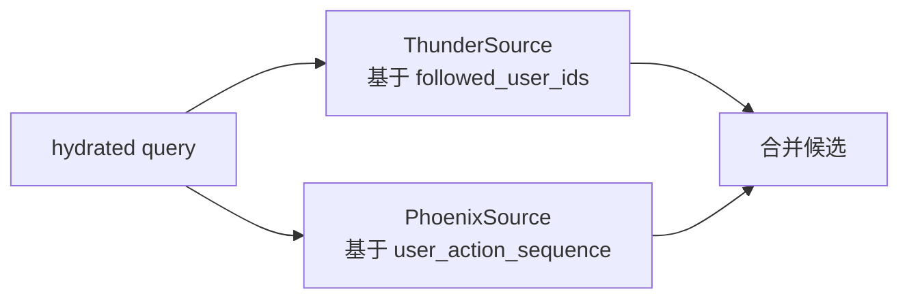
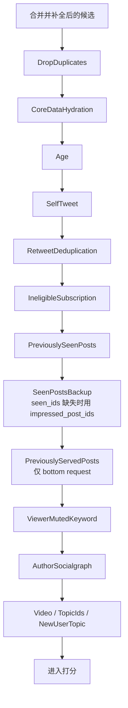
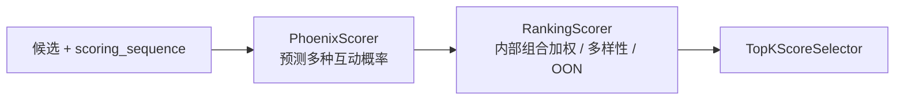
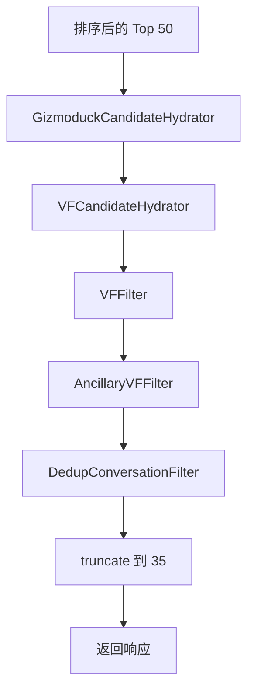

# 04. 召回、过滤与排序策略

本篇只讲策略链，不展开协议和客户端细节。

## 1. 召回：为什么要双路

`home-mixer` 默认是双路并行，演示还会加上话题源：

- `ThunderSource`：网内内容（有 cached posts 时关闭）
- `PhoenixSource`：网外内容（网内限定、严格话题、或有 cached posts 时关闭）
- `PhoenixTopicsSource`：演示默认装配；非 demo 要显式注入 adapter
- `CachedPostsSource`：只接受 QueryBuilder 已批准的 demo fixture



### 1.1 `ThunderSource`

作用：

- 从 Thunder 取关注作者最近帖子
- 默认启用；请求已带 cached posts 时关闭

输入：

- `query.user_id`
- `query.user_features.followed_user_ids`

输出特点：

- `served_type`：普通请求是 `ForYouInNetwork`；`in_network_only` 时是 `RankedFollowing`
- 初步填 `ancestors`，以及 `retweeted_tweet_id` / `retweeted_user_id`（来自 Thunder `source_post_id` / `source_user_id`）
- 为后续 `in_network` 和会话去重打基础

### 1.2 `PhoenixSource`

作用：

- 从 Phoenix Retrieval 取网外候选

启用条件：

- `!query.in_network_only`
- 没有 cached posts
- 不是 strict / cold-start 话题请求

硬依赖：

- retrieval sequence

输出特点：

- `served_type = ForYouPhoenixRetrieval`
- 当前只写入轻量关系字段，更多内容依赖后续 hydrator

## 2. 候选补全：召回后的“补课”阶段

召回出来的候选信息非常少，因此需要集中补数。

| Hydrator | 作用 | 下游影响 |
| --- | --- | --- |
| `InNetworkCandidateHydrator` | 判断作者是否在关注网络内 | `RankingScorer` 内部 OON 阶段、`VFCandidateHydrator` |
| `CoreDataCandidateHydrator` | 补文本、转推关系、回复关系 | 多个 filter 和 scorer 依赖 |
| `QuoteHydrator` | 补引用帖 | quote-aware 过滤 / Ranking |
| `VideoDurationCandidateHydrator` | 补视频时长 | `VideoFilter`（看 `video_duration_ms`）、VQV 权重 |
| `HasMediaHydrator` | 补是否有媒体 | 展示信号，当前无过滤消费 |
| `SubscriptionHydrator` | 补订阅作者信息 | 订阅过滤 |
| `FilteredTopicsHydrator` / `LanguageCodeHydrator` | 补话题和语言 | 话题过滤 |
| `GizmoduckCandidateHydrator` | 补作者 screen_name、粉丝数 | 默认在 post-selection；冷启动打开时预选再跑一次 |

## 3. 过滤链：先把明显不该排的内容拿掉

过滤是串行执行的，所以顺序有业务含义。



### 3.1 过滤器按问题分类

| 问题 | 过滤器 |
| --- | --- |
| 候选重复 | `DropDuplicatesFilter`、`RetweetDeduplicationFilter` |
| 内容不完整 | `CoreDataHydrationFilter` |
| 内容过旧 | `AgeFilter` |
| 不该给自己看 | `SelfTweetFilter` |
| 权限不匹配 | `IneligibleSubscriptionFilter` |
| 已经看过 / 已下发过 | `PreviouslySeenPostsFilter`、`PreviouslySeenPostsBackupFilter`、`PreviouslyServedPostsFilter` |
| 用户明确不想看 | `ViewerMutedKeywordFilter`、`AuthorSocialgraphFilter` |
| 请求不要视频 / 话题约束 | `VideoFilter`、`TopicIdsFilter`、`NewUserTopicIdsFilter` |

### 3.2 为什么 `PreviouslyServedPostsFilter` 只在 bottom request 启用

它的 `enable()` 条件是 `query.is_bottom_request`，意图是：

- 首屏更强调质量，不一定强依赖 `served_ids`
- 下滑续页更强调“不要重复给刚才给过的内容”

这体现了请求类型差异化策略。

## 4. 打分链：从行为概率到最终排序分

打分也是串行的，每个 scorer 都依赖前一个阶段产物。



上游 47c1bcd 已把 Weighted、Author Diversity、OON 三段逻辑合并进唯一的 `RankingScorer`，仓库中不再存在 `WeightedScorer`、`AuthorDiversityScorer`、`OONScorer` 这三个独立类型；下面 4.2–4.4 介绍的是 `RankingScorer` 内部按序执行的三个阶段。

### 4.1 `PhoenixScorer`

作用：

- 调 Phoenix Prediction 服务
- 取每个候选上的行为概率

主要输出：

- `phoenix_scores`
- `prediction_request_id`
- `last_scored_at_ms`

一个重要细节：

- 对于转推，它优先用原始帖子的 `tweet_id` / `author_id` 作为模型输入和结果 lookup key

### 4.2 `RankingScorer`

它把多种行为概率合成一个 `weighted_score`。当前主要权重包括：

| 行为 | 权重 |
| --- | --- |
| 点赞 | `0.5` |
| 回复 | `5.0` |
| 转发 | `1.0` |
| 分享 | `2.0` |
| 引用 | `5.0` |
| 关注作者 | `4.0` |
| 不感兴趣 | `-43.2` |
| 拉黑 | `-31.2` |
| 静音 | `-58.8` |
| 举报 | `-234.0` |

简化理解：

```text
weighted_score
  = 正向行为概率 * 正向权重
  + 负向行为概率 * 负向权重
  + 连续停留时间 * dwell_time_weight
```

这里的“行为概率”是 Phoenix 针对当前 viewer 的个性化预测，不是帖子的点赞、
举报等原始互动次数。因此不能用两个权重的比值推导“一次举报抵消多少次点赞”。
负向行为通常具有更低的基准概率，较大的权重绝对值用于让这些低概率预测仍能
影响最终排序。

VQV 还有一个额外条件：

- 只有 `video_duration_ms > MIN_VIDEO_DURATION_MS`，且 viewer `follower_count` 未达 10000（缺粉丝数时不触发该门槛）才应用 `VQV_WEIGHT`

### 4.3 作者多样性（`RankingScorer` 内部阶段）

作用：

- 防止同一作者在结果前列出现过密

实现方式：

1. 先按 `weighted_score` 排一个内部顺序
2. 统计每个作者已经出现了几次
3. 按出现次数乘衰减因子
4. 把结果写回 `score`

当前关键参数：

- `AUTHOR_DIVERSITY_DECAY = 0.5`
- `AUTHOR_DIVERSITY_FLOOR = 0.25`（第 2、3 条大约 ×0.625、×0.4375）

### 4.4 OON 降权（`RankingScorer` 内部阶段）

作用：

- 给网外内容统一降权

规则：

- `in_network == false` 时，`score *= OON_WEIGHT_FACTOR`
- 网内回复/转发默认也乘同一因子（`ENABLE_OON_RESCORE_FOR_IN_NETWORK_REPLIES_RETWEETS = true`）
- 当前普通请求 `OON_WEIGHT_FACTOR = 0.75`；话题请求用 `TOPIC_OON_WEIGHT_FACTOR = 0.5`

## 5. 选择与后处理

### 5.1 Selector

`TopKScoreSelector` 按 `score` 降序排序，并先保留 Top 50（`TOP_K_CANDIDATES_TO_SELECT`）。

### 5.2 Post-selection

选择后并没有立刻返回，还会继续做：

1. `GizmoduckCandidateHydrator`：补作者资料
2. `VFCandidateHydrator`：批量拿可见性审核结果
3. `VFFilter`：删除应被 Drop 的内容
4. `AncillaryVFFilter`：引用/转发附属内容被挡住时去掉
5. `DedupConversationFilter`：同一会话树只留一条最高分
6. 最终再截断到 `RESULT_SIZE = 35`



## 6. 为什么要把可见性过滤放在后面

当前设计明显偏向这个取舍：

- 先让排序模型面对更大的候选池
- 再对高分结果做更贵的安全审核

优点：

- 节省 VF 调用成本
- 只审核真正可能返回给用户的候选

代价：

- 如果 VF 删掉很多结果，不会回补第 51 名以后的候选

这也是后面风险文档里会单独指出的问题。
