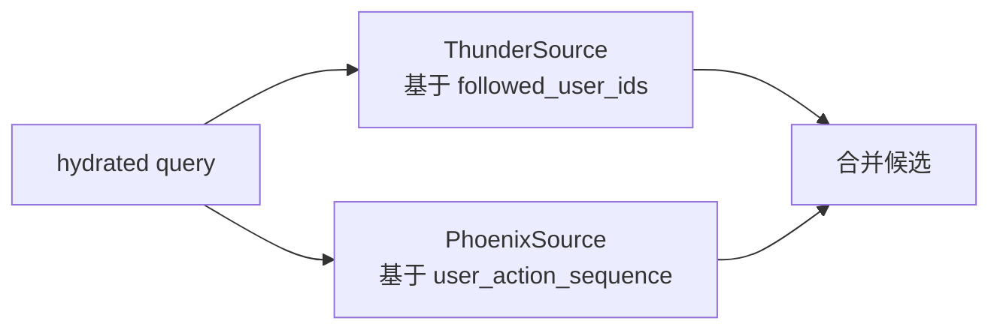
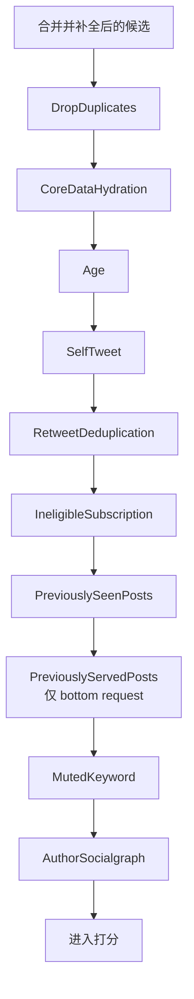
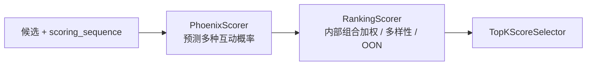
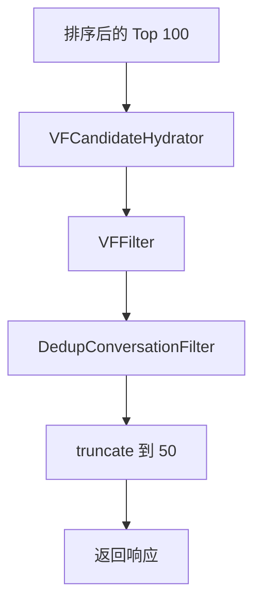

# 04. 召回、过滤与排序策略

本篇只讲策略链，不展开协议和客户端细节。

## 1. 召回：为什么要双路

`home-mixer` 当前的召回是双路并行：

- `ThunderSource`：网内内容
- `PhoenixSource`：网外内容



### 1.1 `ThunderSource`

作用：

- 从 Thunder 取关注作者最近帖子
- 默认总是启用

输入：

- `query.user_id`
- `query.user_features.followed_user_ids`

输出特点：

- `served_type = ForYouInNetwork`
- 初步填 `ancestors`
- 为后续 `in_network` 和会话去重打基础

### 1.2 `PhoenixSource`

作用：

- 从 Phoenix Retrieval 取网外候选

启用条件：

- `!query.in_network_only`

硬依赖：

- `query.user_action_sequence`

输出特点：

- `served_type = ForYouPhoenixRetrieval`
- 当前只写入轻量关系字段，更多内容依赖后续 hydrator

## 2. 候选补全：召回后的“补课”阶段

召回出来的候选信息非常少，因此需要集中补数。

| Hydrator | 作用 | 下游影响 |
| --- | --- | --- |
| `InNetworkCandidateHydrator` | 判断作者是否在关注网络内 | `RankingScorer` 内部 OON 阶段、`VFCandidateHydrator` |
| `CoreDataCandidateHydrator` | 补文本、转推关系、回复关系 | 多个 filter 和 scorer 依赖 |
| `VideoDurationCandidateHydrator` | 补视频时长 | VQV 权重判断 |
| `SubscriptionHydrator` | 补订阅作者信息 | 订阅过滤 |
| `GizmoduckCandidateHydrator` | 补作者 screen_name、粉丝数 | 展示、未来归一化 |

## 3. 过滤链：先把明显不该排的内容拿掉

过滤是串行执行的，所以顺序有业务含义。



### 3.1 过滤器按问题分类

| 问题 | 过滤器 |
| --- | --- |
| 候选重复 | `DropDuplicatesFilter`、`RetweetDeduplicationFilter` |
| 内容不完整 | `CoreDataHydrationFilter` |
| 内容过旧 | `AgeFilter` |
| 不该给自己看 | `SelfTweetFilter` |
| 权限不匹配 | `IneligibleSubscriptionFilter` |
| 已经看过 / 已下发过 | `PreviouslySeenPostsFilter`、`PreviouslyServedPostsFilter` |
| 用户明确不想看 | `MutedKeywordFilter`、`AuthorSocialgraphFilter` |

### 3.2 为什么 `PreviouslyServedPostsFilter` 只在 bottom request 启用

它的 `enable()` 条件是 `query.is_bottom_request`，意图是：

- 首屏更强调质量，不一定强依赖 `served_ids`
- 下滑续页更强调“不要重复给刚才给过的内容”

这体现了请求类型差异化策略。

## 4. 打分链：从行为概率到最终排序分

打分也是串行的，每个 scorer 都依赖前一个阶段产物。



`WeightedScorer`、`AuthorDiversityScorer` 和 `OONScorer` 仍保留为可测试的本地行为实现，但生产 pipeline 只注册同名上游边界 `RankingScorer`，由它按原顺序组合三段逻辑。

### 4.1 `PhoenixScorer`

作用：

- 调 Phoenix Prediction 服务
- 取每个候选上的行为概率

主要输出：

- `phoenix_scores`
- `prediction_request_id`
- `last_scored_at_ms`

一个重要细节：

- 对于转推，它优先用原始帖子的 `tweet_id` / `author_id` 作为模型输入和结果 lookup key

### 4.2 `WeightedScorer`

它把多种行为概率合成一个 `weighted_score`。当前主要权重包括：

| 行为 | 权重 |
| --- | --- |
| 点赞 | `0.5` |
| 回复 | `27.0` |
| 转发 | `1.0` |
| 分享 | `1.0` |
| 引用 | `1.0` |
| 关注作者 | `1.0` |
| 不感兴趣 | `-74.0` |
| 拉黑 / 静音 | `-74.0` |
| 举报 | `-369.0` |

简化理解：

```text
weighted_score
  = 正向行为概率 * 正向权重
  + 负向行为概率 * 负向权重
  + 连续停留时间 * dwell_time_weight
```

VQV 还有一个额外条件：

- 只有 `video_duration_ms > MIN_VIDEO_DURATION_MS` 才应用 `VQV_WEIGHT`

### 4.3 `AuthorDiversityScorer`

作用：

- 防止同一作者在结果前列出现过密

实现方式：

1. 先按 `weighted_score` 排一个内部顺序
2. 统计每个作者已经出现了几次
3. 按出现次数乘衰减因子
4. 把结果写回 `score`

当前关键参数：

- `AUTHOR_DIVERSITY_DECAY = 0.5`
- `AUTHOR_DIVERSITY_FLOOR = 0.1`

### 4.4 `OONScorer`

作用：

- 给网外内容统一降权

规则：

- `in_network == false` 时，`score *= OON_WEIGHT_FACTOR`
- 当前 `OON_WEIGHT_FACTOR = 0.5`

## 5. 选择与后处理

### 5.1 Selector

`TopKScoreSelector` 按 `score` 降序排序，并先保留 Top 100。

### 5.2 Post-selection

选择后并没有立刻返回，还会继续做：

1. `VFCandidateHydrator`：批量拿可见性审核结果
2. `VFFilter`：删除应被 Drop 的内容
3. `DedupConversationFilter`：同一会话树只留一条最高分
4. 最终再截断到 `RESULT_SIZE = 50`



## 6. 为什么要把可见性过滤放在后面

当前设计明显偏向这个取舍：

- 先让排序模型面对更大的候选池
- 再对高分结果做更贵的安全审核

优点：

- 节省 VF 调用成本
- 只审核真正可能返回给用户的候选

代价：

- 如果 VF 删掉很多结果，不会回补第 101 名以后的候选

这也是后面风险文档里会单独指出的问题。
