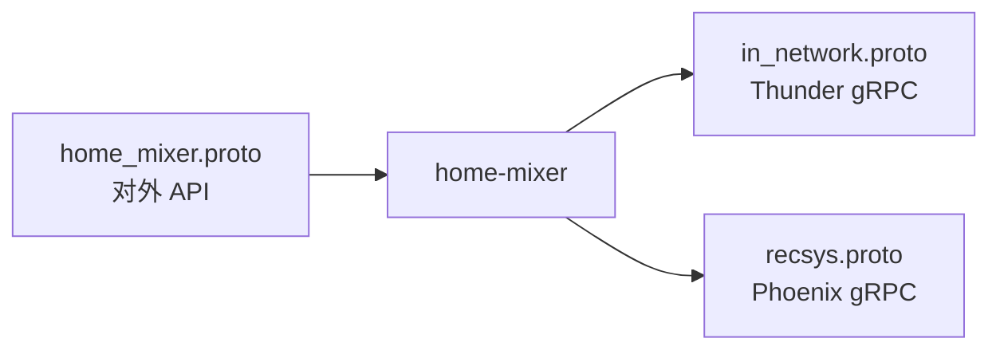
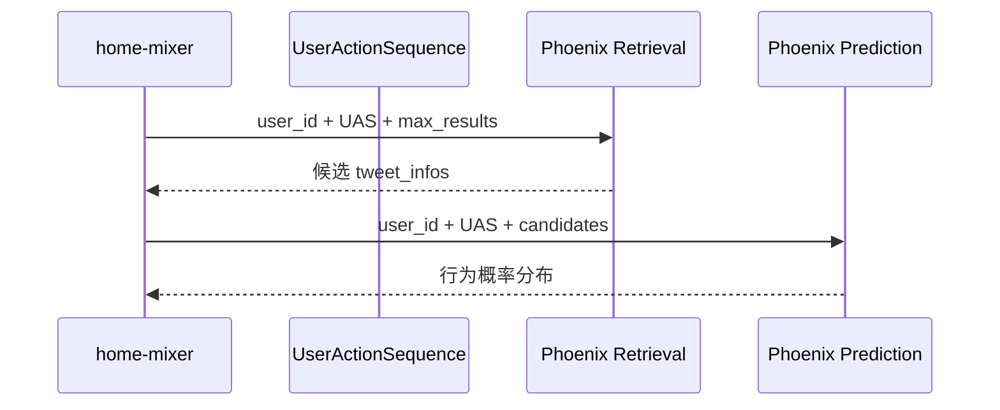
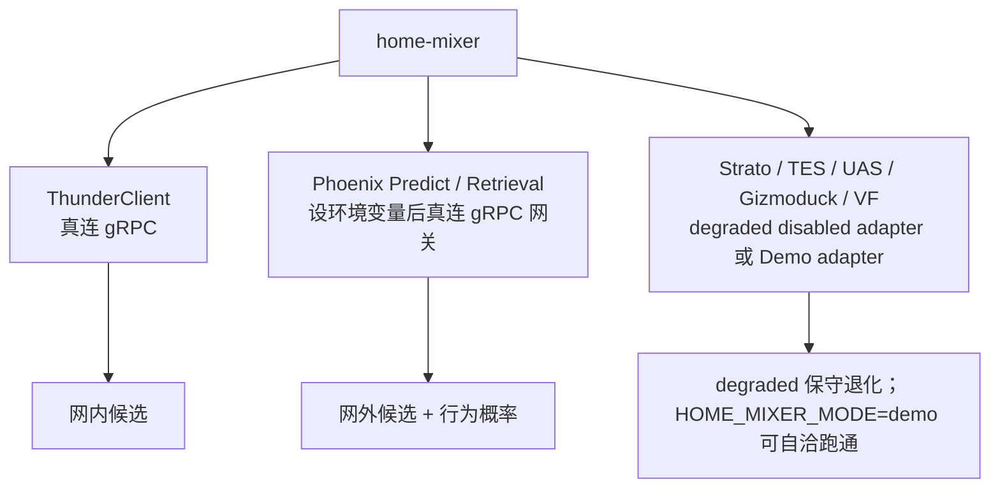

# 05. 外部依赖与数据契约

`home-mixer` 本质上是一个“协议和依赖拼接器”。要理解它，必须同时看 proto 和客户端抽象。

## 1. 最关键的几份 proto

`proto/definitions/` 共五份协议，全部会被 `home-mixer` 使用：

| proto | 作用 | `home-mixer` 如何使用 |
| --- | --- | --- |
| `home_mixer.proto` | 对外服务协议 | `ScoredPostsService.GetScoredPosts` / `DebugScoredPosts`；`ForYouFeedService.GetForYouFeed` / `GetForYouFeedV2` |
| `in_network.proto` | Thunder 协议 | `InNetworkPostsService.GetInNetworkPosts` |
| `recsys.proto` | Phoenix 协议 | `PhoenixRetrievalService.Retrieve`、`PhoenixPredictionService.PredictNextActions` |
| `recommendation_data.proto` | 业务推荐数据合同 | `clients/mrpyq_recommendation_data_client.rs` 消费；尚未装配进请求路径 |
| `vm_ranker.proto`（可选） | VM Ranker 二次重排 | `VmRankerService.Rank`；默认不装配 |

## 2. 对外 API：`home_mixer.proto`

### 2.1 请求侧关键信号

| 字段 | 含义 | 影响组件 |
| --- | --- | --- |
| `viewer_id` | 当前请求用户 | 全链路 |
| `client_app_id` | 客户端类型 | VF viewer context |
| `country_code` / `language_code` | 地域与语言上下文 | VF viewer context |
| `seen_ids` | 已看过帖子 | `PreviouslySeenPostsFilter` |
| `served_ids` | 已下发帖子 | `PreviouslyServedPostsFilter` |
| `in_network_only` | 仅网内 | `PhoenixSource.enable()`（还要求无 cached posts、非 strict/cold-start topic） |
| `is_bottom_request` | 是否翻页 | `PreviouslyServedPostsFilter.enable()` |
| `bloom_filter_entries` | 客户端布隆过滤器 | `PreviouslySeenPostsFilter` |

### 2.2 返回侧关键信号

| 字段 | 来源 |
| --- | --- |
| `tweet_id` / `author_id` | `PostCandidate` 标识字段 |
| `score` | `score` |
| `served_type` | Source |
| `screen_names` | `CandidateHelpers::get_screen_names()` |
| `visibility_reason` | VF 结果映射 |

## 3. Thunder 契约：`in_network.proto`

Thunder 负责的不是排序，而是给一批“关注的人最近发了什么”。

### 3.1 请求结构

`ThunderSource` 发送的 `GetInNetworkPostsRequest` 关键字段有：

| 字段 | 来源 |
| --- | --- |
| `user_id` | `query.user_id` |
| `following_user_ids` | `query.user_features.followed_user_ids` |
| `max_results` | `THUNDER_MAX_RESULTS` |
| `exclude_tweet_ids` | `query.seen_ids` |
| `algorithm` | 固定 `"default"` |
| `is_video_request` | 固定 `false` |

### 3.2 响应结构

Thunder 返回 `LightPost`，里面只有轻量字段：

- `post_id`
- `author_id`
- `created_at`
- 回复、对话和转推关系
- `has_video`

这些字段足以支持：

- 快速召回
- 初步关系构建
- 后续再去 TES 做重补全

## 4. Phoenix 契约：`recsys.proto`

Phoenix 在 `home-mixer` 中扮演两种角色。

### 4.1 Retrieval

输入：

- `user_id`
- `UserActionSequence`
- `max_results`

输出：

- 一批 `ScoredCandidate`

### 4.2 Prediction

输入：

- `user_id`
- `UserActionSequence`
- 候选 `TweetInfo[]`（当前只填 `tweet_id` / `author_id`，`safety_label_mask` 恒为 0；作者 NSFW 接线已回退）

输出：

- 每个候选的离散动作 log probability
- 连续动作预测值

## 5. 客户端抽象与调用方对应

| 客户端 trait | 调用方 | 作用 |
| --- | --- | --- |
| `UserActionSequenceOps` | `ScoringSequenceQueryHydrator` / `RetrievalSequenceQueryHydrator`（共享 request-scoped provider） | 取用户行为序列；500 ms 上限 |
| `StratoClient` | 四个 user-id owner / `UserSafetyFeaturesQueryHydrator`（共享 provider）/ `PhoenixRequestCacheSideEffect` | 取用户特征和写请求缓存均为 500 ms 上限 |
| `PhoenixRetrievalClient` | `PhoenixSource` | 网外召回 |
| `ThunderClient` | `ThunderSource` | 网内召回 |
| `TESClient` | 多个 candidate hydrator | 补帖子文本、媒体、订阅信息；每个批次 500 ms 上限 |
| `GizmoduckClient` | `QueryBuilder` / `GizmoduckCandidateHydrator` | viewer policy 200 ms；post-selection 作者资料批次 500 ms |
| `UserTopicReader` / `TopicRetrievalClient` | `UserTopicsQueryHydrator` / `PhoenixTopicsSource` | profile 读取和 Topic 召回各 500 ms 上限 |
| `PhoenixPredictionClient` | `PhoenixScorer` | 精排预测；总调用上限 5 s，超时保留候选并走 fallback 排序 |
| `VisibilityFilteringClient` | `VFCandidateHydrator` | 可见性审核；500 ms 上限，超时/不可用保留候选，成功响应缺帖视为 not_evaluated 删除 |

## 6. 当前仓库里的实现成熟度

这是阅读源码时最需要明确的一点。

| 依赖 | 当前实现状态 | 说明 |
| --- | --- | --- |
| `ThunderClient` | 简化版真实客户端 | 连接 `THUNDER_GRPC_ADDR`（默认 `http://localhost:50052`）；Source 总调用上限 500 ms，seen IDs 下推，signed LightPost IDs 在 adapter checked conversion |
| `PhoenixRetrievalClient` | 真实 gRPC 客户端（可选） | 设置 `PHOENIX_RETRIEVAL_GRPC_ADDR` 后调用 Phoenix 网关；标准/MoE 召回上限 3 s，未设置时显式 Unavailable，由 Source 跳过该召回路 |
| `PhoenixPredictionClient` | 真实 gRPC 客户端（可选） | 设置 `PHOENIX_PREDICT_GRPC_ADDR` 后调用 Phoenix 网关；精排上限 5 s，未设置时显式 Unavailable，由 Scorer 保留候选并走规则 fallback |
| `DisabledUserActionSequenceFetcher` | disabled adapter | 返回空行为序列；`HOME_MIXER_MODE=demo` 时装配层改为注入 `DemoUserActionSequenceFetcher`（合成序列） |
| `DisabledStratoClient` | disabled adapter | 返回空用户特征；演示模式注入 `DemoStratoClient`（固定关注列表）；两者都明确拒绝未配置的持久化写入，因此写回开关默认关闭 |
| `DisabledTESClient` | disabled adapter | 所有帖子无 core data；演示模式注入 `DemoTESClient`（占位文本） |
| `GizmoduckClient` | disabled + Demo adapter | `degraded` 返回未知 viewer policy，QueryBuilder 限制为仅网内；`demo` 明确允许网外并保留空作者资料；真实接入需要确认用户偏好授权语义 |
| `VisibilityFilteringClient` | disabled + Demo adapter | `demo` 显式返回 Allow；`degraded` 返回 Unavailable，Pipeline 保留候选；成功响应缺帖视为 not_evaluated 删除；真实合同缺失时 `production_ready` 拒绝启动 |
| `GrpcVMRankerClient` | 真实 gRPC 客户端（可选） | 同时设置 `HOME_MIXER_ENABLE_VM_RANKER=1` 与 `VM_RANKER_GRPC_ADDR` 后调用本仓库 `vm-ranker` 服务；上限 500 ms，失败时 Scorer 按候选数返回错误，由流水线失败隔离处理 |

除上表外，`clients/` 下还有未接入主链的骨架客户端：`impressed_posts_client.rs`、`impression_bloom_filter_client.rs`、`socialgraph_client.rs`、`tweet_mixer_client.rs`，均为 trait + 占位实现，供后续扩展。

### 6.1 可选集成与人工接入

以下能力不是主链启动条件，代码通过 `HomeMixerFeatures` 在装配层默认关闭：

| 能力 | 显式开关 | 还需人工提供/确认 | 缺失时行为 |
| --- | --- | --- | --- |
| Phoenix MoE 召回 | `HOME_MIXER_ENABLE_PHOENIX_MOE=1` | `PHOENIX_MOE_GRPC_ADDR`、模型/协议兼容、容量、超时和降级 | 不装配 `PhoenixMoeSource`；Phoenix/Thunder 主召回继续 |
| 请求缓存写回 | `HOME_MIXER_ENABLE_REQUEST_CACHE_SIDE_EFFECT=1` | 真实 Strato adapter、写入 schema、认证、幂等、保留期、隐私和恢复责任方 | SideEffect 不执行；响应路径不受影响 |
| Debug RPC | `HOME_MIXER_ENABLE_DEBUG_RPC=1` | `HOME_MIXER_DEBUG_TOKEN`、受控调用方和日志/数据保留策略 | 默认返回 `Unavailable`；启用后 token 不匹配返回 `PermissionDenied` |
| 未签名 cached posts | `HOME_MIXER_ENABLE_UNSIGNED_CACHED_POSTS=1` | 仅本地 fixture，不构成生产缓存合同 | 只允许 `HOME_MIXER_MODE=demo`；其他模式拒绝启动或拒绝请求 |
| VM Ranker 二次重排 | `HOME_MIXER_ENABLE_VM_RANKER=1` | `VM_RANKER_GRPC_ADDR`（本仓库 `vm-ranker` 服务实例）、value model 产物、容量与超时 | 不装配 `VMRanker` Scorer；`RankingScorer` 的分数直接进入 Selector |
| 作者冷启动 | `HOME_MIXER_ENABLE_AUTHOR_COLD_START=1` | 仅 demo；缺 `view_count` 或粉丝数的候选不参与 | 不装配 `AuthorColdStartScorer`，也不在预选补粉丝数 |
| 冷启动 Thompson Sampling | `HOME_MIXER_ENABLE_COLD_START_THOMPSON_SAMPLING=1` | 必须同时开 Author Cold Start | 冷启动仍用确定性槽位，不做 Beta 采样 |

禁止仅设置开关就把能力标为“已接入”。开关是人工批准入口，真实完成状态仍以能力台账中的合同和环境验收证据为准。Ads、Prompt、WhoToFollow、PushToHome 已挂进 ForYou 外层 pipeline，但 source 的 `enable()` 恒为 false，默认跑不到；Kafka/Redis 和 Grox 模型组件不会进入默认装配。

Viewer policy 属于请求主边界，不作为可选旁路开关。只有 `ViewerEligibility::Allowed` 才允许网外候选；`Denied`、`Unknown`、真实服务错误或超过 200 ms 时都强制仅网内。VF 结果使用 `Allowed / Restricted / Unchecked / Unavailable` 明确区分；未知结果不再等价于审核通过。

演示实现是独立的 `Demo*` 类型，由装配层按 `HOME_MIXER_MODE=demo` 选择注入；`HOME_MIXER_DEMO=1` 仅作为旧脚本兼容别名。默认 `degraded` 明确记录关键合同缺失；调用方身份、Viewer、UAS、Strato、TES、Gizmoduck、VF、Phoenix、Thunder 合同未全部闭合前，`production_ready` 拒绝启动。

接真实平台时的替换顺序和每个 stub 对应的改造点，见 [getting-started：从演示到真实系统](../getting-started/06-从演示到真实系统.md)。

## 7. S2S 认证的现实状态

代码里保留了 `S2S_CHAIN_PATH`、`S2S_CRT_PATH`、`S2S_KEY_PATH` 这些证书路径，主要用于 VF 客户端构造签名兼容，但当前 VF 实现本身还是 stub。

因此现在的真实情况是：

- 代码保留了生产版接口形状
- 但还没有真正进入“必须持证访问外部服务”的阶段

## 8. 一个重要判断

从依赖视角看，当前 `home-mixer` 代码更像：

- 一套相当完整的编排骨架
- 加上一条真实接了 Thunder 的主链
- 再加上一批为未来真实服务预留好的 trait 和数据结构

所以理解它时，要把“接口层完整”和“默认行为可用”区分开看。
