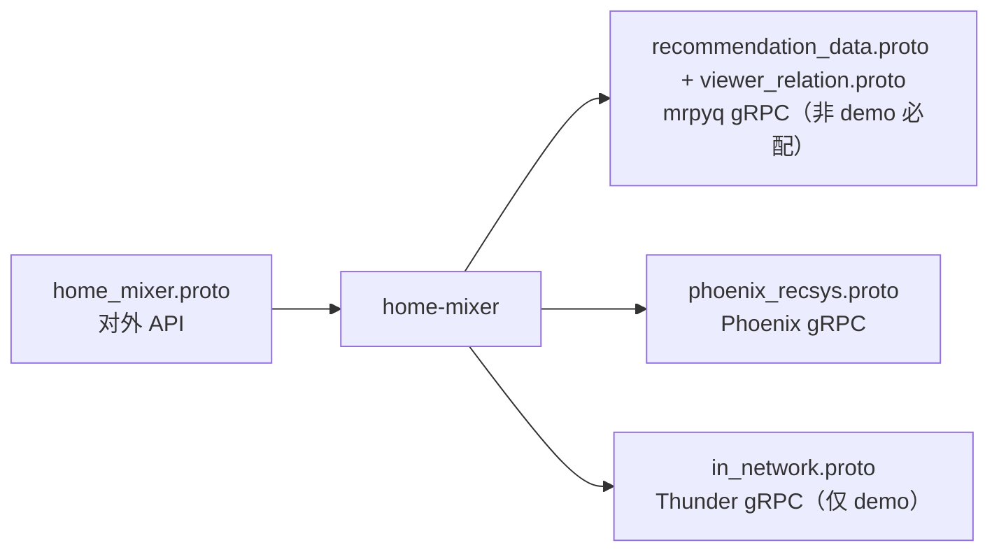
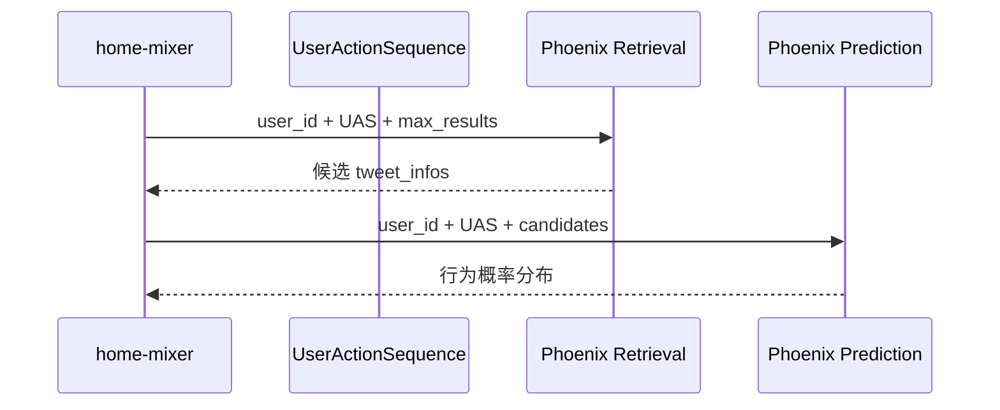
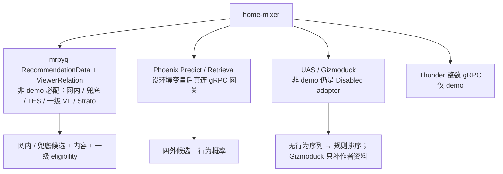

# 05. 外部依赖与数据契约

`home-mixer` 本质上是一个“协议和依赖拼接器”。要理解它，必须同时看 proto 和客户端抽象。

## 1. 最关键的几份 proto

`proto/definitions/` 共六份协议，全部会被 `home-mixer` 使用：

| proto | 作用 | `home-mixer` 如何使用 |
| --- | --- | --- |
| `home_mixer.proto` | 对外服务协议 | `ScoredPostsService.GetScoredPosts` / `DebugScoredPosts`；`ForYouFeedService.GetForYouFeed` / `GetForYouFeedV2`。所有身份字段都是 24 位小写 hex ObjectId 字符串，空串表示缺省 |
| `phoenix_recsys.proto` | Phoenix 协议（包名仍为 `recsys`；文件改名是为避开 xrex Python descriptor 撞名） | `PhoenixRetrievalService.Retrieve`、`PhoenixPredictionService.PredictNextActions` |
| `recommendation_data.proto` | mrpyq 业务推荐数据合同 | 非 demo 模式的唯一业务数据面：`clients/mrpyq_adapters.rs` 用它承载 TES、网内召回、兜底召回和一级 eligibility（VF 端口） |
| `viewer_relation.proto` | mrpyq viewer 关系合同 | `clients/mrpyq_viewer_relation_client.rs` 消费，装配到 Strato 端口填 block / mute / 屏蔽词；mrpyq 侧尚未实现该 RPC |
| `in_network.proto` | Thunder 协议（整数 ID） | `InNetworkPostsService.GetInNetworkPosts`；仅 `HOME_MIXER_MODE=demo` 且编译了 `legacy-int-ids` feature 时装配 |
| `vm_ranker.proto`（可选） | VM Ranker 二次重排（整数 ID） | `VmRankerService.Rank`；默认不装配，非 demo 强制禁用 |

## 2. 对外 API：`home_mixer.proto`

### 2.1 请求侧关键信号

| 字段 | 含义 | 影响组件 |
| --- | --- | --- |
| `viewer_id` | 当前请求用户 | 全链路 |
| `client_app_id` | 客户端类型 | VF viewer context |
| `country_code` / `language_code` | 地域与语言上下文 | VF viewer context |
| `seen_ids` | 已看过帖子 | `PreviouslySeenPostsFilter` |
| `served_ids` | 已下发帖子 | `PreviouslyServedPostsFilter` |
| `in_network_only` | 唯一的网络范围开关；只有请求显式为 true 才仅网内，否则同时允许网内和网外 | `PhoenixSource.enable()`（还要求无 cached posts、非 strict/cold-start topic）、`FallbackSource.enable()`、`ThunderSource` 的 `served_type` |
| `is_bottom_request` | 是否翻页 | `PreviouslyServedPostsFilter.enable()` |
| `bloom_filter_entries` | 客户端布隆过滤器 | `PreviouslySeenPostsFilter` |

### 2.2 返回侧关键信号

| 字段 | 来源 |
| --- | --- |
| `tweet_id` / `author_id` | `PostCandidate` 标识字段 |
| `score` | `score` |
| `served_type` | Source |
| `screen_names` | `CandidateHelpers::get_screen_names()` |
| `visibility_reason` | VF 结果映射 |

## 3. 网内召回契约：mrpyq（非 demo）与 Thunder（demo）

`ThunderSource` 不直接依赖 Thunder，而是依赖 `InNetworkPostsClient` trait（`clients/in_network_posts_client.rs`）。装配层按模式选实现：

| 模式 | 实现 | 协议 |
| --- | --- | --- |
| 非 demo | `MrpyqInNetworkPostsClient`（`clients/mrpyq_adapters.rs`） | `recommendation_data.proto` 的 `ListRecommendationCandidates(source=NETWORK)`，按不透明游标翻页，最多 10 页，整次召回受 `MRPYQ_RECALL_BUDGET_MS`（1500 ms）约束 |
| demo | `ThunderClient`（需 `legacy-int-ids` feature） | `in_network.proto` 的 `GetInNetworkPosts`，仅能 round-trip 零填充的演示 ObjectId |

同一个 `MrpyqInNetworkPostsClient` 还通过 `get_fallback_posts` 承载 `FallbackSource`（`source=FALLBACK`）。

### 3.1 mrpyq 请求与响应

| 字段 | 来源 |
| --- | --- |
| `account_id` | `query.user_id`（皮的 `member_id`；字段名沿用 mrpyq 现有 proto，皮维度对齐要求见 `docs/implementation/mrpyq-member-dimension-requirements.md`） |
| `source` | `NETWORK` 或 `FALLBACK` |
| `page_size` | 每页最多 200（`MAX_FEED_IDS`） |
| `page_token` | 上一页返回的游标，原样回传 |

响应只带 `feed_id` / `source` / `source_score` / `next_page_token` / `source_ready`；作者、正文、创建时间由 TES 端口（同一 mrpyq 服务的 `BatchGetRecommendationContents`）在候选补全阶段补回。NETWORK 收件箱按发帖时间倒序，适配器遇到第一条超过 `MAX_POST_AGE` 的候选即停止翻页；`source_ready=false` 时返回空候选。

Thunder 负责的不是排序，而是给一批“关注的人最近发了什么”。下面两小节只在 demo 装配下成立。

### 3.2 Thunder 请求结构（demo）

`ThunderSource` 发送的 `GetInNetworkPostsRequest` 关键字段有：

| 字段 | 来源 |
| --- | --- |
| `user_id` | `query.user_id` |
| `following_user_ids` | `query.user_features.followed_user_ids` |
| `max_results` | `THUNDER_MAX_RESULTS` |
| `exclude_tweet_ids` | `query.seen_ids` |
| `algorithm` | 固定 `"default"` |
| `is_video_request` | 固定 `false` |

### 3.3 Thunder 响应结构（demo）

Thunder 返回 `LightPost`，里面只有轻量字段：

- `post_id`
- `author_id`
- `created_at`
- 回复、对话和转推关系
- `has_video`

这些字段足以支持：

- 快速召回
- 初步关系构建
- 后续再去 TES 做重补全

## 4. Phoenix 契约：`phoenix_recsys.proto`

Phoenix 在 `home-mixer` 中扮演两种角色。

### 4.1 Retrieval

输入：

- `user_id`
- `UserActionSequence`
- `max_results`

输出：

- 一批 `ScoredCandidate`

### 4.2 Prediction

输入：

- `user_id`
- `UserActionSequence`
- 候选 `TweetInfo[]`（当前只填 `tweet_id` / `author_id`，`safety_label_mask` 恒为 0；作者 NSFW 接线已回退）

输出：

- 每个候选的离散动作 log probability
- 连续动作预测值

## 5. 客户端抽象与调用方对应

| 客户端 trait | 调用方 | 作用 |
| --- | --- | --- |
| `UserActionSequenceOps` | `ScoringSequenceQueryHydrator` / `RetrievalSequenceQueryHydrator`（共享 request-scoped provider） | 取用户行为序列；500 ms 上限 |
| `StratoClient` | 四个 user-id owner / `UserSafetyFeaturesQueryHydrator`（共享 provider）/ `PhoenixRequestCacheSideEffect` | 取用户特征和写请求缓存均为 500 ms 上限 |
| `PhoenixRetrievalClient` | `PhoenixSource` | 网外召回；3 s 上限 |
| `InNetworkPostsClient` | `ThunderSource` / `FallbackSource` | 网内与兜底召回；demo 由 `ThunderClient` 实现，非 demo 由 `MrpyqInNetworkPostsClient` 实现 |
| `TESClient` | 多个 candidate hydrator（共享 `TesHydrationProvider`） | 补作者、正文、`created_at_ms`、互动计数、一级 `recommendation_eligible` 和媒体；每个批次 500 ms 上限 |
| `GizmoduckClient` | `GizmoduckCandidateHydrator` | post-selection 作者资料批次 500 ms |
| `UserTopicReader` / `TopicRetrievalClient` | `UserTopicsQueryHydrator` / `PhoenixTopicsSource` | profile 读取和 Topic 召回各 500 ms 上限 |
| `PhoenixPredictionClient` | `PhoenixScorer` | 精排预测；总调用上限 5 s。超时、失败或没有行为序列时整批标 `degraded_reason`，由 `RuleFallbackScorer` 用规则分覆盖 |
| `VisibilityFilteringClient` | `VFCandidateHydrator` | 可见性审核；500 ms 上限。超时、不可用与成功响应缺帖都记为 `Unavailable`，`VFFilter` 按 `HOME_MIXER_VF_FAILURE_POLICY` 处理（默认 `fail_closed` 丢弃） |
| `ServedPersistence` | `ScoredPostsServer` / `ForYouFeedServer` | 响应前同步落库本次下发的帖子，失败返回 `Unavailable`；当前只有进程内存实现 |

## 6. 当前仓库里的实现成熟度

这是阅读源码时最需要明确的一点。

非 demo（`degraded`）装配要求 `MRPYQ_RECOMMENDATION_DATA_ADDR` 必填，否则启动失败；`clients/mrpyq_adapters.rs` 用同一个地址构造下表中的四个 mrpyq 适配器。`DisabledStratoClient` / `DisabledTESClient` / `DisabledVisibilityFilteringClient` 仍在源码里，但已不被任何装配路径使用。

| 依赖 | 当前实现状态 | 说明 |
| --- | --- | --- |
| `InNetworkPostsClient` | 非 demo `MrpyqInNetworkPostsClient`；demo `ThunderClient` | 非 demo 调 mrpyq `ListRecommendationCandidates`，NETWORK 供 `ThunderSource`、FALLBACK 供 `FallbackSource`，整次召回 1500 ms 预算，首页失败即报错、后续页失败保留已读页。demo 的 `ThunderClient` 连接 `THUNDER_GRPC_ADDR`（默认 `http://localhost:50052`），500 ms 上限，只能承载零填充演示 ID |
| `TESClient` | 非 demo `MrpyqTESClient`；demo `DemoTESClient` | 非 demo 用 `BatchGetRecommendationContents` 补作者（`creator_member_id`）、正文、`created_at_ms`、点赞 / 评论数、`recommendation_eligible` 和媒体；与 VF 端口共享一份 2 s TTL 的内容缓存，同一批候选只打一次 RPC。`creator_member_id` 为空的帖子记为无 core data，随后被 `CoreDataHydrationFilter` 丢弃 |
| `VisibilityFilteringClient` | 非 demo `MrpyqFirstStageEligibilityClient`；demo `DemoVisibilityFilteringClient`（Allow） | 非 demo 只承载 mrpyq 的一级 `recommendation_eligible`：这是帖子属性、与 viewer 无关，且 `FirstStageEligibleFilter` 已在前面消费同一标志，因此这一层不构成 viewer 级准入。`Unchecked / Unavailable`（含成功响应缺帖）按 `HOME_MIXER_VF_FAILURE_POLICY`，默认 `fail_closed` 丢弃 |
| `StratoClient` | 非 demo `MrpyqStratoClient`；demo `DemoStratoClient` | 非 demo 调 `ViewerRelationService.GetViewerRelations` 填 block / blocked_by / mute / 屏蔽词，关注列表等其余 `UserFeatures` 字段没有 mrpyq 契约、保持为空。mrpyq 尚未实现该 RPC，当前调用失败后 query hydrator 只记日志，`user_features` 全空，拉黑 / 屏蔽词过滤器实际不生效。两者都拒绝持久化写入，因此请求缓存写回开关默认关闭 |
| `PhoenixRetrievalClient` | 真实 gRPC 客户端（可选） | 设置 `PHOENIX_RETRIEVAL_GRPC_ADDR` 后调用 Phoenix 网关；标准/MoE 召回上限 3 s，未设置时显式 Unavailable，由 Source 跳过该召回路。非 demo 拒绝 `random-weights=true` 的网关 |
| `PhoenixPredictionClient` | `SlimPhoenixPredictionClient`（可选真连） | 设置 `PHOENIX_PREDICT_GRPC_ADDR` 后调用 Phoenix 网关，校验 serving metadata 与响应形状；精排上限 5 s，未设置、失败或校验不通过时整批进入 `RuleFallbackScorer`。非 demo 拒绝随机权重 |
| `UserActionSequenceOps` | 非 demo `DisabledUserActionSequenceFetcher`；demo `DemoUserActionSequenceFetcher` | 非 demo 返回空行为序列，序列聚合报错，`scoring_sequence` / `retrieval_sequence` 为 `None`：`PhoenixSource` 不能召回，`PhoenixScorer` 整批标 `phoenix_missing_sequence`，即便配置了 Phoenix 地址也不会调用模型 |
| `GizmoduckClient` | 非 demo `DisabledGizmoduckClient`；demo `DemoGizmoduckClient` | 只承担作者资料补全；非 demo 全部为空，`demo` 合成昵称 / 粉丝数 |
| `ServedPersistence` | `InMemoryServedPersistence` | 进程内存，重启即丢、多副本不共享；响应前同步写入，失败返回 `Unavailable` |
| `GrpcVMRankerClient` | 真实 gRPC 客户端（可选，仅 demo） | 同时设置 `HOME_MIXER_ENABLE_VM_RANKER=1` 与 `VM_RANKER_GRPC_ADDR` 后调用本仓库 `vm-ranker` 服务；整数 proto 无法承载真实 ObjectId，非 demo 强制禁用 |

除上表外，`clients/` 下还有未接入主链的骨架客户端：`impressed_posts_client.rs`、`impression_bloom_filter_client.rs`、`socialgraph_client.rs`、`tweet_mixer_client.rs`，均为 trait + 占位实现，供后续扩展。

### 6.1 可选集成与人工接入

以下能力不是主链启动条件，代码通过 `HomeMixerFeatures` 在装配层默认关闭：

| 能力 | 显式开关 | 还需人工提供/确认 | 缺失时行为 |
| --- | --- | --- | --- |
| Phoenix MoE 召回 | `HOME_MIXER_ENABLE_PHOENIX_MOE=1` | `PHOENIX_MOE_GRPC_ADDR`、模型/协议兼容、容量、超时和降级 | 不装配 `PhoenixMoeSource`；Phoenix/Thunder 主召回继续 |
| 请求缓存写回 | `HOME_MIXER_ENABLE_REQUEST_CACHE_SIDE_EFFECT=1` | 真实 Strato adapter、写入 schema、认证、幂等、保留期、隐私和恢复责任方 | SideEffect 不执行；响应路径不受影响 |
| Debug RPC | `HOME_MIXER_ENABLE_DEBUG_RPC=1` | `HOME_MIXER_DEBUG_TOKEN`、受控调用方和日志/数据保留策略 | 默认返回 `Unavailable`；启用后 token 不匹配返回 `PermissionDenied` |
| 未签名 cached posts | `HOME_MIXER_ENABLE_UNSIGNED_CACHED_POSTS=1` | 仅本地 fixture，不构成生产缓存合同 | 只允许 `HOME_MIXER_MODE=demo`；其他模式拒绝启动或拒绝请求 |
| VM Ranker 二次重排 | `HOME_MIXER_ENABLE_VM_RANKER=1` | `VM_RANKER_GRPC_ADDR`（本仓库 `vm-ranker` 服务实例）、value model 产物、容量与超时 | 不装配 `VMRanker` Scorer；`RankingScorer` 的分数直接进入 Selector |
| 作者冷启动 | `HOME_MIXER_ENABLE_AUTHOR_COLD_START=1` | 仅 demo；缺 `view_count` 或粉丝数的候选不参与 | 不装配 `AuthorColdStartScorer`，也不在预选补粉丝数 |
| 冷启动 Thompson Sampling | `HOME_MIXER_ENABLE_COLD_START_THOMPSON_SAMPLING=1` | 必须同时开 Author Cold Start | 冷启动仍用确定性槽位，不做 Beta 采样 |

禁止仅设置开关就把能力标为“已接入”。开关是人工批准入口，真实完成状态仍以能力台账中的合同和环境验收证据为准。Ads、Prompt、WhoToFollow、PushToHome 已挂进 ForYou 外层 pipeline，但 source 的 `enable()` 恒为 false，默认跑不到；Kafka/Redis 和 Grox 模型组件不会进入默认装配。

网络范围只有一个真源：只有请求显式 `in_network_only=true` 才仅网内，否则同时允许网内和网外。QueryBuilder 不请求 Gizmoduck viewer RPC；Gizmoduck 只用于作者资料补全。VF 结果使用 `Allowed / Restricted / Unchecked / Unavailable` 明确区分，它是独立的候选安全策略，也不替代网络范围开关。

演示实现是独立的 `Demo*` 类型，由装配层按 `HOME_MIXER_MODE=demo` 选择注入；`HOME_MIXER_DEMO=1` 仅作为旧脚本兼容别名。默认 `degraded` 必须配置 `MRPYQ_RECOMMENDATION_DATA_ADDR`，否则拒绝启动；调用方身份、TES、UAS、Strato、VF、网内 / 兜底、Phoenix 元数据、served 落库这些合同未全部验收前，`production_ready` 拒绝启动。

接真实平台时的替换顺序和每个 stub 对应的改造点，见 [getting-started：从演示到真实系统](../getting-started/06-从演示到真实系统.md)。

## 7. S2S 认证的现实状态

代码里保留了 `S2S_CHAIN_PATH`、`S2S_CRT_PATH`、`S2S_KEY_PATH` 这些证书路径（`clients/s2s.rs`），但当前没有任何已装配的客户端读取它们；mrpyq 与 Phoenix 的 gRPC 通道都是明文 `connect_lazy()`。

因此现在的真实情况是：

- 代码保留了生产版接口形状
- 但还没有真正进入“必须持证访问外部服务”的阶段，也没有对调用方做身份校验

## 8. 一个重要判断

从依赖视角看，当前 `home-mixer` 代码更像：

- 一套相当完整的编排骨架
- 加上一条非 demo 下真实接到 mrpyq 的主链（网内 / 兜底召回、内容补全、一级 eligibility）
- 再加上一批为未来真实服务预留好的 trait 和数据结构（UAS、Gizmoduck、viewer 关系后端、ImpressedPosts、持久化 served / feedback）

所以理解它时，要把“接口层完整”和“默认行为可用”区分开看。
