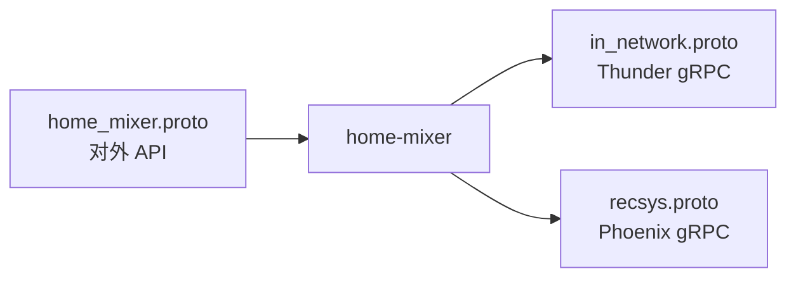
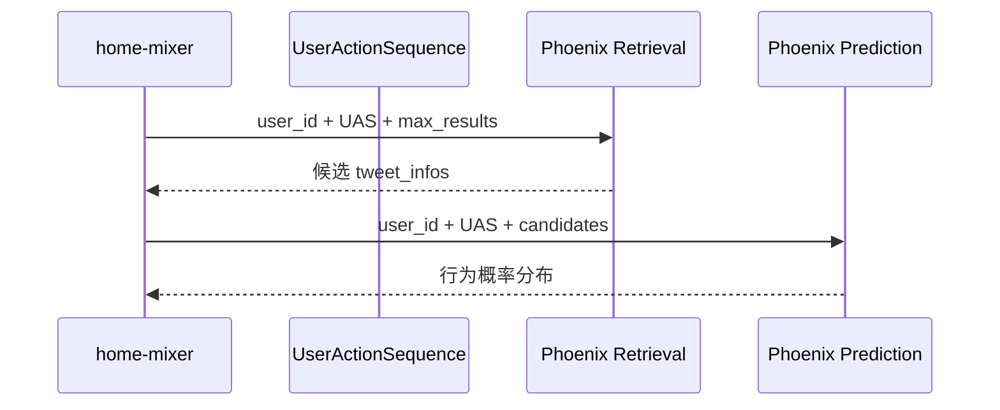
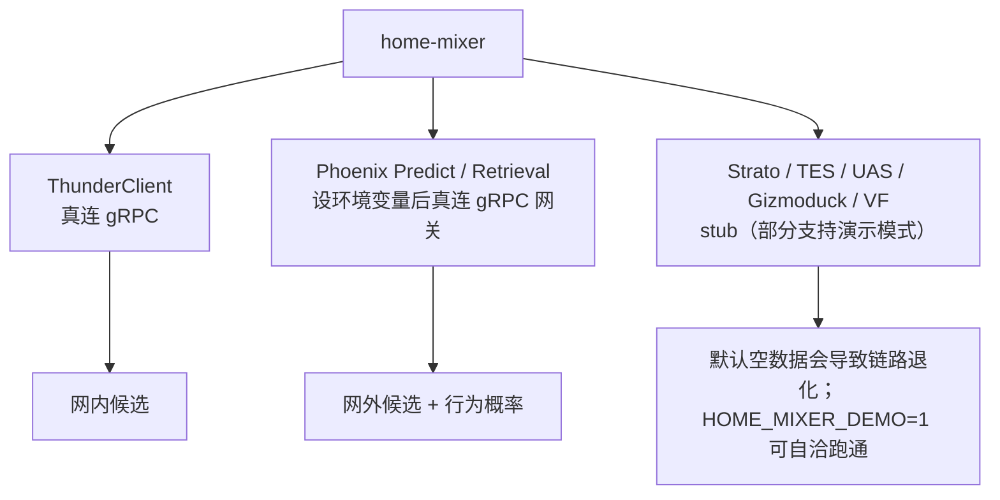

# 05. 外部依赖与数据契约

`home-mixer` 本质上是一个“协议和依赖拼接器”。要理解它，必须同时看 proto 和客户端抽象。

## 1. 三份最关键的 proto

| proto | 作用 | `home-mixer` 如何使用 |
| --- | --- | --- |
| `home_mixer.proto` | 对外服务协议 | 接请求、回结果 |
| `in_network.proto` | Thunder 协议 | 请求网内候选 |
| `recsys.proto` | Phoenix 协议 | 做网外召回与精排预测 |

## 2. 对外 API：`home_mixer.proto`

### 2.1 请求侧关键信号

| 字段 | 含义 | 影响组件 |
| --- | --- | --- |
| `viewer_id` | 当前请求用户 | 全链路 |
| `client_app_id` | 客户端类型 | VF viewer context |
| `country_code` / `language_code` | 地域与语言上下文 | VF viewer context |
| `seen_ids` | 已看过帖子 | `PreviouslySeenPostsFilter` |
| `served_ids` | 已下发帖子 | `PreviouslyServedPostsFilter` |
| `in_network_only` | 仅网内 | `PhoenixSource.enable()` |
| `is_bottom_request` | 是否翻页 | `PreviouslyServedPostsFilter.enable()` |
| `bloom_filter_entries` | 客户端布隆过滤器 | `PreviouslySeenPostsFilter` |

### 2.2 返回侧关键信号

| 字段 | 来源 |
| --- | --- |
| `tweet_id` / `author_id` | `PostCandidate` 标识字段 |
| `score` | `score` |
| `served_type` | Source |
| `screen_names` | `CandidateHelpers::get_screen_names()` |
| `visibility_reason` | VF 结果映射 |

## 3. Thunder 契约：`in_network.proto`

Thunder 负责的不是排序，而是给一批“关注的人最近发了什么”。

### 3.1 请求结构

`ThunderSource` 发送的 `GetInNetworkPostsRequest` 关键字段有：

| 字段 | 来源 |
| --- | --- |
| `user_id` | `query.user_id` |
| `following_user_ids` | `query.user_features.followed_user_ids` |
| `max_results` | `THUNDER_MAX_RESULTS` |
| `exclude_tweet_ids` | 当前实现固定空列表 |
| `algorithm` | 固定 `"default"` |
| `is_video_request` | 固定 `false` |

### 3.2 响应结构

Thunder 返回 `LightPost`，里面只有轻量字段：

- `post_id`
- `author_id`
- `created_at`
- 回复、对话和转推关系
- `has_video`

这些字段足以支持：

- 快速召回
- 初步关系构建
- 后续再去 TES 做重补全

## 4. Phoenix 契约：`recsys.proto`

Phoenix 在 `home-mixer` 中扮演两种角色。

### 4.1 Retrieval

输入：

- `user_id`
- `UserActionSequence`
- `max_results`

输出：

- 一批 `ScoredCandidate`

### 4.2 Prediction

输入：

- `user_id`
- `UserActionSequence`
- 候选 `TweetInfo[]`

输出：

- 每个候选的离散动作 log probability
- 连续动作预测值

## 5. 客户端抽象与调用方对应

| 客户端 trait | 调用方 | 作用 |
| --- | --- | --- |
| `UserActionSequenceOps` | `UserActionSeqQueryHydrator` | 取用户行为序列 |
| `StratoClient` | `UserFeaturesQueryHydrator` / `CacheRequestInfoSideEffect` | 取用户特征、写请求缓存 |
| `PhoenixRetrievalClient` | `PhoenixSource` | 网外召回 |
| `ThunderClient` | `ThunderSource` | 网内召回 |
| `TESClient` | 多个 candidate hydrator | 补帖子文本、媒体、订阅信息 |
| `GizmoduckClient` | `GizmoduckCandidateHydrator` | 补作者资料 |
| `PhoenixPredictionClient` | `PhoenixScorer` | 精排预测 |
| `VisibilityFilteringClient` | `VFCandidateHydrator` | 可见性审核 |

## 6. 当前仓库里的实现成熟度

这是阅读源码时最需要明确的一点。

| 依赖 | 当前实现状态 | 说明 |
| --- | --- | --- |
| `ThunderClient` | 简化版真实客户端 | 会连 gRPC Thunder 服务（`THUNDER_GRPC_ADDR`） |
| `PhoenixRetrievalClient` | 真实 gRPC 客户端（可选） | 设置 `PHOENIX_RETRIEVAL_GRPC_ADDR` 后调用 Phoenix 网关；未设置退化为 stub（无网外候选） |
| `PhoenixPredictionClient` | 真实 gRPC 客户端（可选） | 设置 `PHOENIX_PREDICT_GRPC_ADDR` 后调用 Phoenix 网关；未设置退化为 stub（空预测） |
| `UserActionSequenceFetcher` | stub | 返回空行为序列；`HOME_MIXER_DEMO=1` 时装配层改为注入 `DemoUserActionSequenceFetcher`（合成序列） |
| `StratoClient` | stub | 返回空用户特征；演示模式注入 `DemoStratoClient`（固定关注列表）；写缓存静默成功 |
| `TESClient` | stub | 所有帖子无 core data；演示模式注入 `DemoTESClient`（占位文本） |
| `GizmoduckClient` | stub | 默认所有用户资料为空 |
| `VisibilityFilteringClient` | stub | 默认全部通过审核 |

演示实现是独立的 `Demo*` 类型，由 `phoenix_candidate_pipeline::prod()` 在装配时按 `HOME_MIXER_DEMO` 选择注入；生产 stub 内部没有任何演示分支，替换 stub 时不需要关心演示逻辑。演示数据的共享契约（账号集合、Snowflake 工具）在 `proto/src/demo.rs`，thunder 与 home-mixer 共用一份。

接真实平台时的替换顺序和每个 stub 对应的改造点，见 [getting-started：从演示到真实系统](../getting-started/06-从演示到真实系统.md)。

## 7. S2S 认证的现实状态

代码里保留了 `S2S_CHAIN_PATH`、`S2S_CRT_PATH`、`S2S_KEY_PATH` 这些证书路径，主要用于 VF 客户端构造签名兼容，但当前 VF 实现本身还是 stub。

因此现在的真实情况是：

- 代码保留了生产版接口形状
- 但还没有真正进入“必须持证访问外部服务”的阶段

## 8. 一个重要判断

从依赖视角看，当前 `home-mixer` 代码更像：

- 一套相当完整的编排骨架
- 加上一条真实接了 Thunder 的主链
- 再加上一批为未来真实服务预留好的 trait 和数据结构

所以理解它时，要把“接口层完整”和“默认行为可用”区分开看。
