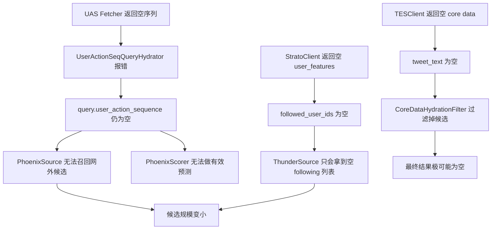
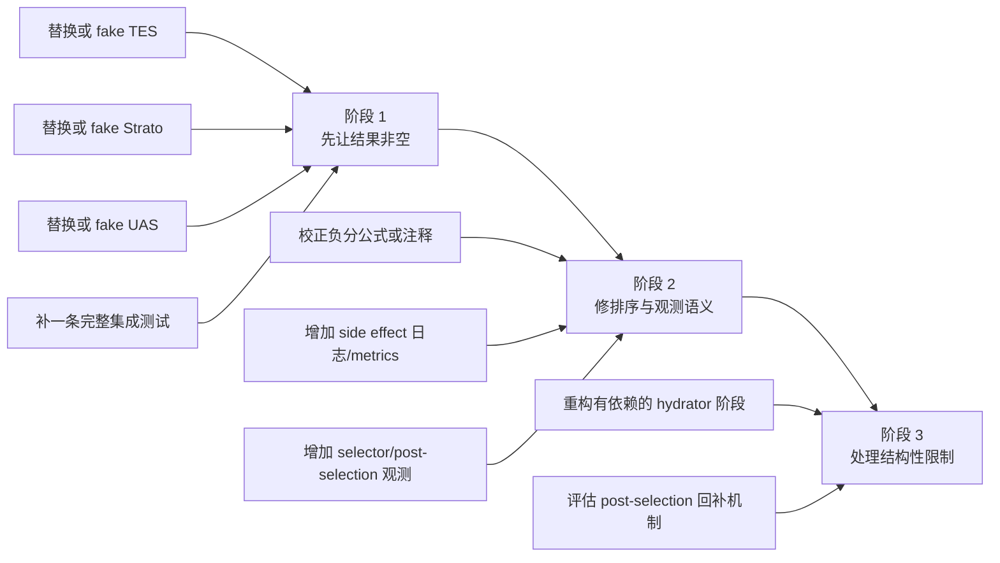

# 06. 当前行为、风险与补齐路线

前面几篇讲的是结构，本篇讲“这份仓库现在真实会怎样跑”。

## 1. 默认代码路径下的真实行为

如果直接按仓库当前默认实现启动 `home-mixer`，它不是“效果一般”，而是会发生明显退化。

## 2. 关键退化点逐条解释

### 2.1 UAS 链路默认失效

`UserActionSequenceFetcher` 默认返回空行为列表，而 `UserActionSeqQueryHydrator` 会把空序列视为错误，不会写回 `query.user_action_sequence`。

后果：

- `PhoenixSource` 因缺少序列而失败
- `PhoenixScorer` 缺少有效模型输入

### 2.2 用户特征默认全空

`StratoClient` 默认返回空 `UserFeatures`，导致：

- `followed_user_ids` 为空
- `blocked_user_ids` / `muted_user_ids` 为空
- `muted_keywords` 为空
- `subscribed_user_ids` 为空

后果：

- Thunder 几乎没有有效 following 列表
- 个性化过滤大多退化为无效果

### 2.3 TES 默认全空最致命

`TESClient` 默认不给任何 core data，导致：

- `tweet_text` 为空
- `retweeted_tweet_id` / `retweeted_user_id` 为空
- `video_duration_ms` 为空
- `subscription_author_id` 为空

其中最关键的是：

- `CoreDataHydrationFilter` 要求 `tweet_text` 非空

这意味着即便前面有候选进来，很多也会被这一层直接清空。

### 2.4 Phoenix Prediction 默认无实际排序信号

即使忽略前面问题，`PhoenixPredictionClient` 也默认返回空分布，`WeightedScorer` 大量字段都会按 `0.0` 计算。

后果：

- 排序信号非常弱
- 后面的多样性和网外降权更多是在对“接近空分数”做操作

### 2.5 VF 默认全部放行

当前可见性系统不会实际拦截内容，因此：

- 安全链路形状存在
- 但没有真实审核效果

## 3. 当前实现里的高优先级工程问题

| 问题 | 原因 | 影响 |
| --- | --- | --- |
| 默认几乎返回空结果 | 多个 stub 叠加，尤其是 UAS + TES + Strato | 系统难以做端到端验证 |
| 同 stage hydrator 有依赖错位 | Hydrator 并行执行，但部分实现依赖彼此输出 | 某些字段补全不稳定 |
| 负分归一化公式与注释不一致 | `WeightedScorer::offset_score()` 和参数注释存在语义偏差 | 排序解释性和调参直觉受损 |
| post-selection 删除后不回补 | selector 先取 100，后过滤再截断 50 | 返回条数可能明显不足 |
| side effect 失败无统一观测 | 结果被异步丢弃 | 缓存回写问题不易察觉 |

## 4. 最值得注意的一个结构性风险

`GizmoduckCandidateHydrator` 读取 `retweeted_user_id`，但这个字段主要由 `CoreDataCandidateHydrator` 在同一 stage 中写入。

由于同 stage hydrator 并行执行：

- `GizmoduckCandidateHydrator` 看不到这一轮刚补出的 `retweeted_user_id`
- `retweeted_screen_name` 的正确性会受影响

这说明问题不只是“某个客户端没填数据”，而是“装配顺序与框架语义之间有结构性约束”。

## 5. 观测和测试上的缺口

### 5.1 观测缺口

- selector 没有统一 stage 级打点
- side effect 没有统一失败日志
- `filtered_candidates` 不记录是哪个 filter 删掉的
- post-selection 删除比例缺少直接观测

### 5.2 测试缺口

当前最需要的不是更多小函数单测，而是：

1. pipeline 端到端集成测试
2. stub client 的 fake 实现组合测试
3. 排序语义测试
4. post-selection 缩水行为测试

## 6. 推荐补齐路线

### 6.1 阶段 1：先让链路稳定给出非空结果

优先级建议：

1. `TESClient`
2. `StratoClient`
3. `UserActionSequenceFetcher`
4. 集成测试

原因很简单：

- 没有文本，候选会被早早清空
- 没有用户特征，Thunder 和多个过滤器都失真
- 没有 UAS，Phoenix 两条链都跑不起来

### 6.2 阶段 2：修语义与可观测性

重点包括：

- 校准 `WeightedScorer`
- 给 side effect 打日志与指标
- 给 selector 和 post-selection 增加规模变化观测

### 6.3 阶段 3：再动框架结构

只有在前两步完成后，才值得处理更重的结构调整：

- 拆分有依赖的 hydrator
- 设计 post-selection 回补
- 考虑 filter 来源追踪

## 7. 一个务实判断标准

判断 `home-mixer` 是否“可用”，不要只看能不能编译或服务能不能起，而要看四个问题：

1. 能否稳定返回非空结果
2. 关键排序信号是否真实进入打分链
3. 过滤和审核是否能解释为什么内容被删
4. 出问题时能否在日志和指标里快速定位阶段

按这个标准，当前仓库的 `home-mixer` 已经有了完整的系统骨架，但离真正可运营的首页编排服务还有明确的工程补齐工作。
