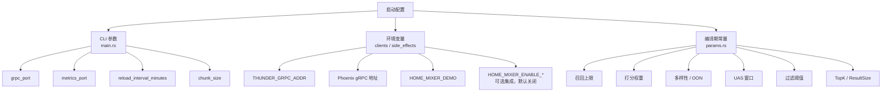
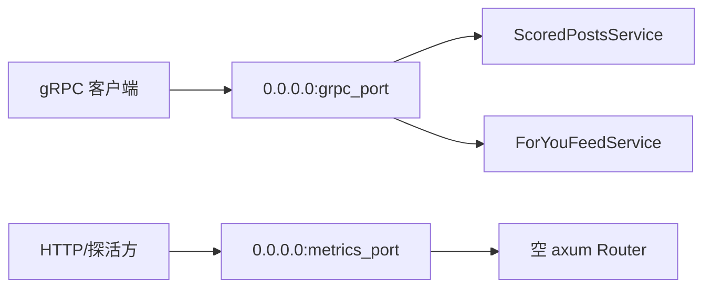
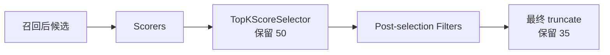

# 07. 配置、入口参数与参数手册

本篇把 `home-mixer` 当前所有可见的配置入口整理成一张图和几组表，方便回答三个问题：

1. 服务怎么启动
2. 配置从哪里进来
3. 参数改了会影响哪一段链路

## 1. 配置入口总览

当前 `home-mixer` 的配置入口并不多，主要分三层：

- 进程启动参数
- 环境变量
- 编译期常量 `params.rs`

## 2. 启动参数

启动参数定义在 `home-mixer/main.rs`。

| 参数 | 默认值 | 当前实际用途 | 备注 |
| --- | --- | --- | --- |
| `--grpc-port` | `50051` | gRPC 对外监听端口 | 实际生效 |
| `--metrics-port` | `9090` | HTTP 监听端口 | 当前 router 为空，占位为主 |
| `--reload-interval-minutes` | `5` | 仅打印到启动日志 | 当前代码未使用 |
| `--chunk-size` | `100` | 仅打印到启动日志 | 当前代码未使用 |

一个重要结论：

- `reload_interval_minutes` 和 `chunk_size` 在当前代码中只是参数保留位，不进入任何业务逻辑。

## 3. 环境变量

### 3.1 已实际读取

| 变量 | 读取位置 | 作用 | 默认行为 |
| --- | --- | --- | --- |
| `THUNDER_GRPC_ADDR` | `clients/thunder_client.rs` | Thunder gRPC 地址 | 默认 `http://localhost:50052` |
| `PHOENIX_PREDICT_GRPC_ADDR` | `clients/phoenix_prediction_client.rs` | Phoenix 精排 gRPC 地址 | 未设置时显式 Unavailable，Scorer 保留候选并走规则 fallback |
| `PHOENIX_RETRIEVAL_GRPC_ADDR` | `clients/phoenix_retrieval_client.rs` | Phoenix 召回 gRPC 地址 | 未设置时显式 Unavailable，Source 跳过网外召回路 |
| `PHOENIX_MOE_GRPC_ADDR` | `candidate_pipeline/phoenix_candidate_pipeline.rs` | Phoenix MoE 专家召回地址；只提供地址，不会自动启用 | 未设置时不装配 MoE Source |
| `HOME_MIXER_MODE` | `runtime_config.rs` | 运行意图：`demo` / `degraded` / `production_ready` | 默认 `degraded`；调用方身份、Viewer、UAS、Strato、TES、Gizmoduck、VF、Phoenix、Thunder 合同未全部闭合前，`production_ready` 拒绝启动 |
| `HOME_MIXER_ENABLE_PHOENIX_MOE` | `feature_policy.rs` | 显式启用 Phoenix MoE 旁路召回 | 默认关闭；启用但缺少 `PHOENIX_MOE_GRPC_ADDR` 时记录告警并跳过，主链继续 |
| `HOME_MIXER_ENABLE_REQUEST_CACHE_SIDE_EFFECT` | `feature_policy.rs` | 显式启用请求缓存 SideEffect | 默认关闭；启用前必须人工确认真实 Strato adapter、schema、认证和保留策略 |
| `HOME_MIXER_ENABLE_DEBUG_RPC` | `feature_policy.rs` / `debug_access.rs` | 启用 `DebugScoredPosts` | 默认关闭；开启时必须同时提供 `HOME_MIXER_DEBUG_TOKEN`，调用方通过 `x-home-mixer-debug-token` metadata 传入 |
| `HOME_MIXER_ENABLE_UNSIGNED_CACHED_POSTS` | `feature_policy.rs` / `runtime_config.rs` / `server.rs` | 允许请求直接携带未签名 `cached_posts` fixture | 默认关闭且只允许 `demo`；生产缓存必须使用服务端状态或签名/opaque 合同 |
| `HOME_MIXER_ENABLE_VM_RANKER` | `feature_policy.rs` | 显式启用 VM Ranker 二次重排 Scorer | 默认关闭；启用但缺少 `VM_RANKER_GRPC_ADDR` 时记录告警并跳过，主链继续 |
| `HOME_MIXER_ENABLE_AUTHOR_COLD_START` | `feature_policy.rs` | 启用低曝光新作者提升，并在 scorer 前补作者粉丝数 | 默认关闭；当前只允许 `demo`，非 demo 会告警并禁用；候选缺 `view_count` 或作者粉丝数时严格不参与 |
| `HOME_MIXER_ENABLE_COLD_START_THOMPSON_SAMPLING` | `feature_policy.rs` | 在冷启动候选中启用 Beta Thompson Sampling | 默认关闭；只有 Author Cold Start 同时开启才生效 |
| `VM_RANKER_GRPC_ADDR` | `candidate_pipeline/phoenix_candidate_pipeline.rs` | VM Ranker 服务地址；只提供地址不会自动启用 | 未设置时不装配 `VMRanker` Scorer |
| `VM_RANKER_VALUE_MODEL_ID` | `candidate_pipeline/phoenix_candidate_pipeline.rs` | 选择 value model；上游从 feature switch 读取，本地由装配显式配置 | 未设置时服务端按 `unknown` 记账并使用默认权重 |
| `HOME_MIXER_DEMO` | `demo.rs` | `HOME_MIXER_MODE=demo` 的旧兼容别名 | 仅兼容已有脚本；新配置使用 `HOME_MIXER_MODE` |

Phoenix 两个主服务地址通常同时指向 `phoenix/scripts/run_grpc_gateway.py` 启动的网关（默认 `http://localhost:50053`）。完整启动组合见 [getting-started 第四步](../getting-started/05-第四步-跑通完整推荐链路.md)。

### 3.2 可选集成启用规则

`HomeMixerConfig::from_env()` 在进程装配时一次性生成 `HomeMixerFeatures`。Source、SideEffect 和其他业务组件不直接读取环境变量。

可选集成遵循以下规则：

1. 默认关闭；主推荐链不能依赖旁路功能才能启动或返回结果。
2. 开关只代表操作员批准启用，不代表外部服务已经完成接入。
3. 启用前必须人工确认服务 owner、公开 schema、认证、超时、错误语义、降级、测试环境和数据保留策略。
4. 开关开启但必要地址缺失时，装配层记录告警并跳过组件，不能阻断主链启动。
5. 当前没有公开 adapter 的 Ads、Prompt、WhoToFollow、PushToHome、Kafka/Redis 和 Grox 模型能力不提供伪开关；它们保持不装配，完成合同和实现后再增加 typed flag。

请求缓存 SideEffect 即使显式开启，当前 `DisabledStratoClient` 和 `DemoStratoClient` 也会明确拒绝持久化写入。必须完成人工接入和持久化验收后，才能把它视为生产数据闭环。

### 3.3 QueryBuilder 外部策略

两个 RPC 共用同一个 `QueryBuilder`。它负责 viewer ID 校验、公共 proto 映射、请求 ID、全局/请求级 MoE 开关合并，以及 viewer policy 查询。

`GizmoduckClient::get_viewer_data` 的超时预算固定为 200 ms。只有明确返回 `ViewerEligibility::Allowed` 才允许网外推荐；`Denied`、`Unknown`、错误或超时都记录告警并强制 `in_network_only=true`，保留 Thunder 网内降级链而不绕过用户偏好。

### 3.4 证书路径

`clients/s2s.rs` 里固定了三条路径：

| 常量 | 默认路径 | 用途 |
| --- | --- | --- |
| `S2S_CHAIN_PATH` | `/etc/pki/tls/certs/s2s-chain.pem` | CA 链 |
| `S2S_CRT_PATH` | `/etc/pki/tls/certs/s2s-cert.pem` | 客户端证书 |
| `S2S_KEY_PATH` | `/etc/pki/tls/private/s2s-key.pem` | 客户端私钥 |

但要注意：

- 当前只有 disabled VF 边界的构造函数接收这些路径
- `demo` 注入显式 Allow adapter；`degraded` 注入返回 Unavailable 的 disabled adapter
- VF 未知时网外候选拒绝、网内候选保留；`production_ready` 在真实 VF 合同缺失时拒绝启动

## 4. 服务级参数

### 4.1 gRPC 传输参数

| 常量 | 值 | 使用点 |
| --- | --- | --- |
| `MAX_GRPC_MESSAGE_SIZE` | `16 * 1024 * 1024` | gRPC server 的编码/解码消息大小限制 |
| `THUNDER_REQUEST_TIMEOUT_MS` | `500` | Thunder 网内召回上限 |
| `UAS_FETCH_TIMEOUT_MS` | `500` | request-scoped UAS 读取上限 |
| `USER_FEATURES_FETCH_TIMEOUT_MS` | `500` | request-scoped Strato 用户特征读取上限 |
| `USER_TOPIC_READ_TIMEOUT_MS` | `500` | 补充话题 profile 读取上限 |
| `STRATO_WRITE_TIMEOUT_MS` | `500` | 异步请求信息写回上限 |
| `TES_REQUEST_TIMEOUT_MS` | `500` | TES core/media/subscription 单批调用上限 |
| `GIZMODOUCK_REQUEST_TIMEOUT_MS` | `500` | post-selection 作者资料批次上限 |
| `PHOENIX_RETRIEVAL_TIMEOUT_MS` | `3000` | Phoenix 标准/MoE 召回上限 |
| `PHOENIX_PREDICTION_TIMEOUT_MS` | `5000` | Phoenix 精排上限 |
| `TOPIC_RETRIEVAL_TIMEOUT_MS` | `500` | Topic 召回上限 |
| `VF_REQUEST_TIMEOUT_MS` | `500` | 单组可见性检查上限 |

### 4.2 对外监听结构

当前 HTTP 端口的现实状态是：

- 进程会监听
- 但没有明确的 health/metrics route

## 5. 召回参数

| 常量 | 值 | 影响组件 | 影响说明 |
| --- | --- | --- | --- |
| `THUNDER_MAX_RESULTS` | `500` | `ThunderSource` | 网内召回上限 |
| `PHOENIX_MAX_RESULTS` | `300` | `PhoenixSource` | 网外召回上限 |

这两个值共同决定了进入补全阶段前的候选池规模上限。

## 6. 打分权重参数

### 6.1 正向离散行为

| 常量 | 值 | 含义 |
| --- | --- | --- |
| `FAVORITE_WEIGHT` | `0.5` | 点赞 |
| `REPLY_WEIGHT` | `27.0` | 回复 |
| `RETWEET_WEIGHT` | `1.0` | 转发 |
| `PHOTO_EXPAND_WEIGHT` | `0.02` | 图片展开 |
| `CLICK_WEIGHT` | `0.04` | 点击详情 |
| `PROFILE_CLICK_WEIGHT` | `0.02` | 点击作者主页 |
| `VQV_WEIGHT` | `0.005` | 视频有效观看 |
| `SHARE_WEIGHT` | `1.0` | 分享 |
| `SHARE_VIA_DM_WEIGHT` | `1.0` | 私信分享 |
| `SHARE_VIA_COPY_LINK_WEIGHT` | `1.0` | 复制链接分享 |
| `DWELL_WEIGHT` | `0.001` | 二值停留 |
| `QUOTE_WEIGHT` | `1.0` | 引用转发 |
| `QUOTED_CLICK_WEIGHT` | `0.02` | 点击引用帖 |
| `FOLLOW_AUTHOR_WEIGHT` | `1.0` | 关注作者 |

### 6.2 连续行为

| 常量 | 值 | 含义 |
| --- | --- | --- |
| `CONT_DWELL_TIME_WEIGHT` | `0.0001` | 连续停留时间 |

### 6.3 负向行为

| 常量 | 值 | 含义 |
| --- | --- | --- |
| `NOT_INTERESTED_WEIGHT` | `-74.0` | 不感兴趣 |
| `BLOCK_AUTHOR_WEIGHT` | `-74.0` | 拉黑作者 |
| `MUTE_AUTHOR_WEIGHT` | `-74.0` | 静音作者 |
| `REPORT_WEIGHT` | `-369.0` | 举报 |

### 6.4 归一化相关

| 常量 | 值 | 当前作用 |
| --- | --- | --- |
| `WEIGHTS_SUM` | `33.6112` | `WeightedScorer::offset_score()` |
| `NEGATIVE_WEIGHTS_SUM` | `-591.001` | `WeightedScorer::offset_score()` |
| `NEGATIVE_SCORES_OFFSET` | `1.0` | `WeightedScorer::offset_score()` |

注意：

- 这些常量的注释意图和当前负分公式之间存在不完全一致，详见风险文档。

## 7. 多样性与网外降权参数

| 常量 | 值 | 影响组件 | 作用 |
| --- | --- | --- | --- |
| `OON_WEIGHT_FACTOR` | `0.5` | `OONScorer` | 网外内容统一降权 |
| `AUTHOR_DIVERSITY_DECAY` | `0.5` | `AuthorDiversityScorer` | 同作者重复衰减 |
| `AUTHOR_DIVERSITY_FLOOR` | `0.1` | `AuthorDiversityScorer` | 衰减地板 |

## 8. UAS 参数

| 常量 | 值 | 使用点 | 作用 |
| --- | --- | --- | --- |
| `UAS_WINDOW_TIME_MS` | `7 天` | `UserActionSeqQueryHydrator` | 聚合时间窗口 |
| `UAS_MAX_SEQUENCE_LENGTH` | `300` | `UserActionSeqQueryHydrator` | 序列截断上限 |

## 9. 过滤参数

| 常量 | 值 | 影响组件 | 作用 |
| --- | --- | --- | --- |
| `MAX_POST_AGE` | `48 小时` | `AgeFilter` | 帖子年龄限制 |
| `MIN_VIDEO_DURATION_MS` | `2000` | `RankingScorer` | 是否启用 VQV 权重 |

## 10. 输出参数

| 常量 | 值 | 影响组件 | 作用 |
| --- | --- | --- | --- |
| `TOP_K_CANDIDATES_TO_SELECT` | `50` | `TopKScoreSelector` | 选择阶段保留数量 |
| `RESULT_SIZE` | `35` | pipeline 最终裁剪 | 最终响应上限 |

两个值取自上游 `47c1bcd` 的真实配置，取代了此前本地自拟的 100 / 50。

## 11. 当前配置体系的现实评价

当前配置体系是“骨架完整、动态化不足”的状态：

- 有明确的参数分层
- 主要排序和过滤阈值都集中在 `params.rs`
- 但很多参数还是编译期常量，不是运行时配置
- 启动参数里也有两个暂未接入业务逻辑的保留位

如果后续要走向生产，优先建议动态化的是：

1. Thunder/Phoenix/Strato/TES 等外部服务地址
2. 核心排序权重
3. 召回上限、TopK、ResultSize
4. Age / OON / Diversity 等策略阈值
