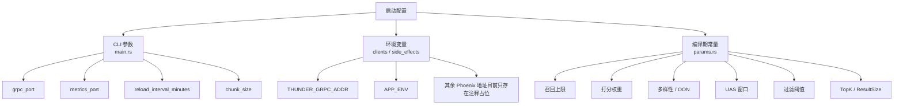
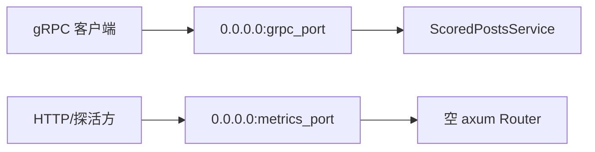

# 07. 配置、入口参数与参数手册

本篇把 `home-mixer` 当前所有可见的配置入口整理成一张图和几组表，方便回答三个问题：

1. 服务怎么启动
2. 配置从哪里进来
3. 参数改了会影响哪一段链路

## 1. 配置入口总览

当前 `home-mixer` 的配置入口并不多，主要分三层：

- 进程启动参数
- 环境变量
- 编译期常量 `params.rs`

## 2. 启动参数

启动参数定义在 `home-mixer/main.rs`。

| 参数 | 默认值 | 当前实际用途 | 备注 |
| --- | --- | --- | --- |
| `--grpc-port` | `50051` | gRPC 对外监听端口 | 实际生效 |
| `--metrics-port` | `9090` | HTTP 监听端口 | 当前 router 为空，占位为主 |
| `--reload-interval-minutes` | `5` | 仅打印到启动日志 | 当前代码未使用 |
| `--chunk-size` | `100` | 仅打印到启动日志 | 当前代码未使用 |

一个重要结论：

- `reload_interval_minutes` 和 `chunk_size` 在当前代码中只是参数保留位，不进入任何业务逻辑。

## 3. 环境变量

### 3.1 已实际读取

| 变量 | 读取位置 | 作用 | 默认行为 |
| --- | --- | --- | --- |
| `THUNDER_GRPC_ADDR` | `clients/thunder_client.rs` | Thunder gRPC 地址 | 默认 `http://localhost:50052` |
| `PHOENIX_PREDICT_GRPC_ADDR` | `clients/phoenix_prediction_client.rs` | Phoenix 精排 gRPC 地址 | 未设置时退化为 stub（空预测） |
| `PHOENIX_RETRIEVAL_GRPC_ADDR` | `clients/phoenix_retrieval_client.rs` | Phoenix 召回 gRPC 地址 | 未设置时退化为 stub（无网外候选） |
| `HOME_MIXER_DEMO` | `demo.rs`（仅装配层 `phoenix_candidate_pipeline::prod()` 读取） | 设为 `1` 时装配层注入 `Demo*` 客户端，返回自洽的演示数据（关注列表、行为序列、帖子文本） | 未设置时注入生产 stub，返回空数据 |
| `APP_ENV` | `side_effects/cache_request_info_side_effect.rs` | 控制是否写请求缓存 | 非 `prod` 时 side effect 不启用 |

Phoenix 两个地址通常同时指向 `phoenix/scripts/run_grpc_gateway.py` 启动的网关（默认 `http://localhost:50053`）。完整启动组合见 [getting-started 第四步](../getting-started/05-第四步-跑通完整推荐链路.md)。

### 3.3 证书路径

`clients/s2s.rs` 里固定了三条路径：

| 常量 | 默认路径 | 用途 |
| --- | --- | --- |
| `S2S_CHAIN_PATH` | `/etc/pki/tls/certs/s2s-chain.pem` | CA 链 |
| `S2S_CRT_PATH` | `/etc/pki/tls/certs/s2s-cert.pem` | 客户端证书 |
| `S2S_KEY_PATH` | `/etc/pki/tls/private/s2s-key.pem` | 客户端私钥 |

但要注意：

- 当前只有 VF 客户端构造函数接收这些路径
- VF 客户端仍是 stub
- 所以这些路径现在主要代表“未来生产版接口形状”，不是当前主链必需项

## 4. 服务级参数

### 4.1 gRPC 传输参数

| 常量 | 值 | 使用点 |
| --- | --- | --- |
| `MAX_GRPC_MESSAGE_SIZE` | `16 * 1024 * 1024` | gRPC server 的编码/解码消息大小限制 |

### 4.2 对外监听结构

当前 HTTP 端口的现实状态是：

- 进程会监听
- 但没有明确的 health/metrics route

## 5. 召回参数

| 常量 | 值 | 影响组件 | 影响说明 |
| --- | --- | --- | --- |
| `THUNDER_MAX_RESULTS` | `500` | `ThunderSource` | 网内召回上限 |
| `PHOENIX_MAX_RESULTS` | `300` | `PhoenixSource` | 网外召回上限 |

这两个值共同决定了进入补全阶段前的候选池规模上限。

## 6. 打分权重参数

### 6.1 正向离散行为

| 常量 | 值 | 含义 |
| --- | --- | --- |
| `FAVORITE_WEIGHT` | `0.5` | 点赞 |
| `REPLY_WEIGHT` | `27.0` | 回复 |
| `RETWEET_WEIGHT` | `1.0` | 转发 |
| `PHOTO_EXPAND_WEIGHT` | `0.02` | 图片展开 |
| `CLICK_WEIGHT` | `0.04` | 点击详情 |
| `PROFILE_CLICK_WEIGHT` | `0.02` | 点击作者主页 |
| `VQV_WEIGHT` | `0.005` | 视频有效观看 |
| `SHARE_WEIGHT` | `1.0` | 分享 |
| `SHARE_VIA_DM_WEIGHT` | `1.0` | 私信分享 |
| `SHARE_VIA_COPY_LINK_WEIGHT` | `1.0` | 复制链接分享 |
| `DWELL_WEIGHT` | `0.001` | 二值停留 |
| `QUOTE_WEIGHT` | `1.0` | 引用转发 |
| `QUOTED_CLICK_WEIGHT` | `0.02` | 点击引用帖 |
| `FOLLOW_AUTHOR_WEIGHT` | `1.0` | 关注作者 |

### 6.2 连续行为

| 常量 | 值 | 含义 |
| --- | --- | --- |
| `CONT_DWELL_TIME_WEIGHT` | `0.0001` | 连续停留时间 |

### 6.3 负向行为

| 常量 | 值 | 含义 |
| --- | --- | --- |
| `NOT_INTERESTED_WEIGHT` | `-74.0` | 不感兴趣 |
| `BLOCK_AUTHOR_WEIGHT` | `-74.0` | 拉黑作者 |
| `MUTE_AUTHOR_WEIGHT` | `-74.0` | 静音作者 |
| `REPORT_WEIGHT` | `-369.0` | 举报 |

### 6.4 归一化相关

| 常量 | 值 | 当前作用 |
| --- | --- | --- |
| `WEIGHTS_SUM` | `33.6061` | `WeightedScorer::offset_score()` |
| `NEGATIVE_WEIGHTS_SUM` | `-591.0` | `WeightedScorer::offset_score()` |
| `NEGATIVE_SCORES_OFFSET` | `1.0` | `WeightedScorer::offset_score()` |

注意：

- 这些常量的注释意图和当前负分公式之间存在不完全一致，详见风险文档。

## 7. 多样性与网外降权参数

| 常量 | 值 | 影响组件 | 作用 |
| --- | --- | --- | --- |
| `OON_WEIGHT_FACTOR` | `0.5` | `OONScorer` | 网外内容统一降权 |
| `AUTHOR_DIVERSITY_DECAY` | `0.5` | `AuthorDiversityScorer` | 同作者重复衰减 |
| `AUTHOR_DIVERSITY_FLOOR` | `0.1` | `AuthorDiversityScorer` | 衰减地板 |

## 8. UAS 参数

| 常量 | 值 | 使用点 | 作用 |
| --- | --- | --- | --- |
| `UAS_WINDOW_TIME_MS` | `7 天` | `UserActionSeqQueryHydrator` | 聚合时间窗口 |
| `UAS_MAX_SEQUENCE_LENGTH` | `300` | `UserActionSeqQueryHydrator` | 序列截断上限 |

## 9. 过滤参数

| 常量 | 值 | 影响组件 | 作用 |
| --- | --- | --- | --- |
| `MAX_POST_AGE` | `48 小时` | `AgeFilter` | 帖子年龄限制 |
| `MIN_VIDEO_DURATION_MS` | `2000` | `WeightedScorer` | 是否启用 VQV 权重 |

## 10. 输出参数

| 常量 | 值 | 影响组件 | 作用 |
| --- | --- | --- | --- |
| `TOP_K_CANDIDATES_TO_SELECT` | `100` | `TopKScoreSelector` | 选择阶段保留数量 |
| `RESULT_SIZE` | `50` | pipeline 最终裁剪 | 最终响应上限 |

## 11. 当前配置体系的现实评价

当前配置体系是“骨架完整、动态化不足”的状态：

- 有明确的参数分层
- 主要排序和过滤阈值都集中在 `params.rs`
- 但很多参数还是编译期常量，不是运行时配置
- 启动参数里也有两个暂未接入业务逻辑的保留位

如果后续要走向生产，优先建议动态化的是：

1. Thunder/Phoenix/Strato/TES 等外部服务地址
2. 核心排序权重
3. 召回上限、TopK、ResultSize
4. Age / OON / Diversity 等策略阈值
