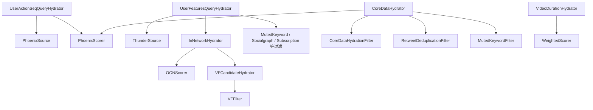

# 08. 组件索引

本篇是“查手册式”索引，按组件列出：

- 文件位置
- enable 条件
- 读取字段
- 写回字段
- 外部依赖
- 下游依赖

## 1. Query Hydrators

| 组件 | 文件 | enable | 读取 | 写回 | 外部依赖 | 下游依赖 |
| --- | --- | --- | --- | --- | --- | --- |
| `UserActionSeqQueryHydrator` | `query_hydrators/user_action_seq_query_hydrator.rs` | 默认启用 | `query.user_id` | `query.user_action_sequence` | `UserActionSequenceFetcher` | `PhoenixSource`、`PhoenixScorer` |
| `UserFeaturesQueryHydrator` | `query_hydrators/user_features_query_hydrator.rs` | 默认启用 | `query.user_id` | `query.user_features` | `StratoClient` | `ThunderSource`、多个 Filter / Hydrator |

## 2. Sources

| 组件 | 文件 | enable | 读取 | 产出字段 | 外部依赖 | 说明 |
| --- | --- | --- | --- | --- | --- | --- |
| `PhoenixSource` | `sources/phoenix_source.rs` | `!query.in_network_only` | `user_id`、`user_action_sequence` | `tweet_id` `author_id` `in_reply_to_tweet_id` `served_type` | `PhoenixRetrievalClient` | 缺失序列直接失败 |
| `ThunderSource` | `sources/thunder_source.rs` | 默认启用 | `user_id`、`followed_user_ids` | `tweet_id` `author_id` `in_reply_to_tweet_id` `ancestors` `served_type` | `ThunderClient` | 用 reply / conversation 构造 `ancestors` |

## 3. Candidate Hydrators

| 组件 | 文件 | enable | 读取 | 写回 | 外部依赖 | 下游依赖 |
| --- | --- | --- | --- | --- | --- | --- |
| `InNetworkCandidateHydrator` | `candidate_hydrators/in_network_candidate_hydrator.rs` | 默认启用 | `query.user_id` `followed_user_ids` `candidate.author_id` | `in_network` | 无 | `OONScorer`、`VFCandidateHydrator` |
| `CoreDataCandidateHydrator` | `candidate_hydrators/core_data_candidate_hydrator.rs` | 默认启用 | `candidate.tweet_id` | `retweeted_user_id` `retweeted_tweet_id` `in_reply_to_tweet_id` `tweet_text` | `TESClient.get_tweet_core_datas` | `CoreDataHydrationFilter`、`RetweetDeduplicationFilter`、`MutedKeywordFilter`、`PhoenixScorer` |
| `VideoDurationCandidateHydrator` | `candidate_hydrators/video_duration_candidate_hydrator.rs` | 默认启用 | `candidate.tweet_id` | `video_duration_ms` | `TESClient.get_tweet_media_entities` | `WeightedScorer` |
| `SubscriptionHydrator` | `candidate_hydrators/subscription_hydrator.rs` | 默认启用 | `candidate.tweet_id` | `subscription_author_id` | `TESClient.get_subscription_author_ids` | `IneligibleSubscriptionFilter` |
| `GizmoduckCandidateHydrator` | `candidate_hydrators/gizmoduck_hydrator.rs` | 默认启用 | `author_id` `retweeted_user_id` | `author_followers_count` `author_screen_name` `retweeted_screen_name` | `GizmoduckClient` | 响应映射、未来分数归一化 |
| `VFCandidateHydrator` | `candidate_hydrators/vf_candidate_hydrator.rs` | post-selection 阶段默认启用 | `query.user_id` `query.viewer_context` `candidate.in_network` `tweet_id` | `visibility_reason` | `VisibilityFilteringClient` | `VFFilter` |

## 4. Filters

### 4.1 Pre-selection Filters

| 组件 | 文件 | enable | 读取 | 移除条件 |
| --- | --- | --- | --- | --- |
| `DropDuplicatesFilter` | `filters/drop_duplicates_filter.rs` | 默认启用 | `tweet_id` | 同一 `tweet_id` 重复出现 |
| `CoreDataHydrationFilter` | `filters/core_data_hydration_filter.rs` | 默认启用 | `author_id` `tweet_text` | 作者为空或文本为空 |
| `AgeFilter` | `filters/age_filter.rs` | 默认启用 | `tweet_id` | Snowflake 推导年龄大于 `MAX_POST_AGE` |
| `SelfTweetFilter` | `filters/self_tweet_filter.rs` | 默认启用 | `query.user_id` `author_id` | 作者就是 viewer |
| `RetweetDeduplicationFilter` | `filters/retweet_deduplication_filter.rs` | 默认启用 | `tweet_id` `retweeted_tweet_id` | 原帖/转推去重域冲突 |
| `IneligibleSubscriptionFilter` | `filters/ineligible_subscription_filter.rs` | 默认启用 | `subscription_author_id` `subscribed_user_ids` | 订阅内容作者不在订阅列表 |
| `PreviouslySeenPostsFilter` | `filters/previously_seen_posts_filter.rs` | 默认启用 | `seen_ids` `bloom_filter_entries` `related_post_ids` | 见过任一相关帖子 |
| `PreviouslyServedPostsFilter` | `filters/previously_served_posts_filter.rs` | `query.is_bottom_request` | `served_ids` `related_post_ids` | 下翻请求里命中已下发帖子 |
| `MutedKeywordFilter` | `filters/muted_keyword_filter.rs` | 默认启用 | `tweet_text` `muted_keywords` | 文本命中屏蔽关键词 |
| `AuthorSocialgraphFilter` | `filters/author_socialgraph_filter.rs` | 默认启用 | `author_id` `blocked_user_ids` `muted_user_ids` | 作者在拉黑或静音列表 |

### 4.2 Post-selection Filters

| 组件 | 文件 | enable | 读取 | 移除条件 |
| --- | --- | --- | --- | --- |
| `VFFilter` | `filters/vf_filter.rs` | 默认启用 | `visibility_reason` | `Drop` 或 generic filtered |
| `DedupConversationFilter` | `filters/dedup_conversation_filter.rs` | 默认启用 | `ancestors` `tweet_id` `score` | 同一会话树保留最高分 |

## 5. Scorers

| 组件 | 文件 | enable | 读取 | 写回 | 外部依赖 | 说明 |
| --- | --- | --- | --- | --- | --- | --- |
| `PhoenixScorer` | `scorers/phoenix_scorer.rs` | 默认启用 | `user_action_sequence` 候选 tweet/author 关系 | `phoenix_scores` `prediction_request_id` `last_scored_at_ms` | `PhoenixPredictionClient` | 转推优先按原始 tweet 做 lookup |
| `WeightedScorer` | `scorers/weighted_scorer.rs` | 默认启用 | `phoenix_scores` `video_duration_ms` | `weighted_score` | 无 | 聚合多种行为分数 |
| `AuthorDiversityScorer` | `scorers/author_diversity_scorer.rs` | 默认启用 | `weighted_score` `author_id` | `score` | 无 | 先内部排序后做作者衰减 |
| `OONScorer` | `scorers/oon_scorer.rs` | 默认启用 | `score` `in_network` | `score` | 无 | 仅网外内容乘降权系数 |

## 6. Selector

| 组件 | 文件 | 读取 | 输出规模 | 说明 |
| --- | --- | --- | --- | --- |
| `TopKScoreSelector` | `selectors/top_k_score_selector.rs` | `score` | `TOP_K_CANDIDATES_TO_SELECT` | 分数缺失时视为负无穷 |

## 7. Side Effects

| 组件 | 文件 | enable | 输入 | 外部依赖 | 说明 |
| --- | --- | --- | --- | --- | --- |
| `CacheRequestInfoSideEffect` | `side_effects/cache_request_info_side_effect.rs` | `APP_ENV == "prod"` 且 `!query.in_network_only` | `user_id` + 最终候选 tweet ids | `StratoClient.store_request_info` | fire-and-forget，不阻塞响应 |

## 8. 支撑性工具模块

| 模块 | 文件 | 作用 |
| --- | --- | --- |
| `request_util` | `util/request_util.rs` | 生成 `request_id` 和 `prediction_request_id` |
| `snowflake` | `util/snowflake.rs` | 从 tweet id 推导创建时间 |
| `bloom_filter` | `util/bloom_filter.rs` | 支持已看过内容去重 |
| `candidates_util` | `util/candidates_util.rs` | 生成 related post ids |
| `score_normalizer` | `util/score_normalizer.rs` | 归一化钩子，当前为 stub |
| `post_text` | `post_text/mod.rs` | 屏蔽关键词分词与匹配 |
| `visibility/models` | `visibility/models.rs` | 安全过滤原因和动作模型 |

## 9. 一张依赖关系总图

## 10. 当前索引最值得记住的两个事实

### 10.1 `CoreDataCandidateHydrator` 是关键枢纽

很多后续逻辑都隐含依赖它补出来的字段，尤其是：

- `tweet_text`
- `retweeted_tweet_id`
- `retweeted_user_id`
- `in_reply_to_tweet_id`

### 10.2 `InNetworkCandidateHydrator` 决定的不只是标签

`in_network` 不仅影响返回字段，还会直接影响：

- `OONScorer` 的降权
- `VFCandidateHydrator` 的 `SafetyLevel` 选择

所以它其实是排序和安全策略的共同分叉点。
