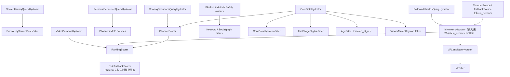

# 08. 组件索引

本篇是“查手册式”索引，按组件列出：

- 文件位置
- enable 条件
- 读取字段
- 写回字段
- 外部依赖
- 下游依赖

> **索引范围**：§1-§10 索引内层 `PhoenixCandidatePipeline` 装配的组件；ForYou 外层 pipeline（`for_you_candidate_pipeline.rs`）的装配见 §11；存在于代码中但未装配进任何 pipeline 的骨架组件见 §12。引用 / 转推 / 订阅三类产品不存在的专用组件（`QuoteHydrator`、`SubscriptionHydrator`、`SubscribedUserIdsQueryHydrator`、`RetweetDeduplicationFilter`、`IneligibleSubscriptionFilter`、`AncillaryVFFilter`）已按 U5 规则物理删除，对应候选字段保留为空、共享过滤器里的相关分支保持无操作。

## 1. Query Hydrators

| 组件 | 文件 | enable | 读取 | 写回 | 外部依赖 | 下游依赖 |
| --- | --- | --- | --- | --- | --- | --- |
| `ServedHistoryQueryHydrator` | `query_hydrators/served_history_query_hydrator.rs` | `ScoredPostsServer::with_state` 通过 `install_feed_state_store` 插到列表首位 | `user_id` `served_ids` | `served_ids`（请求值 + 已下发历史去重合并） | 异步 `FeedStateStore`；与时间戳组件共用请求快照 | `PreviouslyServedPostsFilter` |
| `PastRequestTimestampsQueryHydrator` | `query_hydrators/past_request_timestamps_query_hydrator.rs` | 同上，第二位 | `user_id` | `past_request_timestamps_ms` | `FeedStateStore` | 请求节奏语义（当前无过滤消费） |
| `ScoringSequenceQueryHydrator` | `query_hydrators/scoring_sequence_query_hydrator.rs` | 默认启用 | `user_id` `request_id` | `user_action_sequence` `scoring_sequence` | 共享 `UserActionSequenceOps` provider | `PhoenixScorer` |
| `RetrievalSequenceQueryHydrator` | `query_hydrators/retrieval_sequence_query_hydrator.rs` | 默认启用 | `user_id` `request_id` | `retrieval_sequence` | 同一共享 provider | `PhoenixSource` / MoE |
| `BlockedUserIdsQueryHydrator` | `query_hydrators/blocked_user_ids_query_hydrator.rs` | 默认启用 | `user_id` | `blocked_user_ids` | 共享 `StratoClient` provider | `AuthorSocialgraphFilter` |
| `MutedUserIdsQueryHydrator` | `query_hydrators/muted_user_ids_query_hydrator.rs` | 默认启用 | `user_id` | `muted_user_ids` | 同一共享 provider | `AuthorSocialgraphFilter` |
| `FollowedUserIdsQueryHydrator` | `query_hydrators/followed_user_ids_query_hydrator.rs` | 默认启用 | `user_id` | `followed_user_ids` | 同一共享 provider | `InNetworkCandidateHydrator`（仅对来源未标 `in_network` 的候选推断）；demo `ThunderClient` 请求的 following 列表。非 demo 的 mrpyq 无关注图契约，该字段为空 |
| `UserSafetyFeaturesQueryHydrator` | `query_hydrators/user_safety_features_query_hydrator.rs` | 默认启用 (`U2`) | `user_id` | `muted_keywords` `blocked_by_user_ids` | 同一共享 provider | `ViewerMutedKeywordFilter` / `AuthorSocialgraphFilter` |
| `UserTopicsQueryHydrator` | `query_hydrators/user_topics_query_hydrator.rs` | 显式注入 `topic_clients` 或 Demo 时启用 | `user_id` | `supplemental_topic_ids` | `UserTopicReader` | `PhoenixTopicsSource` |

Query hydrator 失败只记 request-scoped error 日志、不中断请求：UAS 失败或该用户没有投影数据让两个 sequence 保持 `None`，Strato 失败让 `user_features` 保持全空默认值。

## 2. Sources

| 组件 | 文件 | enable | 读取 | 产出字段 | 外部依赖 | 说明 |
| --- | --- | --- | --- | --- | --- | --- |
| `ThunderSource` | `sources/thunder_source.rs` | 有 `InNetworkPostsClient` 时装配；`has_cached_posts` 时跳过 | `user_id` | `tweet_id` `created_at_ms`（demo Thunder 带，mrpyq 不带）`in_reply_to_tweet_id` `retweeted_*` `ancestors` `served_type` `in_network=Some(true)` | `InNetworkPostsClient`：非 demo `MrpyqInNetworkPostsClient`（mrpyq NETWORK 收件箱），demo `ThunderClient` | 上游顺序第一；mrpyq 候选只带 `feed_id`，作者由 TES 补回；`in_network_only` 时 `served_type=RankedFollowing` |
| `PhoenixSource` | `sources/phoenix_source.rs` | 非网内限定、非 strict/cold-start topic、无 cached posts | `user_id`、`retrieval_sequence`（缺时回退 `user_action_sequence`） | `tweet_id` `author_id` `in_reply_to_tweet_id` `served_type` | `PhoenixRetrievalClient` | 两个序列都缺失时直接失败；只有请求显式 `in_network_only=true` 才因网络范围关闭 |
| `FallbackSource` | `sources/fallback_source.rs` | 有兜底客户端时装配（非 demo = mrpyq，demo = `DemoFallbackPostsClient`）；非网内限定且无 cached posts 时启用 | `user_id` | `tweet_id` `served_type=ForYouPhoenixRetrieval` `in_network=Some(false)` | `InNetworkPostsClient::get_fallback_posts`（mrpyq FALLBACK 池，最多 200 条） | U2 新增；`served_type` 复用网外召回枚举，响应中无法与 Phoenix 召回区分 |
| `PhoenixTopicsSource` | `sources/phoenix_topics_source.rs` | 注入 topic adapter 且有 topic recall | selected topics | `tweet_id` `author_id` `served_type` | `TopicRetrievalClient` | 可选话题候选召回 |
| `PhoenixMoeSource` | `sources/phoenix_moe_source.rs` | typed switch + endpoint + 请求允许 | `user_id`、`retrieval_sequence` | `tweet_id` `author_id` `served_type` | `PhoenixRetrievalClient` (MoE) | 默认关闭 |
| `CachedPostsSource` | `sources/cached_posts_source.rs` | QueryBuilder 已接受显式 Demo unsigned fixture | 本地请求缓存 | `tweet_id` `author_id` 等 | 无 | 默认请求拒绝未签名缓存；启用时其他主要来源关闭 |

## 3. Candidate Hydrators

| 组件 | 文件 | enable | 读取 | 写回 | 外部依赖 | 下游依赖 |
| --- | --- | --- | --- | --- | --- | --- |
| `InNetworkCandidateHydrator` | `candidate_hydrators/in_network_candidate_hydrator.rs` | 默认启用 | `query.user_id` `followed_user_ids` `candidate.author_id` `candidate.in_network` | `in_network`（来源已标 `Some(..)` 时原样保留，只对未标的候选按关注列表 / 本人推断） | 无 | `RankingScorer`、`VFCandidateHydrator`、`RuleFallbackScorer` |
| `CoreDataCandidateHydrator` | `candidate_hydrators/core_data_candidate_hydrator.rs` | 请求不带 `cached_posts` 时启用 | `candidate.tweet_id` | `author_id`（来源留空时补回）`retweeted_user_id` `retweeted_tweet_id` `in_reply_to_tweet_id` `tweet_text` `created_at_ms` `recommendation_eligible` `favorite_count` `view_count` 等互动计数；共享 batch 里算出的 `quoted_*` 不写回（U5） | `TESClient.get_tweet_core_datas` via shared provider | `CoreDataHydrationFilter`、`FirstStageEligibleFilter`、`AgeFilter`、`ViewerMutedKeywordFilter`、`PhoenixScorer`、`RuleFallbackScorer`、冷启动探索 |
| `HasMediaHydrator` | `candidate_hydrators/has_media_hydrator.rs` | 请求不带 `cached_posts` 时启用 | shared media batch | `has_media` | `TESClient.get_tweet_media_entities` via shared provider | 展示信号，当前无过滤消费 |
| `VideoDurationCandidateHydrator` | `candidate_hydrators/video_duration_candidate_hydrator.rs` | 请求不带 `cached_posts` 时启用 | `candidate.tweet_id` | `video_duration_ms` | shared `TESClient` media batch | `VideoFilter`、`RankingScorer` |
| `GizmoduckCandidateHydrator` | `candidate_hydrators/gizmoduck_hydrator.rs` | post-selection 默认启用；demo Cold Start 显式开启时另在 pre-selection 补粉丝数 | `author_id` `retweeted_user_id` | `author_followers_count` `author_screen_name` `retweeted_screen_name` | `GizmoduckClient`（去重批量读取；非 demo 为 Disabled，全部 `None`） | Cold Start 资格；响应映射；能读取 pre-selection CoreData 已补出的 retweet author |
| `FilteredTopicsHydrator` | `candidate_hydrators/filtered_topics_hydrator.rs` | 不带 `cached_posts` 且（topic recall / excluded topics） | shared core batch | `filtered_topic_ids` `unfiltered_topic_ids` | shared `TESClient` core batch | `TopicIdsFilter` / `NewUserTopicIdsFilter` |
| `LanguageCodeHydrator` | `candidate_hydrators/language_code_hydrator.rs` | 请求不带 `cached_posts` 时启用 | shared core batch | `language_code` | shared `TESClient` core batch | language / response consumers |
| `VFCandidateHydrator` | `candidate_hydrators/vf_candidate_hydrator.rs` | post-selection 阶段默认启用 | `get_viewer()`（`user_id` `client_app_id` `country_code` `language_code`）`candidate.in_network` `tweet_id` | `visibility_decision` `visibility_action` `drop_ancillary_posts` | `VisibilityFilteringClient`（500 ms；非 demo 为 mrpyq 一级 eligibility） | `VFFilter`；`drop_ancillary_posts` 已无消费者（`AncillaryVFFilter` 随 U5 删除） |

## 4. Filters

### 4.1 Pre-selection Filters

| 组件 | 文件 | enable | 读取 | 移除条件 |
| --- | --- | --- | --- | --- |
| `DropDuplicatesFilter` | `filters/drop_duplicates_filter.rs` | 默认启用 | `tweet_id` | 同一 `tweet_id` 重复出现 |
| `CoreDataHydrationFilter` | `filters/core_data_hydration_filter.rs` | 默认启用 | `author_id` `tweet_text` | 作者为 NIL 或文本 trim 后为空（纯图片 / 视频且无正文的帖子也会被丢） |
| `FirstStageEligibleFilter` | `filters/first_stage_eligible_filter.rs` | 默认启用（U2 新增） | `recommendation_eligible` | 只丢 `Some(false)`；`None` 保留（fail-open），以便 Demo TES 不设该字段时仍出结果 |
| `AgeFilter` | `filters/age_filter.rs` | 默认启用 | `created_at_ms`（缺失时回退 `tweet_id` 的 ObjectId 时间戳） | 帖龄大于 `MAX_POST_AGE`（48 h）；两者都缺时丢弃 |
| `SelfTweetFilter` | `filters/self_tweet_filter.rs` | 默认启用 | `query.user_id` `author_id` | 作者就是 viewer |
| `PreviouslySeenPostsFilter` | `filters/previously_seen_posts_filter.rs` | 默认启用 | `seen_ids` `bloom_filter_entries` `related_post_ids` | 见过任一相关帖子 |
| `PreviouslySeenPostsBackupFilter` | `filters/previously_seen_posts_backup_filter.rs` | `seen_ids` 为空且带了 `impressed_post_ids` | `impressed_post_ids` | 主 seen 列表缺失时，用曝光 ID 做备份去重 |
| `PreviouslyServedPostsFilter` | `filters/previously_served_posts_filter.rs` | `query.is_bottom_request` | `served_ids` `related_post_ids` | 下翻请求里命中已下发帖子 |
| `ViewerMutedKeywordFilter` | `filters/viewer_muted_keyword_filter.rs` | 默认启用 | `tweet_text` `quoted_tweet_text` + `user_features.muted_keywords` | 主文或引用文命中 viewer 屏蔽关键词 |
| `AuthorSocialgraphFilter` | `filters/author_socialgraph_filter.rs` | 默认启用 | `author_id` `blocked_user_ids` `blocked_by_user_ids` `muted_user_ids`；候选级反向屏蔽字段未装配时中立 | 作者、转推原作者或引用作者在拉黑、被拉黑或静音列表 |
| `VideoFilter` | `filters/video_filter.rs` | `query.exclude_videos` | `video_duration_ms` | 请求不要视频时，丢掉带时长的候选 |
| `TopicIdsFilter` | `filters/topic_ids_filter.rs` | strict topic 或 excluded topics | topic fields | strict topic 不匹配或命中排除项 |
| `NewUserTopicIdsFilter` | `filters/new_user_topic_ids_filter.rs` | cold-start topics | `new_user_topic_ids` `filtered_topic_ids` `in_network` | 网外且不匹配 cold-start topic |

### 4.2 Post-selection Filters

| 组件 | 文件 | enable | 读取 | 移除条件 |
| --- | --- | --- | --- | --- |
| `VFFilter` | `filters/vf_filter.rs` | 默认启用 | `visibility_action` `visibility_decision` | 显式 `Action::Drop` 或 Restricted Drop/generic 始终删除；Unchecked/Unavailable（含响应缺帖）按 `HOME_MIXER_VF_FAILURE_POLICY`：默认 `fail_closed` 全删除，`in_network_only` 仅保留 `in_network == Some(true)`，`allow_all` 全保留 |
| `DedupConversationFilter` | `filters/dedup_conversation_filter.rs` | 默认启用 | `ancestors` `tweet_id` `score` | 同一会话树保留最高分 |

## 5. Scorers

| 组件 | 文件 | enable | 读取 | 写回 | 外部依赖 | 说明 |
| --- | --- | --- | --- | --- | --- | --- |
| `PhoenixScorer` | `scorers/phoenix_scorer.rs` | 默认启用 | `scoring_sequence`（缺时回退 `user_action_sequence`）、候选 tweet/author 关系 | `phoenix_scores` `prediction_request_id` `last_scored_at_ms` `degraded_reason` | `PhoenixPredictionClient`（5 s） | 无序列时整批标 `phoenix_missing_sequence`，超时 / 失败 / 契约校验不通过时整批标 `phoenix_unavailable`，交给 `RuleFallbackScorer`；`TweetInfo.safety_label_mask` 恒为 0 |
| `RankingScorer` | `scorers/ranking_scorer.rs` | 默认启用 | `phoenix_scores` `video_duration_ms` `author_id` `in_network` | `weighted_score` `score` | 无 | 对齐上游 47c1bcd：权重混合、作者多样性、OON 降权在同一 Scorer 内按序完成（旧 weighted/author_diversity/oon 三个文件已随上游删除）；retweet / quote / quoted_* 权重按 U5 置 0 |
| `RuleFallbackScorer` | `scorers/rule_fallback_scorer.rs` | 默认启用（U2 新增，装配在 `RankingScorer` 之后） | `degraded_reason` `phoenix_scores` `created_at_ms` `in_network` `favorite_count` `reply_count` `author_id` | `score` `degraded_reason=phoenix_unavailable`；清空 `phoenix_scores` `weighted_score` `prediction_request_id` | 无 | 批内全部候选都有可用 Phoenix 头时无操作；否则用“新鲜度 + 网内 + 互动数 × 作者多样性衰减”的规则分覆盖整批 |
| `VMRanker` | `scorers/vm_ranker.rs` | 仅 demo：`HOME_MIXER_ENABLE_VM_RANKER=1` 且提供 `VM_RANKER_GRPC_ADDR`（需 `legacy-int-ids` feature） | `phoenix_scores` `score` `author_followers_count` `video_duration_ms` | `score` | `GrpcVMRankerClient`（500 ms） | 默认关闭；整数 proto 无法承载真实 ObjectId，非 demo 强制禁用；调用失败时按候选数返回错误交流水线隔离，不伪造分数 |
| `AuthorColdStartScorer` | `scorers/author_cold_start.rs` | demo 且 `HOME_MIXER_ENABLE_AUTHOR_COLD_START` | `view_count` `author_followers_count` | `score` | 无 | 默认关闭；缺曝光或粉丝数的候选不参与 |

## 6. Selector

| 组件 | 文件 | 读取 | 输出规模 | 说明 |
| --- | --- | --- | --- | --- |
| `TopKScoreSelector` | `selectors/top_k_score_selector.rs` | `score` | `TOP_K_CANDIDATES_TO_SELECT` | 分数缺失时视为负无穷 |

## 7. Side Effects

| 组件 | 文件 | enable | 输入 | 外部依赖 | 说明 |
| --- | --- | --- | --- | --- | --- |
| `PhoenixRequestCacheSideEffect` | `side_effects/phoenix_request_cache_side_effect.rs` | `HOME_MIXER_ENABLE_REQUEST_CACHE_SIDE_EFFECT=true` 且请求允许 | `user_id` + 最终候选 tweet ids | `StratoClient.store_request_info` | 默认关闭；fire-and-forget，不阻塞响应 |
| `ResponseDiversityStatsSideEffect` | `side_effects/response_diversity_stats_side_effect.rs` | 默认装配，非空结果按 5% 采样 | selected candidates 的 `author_id`、`served_type`、`in_network`、`score` | 本地候选多样性 sink，默认日志 adapter | 记录内层 final/top10；不读 weighted_score，不改排序，不记录 SID/实验桶/pre_heuristic |
| `ServedCandidatesKafkaSideEffect`（SE-11） | `side_effects/served_candidates_kafka_side_effect.rs` | 配置了 `SERVED_EVENTS_KAFKA_BROKERS`/`SERVED_EVENTS_KAFKA_TOPIC` 或 `SERVED_EVENTS_JSONL_PATH` 时装配；装配后每个非空响应都发布（含影子流量） | `request_id`、`viewer_id`、`request_time_ms`、最终列表的 `position` / `post_id` / `author_id` / `served_type` / `score` / `degraded_reason` | `ServedCandidatesSink`（`clients/served_candidates_sink.rs`：JSON Lines 文件或 Kafka，Kafka 需 `--features kafka`） | 服务端曝光日志，训练归因的原始事件源；事件合同见 `docs/implementation/served-candidates-event-contract.md`；fire-and-forget，失败只记日志 |

## 8. 支撑性工具模块

| 模块 | 文件 | 作用 |
| --- | --- | --- |
| `runtime_config` | `runtime_config.rs` | 解析 Demo/Degraded/ProductionReady 意图并校验启动不变量；`FeedStateConfig` 与 `UasConfig` 在这里一次解析并注入装配 |
| `uas_fetcher` | `clients/uas_fetcher.rs` | `UserActionSequenceOps` 端口及其实现：非 demo `RedisUserActionSequenceStore`（ZSET `home_mixer:uas:{user_id}:actions`，读窗口内最新 N 条、坏成员逐条跳过）、demo `DemoUserActionSequenceFetcher`、显式无 Redis 时的 `DisabledUserActionSequenceFetcher`；同时提供投影 job 的写端口 `UserActionEventSink` 与事件边界类型 `UserActionEvent` / `ValidatedUserAction` |
| `uas-worker` | `bin/uas_worker.rs` | 独立投影 job：消费 Kafka（`--features kafka`）或 stdin 的 JSON 行为事件，校验一次后幂等写入 Redis；写失败按退避重试，预算耗尽才退出并保留 offset |
| `query_builder` | `query_builder.rs` | 校验公共 proto、原样映射网络范围、生成请求身份并以具名字段构造 domain query |
| `rpc_policy` | `rpc_policy.rs` | RPC 入口的总预算（`HOME_MIXER_REQUEST_TIMEOUT_MS` 与客户端 `grpc-timeout` 取更短）与终态指标记录；`within_budget` 超时整体取消并返回 `DeadlineExceeded` |
| `metrics` | `metrics.rs` | 进程级 Prometheus registry：`home_mixer_rpc_requests_total{rpc,code}`、`home_mixer_rpc_duration_seconds{rpc}`、`home_mixer_rpc_in_flight{rpc}`、`home_mixer_ready`、`home_mixer_build_info`；handler 被取消时记 `CANCELLED` |
| `admin_server` | `admin_server.rs` | 管理 HTTP：`/healthz`、`/readyz`（`starting` / `ready` / `draining`）、`/metrics`；`Readiness` 状态只能前进，进入 draining 后不再变回 ready |
| `shutdown` | `shutdown.rs` | SIGTERM / Ctrl-C 信号 future，server 与 `uas-worker` 共用 |
| `logging` | `logging.rs` | `RUST_LOG` 过滤 + `HOME_MIXER_LOG_FORMAT`（`text` / `json`）的日志初始化，两个二进制共用 |
| `debug_access` | `debug_access.rs` | 默认关闭的 Debug RPC token 授权策略 |
| `request_util` | `util/request_util.rs` | 为 `QueryBuilder` 生成请求/预测 ID 和 request time |
| `ids` | `models/ids.rs` | `ObjectId([u8; 12])` 与别名 `PostId` / `UserId`：24-hex 解析与输出、`timestamp_secs()`（AgeFilter 回退）、`to_u64_hash()`（xrex / 分桶派生，与 `phoenix/services/model_contract.py` 共享黄金向量） |
| `feed_state` | `feed_state.rs` / `clients/redis_feed_state_store.rs` | 有界已下发历史 / 请求时间戳；业务模式 Redis，Demo 默认内存 |
| `bloom_filter` | `util/bloom_filter.rs` | 支持已看过内容去重（对 12 字节 ObjectId 做 murmur） |
| `candidates_util` | `util/candidates_util.rs` | 生成 related post ids |
| `composition` | `util/composition.rs` | 按键分组统计总数、唯一数、最大占比、HHI 和归一化熵；由候选多样性统计消费 |
| `post_text` | `post_text/mod.rs` | 屏蔽关键词分词与匹配 |
| `visibility/models` | `visibility/models.rs` | 安全过滤原因和动作模型 |

## 9. 一张依赖关系总图

## 10. 当前索引最值得记住的两个事实

### 10.1 `CoreDataCandidateHydrator` 是关键枢纽

很多后续逻辑都隐含依赖它补出来的字段，尤其是：

- `tweet_text`
- `retweeted_tweet_id`
- `retweeted_user_id`
- `in_reply_to_tweet_id`

### 10.2 `InNetworkCandidateHydrator` 决定的不只是标签

`in_network` 不仅影响返回字段，还会直接影响：

- `RankingScorer` 内部 OON 阶段的降权
- `RuleFallbackScorer` 的规则分（网内 +2.0）
- `VFCandidateHydrator` 的 `SafetyLevel` 选择
- `VFFilter` 在 `HOME_MIXER_VF_FAILURE_POLICY=in_network_only` 下的保留判断

所以它其实是排序和安全策略的共同分叉点。`ThunderSource` 与 `FallbackSource` 在来源处就把它标定为 `Some(true)` / `Some(false)`，`InNetworkCandidateHydrator` 只对其他来源推断。

## 11. ForYou 外层 pipeline 组件

`for_you_candidate_pipeline.rs` 在内层 `PhoenixCandidatePipeline` 之外装配了 ForYou 外层链路（query 类型同为 `ScoredPostsQuery`，候选类型为 `FeedItem`）：

| 组件 | 文件 | 说明 |
| --- | --- | --- |
| `ServedHistoryQueryHydrator` | `query_hydrators/served_history_query_hydrator.rs` | 外层 query 补全：已服务历史 |
| `PastRequestTimestampsQueryHydrator` | `query_hydrators/past_request_timestamps_query_hydrator.rs` | 外层 query 补全：历史请求时间戳 |
| `ScoredPostsSource` | `sources/scored_posts_source.rs` | 把内层 pipeline 结果作为外层候选来源 |
| `AdsSource` | `sources/ads_source.rs` | 广告来源（当前 `disabled`） |
| `WhoToFollowSource` | `sources/who_to_follow_source.rs` | 推荐关注来源 |
| `PromptsSource` | `sources/prompts_source.rs` | 提示卡片来源 |
| `PushToHomeSource` | `sources/push_to_home_source.rs` | push 转 home 来源 |
| `BlenderSelector` | `selectors/blender_selector.rs` | 外层混合选择（`BlenderConfig.max_items` 为外层 result_size） |
| `ResponseStatsSideEffect` | `side_effects/response_stats_side_effect.rs` | 外层响应统计（`FeedStatsSink`） |

## 12. 未装配的骨架组件

以下组件存在于代码中，但当前未装配进任何 pipeline（预留扩展点）：

| 组件 | 文件 |
| --- | --- |
| `ImpressedPostsQueryHydrator` | `query_hydrators/impressed_posts_query_hydrator.rs` |
| `ImpressionBloomFilterQueryHydrator` | `query_hydrators/impression_bloom_filter_query_hydrator.rs` |
| `TweetMixerSource` | `sources/tweet_mixer_source.rs` |
| `BlockedByHydrator` | `candidate_hydrators/blocked_by_hydrator.rs`（候选作者、转推原作者、引用作者反向屏蔽；真实 Adapter 未接入） |
| `PublishSeenIdsToKafkaSideEffect` | `side_effects/publish_seen_ids_to_kafka_side_effect.rs` |
