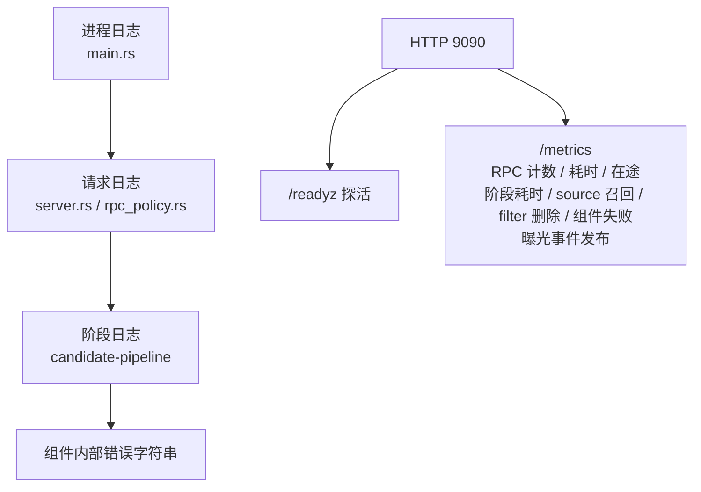
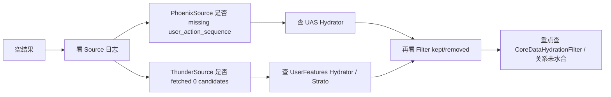

# 09. 排障与可观测性

本篇聚焦一个问题：`home-mixer` 出现空结果、结果过少、排序异常时，现有代码里能看什么、应该怎么查。

## 1. 当前真正存在的观测手段

### 1.1 日志

这是当前最主要的观测来源。

日志主要来自三层：

- `home-mixer/main.rs`：进程级启动日志
- `home-mixer/server.rs`：请求入口/出口日志
- `candidate-pipeline/candidate_pipeline.rs`：阶段级日志

### 1.2 指标与探活

管理 HTTP 端口（默认 9090，`admin_server.rs`）提供三条路由：

- `GET /healthz`：进程活着就 200
- `GET /readyz`：只有能接推荐流量时 200 `ready`；装配中 503 `starting`，收到终止信号后 503 `draining`
- `GET /metrics`：Prometheus 文本，registry 在 `metrics.rs`

指标分四层，字段说明见 [07 配置 §4.3](./07-config-and-params.md#43-指标)：

- RPC 入口：`home_mixer_rpc_requests_total{rpc,code}`、`home_mixer_rpc_duration_seconds{rpc}`、`home_mixer_rpc_in_flight{rpc}`，回答“请求有没有进来、多久、以什么状态结束”，包括超预算的 `DEADLINE_EXCEEDED` 和客户端先断开的 `CANCELLED`。
- 上游调用：`home_mixer_client_calls_total{client,method,result}`、`home_mixer_client_call_duration_seconds{client,method}`，按依赖拆分：mrpyq（`ListRecommendationCandidates` / `BatchGetRecommendationContents` / `GetViewerRelations`）、Phoenix（`PredictNextActions` / `Retrieve`）、Redis（feed-state `load` / `record`、UAS `read` / `write`）；`result` 区分 `ok` / `error`（传输/超时）与 `rejected`（调用成功但响应未过契约校验），慢依赖归因不用再对阶段耗时与日志。uas-worker 的 registry 也注册了这一层（`redis_uas` 系列）。
- 流水线阶段：`home_mixer_stage_duration_seconds{pipeline,stage}`、`home_mixer_stage_candidates`、`home_mixer_source_candidates_total{source}`、`home_mixer_filter_removed_total{filter}`、`home_mixer_component_failures_total{stage,component}`、`home_mixer_component_failed_candidates_total`、`home_mixer_pipeline_underfilled_total`、`home_mixer_side_effect_runs_total{component,result}`。数据来源与那一行 `Summary:` 日志相同（`candidate-pipeline` 的 `PipelineObserver`），所以"慢在哪个阶段、哪个 filter 删得最多、哪个依赖在失败"不用翻日志就能看到。
- 曝光事件：`home_mixer_served_events_total{result}`、`home_mixer_served_event_candidates_total`、`home_mixer_served_event_publish_duration_seconds`，与成功响应数对账即曝光丢失率。

仍然只有日志的是：单个组件内部的分支（比如 `PhoenixScorer` 是因为没序列还是网关拒绝而回退，只在 `degraded_reason` 和日志里）、每个具体 filter 的输入规模。

## 2. 关键日志点

### 2.1 进程启动与关停日志

启动时至少会看到：

- 启动参数（端口、shutdown delay、drain timeout）
- `HTTP server listening on ... (/healthz, /readyz, /metrics)`
- `gRPC server listening on ...`
- `Server ready`

关停时：

- `shutdown signal received; /readyz now reports draining`
- 排空超过 `--drain-timeout-secs` 时的 `in-flight requests did not finish within ...; exiting anyway`
- `side effects drained: N pending at shutdown, X ms`，或 `side effects did not drain within ...: N still running`
- 配置了 Kafka 曝光 sink 时的 `served-candidates Kafka producer flushed (...)`
- `Server stopped`

`HOME_MIXER_LOG_FORMAT=json` 时每行是一个 JSON 对象，`msg` 字段保持与文本模式相同的内容，下面 grep 清单里的关键词仍可直接用。

### 2.2 请求入口/出口日志

`server.rs` 记录入口：

- `Scored Posts request - request_id ...`

`scored_posts_server.rs` 记录出口：

- `Scored Posts response - request_id ... - N posts (X ms)`

`rpc_policy.rs` 记录超预算：

- `request_id=... deadline_exceeded budget_ms=...`（warn；此时客户端拿到 `DeadlineExceeded`，没有出口日志）

这几条日志回答的是：

- 请求有没有真的进入服务
- 最终返回了几条，还是被预算截断
- 整体耗时多少

### 2.3 阶段级日志

`candidate-pipeline` 框架里最重要的日志模式是：

```text
request_id=... stage=Source component=... output=N elapsed_ms=...
request_id=... stage=... component=... failed: ... elapsed_ms=...
Hydrator length_mismatch expected=N got=M   # warn 级，无 request_id 前缀，该组件整份转 Err
request_id=... stage=Filter component=... input=K kept=N removed=M elapsed_ms=...
```

这几类日志分别对应：

- Source 成功拿到多少候选
- 某个组件失败
- Hydrator / Scorer 返回长度不对
- Filter 阶段整体保留/移除规模

## 3. 一张排障观察面图



## 4. 先看什么：一个最小排障顺序

### 4.1 第一步：看请求有没有进来

查：

- 是否有 `Scored Posts request - request_id ...`

如果没有：

- 问题在网络、端口、客户端或 gRPC 层

### 4.2 第二步：看最终返回了多少条

查：

- `Scored Posts response - request_id ... - N posts`

如果 `N = 0` 或远小于预期，继续往下看阶段日志。

### 4.3 第三步：看 Source 阶段

重点看：

- `stage=Source component=PhoenixSource`
- `stage=Source component=ThunderSource`

要回答两个问题：

1. 有没有 source 直接失败
2. 成功的 source 各拿到了多少候选

### 4.4 第四步：看 Filter 阶段规模变化

Filter 阶段会有总的：

- `kept=N removed=M`

如果 source 有候选但 filter 后接近清空，问题就在补全或过滤链。

### 4.5 第五步：看 post-selection 是否缩水

即使前面都正常，最终条数还是可能不足，因为：

- selector 先取 50
- post-selection 再删
- 不回补

## 5. 常见问题的具体排法

### 5.1 症状：结果为空

优先怀疑顺序：

1. `PhoenixSource` 因缺少 `user_action_sequence` 失败，或请求显式 `in_network_only=true` 导致 `PhoenixSource` 与 `FallbackSource` 被关闭；QueryBuilder 不依赖 Gizmoduck viewer RPC
2. `ThunderSource` 拿不到内容：demo 是 `followed_user_ids` 为空；非 demo 看 `mrpyq adapter recall ...` 日志里的 `ready=false`、`posts=0` 或召回预算耗尽
3. `CoreDataHydrationFilter` 把候选清空（mrpyq 内容缺失、`creator_member_id` 为空，或无正文且未确认有媒体）
4. `AuthorSocialgraphFilter` / `ViewerMutedKeywordFilter` 因 `viewer_relations_hydrated=false` 整批丢弃（关系 RPC 未实现或失败）
5. `VFFilter` 在默认 `fail_closed` 下删掉所有 `Unavailable` 候选（日志 `visibility unavailable for N candidates`）

推荐检查链路：



### 5.2 症状：只有网内内容，没有网外内容

重点看：

- 请求里是否 `in_network_only = true`
- `PhoenixSource` 是否失败
- `ScoringSequenceQueryHydrator` / `RetrievalSequenceQueryHydrator` 是否成功写入各自序列
- 是否设置 `PHOENIX_RETRIEVAL_GRPC_ADDR`，日志中是否出现 retrieval unavailable

### 5.3 症状：有候选，但得分很奇怪

重点看：

- `PhoenixPredictionClient` 是否返回空分布
- `RankingScorer` 内部 Weighted 阶段是否只在使用默认 `0.0`
- `RankingScorer` 内部 OON 阶段是否对网外应用预期系数
- 负分 offset 公式是否符合你的预期

### 5.4 症状：条数常常不足 50

重点看：

- selector 之前候选是否足够
- `VFFilter` 是否删了很多
- `DedupConversationFilter` 是否删了很多

这里要记住：

- 当前实现不会从第 51 名以后回补

## 6. 当前观测盲点

这几个点在代码里几乎没有统一观测。

| 盲点 | 现状 | 影响 |
| --- | --- | --- |
| selector 前后规模变化 | 只有 `stage=Selector` 一行日志，无指标 | 很难判断 TopK 阶段缩水多少 |
| side effect 失败 | 有 `home_mixer_side_effect_runs_total{component,result}`；任务在关停时会被等待（`drain_timeout` 剩余预算），Kafka sink 会 flush | 超出排空预算的任务仍会丢，`side effects did not drain` 日志可见 |
| 每个具体 filter 的输入规模 | 移除量有 `home_mixer_filter_removed_total{filter}`，输入量只有 debug 日志 | 能看出哪个 filter 删得多，看不出它的删除率 |
| post-selection 过滤比例 | `filter_removed_total{filter="VFFilter"}` / `{filter="DedupConversationFilter"}` 与 `pipeline_underfilled_total` 可以对着看 | 缩水归因已可做；回补仍未实现 |
| 组件内部分支 | `PhoenixScorer` 回退原因只在 `degraded_reason` 和日志 | 指标能看到 Phoenix 失败，看不到失败原因分布 |

## 7. 一份实用 grep 清单

如果你直接在仓库日志里排，可以先 grep 这些关键词：

```bash
request_id=
deadline_exceeded
stage=Source
stage=Hydrator
stage=Filter
stage=PostSelectionFilter
stage=Scorer
failed:
kept
removed
Scored Posts request
Scored Posts response
```

## 8. 现阶段最值得补的观测

如果后续要增强这套系统，我建议优先加：

1. 每个 filter 的输入规模（配合已有的 `filter_removed_total` 得到删除率）
2. selector 前后的候选规模和分数分布
3. `PhoenixScorer` 回退原因（`phoenix_missing_sequence` / `phoenix_unavailable`）按原因计数
4. mrpyq / Redis / Phoenix 按 RPC 方法拆的调用级指标（目前用阶段耗时与组件失败数代替）

## 9. 一个务实结论

当前 `home-mixer` 不是“完全不可观测”，而是：

- 有一条还算不错的 request_id + stage 日志主线
- 有 RPC 入口级的计数、耗时、在途指标和 readiness 探活
- 有与日志同源的阶段级指标：慢在哪个阶段、哪个 source 召回了多少、哪个 filter 删了多少、哪个组件在失败、曝光事件发出去多少
- 缺的是组件内部的分支归因和 selector 前后的分数分布

所以排障的前两步（"慢了 / 挂了 / 被截断了"、"慢在哪一段、谁在失败"）都能从指标看出来；只有"这个组件为什么失败"还要回到 request_id 日志。
