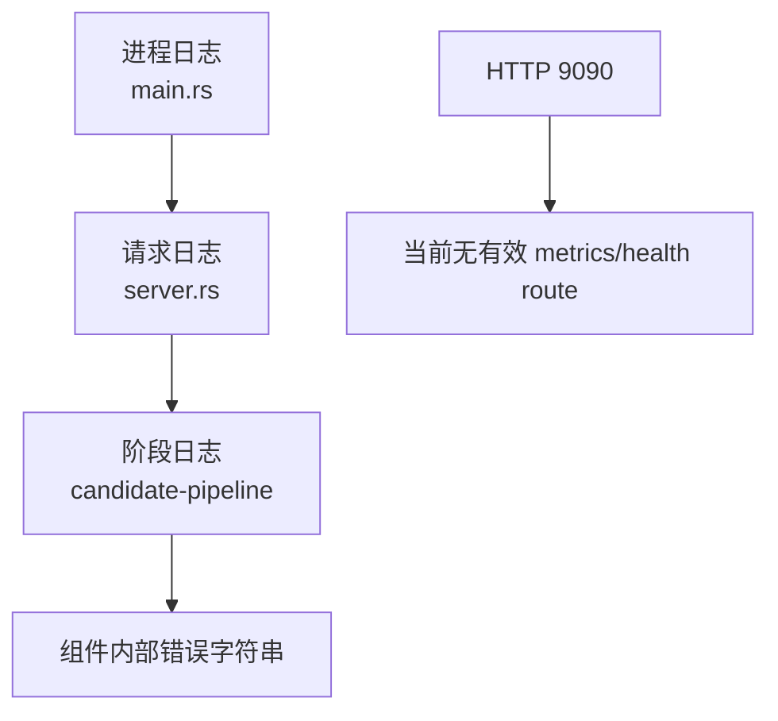
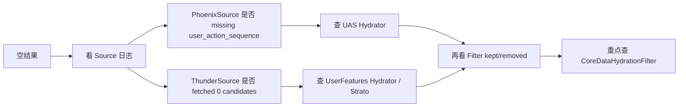

# 09. 排障与可观测性

本篇聚焦一个问题：`home-mixer` 出现空结果、结果过少、排序异常时，现有代码里能看什么、应该怎么查。

## 1. 当前真正存在的观测手段

### 1.1 日志

这是当前最主要的观测来源。

日志主要来自三层：

- `home-mixer/main.rs`：进程级启动日志
- `home-mixer/server.rs`：请求入口/出口日志
- `candidate-pipeline/candidate_pipeline.rs`：阶段级日志

### 1.2 指标

当前 `home-mixer` 本身没有像 `thunder/metrics.rs` 那样成体系的 metrics 定义。

现实情况是：

- HTTP 端口会启动
- 但 router 为空
- 没有明确暴露 Prometheus 指标

所以现阶段排障基本还是依赖日志。

## 2. 关键日志点

### 2.1 进程启动日志

启动时至少会看到：

- 启动参数
- gRPC 监听地址
- HTTP 监听地址
- `Server ready`
- 收到 `ctrl_c` 后的关闭日志

### 2.2 请求入口/出口日志

`server.rs` 会记录：

- `Scored Posts request - request_id ...`
- `Scored Posts response - request_id ... - N posts (X ms)`

这两条日志回答的是：

- 请求有没有真的进入服务
- 最终返回了几条
- 整体耗时多少

### 2.3 阶段级日志

`candidate-pipeline` 框架里最重要的日志模式是：

```text
request_id=... stage=... component=... fetched N candidates
request_id=... stage=... component=... failed: ...
request_id=... stage=... component=... skipped: length_mismatch ...
request_id=... stage=... kept N, removed M
```

这几类日志分别对应：

- Source 成功拿到多少候选
- 某个组件失败
- Hydrator / Scorer 返回长度不对
- Filter 阶段整体保留/移除规模

## 3. 一张排障观察面图



## 4. 先看什么：一个最小排障顺序

### 4.1 第一步：看请求有没有进来

查：

- 是否有 `Scored Posts request - request_id ...`

如果没有：

- 问题在网络、端口、客户端或 gRPC 层

### 4.2 第二步：看最终返回了多少条

查：

- `Scored Posts response - request_id ... - N posts`

如果 `N = 0` 或远小于预期，继续往下看阶段日志。

### 4.3 第三步：看 Source 阶段

重点看：

- `stage=Source component=PhoenixSource`
- `stage=Source component=ThunderSource`

要回答两个问题：

1. 有没有 source 直接失败
2. 成功的 source 各拿到了多少候选

### 4.4 第四步：看 Filter 阶段规模变化

Filter 阶段会有总的：

- `kept N, removed M`

如果 source 有候选但 filter 后接近清空，问题就在补全或过滤链。

### 4.5 第五步：看 post-selection 是否缩水

即使前面都正常，最终条数还是可能不足，因为：

- selector 先取 100
- post-selection 再删
- 不回补

## 5. 常见问题的具体排法

### 5.1 症状：结果为空

优先怀疑顺序：

1. `PhoenixSource` 因缺少 `user_action_sequence` 失败
2. `ThunderSource` 因 `followed_user_ids` 为空拿不到内容
3. `CoreDataHydrationFilter` 把候选清空

推荐检查链路：



### 5.2 症状：只有网内内容，没有网外内容

重点看：

- 请求里是否 `in_network_only = true`
- `PhoenixSource` 是否失败
- `UserActionSeqQueryHydrator` 是否成功写入序列
- `PhoenixRetrievalClient` 是否仍是 stub

### 5.3 症状：有候选，但得分很奇怪

重点看：

- `PhoenixPredictionClient` 是否返回空分布
- `WeightedScorer` 是否只在用默认 `0.0`
- `OONScorer` 是否让网外统一减半
- 负分 offset 公式是否符合你的预期

### 5.4 症状：条数常常不足 50

重点看：

- selector 之前候选是否足够
- `VFFilter` 是否删了很多
- `DedupConversationFilter` 是否删了很多

这里要记住：

- 当前实现不会从第 101 名以后回补

## 6. 当前观测盲点

这几个点在代码里几乎没有统一观测。

| 盲点 | 现状 | 影响 |
| --- | --- | --- |
| selector 前后规模变化 | 无统一日志/指标 | 很难判断 TopK 阶段缩水多少 |
| side effect 失败 | 结果被丢弃 | 缓存写回失效不明显 |
| 每个具体 filter 的移除量 | 只有阶段总量 | 难判断是哪个 filter 最伤 |
| post-selection 过滤比例 | 无单独指标 | 难判断是 VF 还是会话去重导致缩水 |
| HTTP health/metrics | router 为空 | 监控入口名义存在但功能弱 |

## 7. 一份实用 grep 清单

如果你直接在仓库日志里排，可以先 grep 这些关键词：

```bash
request_id=
stage=Source
stage=Hydrator
stage=Filter
stage=PostSelectionFilter
stage=Scorer
failed:
kept
removed
Scored Posts request
Scored Posts response
```

## 8. 现阶段最值得补的观测

如果后续要增强这套系统，我建议优先加：

1. 每个 filter 的 `input_count / kept_count / removed_count`
2. selector 前后的候选规模和分数分布
3. side effect 成功/失败日志
4. `PhoenixSource`、`ThunderSource` 的独立耗时
5. post-selection 删除率

## 9. 一个务实结论

当前 `home-mixer` 不是“完全不可观测”，而是：

- 有一条还算不错的 request_id + stage 日志主线
- 但缺少服务级指标和细粒度统计

所以排障不是做不到，而是更依赖工程师对 pipeline 结构本身的理解。
