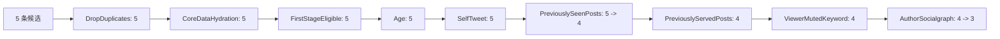
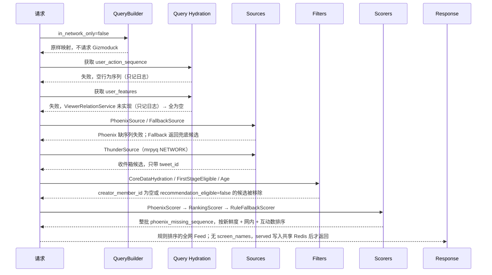

# 10. 端到端示例

本篇用两个示例把 `home-mixer` 串起来：

1. 一个“说明性最小可用示例”，用于理解设计意图
2. 一个“按当前默认 degraded 装配推导的真实退化示例”

## 1. 说明

第一个示例不是当前仓库直接跑出来的真实结果，而是基于代码结构构造的 walkthrough，用来解释：

- 请求字段如何进入 pipeline
- 候选如何被补全、过滤和排序
- 响应字段如何形成

为了可读，示例里的 ID 写成短整数；真实协议里 `viewer_id`、`seen_ids`、`tweet_id` 等全部是 24 位小写 hex ObjectId 字符串（如 `"000000000000000000000001"`），流水线内是 `PostId` / `UserId`。

第二个示例才描述当前默认 degraded 装配（`MRPYQ_RECOMMENDATION_DATA_ADDR` 已配置、其余适配器仍为 Disabled）下更接近真实的运行结果。

## 2. 示例 A：说明性最小可用请求

### 2.1 输入请求

```json
{
  "viewer_id": 1001,
  "client_app_id": 258901,
  "country_code": "CN",
  "language_code": "zh",
  "seen_ids": [90001],
  "served_ids": [80001],
  "in_network_only": false,
  "is_bottom_request": true,
  "bloom_filter_entries": []
}
```

### 2.2 假设的 QueryHydrator 输出

为了说明流程，假设外部依赖返回：

- `user_action_sequence`：存在，长度 120
- `user_features.followed_user_ids = [2001, 2002]`
- `blocked_user_ids = [4004]`
- `muted_user_ids = []`
- `muted_keywords = ["spam"]`

### 2.3 假设的 Source 输出

#### ThunderSource

| tweet_id | author_id | served_type | ancestors |
| --- | --- | --- | --- |
| `70001` | `2001` | InNetwork | `[]` |
| `70002` | `2002` | InNetwork | `[69990]` |

#### PhoenixSource

| tweet_id | author_id | served_type |
| --- | --- | --- |
| `71001` | `3003` | PhoenixRetrieval |
| `71002` | `4004` | PhoenixRetrieval |
| `90001` | `5005` | PhoenixRetrieval |

合并后候选共 5 条。

## 3. 示例 A：候选如何逐步演化

### 3.1 Candidate Hydration 后

假设 TES / Gizmoduck / VF 等依赖返回最小可用数据：

| tweet_id | tweet_text | created_at_ms | recommendation_eligible | in_network | author_screen_name |
| --- | --- | --- | --- | --- | --- |
| `70001` | `今天发布了新功能` | 1 小时前 | `Some(true)` | `true` | `alice` |
| `70002` | `回复一下这个话题` | 3 小时前 | `Some(true)` | `true` | `bob` |
| `71001` | `一篇长文` | 6 小时前 | `Some(true)` | `false` | `creator_pro` |
| `71002` | `普通推荐内容` | 2 小时前 | `Some(true)` | `false` | `blocked_author` |
| `90001` | `旧的已看过内容` | 20 小时前 | `Some(true)` | `false` | `random_user` |

### 3.2 Filter 后



过滤结果：

- `90001`：命中 `seen_ids`，移除
- `71002`：作者 `4004` 在 `blocked_user_ids`，移除
- 其余三条 `recommendation_eligible` 都是 `Some(true)`、帖龄都在 48 小时内，`FirstStageEligibleFilter` 与 `AgeFilter` 不动它们

剩余候选：

- `70001`
- `70002`
- `71001`

### 3.3 Scoring 后

假设 Phoenix 给出如下行为概率：

| tweet_id | fav | reply | retweet | follow_author | not_interested |
| --- | --- | --- | --- | --- | --- |
| `70001` | 0.30 | 0.02 | 0.01 | 0.00 | 0.00 |
| `70002` | 0.10 | 0.08 | 0.02 | 0.00 | 0.00 |
| `71001` | 0.20 | 0.04 | 0.02 | 0.01 | 0.00 |

则：

- `RankingScorer` 的 Weighted 阶段得到三个 `weighted_score`
- 三位作者不同，AuthorDiversity 阶段几乎不衰减
- `70001` / `70002` 是网内，OON 不生效；`71001` 是网外，分数再乘 `OON_WEIGHT_FACTOR`（0.75）

假设最后：

| tweet_id | weighted_score | score |
| --- | --- | --- |
| `70002` | `3.12` | `3.12` |
| `71001` | `1.20` | `0.90` |
| `70001` | `0.74` | `0.74` |

### 3.4 Post-selection 后

假设：

- VF 全部通过
- 会话去重没有额外删除

则最终响应顺序：

1. `70002`
2. `71001`
3. `70001`

## 4. 示例 A：最终响应长什么样

按当前 `home_mixer.proto`，所有 ID 字段都是字符串，可选 ID 缺省时为空串 `""`（不是 `0`），`screen_names` 的键也是 24-hex 字符串；下面为可读仍沿用短整数写法。

```json
{
  "scored_posts": [
    {
      "tweet_id": 70002,
      "author_id": 2002,
      "retweeted_tweet_id": 0,
      "retweeted_user_id": 0,
      "in_reply_to_tweet_id": 69990,
      "score": 3.12,
      "in_network": true,
      "served_type": 1,
      "last_scored_timestamp_ms": 1712840000000,
      "prediction_request_id": 871234567890123,
      "ancestors": [69990],
      "screen_names": {
        "2002": "bob"
      }
    },
    {
      "tweet_id": 71001,
      "author_id": 3003,
      "retweeted_tweet_id": 0,
      "retweeted_user_id": 0,
      "in_reply_to_tweet_id": 0,
      "score": 0.90,
      "in_network": false,
      "served_type": 2,
      "last_scored_timestamp_ms": 1712840000000,
      "prediction_request_id": 871234567890123,
      "ancestors": [],
      "screen_names": {
        "3003": "creator_pro"
      }
    },
    {
      "tweet_id": 70001,
      "author_id": 2001,
      "retweeted_tweet_id": 0,
      "retweeted_user_id": 0,
      "in_reply_to_tweet_id": 0,
      "score": 0.74,
      "in_network": true,
      "served_type": 1,
      "last_scored_timestamp_ms": 1712840000000,
      "prediction_request_id": 871234567890123,
      "ancestors": [],
      "screen_names": {
        "2001": "alice"
      }
    }
  ]
}
```

## 5. 示例 B：按当前默认 degraded 装配推导的真实退化路径

### 5.1 输入请求

假设仍然是同样一份请求，服务以 `HOME_MIXER_MODE=degraded` + `MRPYQ_RECOMMENDATION_DATA_ADDR` + `HOME_MIXER_REDIS_URL` 启动，未配置 Phoenix 地址，也没有运行 `uas-worker`。

### 5.2 当前默认依赖会返回什么

| 依赖 | 默认行为 |
| --- | --- |
| QueryBuilder | 不请求 Gizmoduck，原样保留请求的 `in_network_only=false` |
| `RedisUserActionSequenceStore` | 读 `home_mixer:uas:{viewer}:actions`，该用户没有投影数据 → 空行为序列 → 聚合报错 → `scoring_sequence` / `retrieval_sequence` 为 `None` |
| `MrpyqStratoClient.get_user_features` | 调 `ViewerRelationService`（rec-bff 承载）→ 账号级「不看」翻译成皮 id → 填 `blocked_user_ids`，`blocked_by` / 静音 / 屏蔽词为空；调用失败只记日志 → 空 `UserFeatures` |
| `PhoenixSource` / `FallbackSource` | 默认全网；`PhoenixSource` 因行为序列为空而失败，`FallbackSource` 正常读取 mrpyq FALLBACK 池 |
| `MrpyqInNetworkPostsClient` | 以 `viewer_id`（皮 `member_id`）作为 `account_id` 查 NETWORK 收件箱；皮维度对齐前可能取到空或错误的收件箱 |
| `MrpyqTESClient` | 用 `BatchGetRecommendationContents` 补作者 / 正文 / `created_at_ms` / `recommendation_eligible`；`creator_member_id` 为空的帖子无 core data |
| `PhoenixScorer` | 无序列 → 整批 `phoenix_missing_sequence` → `RuleFallbackScorer` 规则分 |
| `DisabledGizmoduckClient.get_users` | 全部 `None` → 响应 `screen_names` 为空 |
| `MrpyqFirstStageEligibilityClient` | 只回一级 `recommendation_eligible`；存活候选恒 Allow |
| `FeedStateServedPersistence` | 异步写共享 Redis 历史，成功后才返回响应 |

### 5.3 真实退化时序



### 5.4 示例 B 的结论

在当前默认 degraded 装配下，最常见的不是“排序差”，而是：

- 链路会走 mrpyq NETWORK 与 FALLBACK 两路；Phoenix 召回和精排因缺少行为序列不可达
- 所有请求都由 `RuleFallbackScorer` 排序，模型没有参与
- 拉黑 / 屏蔽词过滤因为关系后端缺失而 fail-closed，候选被整批丢弃

## 6. 这个示例最该带走什么

### 6.1 设计上

`home-mixer` 是一条层次清晰的：

- 查询补全
- 双路召回
- 候选补全
- 过滤
- 打分
- 后处理

链路。

### 6.2 实现上

这条链路非常依赖外部依赖返回最小可用数据，尤其是：

1. `user_action_sequence`（决定模型路径是否可达）
2. 请求显式 `in_network_only=true`（这是关闭网外 / 兜底召回的唯一范围条件）
3. mrpyq 内容里的 `creator_member_id` 与正文（决定候选能否通过 `CoreDataHydrationFilter`）
4. viewer 关系（决定拉黑 / 屏蔽词过滤是否生效）

没有这几类数据，整条链路会退化成规则排序的全网 Feed 骨架。
