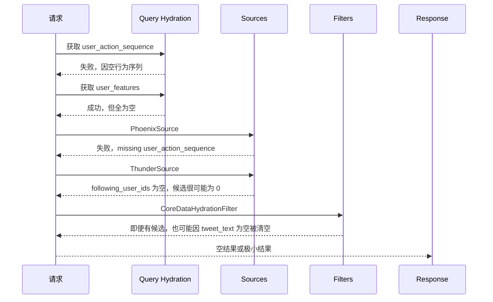

# 10. 端到端示例

本篇用两个示例把 `home-mixer` 串起来：

1. 一个“说明性最小可用示例”，用于理解设计意图
2. 一个“按当前默认 stub 代码推导的真实退化示例”

## 1. 说明

第一个示例不是当前仓库直接跑出来的真实结果，而是基于代码结构构造的 walkthrough，用来解释：

- 请求字段如何进入 pipeline
- 候选如何被补全、过滤和排序
- 响应字段如何形成

第二个示例才描述当前默认 stub 组合下更接近真实的运行结果。

## 2. 示例 A：说明性最小可用请求

### 2.1 输入请求

```json
{
  "viewer_id": 1001,
  "client_app_id": 258901,
  "country_code": "CN",
  "language_code": "zh",
  "seen_ids": [90001],
  "served_ids": [80001],
  "in_network_only": false,
  "is_bottom_request": true,
  "bloom_filter_entries": []
}
```

### 2.2 假设的 QueryHydrator 输出

为了说明流程，假设外部依赖返回：

- `user_action_sequence`：存在，长度 120
- `user_features.followed_user_ids = [2001, 2002]`
- `blocked_user_ids = [4004]`
- `muted_user_ids = []`
- `muted_keywords = ["spam"]`
- `subscribed_user_ids = [3003]`

### 2.3 假设的 Source 输出

#### ThunderSource

| tweet_id | author_id | served_type | ancestors |
| --- | --- | --- | --- |
| `70001` | `2001` | InNetwork | `[]` |
| `70002` | `2002` | InNetwork | `[69990]` |

#### PhoenixSource

| tweet_id | author_id | served_type |
| --- | --- | --- |
| `71001` | `3003` | PhoenixRetrieval |
| `71002` | `4004` | PhoenixRetrieval |
| `90001` | `5005` | PhoenixRetrieval |

合并后候选共 5 条。

## 3. 示例 A：候选如何逐步演化

### 3.1 Candidate Hydration 后

假设 TES / Gizmoduck / VF 等依赖返回最小可用数据：

| tweet_id | tweet_text | in_network | subscription_author_id | author_screen_name |
| --- | --- | --- | --- | --- |
| `70001` | `今天发布了新功能` | `true` | `None` | `alice` |
| `70002` | `回复一下这个话题` | `true` | `None` | `bob` |
| `71001` | `会员专属长文` | `false` | `3003` | `creator_pro` |
| `71002` | `普通推荐内容` | `false` | `None` | `blocked_author` |
| `90001` | `旧的已看过内容` | `false` | `None` | `random_user` |

### 3.2 Filter 后

```mermaid
flowchart LR
    A["5 条候选"] --> B["DropDuplicates: 5"]
    B --> C["CoreDataHydration: 5"]
    C --> D["Age: 5"]
    D --> E["SelfTweet: 5"]
    E --> F["RetweetDeduplication: 5"]
    F --> G["IneligibleSubscription: 5 -> 4"]
    G --> H["PreviouslySeenPosts: 4 -> 3"]
    H --> I["PreviouslyServedPosts: 3"]
    I --> J["MutedKeywordFilter: 3"]
    J --> K["AuthorSocialgraph: 3 -> 2"]
```



被移除的原因：

- `71001`：订阅内容，但 viewer 没订阅作者 `3003`
- `90001`：命中 `seen_ids`
- `71002`：作者 `4004` 在 `blocked_user_ids`

剩余候选：

- `70001`
- `70002`

### 3.3 Scoring 后

假设 Phoenix 给出如下行为概率：

| tweet_id | fav | reply | retweet | follow_author | not_interested |
| --- | --- | --- | --- | --- | --- |
| `70001` | 0.30 | 0.02 | 0.01 | 0.00 | 0.00 |
| `70002` | 0.10 | 0.08 | 0.02 | 0.00 | 0.00 |

则：

- `WeightedScorer` 得到两个 `weighted_score`
- `AuthorDiversityScorer` 若作者不同，则几乎不衰减
- `OONScorer` 不生效，因为两条都是 `in_network = true`

假设最后：

| tweet_id | weighted_score | score |
| --- | --- | --- |
| `70002` | `3.12` | `3.12` |
| `70001` | `0.74` | `0.74` |

### 3.4 Post-selection 后

假设：

- VF 全部通过
- 会话去重没有额外删除

则最终响应顺序：

1. `70002`
2. `70001`

## 4. 示例 A：最终响应长什么样

```json
{
  "scored_posts": [
    {
      "tweet_id": 70002,
      "author_id": 2002,
      "retweeted_tweet_id": 0,
      "retweeted_user_id": 0,
      "in_reply_to_tweet_id": 69990,
      "score": 3.12,
      "in_network": true,
      "served_type": 1,
      "last_scored_timestamp_ms": 1712840000000,
      "prediction_request_id": 871234567890123,
      "ancestors": [69990],
      "screen_names": {
        "2002": "bob"
      }
    },
    {
      "tweet_id": 70001,
      "author_id": 2001,
      "retweeted_tweet_id": 0,
      "retweeted_user_id": 0,
      "in_reply_to_tweet_id": 0,
      "score": 0.74,
      "in_network": true,
      "served_type": 1,
      "last_scored_timestamp_ms": 1712840000000,
      "prediction_request_id": 871234567890123,
      "ancestors": [],
      "screen_names": {
        "2001": "alice"
      }
    }
  ]
}
```

## 5. 示例 B：按当前默认 stub 推导的真实退化路径

### 5.1 输入请求

假设仍然是同样一份请求。

### 5.2 当前默认依赖会返回什么

| 依赖 | 默认行为 |
| --- | --- |
| `UserActionSequenceFetcher` | 空行为序列 |
| `StratoClient.get_user_features` | 空 `UserFeatures` |
| `PhoenixRetrievalClient` | 空候选 |
| `ThunderClient` | 可能能连真实 Thunder，但输入 following 列表为空 |
| `TESClient` | 所有帖子 core data 为空 |
| `PhoenixPredictionClient` | 空预测 |
| `VisibilityFilteringClient` | 全部通过 |

### 5.3 真实退化时序



### 5.4 示例 B 的结论

在当前默认 stub 组合下，最常见的不是“排序差”，而是：

- 根本没有足够候选进入排序
- 或者候选在 `CoreDataHydrationFilter` 被清空

## 6. 这个示例最该带走什么

### 6.1 设计上

`home-mixer` 是一条层次清晰的：

- 查询补全
- 双路召回
- 候选补全
- 过滤
- 打分
- 后处理

链路。

### 6.2 实现上

这条链路非常依赖外部依赖返回最小可用数据，尤其是：

1. `user_action_sequence`
2. `followed_user_ids`
3. `tweet_text`

没有这三类数据，整条链路就会快速退化。
