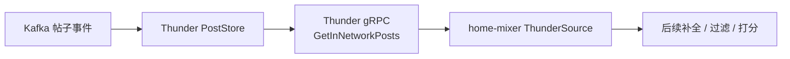
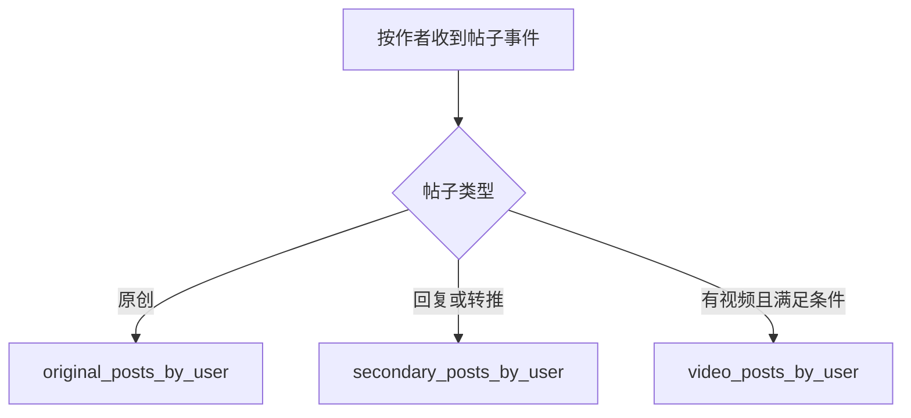
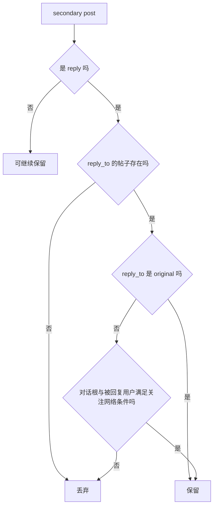

# 11. Thunder 到 home-mixer：网内候选的真实语义

这一篇专门回答两个问题：

1. Thunder 实际返回的“网内帖子”是什么，不是什么
2. 为什么 `home-mixer` 会按现在的方式处理 reply / retweet / conversation / in-network

## 1. Thunder 在链路中的角色

Thunder 不是排序服务，也不是完整帖子服务。它是一个面向低延迟查询的“网内帖子内存缓存服务”。

它的职责很克制：

- 消费 Kafka 的帖子创建/删除事件
- 维护按作者组织的轻量帖子缓存
- 在给定 `following_user_ids` 的前提下，快速返回这些作者最近的帖子
- 做一部分非常轻量的筛选和时间排序

## 2. Thunder 返回的是 `LightPost`

Thunder 对外返回的不是完整帖子，而是 `LightPost`。

### 2.1 `LightPost` 保留的关键信息

- `post_id`
- `author_id`
- `created_at`
- `in_reply_to_post_id`
- `in_reply_to_user_id`
- `conversation_id`
- `is_retweet`
- `is_reply`
- `has_video`
- `source_post_id`
- `source_user_id`

### 2.2 `LightPost` 明确不保留的东西

- 正文文本
- 完整媒体实体
- 作者资料
- 安全标签
- 排序分数

所以 Thunder 对 `home-mixer` 的意义是：

- 给候选“壳”
- 不给候选“肉”

后面的文本、转推关系细化、用户信息，都还要靠 `TES`、`Gizmoduck` 等服务补。

## 3. Thunder 的请求语义

`home-mixer/sources/thunder_source.rs` 发送的请求非常固定：

| 字段 | 当前值来源 |
| --- | --- |
| `user_id` | `query.user_id` |
| `following_user_ids` | `query.user_features.followed_user_ids` |
| `max_results` | `THUNDER_MAX_RESULTS = 1200` |
| `exclude_tweet_ids` | `query.seen_ids` |
| `algorithm` | 固定 `"default"` |
| `debug` | 固定 `false` |
| `is_video_request` | 固定 `false` |

这里有两个重要结论：

1. `home-mixer` 当前通常会直接传入 following list；如果上游没有提供，Thunder 会回查 Strato。`debug=false` 只表示关闭调试日志，不会禁用这条回退。

2. `home-mixer` 把 `query.seen_ids` 下推到 Thunder 的 `exclude_tweet_ids`。
   它把去重主要放在自己后面的 filter 链里。

## 4. Thunder 取数不是“拿所有帖子”

Thunder 内部 `PostStore` 把帖子分成三类缓存：

- `original_posts_by_user`
- `secondary_posts_by_user`
- `video_posts_by_user`

### 4.1 原创和二级内容分开存

Thunder 把：

- 非回复、非转推的帖子视为 original
- 回复和转推视为 secondary

这意味着它天然区分了：

- “直接内容供给”
- “更容易引起噪音或重复的二级内容”

### 4.2 视频有独立索引

视频帖子还会额外进入 `video_posts_by_user`，不过 `home-mixer` 当前这条链并没有发视频专用请求。

## 5. Thunder 内部对网内内容做了哪些筛选

### 5.1 作者粒度的数量限制

`PostStore` 每个作者只会从各自时间线里取有限数量：

| 常量 | 值 | 含义 |
| --- | --- | --- |
| `MAX_ORIGINAL_POSTS_PER_AUTHOR` | `200` | 每个作者最多取 200 条原创 |
| `MAX_REPLY_POSTS_PER_AUTHOR` | `50` | 每个作者最多取 50 条回复/转推 |
| `MAX_VIDEO_POSTS_PER_AUTHOR` | `50` | 每个作者最多取 50 条视频 |
| `MAX_TINY_POSTS_PER_USER_SCAN` | `500` | 每个作者扫描窗口上限 |

这意味着：

- Thunder 输出不是“关注作者所有可见帖子”
- 而是“每个作者最近一段窗口内的一部分帖子”

### 5.2 删除与过期处理

Thunder 会过滤：

- 已被删除的帖子
- 超过保留期的帖子
- 时间戳在未来的帖子

默认保留期来自 `thunder/args.rs`：

- `post_retention_seconds = 172800`，即 2 天

这和 `home-mixer` 自己的 `AgeFilter(48 小时)` 基本一致，所以形成双层时间约束：

- Thunder 先在存储层保留 2 天窗口
- `home-mixer` 再在候选层用 Snowflake 年龄做一次过滤

## 6. Thunder 对 reply / retweet 的特殊处理

这里是最值得讲清楚的地方。

### 6.1 Retweet 的 viewer-self 过滤

`PostStore::get_posts_from_map()` 会过滤掉：

- `post.is_retweet && post.source_user_id == Some(request_user_id)`

也就是：

- 关注的人转发了“viewer 自己的原帖”，Thunder 会直接不返回

这和 `home-mixer` 的 `SelfTweetFilter` 不同：

- `SelfTweetFilter` 只看 `candidate.author_id == viewer`
- Thunder 这里额外处理了“别人转发 viewer 原帖”的场景

### 6.2 Reply 不是无脑放出

对于 secondary posts，Thunder 并不是把所有 reply 都返回。

它会要求 reply 满足以下语义之一：

1. 回复的是一条 original post  
2. 或者回复的是一条 reply/retweet，但该对话结构满足：
   - `post.conversation_id` 存在
   - 被回复帖子再上一层指向该对话根
   - `in_reply_to_user_id` 属于 `following_users`

这意味着 Thunder 对 reply 的放出策略偏保守：

- 更偏向保留和关注网络有直接关系的回复链
- 减少无关对话噪音

### 6.3 `home-mixer` 如何继承这些语义

`ThunderSource` 不会重新解释 Thunder 的 reply/retweet 语义，它只是把这些字段转成 `PostCandidate`：

- `tweet_id = post_id`
- `author_id = author_id`
- `in_reply_to_tweet_id = in_reply_to_post_id`
- `retweeted_tweet_id = source_post_id`
- `retweeted_user_id = source_user_id`
- `ancestors` 由 `in_reply_to_post_id + conversation_id` 推导

也就是说：

- `home-mixer` 看到的“网内 reply 供给”已经是 Thunder 预筛过的一版

## 7. Thunder 的排序语义：只有新鲜度

Thunder 在返回前做的“score”其实只是：

- 按 `created_at` 降序
- 截断到 `max_results`

它没有做：

- 个性化排序
- 多目标打分
- 作者多样性
- 安全过滤

这解释了为什么 Thunder 很适合做 source，不适合直接做最终 Feed 排序。

## 8. 为什么 `home-mixer` 还要再做一次 `InNetworkCandidateHydrator`

看起来 ThunderSource 已经是网内内容，为什么还要再算一次 `in_network`？

原因有两个：

1. `home-mixer` 要把 Thunder 候选和 Phoenix 候选合在一起统一处理
2. 后续很多逻辑不能靠“来源”判断，而是靠“作者是否在关注网络里”判断

比如：

- `RankingScorer` 内部 OON 阶段要对非网内内容降权
- `VFCandidateHydrator` 要按 `SafetyLevel` 区分网内和网外

所以 `in_network` 是一个统一的候选属性，不只是 Thunder 的来源标签。

## 9. `ancestors` 为什么重要

ThunderSource 当前构造 `ancestors` 的规则是：

- 如果是 reply，把 `in_reply_to_tweet_id` 放进去
- 如果 `conversation_id` 和 `reply_to` 不同，再把 `conversation_id` 放进去

这会被后面的 `DedupConversationFilter` 使用：

- 它取 `ancestors` 最小值作为 conversation id
- 同一会话树只保留最高分的一条

也就是说，Thunder 提供的 reply / conversation 关系并不是装饰字段，而是直接决定后续会话级去重行为。

## 10. `home-mixer` 当前对 Thunder 的几个依赖风险

### 10.1 严重依赖 `followed_user_ids`

因为 `home-mixer` 传给 Thunder 的 following 列表来自 `query.user_features.followed_user_ids`，所以：

- 如果 Strato 返回空 following
- Thunder 就几乎一定给不出网内候选

### 10.2 Thunder 侧只下推 seen_ids

`exclude_tweet_ids` 来自 `query.seen_ids`：

- Thunder 会先丢掉这些已看过的帖
- 已投递、布隆过滤器、备份曝光 ID 仍由 `home-mixer` 的 filter 链处理

### 10.3 Thunder 的时间窗口与 `home-mixer` 时间窗口是双重限制

如果两边以后配得不一致，可能出现：

- Thunder 已经裁掉的内容，`home-mixer` 永远见不到
- `home-mixer` 再次过滤，供给进一步变小

## 11. 一个务实总结

对 `home-mixer` 来说，Thunder 不是“排好序的网内 Feed”，而是：

- 一份已经做过轻量筛选、按新鲜度排序的网内候选池

它提供的是：

- 低延迟
- 基础关系字段
- 一部分 reply/retweet 语义

它不提供的是：

- 个性化排序
- 内容补全
- 用户级去重
- 多目标权衡

这些正是 `home-mixer` 后面那条 pipeline 继续存在的原因。
