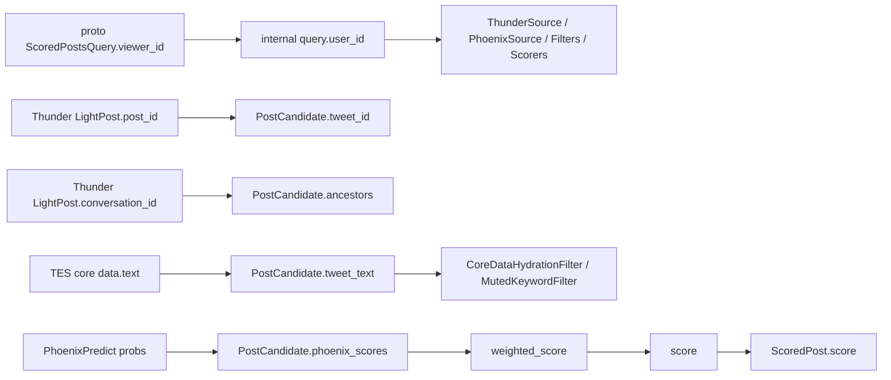

# 12. 字段字典

这篇把 `home-mixer` 相关核心结构做成逐字段手册。

覆盖对象：

1. 对外 proto：`home_mixer::ScoredPostsQuery`
2. 内部查询：`home-mixer::ScoredPostsQuery`
3. 用户特征：`UserFeatures`
4. 候选对象：`PostCandidate`
5. 排序中间分数：`PhoenixScores`
6. 对外返回：`home_mixer::ScoredPost`
7. Thunder 输入对象：`thunder::LightPost`

## 1. 对外请求字段：proto `ScoredPostsQuery`

来源文件：

- `proto/definitions/home_mixer.proto`

| 字段 | 类型 | 含义 | 进入内部后映射到 | 主要影响 |
| --- | --- | --- | --- | --- |
| `viewer_id` | `int64` | 请求用户 | `user_id` | 全链路主身份 |
| `client_app_id` | `int32` | 客户端应用 ID | `client_app_id` | viewer context |
| `country_code` | `string` | 国家码 | `country_code` | viewer context / VF |
| `language_code` | `string` | 语言码 | `language_code` | viewer context / VF |
| `seen_ids` | `repeated int64` | 客户端已看过帖子 | `seen_ids` | `PreviouslySeenPostsFilter` |
| `served_ids` | `repeated int64` | 服务端已投递过帖子 | `served_ids` | `PreviouslyServedPostsFilter` |
| `in_network_only` | `bool` | 是否只要网内内容 | `in_network_only` | `PhoenixSource.enable()` |
| `is_bottom_request` | `bool` | 是否为翻页请求 | `is_bottom_request` | `PreviouslyServedPostsFilter.enable()` |
| `bloom_filter_entries` | `repeated ImpressionBloomFilterEntry` | 已读布隆过滤器 | `bloom_filter_entries` | `PreviouslySeenPostsFilter` |

## 2. 内部查询字段：`models::query::ScoredPostsQuery`

来源文件：

- `home-mixer/models/query.rs`

| 字段 | 类型 | 来源 | 谁写入 | 谁读取 |
| --- | --- | --- | --- | --- |
| `user_id` | `u64` | proto `viewer_id` | `QueryBuilder` checked conversion | 几乎所有组件 |
| `client_app_id` | `i32` | proto | 请求入口 | `get_viewer()` |
| `country_code` | `String` | proto | 请求入口 | `get_viewer()` |
| `language_code` | `String` | proto | 请求入口 | `get_viewer()` |
| `seen_ids` | `Vec<u64>` | proto | `QueryBuilder` 过滤负值 | `PreviouslySeenPostsFilter` |
| `served_ids` | `Vec<u64>` | proto | `QueryBuilder` 过滤负值 | `PreviouslyServedPostsFilter` |
| `in_network_only` | `bool` | proto | 请求入口 | `PhoenixSource`、side effect enable |
| `is_bottom_request` | `bool` | proto | 请求入口 | `PreviouslyServedPostsFilter` |
| `bloom_filter_entries` | `Vec<ImpressionBloomFilterEntry>` | proto | 请求入口 | `PreviouslySeenPostsFilter` |
| `scoring_sequence` | `Option<UserActionSequence>` | hydrated | `ScoringSequenceQueryHydrator` | `PhoenixScorer` |
| `retrieval_sequence` | `Option<UserActionSequence>` | hydrated | `RetrievalSequenceQueryHydrator` | `PhoenixSource` / MoE |
| `user_features` | `UserFeatures` | hydrated | upstream-named field owners + local safety owner | `ThunderSource`、多个 Filter/Hydrator |
| `request_id` | `String` | 本地生成 | `QueryBuilder` | pipeline 日志追踪 |
| `prediction_id` | `u64` | 本地生成 | `QueryBuilder` | `PhoenixScorer` / 响应候选 |
| `request_time_ms` | `i64` | 本地生成 | `QueryBuilder` | 请求时序上下文 |

## 3. `UserFeatures`

来源文件：

- `home-mixer/models/user_features.rs`

| 字段 | 类型 | 含义 | 主要影响组件 |
| --- | --- | --- | --- |
| `muted_keywords` | `Vec<String>` | 屏蔽关键词 | `MutedKeywordFilter` |
| `blocked_user_ids` | `Vec<i64>` | 被 viewer 拉黑的作者 | `AuthorSocialgraphFilter` |
| `muted_user_ids` | `Vec<i64>` | 被 viewer 静音的作者 | `AuthorSocialgraphFilter` |
| `followed_user_ids` | `Vec<i64>` | viewer 关注作者列表 | `ThunderSource`、`InNetworkCandidateHydrator` |
| `subscribed_user_ids` | `Vec<i64>` | viewer 订阅作者列表 | `IneligibleSubscriptionFilter` |

## 4. 候选对象字段：`PostCandidate`

来源文件：

- `home-mixer/models/candidate.rs`

### 4.1 标识与关系字段

| 字段 | 类型 | 初始来源 | 后续作用 |
| --- | --- | --- | --- |
| `tweet_id` | `u64` | Source | 唯一标识、去重、响应输出；signed 协议在 adapter 边界 checked conversion |
| `author_id` | `u64` | Source | 过滤、`in_network` 判定、响应输出 |
| `tweet_text` | `String` | `CoreDataCandidateHydrator` | 文本过滤、内容完整性检查 |
| `in_reply_to_tweet_id` | `Option<u64>` | Source / CoreDataHydrator | related ids、响应输出 |
| `retweeted_tweet_id` | `Option<u64>` | `CoreDataCandidateHydrator` | retweet 去重、Phoenix lookup、响应输出 |
| `retweeted_user_id` | `Option<u64>` | `CoreDataCandidateHydrator` | retweet screen_name、Phoenix lookup、响应输出 |
| `ancestors` | `Vec<u64>` | `ThunderSource` | 会话去重、响应输出 |

### 4.2 排序相关字段

| 字段 | 类型 | 谁写 | 谁读 |
| --- | --- | --- | --- |
| `phoenix_scores` | `PhoenixScores` | `PhoenixScorer` | `RankingScorer` |
| `prediction_request_id` | `Option<u64>` | `PhoenixScorer` 传播 query prediction ID | 响应输出 |
| `last_scored_at_ms` | `Option<u64>` | `PhoenixScorer` | 响应输出 |
| `weighted_score` | `Option<f64>` | `RankingScorer` | debug / 响应内部排序解释 |
| `score` | `Option<f64>` | `RankingScorer` | selector、会话去重、响应输出 |
| `favorite_count` | `Option<i64>` | `CoreDataCandidateHydrator` | 冷启动探索的成功次数 |
| `view_count` | `Option<u64>` | `CoreDataCandidateHydrator` | 冷启动资格与 Thompson Sampling 曝光分母；缺失时不参与 |

### 4.3 来源、网络与展示字段

| 字段 | 类型 | 谁写 | 谁读 |
| --- | --- | --- | --- |
| `served_type` | `Option<ServedType>` | Source | 响应输出 |
| `in_network` | `Option<bool>` | `InNetworkCandidateHydrator` | `RankingScorer` 内部 OON 阶段、VF、响应输出 |
| `video_duration_ms` | `Option<i32>` | `VideoDurationCandidateHydrator` | `RankingScorer` 内部 Weighted 阶段 |
| `author_followers_count` | `Option<i32>` | `GizmoduckCandidateHydrator` | 当前主链几乎未使用 |
| `author_screen_name` | `Option<String>` | `GizmoduckCandidateHydrator` | `get_screen_names()`、响应输出 |
| `retweeted_screen_name` | `Option<String>` | `GizmoduckCandidateHydrator` | `get_screen_names()`、响应输出 |

### 4.4 安全与权限字段

| 字段 | 类型 | 谁写 | 谁读 |
| --- | --- | --- | --- |
| `visibility_decision` | `VisibilityDecision` | `VFCandidateHydrator` | `VFFilter`、响应映射 |
| `subscription_author_id` | `Option<u64>` | `SubscriptionHydrator` | `IneligibleSubscriptionFilter` |

## 5. `PhoenixScores`

来源文件：

- `home-mixer/models/candidate.rs`

这些字段本质上都是“某个候选上的行为概率或连续值”，大多由 `PhoenixScorer` 填充。

| 字段 | 含义 | 参与 `WeightedScorer` 吗 |
| --- | --- | --- |
| `favorite_score` | 点赞概率 | 是 |
| `reply_score` | 回复概率 | 是 |
| `retweet_score` | 转发概率 | 是 |
| `photo_expand_score` | 图片展开概率 | 是 |
| `click_score` | 点击详情概率 | 是 |
| `profile_click_score` | 点击作者主页概率 | 是 |
| `vqv_score` | 视频有效观看概率 | 是，且受视频时长门槛控制 |
| `share_score` | 分享概率 | 是 |
| `share_via_dm_score` | 私信分享概率 | 是 |
| `share_via_copy_link_score` | 复制链接分享概率 | 是 |
| `dwell_score` | 二值停留概率 | 是 |
| `quote_score` | 引用转发概率 | 是 |
| `quoted_click_score` | 点击引用帖概率 | 是 |
| `follow_author_score` | 关注作者概率 | 是 |
| `not_interested_score` | 不感兴趣概率 | 是，负权重 |
| `block_author_score` | 拉黑作者概率 | 是，负权重 |
| `mute_author_score` | 静音作者概率 | 是，负权重 |
| `report_score` | 举报概率 | 是，负权重 |
| `dwell_time` | 连续停留时间 | 是 |

## 6. 对外返回字段：proto `ScoredPost`

来源文件：

- `proto/definitions/home_mixer.proto`
- 映射逻辑在 `home-mixer/server.rs`

| 字段 | 来源 | 缺失时当前行为 |
| --- | --- | --- |
| `tweet_id` | `candidate.tweet_id` | 必有 |
| `author_id` | `candidate.author_id` | 必有或为默认 0 |
| `retweeted_tweet_id` | `candidate.retweeted_tweet_id` | `0` |
| `retweeted_user_id` | `candidate.retweeted_user_id` | `0` |
| `in_reply_to_tweet_id` | `candidate.in_reply_to_tweet_id` | `0` |
| `score` | `candidate.score` | `0.0` |
| `in_network` | `candidate.in_network` | `false` |
| `served_type` | `candidate.served_type` | 默认枚举值 |
| `last_scored_timestamp_ms` | `candidate.last_scored_at_ms` | `0` |
| `prediction_request_id` | `candidate.prediction_request_id` | `0` |
| `ancestors` | `candidate.ancestors` | `[]` |
| `screen_names` | `candidate.get_screen_names()` | 空 map |
| `visibility_reason` | `candidate.visibility_decision` 中的 `Restricted(reason)` | 其他状态为 `None` |

## 7. Thunder `LightPost`

来源文件：

- `proto/definitions/in_network.proto`

这个结构虽然不属于 `home-mixer` crate，但它直接影响 `ThunderSource` 如何构造候选。

| 字段 | 含义 | 进入 `PostCandidate` 后怎样使用 |
| --- | --- | --- |
| `post_id` | 帖子 ID | 映射到 `tweet_id` |
| `author_id` | 作者 ID | 映射到 `author_id` |
| `created_at` | 创建时间 | Thunder 内部排序使用，`home-mixer` 不直接保存 |
| `in_reply_to_post_id` | 被回复帖 ID | 映射到 `in_reply_to_tweet_id` |
| `in_reply_to_user_id` | 被回复用户 ID | 当前 `home-mixer` 不直接保存 |
| `conversation_id` | 对话根 ID | 用来构造 `ancestors` |
| `is_retweet` | 是否转推 | 当前 `ThunderSource` 不直接写到候选结构 |
| `is_reply` | 是否回复 | 当前 `ThunderSource` 不直接写到候选结构 |
| `has_video` | 是否有视频 | 当前 `ThunderSource` 不直接写到候选结构 |
| `source_post_id` | 转推原帖 ID | 当前 `ThunderSource` 不直接写，后续主要靠 TES 补全 |
| `source_user_id` | 转推原作者 ID | 当前 `ThunderSource` 不直接写，后续主要靠 TES 补全 |

## 8. 一个字段流转图

## 9. 当前字段设计里最需要留意的点

### 9.1 同名字段不一定语义完全相同

例如：

- proto 请求里是 `viewer_id`
- 内部结构里叫 `user_id`

本质相同，但阅读代码时要知道这是映射关系，不是两个概念。

### 9.2 某些字段“结构存在但默认跑不满”

例如：

- `tweet_text`
- `retweeted_user_id`
- `author_screen_name`
- `visibility_decision`

这些字段在结构上都存在，但当前默认依赖多为 stub，所以运行时常常为空。

### 9.3 `created_at` 没进 `PostCandidate`

这是一个很重要的设计事实：

- Thunder 用 `created_at` 做内部排序
- `home-mixer` 里候选没有显式保存这个字段
- 年龄判断转而通过 Snowflake 的 `tweet_id` 推导

所以 `AgeFilter` 依赖的是 ID 编码时间，不是 Thunder 返回的 `created_at`。
