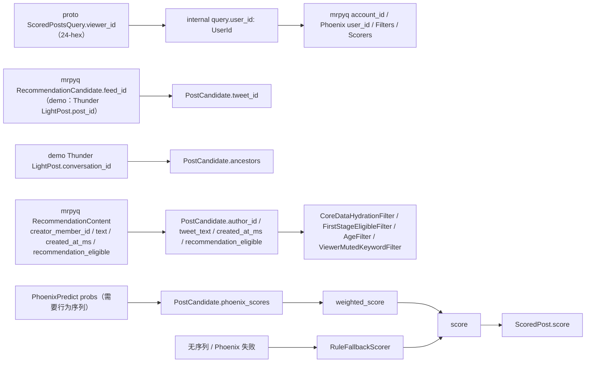

# 12. 字段字典

这篇把 `home-mixer` 相关核心结构做成逐字段手册。

覆盖对象：

1. 对外 proto：`home_mixer::ScoredPostsQuery`
2. 内部查询：`home-mixer::ScoredPostsQuery`
3. 用户特征：`UserFeatures`
4. 候选对象：`PostCandidate`
5. 排序中间分数：`PhoenixScores`
6. 对外返回：`home_mixer::ScoredPost`
7. 网内召回输入对象：mrpyq `RecommendationCandidate` / `RecommendationContent`（非 demo）与 Thunder `LightPost`（demo）

> **收录范围**：本篇只收录对链路行为有直接影响的核心字段，不是逐字段全集。完整字段定义以源文件为准：proto 见 `proto/definitions/home_mixer.proto`，内部结构见 `home-mixer/models/` 对应文件。

## 1. 对外请求字段：proto `ScoredPostsQuery`

来源文件：

- `proto/definitions/home_mixer.proto`

| 字段 | 类型 | 含义 | 进入内部后映射到 | 主要影响 |
| --- | --- | --- | --- | --- |
| `viewer_id` | `string`（24 位小写 hex ObjectId） | 请求用户（皮 `member_id`） | `user_id` | 全链路主身份；空串、`"0"`、非 24-hex 或全零都返回 `InvalidArgument` |
| `client_app_id` | `int32` | 客户端应用 ID | `client_app_id` | viewer context |
| `country_code` | `string` | 国家码 | `country_code` | viewer context / VF |
| `language_code` | `string` | 语言码 | `language_code` | viewer context / VF |
| `seen_ids` | `repeated string` | 客户端已看过帖子 | `seen_ids` | `PreviouslySeenPostsFilter`；非法串丢弃并计数 |
| `served_ids` | `repeated string` | 服务端已投递过帖子 | `served_ids`（再与本地已下发历史合并） | `PreviouslyServedPostsFilter` |
| `in_network_only` | `bool` | 是否只要网内内容 | `in_network_only` | `PhoenixSource.enable()`（还看 cached posts 和 topic 模式） |
| `is_bottom_request` | `bool` | 是否为翻页请求 | `is_bottom_request` | `PreviouslyServedPostsFilter.enable()` |
| `bloom_filter_entries` | `repeated ImpressionBloomFilterEntry` | 已读布隆过滤器 | `bloom_filter_entries` | `PreviouslySeenPostsFilter` |
| `topic_ids` | `repeated int64` | strict 话题约束 | `topic_ids` | `PhoenixTopicsSource`、`TopicIdsFilter` |
| `excluded_topic_ids` | `repeated int64` | 排除话题 | `excluded_topic_ids` | `TopicIdsFilter` |
| `new_user_topic_ids` | `repeated int64` | 新用户冷启动话题 | `new_user_topic_ids` | `NewUserTopicIdsFilter`、topic recall mode |
| `exclude_videos` | `bool` | 请求不要视频 | `exclude_videos` | `VideoFilter.enable()` |
| `impressed_post_ids` | `repeated string` | 客户端曝光 ID（无 seen_ids 时的备份） | `impressed_post_ids` | `PreviouslySeenPostsBackupFilter` |
| `past_request_timestamps_ms` | `repeated int64` | 历史请求时间戳 | `past_request_timestamps_ms` | ForYou 本地状态维护（`PastRequestTimestampsQueryHydrator` 合并本地状态） |
| `cached_posts` | `repeated CachedPost` | 请求携带的缓存候选（默认拒绝，仅显式 Demo 放行） | `cached_posts` / `has_cached_posts` | `CachedPostsSource` |
| `enable_phoenix_moe` | `bool` | 启用 MoE 召回 | `enable_phoenix_moe` | `PhoenixMoeSource.enable()` |

其余请求字段（`is_preview`、`is_polling`、`ip_address`、`user_agent` 等）只透传保存：`user_agent` 会被默认不装配的 `TweetMixerSource` 请求读取，其余暂无消费者。

## 2. 内部查询字段：`models::query::ScoredPostsQuery`

来源文件：

- `home-mixer/models/query.rs`

| 字段 | 类型 | 来源 | 谁写入 | 谁读取 |
| --- | --- | --- | --- | --- |
| `user_id` | `UserId`（`ObjectId`） | proto `viewer_id` | `QueryBuilder` 解析 24-hex | 几乎所有组件；非 demo 作为 `account_id` 发给 mrpyq |
| `client_app_id` | `i32` | proto | 请求入口 | `get_viewer()` |
| `country_code` | `String` | proto | 请求入口 | `get_viewer()` |
| `language_code` | `String` | proto | 请求入口 | `get_viewer()` |
| `seen_ids` | `Vec<PostId>` | proto | `QueryBuilder` 丢弃非法串并计数 | `PreviouslySeenPostsFilter` |
| `served_ids` | `Vec<PostId>` | proto + 本地状态 | `QueryBuilder` 解析；`ServedHistoryQueryHydrator` 再合并 `FeedStateStore` 里的已下发历史 | `PreviouslyServedPostsFilter` |
| `in_network_only` | `bool` | proto | 请求入口原样保留；只有请求显式为 true 才仅网内 | `PhoenixSource` / `FallbackSource` enable、`ThunderSource` 的 `served_type`、side effect enable |
| `is_bottom_request` | `bool` | proto | 请求入口 | `PreviouslyServedPostsFilter` |
| `bloom_filter_entries` | `Vec<ImpressionBloomFilterEntry>` | proto | 请求入口 | `PreviouslySeenPostsFilter` |
| `scoring_sequence` | `Option<UserActionSequence>` | hydrated | `ScoringSequenceQueryHydrator` | `PhoenixScorer` |
| `retrieval_sequence` | `Option<UserActionSequence>` | hydrated | `RetrievalSequenceQueryHydrator` | `PhoenixSource` / MoE |
| `user_action_sequence` | `Option<UserActionSequence>` | hydrated | `UserActionSeqQueryHydrator`（拉取 UAS）；`ScoringSequenceQueryHydrator` 缺省时透传 | 上两个 sequence 缺失时的回退输入 |
| `user_features` | `UserFeatures` | hydrated | upstream-named field owners + local safety owner（非 demo 数据源是 `MrpyqStratoClient`，后端未实现时全空） | `InNetworkCandidateHydrator`、`AuthorSocialgraphFilter`、`ViewerMutedKeywordFilter`、demo `ThunderClient` |
| `topic_ids` / `excluded_topic_ids` / `new_user_topic_ids` | `Vec<i64>` | proto | `QueryBuilder` | topic recall mode、`TopicIdsFilter`、`NewUserTopicIdsFilter` |
| `supplemental_topic_ids` | `Vec<i64>` | 内部（无 proto 字段） | 显式注入的 Adapter | 补充话题召回（Blend 模式） |
| `cached_posts` / `has_cached_posts` | `Vec<PostCandidate>` / `bool` | proto `cached_posts` | `QueryBuilder`（默认拒绝 unsigned，仅 Demo 放行） | `CachedPostsSource` |
| `exclude_videos` / `enable_phoenix_moe` | `bool` | proto | `QueryBuilder` | `VideoFilter` / `PhoenixMoeSource` |
| `impressed_post_ids` / `past_request_timestamps_ms` | `Vec<PostId>` / `Vec<i64>` | proto（后者还由 `PastRequestTimestampsQueryHydrator` 合并本地状态） | `QueryBuilder` / 状态 Query Hydrator | 备份去重 / 请求频次状态 |
| `is_preview` / `is_shadow_traffic` / `is_polling` | `bool` | proto | `QueryBuilder` | 透传；`is_shadow_traffic` 写入 `ServedCandidatesKafkaSideEffect` 的曝光事件字段，不再作为该 SideEffect 的启用门槛 |
| `is_top_request` | `bool` | 内部（无 proto 字段） | `QueryBuilder`（`!is_bottom_request`） | ForYou 流量类型语义 |
| `ip_address` / `user_agent` | `String` | proto | `QueryBuilder` | `ip_address` 无消费者；`user_agent` 仅未装配的 `TweetMixerSource` 读取 |
| `request_id` | `String` | 本地生成 | `QueryBuilder` | pipeline 日志追踪 |
| `prediction_id` | `u64` | 本地生成 | `QueryBuilder` | `PhoenixScorer` / 响应候选 |
| `request_time_ms` | `i64` | 本地生成 | `QueryBuilder` | 请求时序上下文 |

`topic_recall_mode()` 按 `topic_ids` > `new_user_topic_ids` > `supplemental_topic_ids` 的优先级给出 Strict / ColdStart / Blend / None 四种召回模式。

## 3. `UserFeatures`

来源文件：

- `home-mixer/models/user_features.rs`

| 字段 | 类型 | 含义 | 主要影响组件 |
| --- | --- | --- | --- |
| `muted_keywords` | `Vec<String>` | 屏蔽关键词 | `ViewerMutedKeywordFilter`；非 demo 来自 mrpyq `GetViewerRelations.muted_keywords` |
| `blocked_user_ids` | `Vec<UserId>` | 被 viewer 拉黑的作者 | `AuthorSocialgraphFilter`；非 demo 来自 `blocked_account_ids`（皮 ID，解析失败的单条丢弃并告警） |
| `blocked_by_user_ids` | `Vec<UserId>` | 反向屏蔽 viewer 的作者 | `UserSafetyFeaturesQueryHydrator` 写入；`AuthorSocialgraphFilter` 已消费；非 demo 来自 `blocked_by_account_ids`。候选侧 `author_blocks_viewer` 另由未装配的 `BlockedByHydrator` 写入 |
| `muted_user_ids` | `Vec<UserId>` | 被 viewer 静音的作者 | `AuthorSocialgraphFilter`；非 demo 来自 `muted_account_ids` |
| `followed_user_ids` | `Vec<UserId>` | viewer 关注作者列表 | `InNetworkCandidateHydrator`（仅对来源未标 `in_network` 的候选）、demo `ThunderClient` 请求；mrpyq 无关注图契约，非 demo 恒为空 |
| `subscribed_user_ids` | `Vec<UserId>` | viewer 订阅作者列表 | 无消费者（U5：`IneligibleSubscriptionFilter` 已删除），恒为空 |
| `follower_count` | `Option<i64>` | viewer 粉丝数 | VQV 权重粉丝门槛；本地适配器暂不提供，`None` 时门槛不触发 |

非 demo 下 `MrpyqStratoClient` 依赖的 `ViewerRelationService` 尚未由 mrpyq 实现，调用失败只记日志，整个结构保持默认空值。

## 4. 候选对象字段：`PostCandidate`

来源文件：

- `home-mixer/models/candidate.rs`

### 4.1 标识与关系字段

| 字段 | 类型 | 初始来源 | 后续作用 |
| --- | --- | --- | --- |
| `tweet_id` | `PostId`（`ObjectId`） | Source | 唯一标识、去重、响应输出；边界上非 24-hex 的 ID 整条丢弃 |
| `author_id` | `UserId` | Source（Phoenix / demo Thunder）或 `CoreDataCandidateHydrator`（mrpyq 候选来源留 NIL，由 TES 的 `creator_member_id` 补回） | 过滤、`in_network` 推断、响应输出；仍为 NIL 时被 `CoreDataHydrationFilter` 丢弃 |
| `tweet_text` | `String` | `CoreDataCandidateHydrator` | 文本过滤、内容完整性检查 |
| `created_at_ms` | `Option<u64>` | Source（demo Thunder）或 `CoreDataCandidateHydrator`（mrpyq `created_at_ms`） | `AgeFilter`（缺失时回退 ObjectId 时间戳）、`RuleFallbackScorer` |
| `recommendation_eligible` | `Option<bool>` | `CoreDataCandidateHydrator`（mrpyq 一级标志） | `FirstStageEligibleFilter`（只丢 `Some(false)`） |
| `quoted_tweet_text` | `String` | 无写入方（U5：`QuoteHydrator` 已删除） | `ViewerMutedKeywordFilter` 仍会匹配，但恒为空 |
| `in_reply_to_tweet_id` | `Option<PostId>` | Source / CoreDataHydrator | related ids、响应输出 |
| `retweeted_tweet_id` | `Option<PostId>` | `CoreDataCandidateHydrator` / demo Thunder | Phoenix lookup、响应输出；mrpyq 不提供，恒为 `None` |
| `retweeted_user_id` | `Option<UserId>` | `CoreDataCandidateHydrator` / demo Thunder | retweet screen_name、Phoenix lookup、响应输出 |
| `quoted_tweet_id` / `quoted_user_id` | `Option<PostId>` / `Option<UserId>` | 无写入方（U5） | `AuthorSocialgraphFilter` 的引用作者分支恒无操作 |
| `ancestors` | `Vec<PostId>` | demo `ThunderSource`（conversation 关系）；mrpyq 候选为空 | 会话去重、响应输出 |

### 4.2 排序相关字段

| 字段 | 类型 | 谁写 | 谁读 |
| --- | --- | --- | --- |
| `phoenix_scores` | `PhoenixScores` | `PhoenixScorer`；`RuleFallbackScorer` 触发时清空 | `RankingScorer`、`RuleFallbackScorer`（判断是否有可用头） |
| `degraded_reason` | `Option<String>` | `PhoenixScorer`（`phoenix_missing_sequence` / `phoenix_unavailable: …`）；`RuleFallbackScorer` 统一写成 `phoenix_unavailable` | `RuleFallbackScorer`（任一候选带标记即整批规则分）；日志 / 观测 |
| `prediction_request_id` | `Option<u64>` | `PhoenixScorer` 传播 query prediction ID；规则回退时清空 | 响应输出 |
| `last_scored_at_ms` | `Option<u64>` | `PhoenixScorer`；规则回退时清空 | 响应输出 |
| `weighted_score` | `Option<f64>` | `RankingScorer`；规则回退时清空 | debug / 响应内部排序解释 |
| `score` | `Option<f64>` | `RankingScorer`；`RuleFallbackScorer` 整批覆盖；开了 VM Ranker（仅 demo）时由其覆盖 | selector、会话去重、响应输出 |
| `favorite_count` / `reply_count` | `Option<i64>` | `CoreDataCandidateHydrator`（mrpyq `like_count` / `comment_count`） | `RuleFallbackScorer` 互动项、冷启动探索 |
| `view_count` | `Option<u64>` | `CoreDataCandidateHydrator`（mrpyq 不提供，恒 `None`） | 冷启动资格与 Thompson Sampling 曝光分母；缺失时不参与 |

### 4.3 来源、网络与展示字段

| 字段 | 类型 | 谁写 | 谁读 |
| --- | --- | --- | --- |
| `served_type` | `Option<ServedType>` | Source | 响应输出 |
| `in_network` | `Option<bool>` | `ThunderSource`（`Some(true)`）/ `FallbackSource`（`Some(false)`）在来源处标定；其他来源由 `InNetworkCandidateHydrator` 推断 | `RankingScorer` 内部 OON 阶段、`RuleFallbackScorer`、VF、`VFFilter` 的 `in_network_only` 策略、响应输出 |
| `video_duration_ms` | `Option<i32>` | `VideoDurationCandidateHydrator`（mrpyq `has_video` + `video_duration_ms`） | `RankingScorer` 内部 Weighted 阶段、`VideoFilter` |
| `quoted_video_duration_ms` | `Option<i32>` | 无写入方（U5） | 引用帖 VQV 时长门槛（默认关闭时长检查） |
| `author_followers_count` | `Option<i32>` | `GizmoduckCandidateHydrator`（非 demo 为 Disabled，恒 `None`） | `AuthorColdStartScorer` 资格门槛、`VMRanker` 请求映射 |
| `author_screen_name` | `Option<String>` | `GizmoduckCandidateHydrator`（非 demo 恒 `None`） | `get_screen_names()`、响应输出 |
| `retweeted_screen_name` | `Option<String>` | `GizmoduckCandidateHydrator` | `get_screen_names()`、响应输出 |
| `author_profile_looked_up_for_user_id` | `Option<UserId>` | `GizmoduckCandidateHydrator`（请求内复用标记） | 防止其他 hydrator 改作者后复用过期资料 |
| `retweeted_profile_looked_up_for_user_id` | `Option<UserId>` | `GizmoduckCandidateHydrator`（请求内复用标记） | 同上，作用于转推原作者 |
| `has_media` | `Option<bool>` | `HasMediaHydrator`（TES media 批次） | 展示信号，当前无过滤消费 |
| `language_code` | `Option<String>` | `LanguageCodeHydrator` | 展示信号，当前无过滤消费 |

### 4.4 安全与权限字段

| 字段 | 类型 | 谁写 | 谁读 |
| --- | --- | --- | --- |
| `visibility_decision` | `VisibilityDecision` | `VFCandidateHydrator`（非 demo 只有 mrpyq 一级 eligibility 结果） | `VFFilter`（Restricted Drop 删除；`Unchecked / Unavailable` 按 `HOME_MIXER_VF_FAILURE_POLICY`，默认 `fail_closed` 删除）、响应映射 |
| `visibility_action` | `Option<Action>` | `VFCandidateHydrator`（由 decision 推导） | `VFFilter` 优先读它；显式 `Drop` 一律删除 |
| `subscription_author_id` | `Option<UserId>` | 无写入方（U5：`SubscriptionHydrator` 已删除） | 无消费者 |
| `author_blocks_viewer` | `Option<bool>` | `BlockedByHydrator`（CH-09，真实 Adapter 未接入） | 普通作者或转推原作者反向屏蔽标记；`AuthorSocialgraphFilter` 消费 |
| `quoted_author_blocks_viewer` | `Option<bool>` | `BlockedByHydrator`（CH-09，真实 Adapter 未接入） | 引用作者反向屏蔽标记；`AuthorSocialgraphFilter` 消费，`None` 时中立 |
| `drop_ancillary_posts` | `Option<bool>` | `VFCandidateHydrator` | 无消费者（U5：`AncillaryVFFilter` 已删除） |
| `brand_safety_verdict` | `Option<BrandSafetyVerdict>` | 预留（本地无 V2 标签数据源） | 响应输出、ads 混排预留 |
| `safety_labels` | `Vec<SafetyLabelInfo>` | 预留（当前无写入方） | 安全标签展示预留 |

### 4.5 话题与互动统计字段

| 字段 | 类型 | 谁写 | 谁读 |
| --- | --- | --- | --- |
| `retrieval_topic_ids` | `Vec<i64>` | `PhoenixTopicsSource` | 话题来源标记 |
| `filtered_topic_ids` | `Vec<i64>` | `FilteredTopicsHydrator` | `TopicIdsFilter`、`NewUserTopicIdsFilter` |
| `unfiltered_topic_ids` | `Vec<i64>` | `FilteredTopicsHydrator` | 话题来源对照 |
| `following_replied_user_ids` | `Vec<UserId>` | 预留（当前无写入方） | 上游网内回复关系信号 |
| `favorite_count` / `reply_count` / `repost_count` / `quote_count` | `Option<i64>` | `CoreDataCandidateHydrator`（mrpyq 只提供前两项） | `RuleFallbackScorer` 互动项、冷启动探索成功次数、展示统计 |
| `view_count` | `Option<u64>` | `CoreDataCandidateHydrator`（mrpyq 不提供） | 冷启动资格与 Thompson Sampling 曝光分母 |
| `mutual_follow_jaccard` | `Option<f64>` | 社交图补全预留 | 展示信号预留 |
| `is_mutual_follow_author` | `Option<bool>` | 上游 `BidirectionalFollowHydrator`（本地 U3 未接入） | 双向关注回复/停留加成；`None` 时加成不触发 |

## 5. `PhoenixScores`

来源文件：

- `home-mixer/models/candidate.rs`

这些字段本质上都是“某个候选上的行为概率或连续值”，大多由 `PhoenixScorer` 填充。

| 字段 | 含义 | 参与 `RankingScorer` 加权吗 |
| --- | --- | --- | --- |
| `favorite_score` | 点赞概率 | 是 |
| `reply_score` | 回复概率 | 是 |
| `retweet_score` | 转发概率 | 是 |
| `photo_expand_score` | 图片展开概率 | 是 |
| `click_score` | 点击详情概率 | 是 |
| `profile_click_score` | 点击作者主页概率 | 是（当前权重 0.0） |
| `vqv_score` | 视频有效观看概率 | 是，且受视频时长门槛控制 |
| `share_score` | 分享概率 | 是 |
| `share_via_dm_score` | 私信分享概率 | 是 |
| `share_via_copy_link_score` | 复制链接分享概率 | 是 |
| `dwell_score` | 二值停留概率 | 是（当前权重 0.0） |
| `quote_score` | 引用转发概率 | 是 |
| `quoted_click_score` | 点击引用帖概率 | 是 |
| `quoted_vqv_score` | 点击引用帖视频概率 | 是（`QUOTED_VQV_WEIGHT = 0.0`，当前恒零） |
| `follow_author_score` | 关注作者概率 | 是 |
| `not_interested_score` | 不感兴趣概率 | 是，负权重 |
| `block_author_score` | 拉黑作者概率 | 是，负权重 |
| `mute_author_score` | 静音作者概率 | 是，负权重 |
| `report_score` | 举报概率 | 是，负权重 |
| `not_dwelled_score` | 未停留概率 | 是，负权重（`NOT_DWELLED_WEIGHT = -0.02`） |
| `video_open_score` / `open_link_score` / `post_unexplored_score` | 上游 47c1bcd 新增离散头 | 权重已定义；本地发布 checkpoint 不产出这些头，当前恒 `None` |
| `dwell_time` | 连续停留时间 | 是（`CONT_DWELL_TIME_WEIGHT = 0.004`） |
| `click_dwell_time` | 点击后停留时间 | 权重 0.0；协议尚无对应连续动作，当前恒 `None` |
| `active_secs_5m_residual_norm` | 5 分钟活跃残差（归一化） | 权重 0.0；当前恒 `None` |

## 6. 对外返回字段：proto `ScoredPost`

来源文件：

- `proto/definitions/home_mixer.proto`
- 映射逻辑在 `home-mixer/scored_posts_server.rs`

| 字段 | 来源 | 缺失时当前行为 |
| --- | --- | --- |
| `tweet_id` | `candidate.tweet_id` | 必有，24-hex 字符串 |
| `author_id` | `candidate.author_id` | 必有（NIL 候选已被 `CoreDataHydrationFilter` 丢弃） |
| `retweeted_tweet_id` | `candidate.retweeted_tweet_id` | 空串 `""` |
| `retweeted_user_id` | `candidate.retweeted_user_id` | 空串 `""` |
| `in_reply_to_tweet_id` | `candidate.in_reply_to_tweet_id` | 空串 `""` |
| `score` | `candidate.score` | `0.0` |
| `in_network` | `candidate.in_network` | `false` |
| `served_type` | `candidate.served_type` | 默认枚举值 |
| `last_scored_timestamp_ms` | `candidate.last_scored_at_ms` | `0` |
| `prediction_request_id` | `candidate.prediction_request_id` | `0` |
| `ancestors` | `candidate.ancestors` | `[]`（mrpyq 候选恒为空） |
| `screen_names` | `candidate.get_screen_names()` | 空 map（非 demo Gizmoduck 为 Disabled，恒为空） |
| `visibility_reason` | `candidate.visibility_decision` 中的 `Restricted(reason)` | 其他状态为 `None` |
| `brand_safety_verdict` | `candidate.brand_safety_verdict` 映射的枚举 | 默认枚举值（本地暂无 V2 标签数据源） |
| `tweet_text` | `candidate.tweet_text` | 空字符串（依赖 TES 补全） |

## 7. 网内召回输入对象

### 7.1 mrpyq `RecommendationCandidate` / `RecommendationContent`（非 demo）

来源文件：`proto/definitions/recommendation_data.proto`

| 字段 | 来自哪个 RPC | 进入 `PostCandidate` 后怎样使用 |
| --- | --- | --- |
| `feed_id` | `ListRecommendationCandidates` | 映射到 `tweet_id`；适配器先按 ObjectId 时间戳粗筛帖龄 |
| `creator_member_id` | `BatchGetRecommendationContents` | 映射到 `author_id`；为空则该帖无 core data，被 `CoreDataHydrationFilter` 丢弃 |
| `text` | 同上 | `tweet_text` |
| `created_at_ms` | 同上 | `created_at_ms`（`AgeFilter` / `RuleFallbackScorer`） |
| `like_count` / `comment_count` | 同上 | `favorite_count` / `reply_count` |
| `has_image` / `has_video` / `video_duration_ms` | 同上 | `has_media` / `video_duration_ms` |
| `recommendation_eligible` / `ineligible_reason` | 同上 | `recommendation_eligible`（`FirstStageEligibleFilter`）；VF 端口把 `false` 映射为 Restricted Drop |
| `tag_ids` / `room_id` / `section_ids` / `gift_value` / `creator_account_id` / `creator_user_id` / `creator_user_no` | 同上 | 当前不进入候选 |

### 7.2 Thunder `LightPost`（仅 demo）

来源文件：

- `proto/definitions/in_network.proto`

这个结构只在 `HOME_MIXER_MODE=demo` 装配整数 Thunder 时使用，整数 ID 以末 8 字节零填充成 ObjectId。

| 字段 | 含义 | 进入 `PostCandidate` 后怎样使用 |
| --- | --- | --- |
| `post_id` | 帖子 ID | 映射到 `tweet_id` |
| `author_id` | 作者 ID | 映射到 `author_id` |
| `created_at` | 创建时间（秒） | 映射到 `created_at_ms`（×1000） |
| `in_reply_to_post_id` | 被回复帖 ID | 映射到 `in_reply_to_tweet_id` |
| `in_reply_to_user_id` | 被回复用户 ID | 当前 `home-mixer` 不直接保存 |
| `conversation_id` | 对话根 ID | 用来构造 `ancestors` |
| `is_retweet` | 是否转推 | 当前 `ThunderSource` 不直接写到候选结构 |
| `is_reply` | 是否回复 | 当前 `ThunderSource` 不直接写到候选结构 |
| `has_video` | 是否有视频 | 当前 `ThunderSource` 不直接写到候选结构 |
| `source_post_id` | 转推原帖 ID | `ThunderSource` 写入 `retweeted_tweet_id`；TES/CoreData 随后可覆盖 |
| `source_user_id` | 转推原作者 ID | `ThunderSource` 写入 `retweeted_user_id`；TES/CoreData 随后可覆盖 |

## 8. 一个字段流转图

## 9. 当前字段设计里最需要留意的点

### 9.1 同名字段不一定语义完全相同

例如：

- proto 请求里是 `viewer_id`
- 内部结构里叫 `user_id`

本质相同，但阅读代码时要知道这是映射关系，不是两个概念。

### 9.2 某些字段“结构存在但默认跑不满”

例如：

- `tweet_text`
- `retweeted_user_id`
- `author_screen_name`
- `visibility_decision`

这些字段在结构上都存在，但非 demo 下 `tweet_text` 来自 mrpyq、`author_screen_name` 恒为空、`retweeted_user_id` 恒为空、`visibility_decision` 只反映一级 eligibility，运行时要按适配器现状理解。

### 9.3 `created_at_ms` 是显式字段，ObjectId 时间戳只是回退

- demo Thunder 的 `created_at` 与 mrpyq 的 `created_at_ms` 都会写进 `PostCandidate.created_at_ms`
- `AgeFilter` 优先读它；缺失时才回退到 `tweet_id` 的 ObjectId 前 4 字节时间戳，两者都缺则丢弃
- Phoenix 演示网关合成的召回 ID 是 md5 截断，其时间戳位是随机值，所以真实召回路径必须保证 `created_at_ms` 被 TES 补回，不能依赖回退

### 9.4 U5 保留位

`quoted_*`、`subscription_author_id`、`subscribed_user_ids`、`drop_ancillary_posts` 仍在结构里，但已没有写入方或消费者（引用 / 转推 / 订阅专用组件按 U5 删除），读代码时把它们当常量空值即可。
