# home-mixer 系统分析文档

这组文档基于当前仓库里的 `home-mixer/`、`candidate-pipeline/`、`thunder/` 与 `proto/definitions/*.proto` 真实代码整理，目标是把 `home-mixer` 现在到底做了什么、靠什么做、哪些地方还是骨架实现，一次性讲清楚。

现在推荐这样读：

1. 想验证当前代码：去 [getting-started](../getting-started/)，那里只有当前测试入口
2. 想理解实现：先看主文档 [00-handbook.md](./00-handbook.md)
3. 再按主题查附录 [appendices.md](./appendices.md)

先看结论：

- `home-mixer` 是 Feed 编排层，不负责存储、模型训练或事件消费。
- 它把一次首页请求拆成查询补全、双路召回、候选补全、过滤、打分、选择、可见性检查和副作用。
- 真实业务逻辑主要装配在 `home-mixer/candidate_pipeline/phoenix_candidate_pipeline.rs`。
- 执行语义由 `candidate-pipeline/candidate_pipeline.rs` 决定。
- 当前生产候选数据面通过 `RecommendationDataService` 和相关外部合同接入；行为序列、作者资料、可见性和曝光持久化的可用性必须以部署环境验收为准。仓库不提供脱离这些依赖的完整本地 Demo。

```mermaid
flowchart LR
    Client["客户端<br/>ScoredPostsQuery"] --> HM["home-mixer<br/>编排层"]
    HM --> QH["查询补全<br/>UAS / UserFeatures / 已下发历史"]
    QH --> SRC["候选召回<br/>网内（mrpyq / Thunder）+ Phoenix + 兜底 + 话题"]
    SRC --> HYD["候选补全<br/>作者 / 文本 / 时间 / eligibility / 视频"]
    HYD --> FIL["过滤<br/>去重 / 一级 eligibility / 年龄 / 已看过 / 静音等"]
    FIL --> SCO["打分<br/>Phoenix + RankingScorer + RuleFallbackScorer"]
    SCO --> SEL["选择<br/>Top-50 再裁到 35"]
    SEL --> POST["后处理<br/>VF / 会话去重"]
    POST --> RESP["ScoredPostsResponse / ForYouFeedResponse"]
```

## 主入口

- 主文档：[00-handbook.md](./00-handbook.md)
- 附录索引：[appendices.md](./appendices.md)

## 细分文档

1. [02-request-lifecycle.md](./02-request-lifecycle.md)
2. [05-external-deps-and-contracts.md](./05-external-deps-and-contracts.md)
3. [06-current-behavior-risks-roadmap.md](./06-current-behavior-risks-roadmap.md)
4. [07-config-and-params.md](./07-config-and-params.md)
5. [09-debugging-and-observability.md](./09-debugging-and-observability.md)
6. [10-end-to-end-example.md](./10-end-to-end-example.md)

## 每篇文档回答什么问题

| 文档 | 重点回答 |
| --- | --- |
| [00-handbook.md](./00-handbook.md) | 如果只读一篇，如何快速建立对 `home-mixer` 的整体认知 |
| [appendices.md](./appendices.md) | 细分专题如何分类查找 |
| [02-request-lifecycle.md](./02-request-lifecycle.md) | 一次请求从入口到返回，真实经过哪些函数和阶段 |
| [05-external-deps-and-contracts.md](./05-external-deps-and-contracts.md) | 外部服务有哪些，proto 契约是什么，各客户端当前实现到什么程度 |
| [06-current-behavior-risks-roadmap.md](./06-current-behavior-risks-roadmap.md) | 当前代码默认会怎样运行，哪些问题最关键，应该先补什么 |
| [07-config-and-params.md](./07-config-and-params.md) | 进程参数、环境变量、证书路径、所有关键常量如何影响系统 |
| [09-debugging-and-observability.md](./09-debugging-and-observability.md) | 现有日志和观测点在哪里，出现空结果或排序异常时怎么排 |
| [10-end-to-end-example.md](./10-end-to-end-example.md) | 用一个完整示例把请求、候选演化、过滤和响应串起来 |

## 阅读提示

- 本文档集关注“当前代码真实行为”，不是抽象推荐系统教程。
- 由于 `RTK.md` 在仓库中不存在，本文档仅依据可见代码与已有文档编写。
- 若想进一步看框架级执行语义，可结合 `docs/candidate-pipeline/` 一起阅读。
- 如果你要一次性读完，请优先读 [00-handbook.md](./00-handbook.md)。
