# home-mixer 系统分析文档

这组文档基于当前仓库里的 `home-mixer/`、`candidate-pipeline/`、`thunder/` 与 `proto/definitions/*.proto` 真实代码整理，目标是把 `home-mixer` 现在到底做了什么、靠什么做、哪些地方还是骨架实现，一次性讲清楚。

现在推荐这样读：

1. 想先把服务跑起来：去 [getting-started](../getting-started/)，那里有验证过的启动步骤
2. 想理解实现：先看主文档 [00-handbook.md](./00-handbook.md)
3. 再按主题查附录 [appendices.md](./appendices.md)

先看结论：

- `home-mixer` 是 Feed 编排层，不负责存储、模型训练或事件消费。
- 它把一次首页请求拆成查询补全、双路召回、候选补全、过滤、打分、选择、可见性检查和副作用。
- 真实业务逻辑主要装配在 `home-mixer/candidate_pipeline/phoenix_candidate_pipeline.rs`。
- 执行语义由 `candidate-pipeline/candidate_pipeline.rs` 决定。
- 非 demo 模式的业务数据面是 mrpyq（`MRPYQ_RECOMMENDATION_DATA_ADDR` 必填，承载网内 / 兜底召回、内容补全、一级 eligibility、viewer 关系）；行为序列、作者资料和持久化曝光端口仍是 stub，因此文档会明确区分“设计意图”和“当前真实运行效果”。

```mermaid
flowchart LR
    Client["客户端<br/>ScoredPostsQuery"] --> HM["home-mixer<br/>编排层"]
    HM --> QH["查询补全<br/>UAS / UserFeatures / 已下发历史"]
    QH --> SRC["候选召回<br/>网内（mrpyq / Thunder）+ Phoenix + 兜底 + 话题"]
    SRC --> HYD["候选补全<br/>作者 / 文本 / 时间 / eligibility / 视频"]
    HYD --> FIL["过滤<br/>去重 / 一级 eligibility / 年龄 / 已看过 / 静音等"]
    FIL --> SCO["打分<br/>Phoenix + RankingScorer + RuleFallbackScorer"]
    SCO --> SEL["选择<br/>Top-50 再裁到 35"]
    SEL --> POST["后处理<br/>VF / 会话去重"]
    POST --> RESP["ScoredPostsResponse / ForYouFeedResponse"]
```

## 主入口

- 主文档：[00-handbook.md](./00-handbook.md)
- 附录索引：[appendices.md](./appendices.md)

## 细分文档

1. [01-system-overview.md](./01-system-overview.md)
2. [02-request-lifecycle.md](./02-request-lifecycle.md)
3. [03-data-model-and-pipeline.md](./03-data-model-and-pipeline.md)
4. [04-retrieval-filter-ranking.md](./04-retrieval-filter-ranking.md)
5. [05-external-deps-and-contracts.md](./05-external-deps-and-contracts.md)
6. [06-current-behavior-risks-roadmap.md](./06-current-behavior-risks-roadmap.md)
7. [07-config-and-params.md](./07-config-and-params.md)
8. [08-component-index.md](./08-component-index.md)
9. [09-debugging-and-observability.md](./09-debugging-and-observability.md)
10. [10-end-to-end-example.md](./10-end-to-end-example.md)
11. [11-thunder-to-home-mixer.md](./11-thunder-to-home-mixer.md)
12. [12-field-dictionary.md](./12-field-dictionary.md)

## 每篇文档回答什么问题

| 文档 | 重点回答 |
| --- | --- |
| [00-handbook.md](./00-handbook.md) | 如果只读一篇，如何快速建立对 `home-mixer` 的整体认知 |
| [appendices.md](./appendices.md) | 细分专题如何分类查找 |
| [01-system-overview.md](./01-system-overview.md) | `home-mixer` 在系统里处于什么位置，解决哪些问题，边界到哪里为止 |
| [02-request-lifecycle.md](./02-request-lifecycle.md) | 一次请求从入口到返回，真实经过哪些函数和阶段 |
| [03-data-model-and-pipeline.md](./03-data-model-and-pipeline.md) | `ScoredPostsQuery` 与 `PostCandidate` 长什么样，pipeline 是如何装配的 |
| [04-retrieval-filter-ranking.md](./04-retrieval-filter-ranking.md) | 召回、过滤、排序策略分别怎么做，顺序为什么这样排 |
| [05-external-deps-and-contracts.md](./05-external-deps-and-contracts.md) | 外部服务有哪些，proto 契约是什么，各客户端当前实现到什么程度 |
| [06-current-behavior-risks-roadmap.md](./06-current-behavior-risks-roadmap.md) | 当前代码默认会怎样运行，哪些问题最关键，应该先补什么 |
| [07-config-and-params.md](./07-config-and-params.md) | 进程参数、环境变量、证书路径、所有关键常量如何影响系统 |
| [08-component-index.md](./08-component-index.md) | 每个组件具体读什么、写什么、什么时候启用、位于哪个文件 |
| [09-debugging-and-observability.md](./09-debugging-and-observability.md) | 现有日志和观测点在哪里，出现空结果或排序异常时怎么排 |
| [10-end-to-end-example.md](./10-end-to-end-example.md) | 用一个完整示例把请求、候选演化、过滤和响应串起来 |
| [11-thunder-to-home-mixer.md](./11-thunder-to-home-mixer.md) | Thunder 如何组织和筛选网内帖子，以及这些语义如何影响 `home-mixer` |
| [12-field-dictionary.md](./12-field-dictionary.md) | `ScoredPostsQuery`、`PostCandidate`、`ScoredPost` 等核心结构的逐字段字典 |

## 阅读提示

- 本文档集关注“当前代码真实行为”，不是抽象推荐系统教程。
- 由于 `RTK.md` 在仓库中不存在，本文档仅依据可见代码与已有文档编写。
- 若想进一步看框架级执行语义，可结合 `docs/candidate-pipeline/` 一起阅读。
- 如果你要一次性读完，请优先读 [00-handbook.md](./00-handbook.md)。
