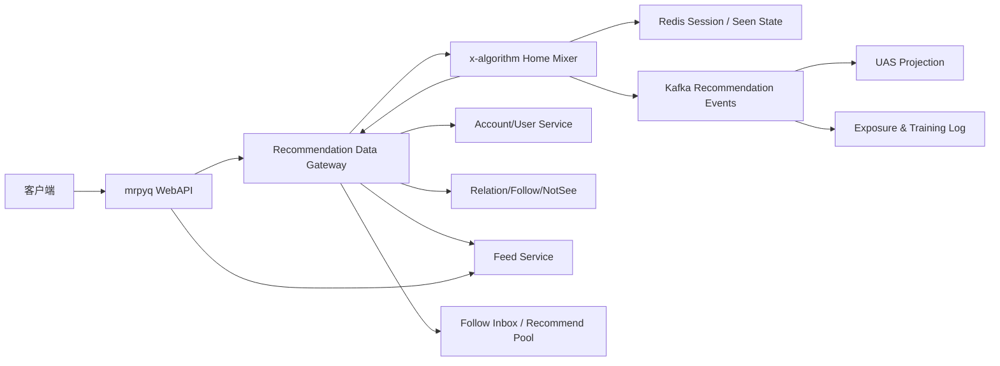

# 基于 mrpyq 的推荐支撑服务复用与补齐分析

> **状态**：`design`
>
> **篇首更新说明（2026-09-17）**：本文写作时假设推荐侧直接对接 mrpyq。此后架构已演进为 home-mixer → rec-bff（`recommend/rec-bff`，独立 Go 门面，实现 `recommendation_data.proto` + `viewer_relation.proto` 两份合同）→ mrpyq Feed / Account。文中关于「mrpyq 直接提供推荐 RPC」的方案性结论部分被取代：当前对接现状与缺口以 [`recommendation-production-readiness-assessment.md`](./recommendation-production-readiness-assessment.md) 为准，皮维度接口要求以 [`implementation/mrpyq-member-dimension-requirements.md`](./implementation/mrpyq-member-dimension-requirements.md) 为准。mrpyq 侧的存储 / 现网分析（关注收件箱、不看 / 不让看、审核字段等）仍有效。
>
> **依据**：[`recommendation-service-mvp-assessment.md`](./recommendation-service-mvp-assessment.md)
>
> **主业务仓库**：mrpyq（`/Users/hejun/work/mp/mrpyq` 为本地路径，文档引用以其仓库名为准）
>
> **分析目标**：识别当前主业务系统中可直接复用、需要适配、需要补齐的推荐数据与支撑能力，并给出首版集成边界。
>
> **事实边界**：本文基于两个仓库当前工作树的静态代码和文档；“代码存在”不等同于“目标环境已经部署、开启或达到生产 SLA”。

---

## 1. 执行摘要

### 1.1 核心结论

`mrpyq` 已经具备推荐 MVP 所需的大部分业务真源和基础设施，不需要再建设一套平行的用户、内容、关系、审核、Kafka 或关注流服务。

当前可复用的核心能力包括：

- 账号认证和用户身份上下文；
- 权威帖子数据、批量内容查询和作者身份字段；
- 帖子删除、公开范围、文本/图片/视频审核状态；
- 关注、好友、屏蔽、“不看”和“不让看”关系；
- 关注流 Redis 收件箱和好友圈 Mongo 投影；
- 全站推荐候选池和帖子准入规则；
- 点赞、评论、收藏、礼物、点击等部分行为数据；
- Kafka 事件总线、Redis/Tair、MongoDB、HBase 和链路追踪；
- 一套现有 Gorse 风格推荐客户端和事件桥接代码。

真正阻断 `x-algorithm` 接入真实业务的，不是“没有业务数据”，而是下面几项合同尚未闭合：

1. **ID 与身份语义不兼容**：`mrpyq` 使用 ObjectID 字符串，并同时存在 `account_id`、`member_id`、`user_id`、`user_no/member_key`；`x-algorithm` 当前主要使用 `u64/i64` 的 viewer、post、author ID。
2. **缺少面向推荐的聚合数据合同**：数据分散在 Feed、Account、Relation、NotSee 等多个 RPC 和存储中，Home Mixer 不能直接把现有 X 风格 TES/Gizmoduck/Strato 接口连到业务服务。
3. **曝光闭环不完整**：已有互动反馈，但没有可审计的“推荐请求 → 候选 → 排序 → 实际曝光 → 后续行为”关联。
4. **已看状态和翻页合同不统一**：`mrpyq` 使用 Redis ZSET/page token，Home Mixer 使用 seen/served/impressed IDs；需要统一短期会话状态。
5. **推荐事件可靠性和数据治理不足**：现有推荐事件链路多处记录错误后继续消费，缺少已证实的重试、DLQ、重放和对账闭环。
6. **现有 Gorse 接入不能直接视为已生产闭合**：仓库有客户端和同步链路，但未发现 Gorse 部署定义；提交的 Feed 部署配置也未显式开启 `rec_sys.is_open`，不能据此判断线上已启用。

### 1.2 推荐的建设边界

建议采用以下边界：

```text
mrpyq
  继续拥有：账号、角色、帖子、关系、审核、互动和原始事件

x-algorithm
  只拥有：推荐请求编排、候选融合、规则/模型打分、多样性和推荐结果

新增支撑层
  负责：身份映射、批量数据适配、曝光日志、短期状态和事件标准化
```

首版不应先建设 Thunder、Phoenix、ANN 或 Feature Store。最小可上线形态是：

```text
一个推荐应用（Home Mixer 或其轻量配置）
+ mrpyq 现有关注流候选
+ mrpyq 现有全站推荐池兜底
+ mrpyq 权威内容/审核/关系过滤
+ 规则排序
+ Redis 短期已看状态
+ Kafka 曝光与互动日志
```

---

## 2. 两个仓库的职责边界

| 维度 | x-algorithm | mrpyq | 集成判断 |
| --- | --- | --- | --- |
| 核心职责 | 推荐召回、补全、过滤、排序、多样性和结果编排 | 账号、帖子、关系、审核、互动和业务 API | `mrpyq` 保持业务真源，`x-algorithm` 不复制业务状态机 |
| 技术栈 | Rust/Tonic；Phoenix 为 Python/JAX；Kafka/gRPC | Go/Kratos/Gin；Kafka/gRPC；多种存储 | 使用进程间 RPC/事件集成，不做 FFI 或代码嵌入 |
| 内容存储 | 无业务权威主库；TES 当前为 Demo/Disabled adapter | Feed Mongo 模型和 FeedService RPC | 内容必须从 `mrpyq` 获取 |
| 关系存储 | Strato/SocialGraph 端口，生产 adapter 缺失 | Relation/Follow RPC 和 Feed 投影 | 关系必须从 `mrpyq` 获取 |
| 审核与权限 | Visibility Filtering 端口，生产 adapter 缺失 | Feed 审核字段、风控服务、隐私关系 | 需要把分散状态聚合成推荐资格合同 |
| 行为数据 | UAS 端口，当前生产实现缺失 | 点赞、评论、收藏、礼物、点击和部分播放数据 | 原始数据可复用，但要新增统一行为投影 |
| ID | `u64/i64`，部分逻辑隐含 Snowflake 时间 | 24 位 ObjectID 字符串，多重身份 | 当前协议不能直接对接 |
| 在线状态 | 单进程 served history；曝光 sink 默认未装配 | Redis/Tair 已大量使用；推荐缓存已有实现 | 可复用 Redis，但需要新 key/schema 和会话合同 |

---

## 3. 可复用能力总览

### 3.1 成熟度定义

| 等级 | 含义 |
| --- | --- |
| **可直接复用** | 已有稳定业务真源或批量接口，只需接入配置和调用 |
| **适配后复用** | 数据和代码存在，但协议、身份、错误或性能合同不满足推荐侧要求 |
| **仅作基线参考** | 有现有实现，但不建议成为新链路的长期依赖 |
| **需要新建** | 未形成推荐需要的完整能力 |

### 3.2 能力矩阵

| 推荐所需能力 | mrpyq 当前事实 | 成熟度 | 建议 |
| --- | --- | --- | --- |
| 用户认证 | AccountService 有 `VerifyToken`/`VerifyTokenWithAuth`；WebAPI 从可信上下文取得账号 ID；内部 gRPC 使用 metadata 传递账号 ID | 适配后复用 | 客户端不能直接传任意 viewer ID；由 WebAPI/网关写入可信账号身份 |
| 账号状态与权限 | AccountService 有 `GetAccountAuth`、`LoadAccountAuths`、封禁和交互许可能力 | 适配后复用 | 汇总为推荐 viewer/author eligibility，不让 Home Mixer理解全部业务字段 |
| 作者资料 | AccountService 有 `BatchGetMembers`、`BatchGetProfiles`、`BatchGetUsers` 等批量接口 | 可直接复用 | 作者展示和状态批量补全走 AccountService，不复制用户表 |
| 权威帖子 | FeedService 有 `GetFeed`、`BatchGetFeeds`、`GetFeedItem`、`BatchGetFeedItems` | 可直接复用 | 为推荐新增轻量批量 DTO 更合适，避免重型客户端展示聚合 |
| 内容审核 | Feed 有 `visible`、`isdeleted`、`audit_visible`、`c_audit`、图片和视频审核字段；Feed Job 接收 AI 审核事件 | 适配后复用 | 建立单一 `recommendation_eligible` 判断，未知状态保守拒绝探索内容 |
| 关注关系 | FollowService 支持关注增删、关注列表、粉丝列表和关注事件 | 可直接复用 | 关系服务作为真源；大列表召回优先读现有 Feed inbox 投影 |
| 好友关系 | RelationService 支持好友增删、全量/分页读取和批量查询 | 可直接复用 | 仅在产品需要好友圈候选时使用，不要和关注关系混淆 |
| 屏蔽相关关系 | RelationService 有 `ListBlockMembers`，但位于会话接收模式领域；Feed NotSeeService 有明确的“不看/不让看”批量接口 | 适配后复用 | 先确认 block 是否适用于内容推荐；明确后再与 not-see、not-allow-see 合并为作者级 hard filter |
| 关注流候选 | FeedService 已有账号级和 member 级 Follow Inbox；Redis ZSET 保存最近候选，容量 2000、TTL 7 天 | 可直接复用 | MVP 可直接替代 Thunder，无需再同步一份关注网络缓存 |
| 好友圈候选 | 已有账号级 Mongo 投影、持久分发任务、读时关系与 Privacy 门禁 | 可直接复用 | 作为好友圈专用候选，不作为全站发现池 |
| 全站候选池 | `K:ALL_FEED_RECOMMEND_POOL` Redis ZSET；有热度、内容长度、专区/标签、作者资格等准入规则 | 适配后复用 | 作为近期热门/业务合格兜底池；需补容量、过期和对账 SLA |
| 个性化候选 | `pkg/xrecsys` 可调用外部 Gorse 风格 API；Feed Job 同步 user/item/feedback | 仅作基线参考 | MVP 不应强依赖；可用于影子对比或迁移兼容 |
| 内容标签 | Feed 标签、专区、section、作者标签和标签关注均已存在 | 可直接复用 | 用于规则召回、偏好和多样性；建立稳定 ID taxonomy，不只传字符串名 |
| 热度信号 | Feed counter 有点赞、评论、举报、礼物；推荐池已有 `like + 2*comment` 基线 | 适配后复用 | 首版增加时间衰减，避免只看累计值 |
| 正向互动 | 点赞、评论、收藏、礼物、详情点击均有入口；部分已写入推荐反馈 | 适配后复用 | 统一行为事件，不直接把现有零散调用当完整训练数据 |
| 负向反馈 | 举报、block、not-see、not-allow-see、用户标签屏蔽存在 | 适配后复用 | 补齐 item 级“不感兴趣”、快速划过和撤销语义 |
| 曝光日志 | 未发现包含 request ID、position、source、score 的统一 Feed 曝光合同 | **需要新建** | MVP 第一日必须建设 |
| 已看状态 | Gorse 查询有延迟 write-back `read`；Home Mixer 有单进程 served history；mrpyq 无统一近期曝光服务 | **需要新建** | Redis 短期状态 + 客户端 seen IDs；不要把推荐返回等同于真实曝光 |
| 行为序列/UAS | 原始互动丰富，但没有 Home Mixer 需要的统一、有序、有界动作序列服务 | **需要新建** | 从标准化行为 topic 投影到 Redis/KV |
| 规则排序配置 | 推荐池有准入阈值配置，但没有完整的新鲜度/热度/关系/多样性权重配置 | **需要补齐** | 可先作为推荐应用内部配置，不必独立微服务 |
| Kafka | Feed/Account/Relation 已有 Kafka 生产消费基础 | 可直接复用 | 新 topic 必须版本化、可重放、可监控；不复制现有吞错语义 |
| Redis/Tair | 已用于候选 inbox、推荐缓存和大量业务状态 | 可直接复用 | 用于短期已看、会话和降级缓存，不作为不可重建真源 |
| 监控 | 有 OpenTelemetry/Jaeger 和部分结构化业务日志 | 适配后复用 | 补推荐业务指标、readiness、事件 lag 和数据对账 |
| RankService | 当前是礼物、人气、派对房等榜单服务 | 不适用 | 不要误认为推荐排序服务，也不建议扩展成推荐引擎 |

---

## 4. 可以直接复用的主业务能力

### 4.1 身份认证与可信 viewer

现有账号服务已经提供 token 验证和账号权限查询：

- `api/account/service/v1/account.proto`
  - `VerifyToken`
  - `VerifyTokenWithAuth`
  - `GetAccountAuth`
  - `LoadAccountAuths`
- `pkg/ctxdata/ctxdata.go`
  - 内部 gRPC metadata key：`x-md-local-aid`
- `app/webapi/interface/internal/api/feed.go`
  - Feed 请求的 `account_id` 来自 WebAPI 已解析的请求上下文，而不是普通查询参数。

因此推荐服务不需要重新建设登录和账号认证。正确做法是：

1. 客户端调用 `mrpyq` WebAPI；
2. WebAPI 完成 token 校验；
3. WebAPI 或推荐网关以服务间可信 metadata 把 `account_id` 传给推荐服务；
4. 推荐服务拒绝普通调用方自行指定任意账号。

需要补齐的是服务到服务认证、调用方白名单和审计，不是重新做用户登录。

### 4.2 权威帖子与批量水合

FeedService 已经是内容真源，核心协议位于：

- `api/feed/service/v1/feed.proto`
  - `GetFeed`
  - `BatchGetFeeds`
  - `GetFeedItem`
  - `BatchGetFeedItems`
- `app/feed/service/internal/data/po/feed.go`
  - 正文、媒体、作者、专区、标签、创建时间、可见性、删除、审核、置顶和互动计数。

首版可以直接通过批量 RPC 水合候选，不应让 `x-algorithm` 直接连接业务 MongoDB。

不过 `BatchGetFeedItems` 面向客户端展示，可能包含评论、点赞身份等较重数据。长期建议增加面向推荐的轻量内部 RPC，例如：

```proto
rpc BatchGetRecommendationContents(BatchGetRecommendationContentsReq)
    returns (BatchGetRecommendationContentsReply);
```

最小字段建议包括：

- `feed_id`；
- `creator_account_id`、`creator_member_id`、`creator_user_id`、`creator_user_no`；
- 正文、语言、媒体类型、视频时长；
- 创建时间；
- 标签、专区和 section IDs；
- 点赞、评论、收藏、礼物等聚合计数；
- 删除、公开、文本审核、图片审核、视频审核；
- 推荐资格和不可推荐原因。

### 4.3 作者资料

账号服务已有丰富的批量资料接口，位于 `api/account/service/v1/account.proto`：

- `BatchGetMembers`
- `BatchGetMembersByKeys`
- `BatchGetProfiles`
- `BatchGetProfilesByKeys`
- `BatchGetUsers`

推荐侧无需复制作者表。需要先决定“作者主键”的业务含义：

- `account_id`：真实账号主体；
- `member_id`：账号扮演某个角色后的身份实例；
- `user_id + user_no/member_key`：角色语义与编号；
- `user_id`：名人/角色模板，不一定对应唯一真实创作者。

**不建议直接把 `user_id` 当推荐 author ID。** 多个账号可能扮演同一角色，若按 `user_id` 做作者多样性、屏蔽或行为聚合，可能把不同创作者错误合并。

### 4.4 关注、好友与隐私关系

关系能力已经较完整：

- `api/relation/service/v1/follow.proto`
  - 关注、取消关注；
  - 关注列表、粉丝列表；
  - 账号级/皮级关注列表；
  - 关注事件。
- `api/relation/service/v1/relation.proto`
  - 好友增删改查；
  - 账号/皮级好友列表；
  - `ListBlockMembers`；该接口位于会话接收模式领域，是否等同于内容推荐屏蔽需要业务确认。
- `api/feed/service/v1/not_see.proto`
  - 不看某个身份；
  - 不让某个身份看；
  - 批量检查。

这些能力可以支撑：

- 关注作者召回；
- 好友圈召回；
- 关系强度加分；
- 已确认语义后的 block，以及 not-see/not-allow-see hard filter；
- 作者级负反馈。

关系服务是权威真源，Feed inbox 和好友圈投影只是高性能候选视图，不能单独授予可见权限。

### 4.5 关注流候选可替代 Thunder

`mrpyq` 已经存在类似 Thunder 目标价值的关注流读优化：

- `api/feed/service/v1/follow.proto`
  - `ListAccountFollowInbox`
  - `ListMemberFollowInbox`
  - 初始化和批量更新接口。
- `app/feed/service/internal/data/feed_follow_inbox.go`
  - 账号级 Redis ZSET；
  - 2000 条容量；
  - 7 天 TTL；
  - 按 score 倒序分页。
- `app/feed/service/internal/data/feed_member_follow_inbox.go`
  - member 级对应实现。
- `app/webapi/interface/internal/biz/feed.go`
  - 未初始化时从 Relation 获取关注列表并初始化 inbox；
  - 读取后仍执行删除、审核、不看和不让看过滤。

因此 MVP 阶段不应再把 Feed 发布事件同步到 Thunder，然后维护第二套关注流缓存。直接复用现有 Follow Inbox 更简单，也更符合当前业务关系语义。

只有当现有 inbox 的容量、TTL、初始化成本或 QPS 成为瓶颈时，才评估 Thunder 或重构现有关注流服务。

### 4.6 全站近期热门候选池

主业务仓库已经有一个可用作热门兜底的全站候选池：

- `app/feed/service/internal/data/feed_recommend_distribute.go`
- `app/webapi/interface/internal/biz/feed_recommend_distribution.go`
- `app/feed/service/internal/data/feed.go::ListFeedsByRecommendV2`

当前行为包括：

- 只接受未删除、公开、符合专区条件的帖子；
- 排除特定业务专区和内容关键词；
- 无图短文本不进入候选池；
- 根据点赞和评论热度阈值准入；
- 检查作者是否被禁止推荐；
- 检查专区名人或作者标签资格；
- 写入 Redis ZSET `K:ALL_FEED_RECOMMEND_POOL`；
- 按 score 倒序分页，池容量约 2000 条。

这已经足够作为 MVP 的“全站近期热门兜底池”。需要补齐的不是重新建候选服务，而是：

1. 给候选池定义明确的时效窗口和容量 SLA；
2. 将“准入时间 score”改为可解释的规则分数或保留独立 `created_at`；
3. 增加候选池空、过期、漏删和规模异常监控；
4. 对 Redis 候选与权威 Feed 状态做定期对账；
5. 收敛重复准入规则，避免 WebAPI、FeedService data 层和 Gorse item 入池规则漂移。

### 4.7 标签与兴趣信号

可复用的数据包括：

- Feed 标签、专区、section；
- 作者标签；
- 用户关注的 Feed 标签；
- 账号最近使用的角色和最近进入的专区；
- 现有 `device_rec` 中的最近用户和房间数据。

关键文件：

- `app/feed/service/internal/data/feed_tag_follow.go`
- `api/feed/service/v1/feed.proto` 中标签关注 RPC
- `app/account/service/internal/data/account_room.go`
- `app/account/service/internal/data/po/account.go::AccountRec`
- `app/feed/job/internal/server/event_feed_recsys.go`

这些数据足以支撑首版的：

- 用户关注标签候选；
- 标签偏好加分；
- 新用户主动兴趣冷启动；
- 标签和专区多样性。

现有 Gorse 用户 labels 主要由最近角色和最近房间名称拼接而成，最多保留少量记录；它可以作为启发式基线，但还不是带来源、权重和时间衰减的长期画像。

### 4.8 内容安全与最终过滤

Feed 和 WebAPI 已经有较完整的安全过滤事实：

- Feed 实体字段：删除、公开范围、文本审核、图片审核、视频审核；
- `Feed.IsVisible(accountId)`：非作者不能看到审核失败或不可见内容；
- `FeedUseCase.loadFeedItems`：过滤删除、不可见、文本/视频审核不通过；
- `FeedUseCase.buildFeedItemsAfterLoad`：过滤“不看”和“不让看”；
- 推荐池准入：排除部分违规/低质量内容和被禁止推荐作者；
- Feed Job：内容审核通过后才向外部推荐系统插入 item。

这些能力应复用，但目前安全状态分散在多个字段、RPC 和调用层。推荐侧需要一个聚合 adapter，返回统一结果：

```text
eligible / ineligible / unknown
+ reason_code
+ authoritative_version/update_time
```

安全状态未知时，建议沿用评估文档原则：

> 网外探索内容 fail closed；不要因为审核或资格服务超时而放行。

---

## 5. 现有推荐链路可复用到什么程度

### 5.1 已有 Gorse 风格推荐接入

`mrpyq` 已经包含一条推荐链路：

```text
Feed/Account 业务事件
  -> Kafka event_recsys
  -> Feed Job
  -> pkg/xrecsys HTTP Client
  -> 外部推荐引擎

FeedService.ListFeedItemsBySquare
  -> GetUserRecommend
  -> Redis 分页缓存
  -> 热门池兜底
  -> FeedItem 水合和业务过滤
```

关键代码：

- `pkg/xrecsys/*`
- `app/feed/service/internal/data/feed_recsys.go`
- `app/feed/job/internal/server/event_feed_recsys.go`
- `app/account/service/internal/data/event_source.go`
- `app/account/service/internal/data/account_room.go`

它已经覆盖：

- user/item/feedback 三类对象；
- 用户 labels；
- 帖子 labels 和时间；
- 点赞、评论、礼物反馈；
- 广场详情点击和收藏反馈；
- 删除/不可见 item 删除；
- 推荐结果短期 Redis 缓存；
- 外部推荐失败后回到全站候选池的基本兜底路径。

### 5.2 为什么不能直接把它视为生产能力

1. **部署状态不明**：仓库只有客户端配置，未发现 Gorse 服务部署定义。
2. **开关状态不明**：`EnableRecommend` 依赖 `rec_sys.is_open`，当前提交的 Feed 部署配置未显式设置该字段；protobuf bool 默认是 false。
3. **事件失败可能丢失**：Feed Job 多处在外部 HTTP 写失败时只记录日志，不把错误返回给 Kafka handler，缺少可见的重试/DLQ 保证。
4. **HTTP 客户端不够稳健**：`pkg/xrecsys/client.go` 只有较长 dial timeout，没有整体请求超时和 response-header timeout；JSON decode 错误被忽略。
5. **反馈不完整**：取消点赞、删除评论、取消收藏、举报、不感兴趣、快速划过、停留和视频完成率未形成统一闭环。
6. **`read` write-back 不等于曝光**：推荐查询使用延迟 write-back `read`，它只能说明结果被请求，不能证明客户端真正展示。
7. **缺少归因字段**：推荐缓存只保存 feed ID 和人工时序 score，没有 request ID、position、source、原始 score、模型版本和实验版本。
8. **身份语义混合**：推荐 user key 使用账号 ID，帖子标签来自角色/用户数据，互动同时携带账号、角色和编号。
9. **规则可能漂移**：全站推荐池准入、Gorse item 准入和业务展示过滤不是同一份规则。

结论：现有链路值得复用为迁移入口、事件样例和 fallback，但不应成为新推荐系统唯一的数据合同。

---

## 6. 必须补齐的能力

### 6.1 P0：身份和 ID 合同

这是当前最优先的阻断项。

### 业务身份建议

| 推荐概念 | mrpyq 建议映射 | 说明 |
| --- | --- | --- |
| viewer | `account_id` | 推荐对象应是登录账号，行为和长期偏好按账号聚合 |
| post | `feed_id` | 权威内容 ID |
| author account | `creator_account_id` | block、账号处罚和真实主体 |
| author identity | `member_id` | 作者多样性和展示身份优先使用 |
| character/template | `user_id + user_no` | 用于标签、角色语义和展示，不应默认作为唯一作者 |
| topic | `feed_tag_id` / `section_id` / `room_id` | 三者不能直接混成一个裸 ID namespace |

### ID 技术方案

`mrpyq` ObjectID 不能直接填进当前 Home Mixer 的 `u64/i64` 字段。可选方案：

#### 方案 A：修改 x-algorithm 推荐域协议为字符串 ID（优先推荐）

优点：

- 保持业务 ID 原样；
- 无额外映射服务；
- 调试、审计和回放简单；
- 避免哈希碰撞和生命周期问题。

代价：

- 需要系统性修改 Home Mixer、Thunder、Phoenix gateway 和相关 proto；
- 当前 Snowflake 年龄推导需要改为显式 `created_at_ms`。

#### 方案 B：建立持久 ID Registry

如果短期必须保持 `u64`：

- 持久保存 `namespace + external_id <-> internal_u64`；
- namespace 至少区分 account/feed/member/user/room/tag/section；
- 必须双向唯一、幂等创建、支持批量查询和审计；
- Redis 只作缓存，MySQL/专用 KV 是真源；
- 候选年龄必须读取显式创建时间，不能依赖映射后 ID 的位结构。

不接受直接截断 ObjectID、裸 hash 或跨 namespace 共用 ID。

### 6.2 P0：Recommendation Data Gateway/Adapter

不建议让 Home Mixer 请求期分别理解 Account、Relation、Feed、NotSee 和风控的全部业务接口。应增加一个面向推荐的数据适配层，可以是：

- `mrpyq` 内新增独立 `recommendation-data` service；或
- 在现有服务上新增一组内部聚合 RPC，由 `x-algorithm` 写 adapter client。

首版建议接口：

```text
GetViewerContext
  -> 账号资格、关注身份、屏蔽身份、主动兴趣、近期已看

ListNetworkCandidates
  -> 复用 Account/Member Follow Inbox

ListFallbackCandidates
  -> 复用全站推荐池、精选池或标签池

BatchGetRecommendationContents
  -> 内容、作者身份、媒体、创建时间、互动计数、标签

BatchCheckRecommendationEligibility
  -> 删除、审核、权限、block/not-see/not-allow-see、作者状态
```

适配层不拥有业务数据，只提供稳定、批量、限时、可观测的推荐合同。

### 6.3 P0：曝光与推荐归因日志

必须新增统一事件，至少包含：

```text
request_id
viewer_account_id
feed_id
creator_account_id/member_id
candidate_source
rank_position
rank_score
rule/model_version
experiment_id
returned_at
exposed_at
client_session_id
page/scene
```

需要区分三个时点：

1. 候选进入推荐管道；
2. 服务端返回；
3. 客户端实际曝光。

只有第三项可以作为真实曝光。现有 Gorse `write-back-type=read` 不能替代客户端曝光事件。

推荐事件链应支持：

```text
推荐请求
  -> 候选与过滤原因
  -> 返回顺序
  -> 实际曝光
  -> 点击/停留/点赞/评论/收藏/分享/举报/不感兴趣
```

### 6.4 P0：短期已看和翻页状态

首版建议两层：

- 客户端携带当前会话 `seen_feed_ids`；
- Redis 保存用户近期返回/曝光的有限 feed IDs 和请求时间。

需要统一 `mrpyq` page token 与 Home Mixer seen/served 模型。可选做法：

1. 继续由 WebAPI 暴露 page token；
2. token 只保存不透明 session ID；
3. Redis 中保存该 session 的候选快照、已下发位置和有效期；
4. 推荐服务根据 session 恢复已下发集合。

不要把完整候选或业务状态编码到客户端 token，也不要依赖单进程内存保证多实例翻页。

### 6.5 P0：可靠事件标准

新推荐事件至少需要：

- `event_id`；
- `schema_version`；
- `event_time` 和 `ingested_at`；
- 主体 namespace 与 ID；
- 业务对象版本；
- create/update/delete/tombstone；
- 撤销行为对应的原事件或幂等 key；
- source topic/partition/offset；
- 可重放和对账策略。

现有 `MpEventMessage + base64 body` 可以继续作为业务原始事件，但建议桥接为版本化的推荐领域事件，不要让 Rust/Python 服务直接解析全部历史 JSON 变体。

### 6.6 P1：统一行为序列/UAS

当前可用原始行为：

- 详情点击；
- 点赞/取消点赞；
- 评论/删除评论；
- 收藏/取消收藏；
- 礼物；
- 举报；
- block/not-see；
- 部分播放/阅读记录。

需要建立动作字典，例如：

| 业务行为 | 推荐动作 | 方向 | 是否可撤销 |
| --- | --- | --- | --- |
| 实际曝光 | `impression` | 中性/负样本基础 | 否 |
| 详情点击 | `click` | 正向 | 否 |
| 有效停留 | `dwell` | 正向，连续值 | 否 |
| 点赞 | `like` | 强正向 | 是 |
| 评论 | `comment` | 强正向 | 是 |
| 收藏 | `favorite` | 强正向 | 是 |
| 礼物 | `gift` | 强正向 | 业务上可冲正 |
| 不感兴趣 | `not_interested` | 强负向 | 可取消 |
| 举报 | `report` | 强负向 | 后台可能改判 |
| 屏蔽作者 | `block_author` | hard negative | 是 |
| 快速划过 | `quick_skip` | 弱负向 | 否 |

在线 UAS 可以投影到 Redis/KV，原始 Kafka/日志仓保留为可重建真源。

### 6.7 P1：规则排序和配置

首版可直接使用以下 mrpyq 信号：

- `created_at` 新鲜度；
- 是否关注作者；
- 点赞、评论、收藏、礼物等热度；
- 用户关注标签；
- 最近角色/专区偏好；
- 作者/账号处罚；
- not-see/block/report 负反馈；
- 作者、专区、标签多样性。

建议规则：

```text
score = freshness
      + relationship_boost
      + decayed_engagement
      + topic_preference
      - negative_feedback_penalty
```

再执行：

- 同作者前 N 条限制；
- 同专区/标签连续数量限制；
- 关注流与热门池来源配额；
- 自己发布、已看、审核不通过 hard filter。

权重和阈值放入可热更新、可回滚的配置。现有 `feed_recommend_base_conf` 和 `feed_recommend_room_conf` 可以复用配置存储模式，但其字段只覆盖候选准入，不足以表达完整排序策略。

### 6.8 P1：推荐业务监控与对账

需要新增：

- 请求成功率、P50/P95/P99；
- 各候选来源数量；
- 水合缺失率；
- 各过滤原因数量；
- 推荐空结果率和短页率；
- 重复曝光率；
- 作者集中度；
- fallback 使用率；
- 安全状态 unknown/deny 比例；
- ID 映射失败率；
- Kafka lag、失败、DLQ 数量；
- 曝光日志与互动关联率；
- Redis 会话状态命中率。

并建立至少每日对账：

- 候选池中的 feed 是否仍公开、未删除、审核通过；
- 删除/私密 feed 是否已从所有派生候选删除；
- 推荐事件与业务主库状态是否一致；
- 曝光和互动是否能关联到 request/item。

---

## 7. 不需要新建或不应直接复用的服务

| 服务/能力 | 判断 | 原因 |
| --- | --- | --- |
| 新用户服务 | 不新建 | Account/User 已有权威资料和批量接口 |
| 新内容服务 | 不新建 | FeedService 已是权威内容系统 |
| 新关系服务 | 不新建 | Follow/Relation/NotSee 已覆盖主要关系 |
| 新审核服务 | 不新建 | 复用 Feed/Fengkong 结果；只增加资格聚合 adapter |
| 新 Kafka 集群 | 不新建 | 主业务已有 Kafka；先复用并补可靠性 |
| Thunder | MVP 不建设 | 已有 Follow Inbox，Thunder 会制造重复投影和运维成本 |
| Phoenix/ANN | MVP 不建设 | 曝光负样本、UAS、ID 和索引合同尚未闭合 |
| RankService | 不复用 | 当前是礼物/人气榜单，不是内容推荐排序 |
| Gorse 作为强依赖 | 暂不 | 部署和开关状态不明，反馈与可靠性不完整 |
| 直接读业务 Mongo | 不建议 | 分库和业务语义复杂，容易绕过权限和状态机 |

---

## 8. 推荐的最小集成架构



### 请求路径

1. WebAPI 校验 token，取得可信 `account_id`；
2. Gateway 获取 viewer context；
3. 从 Follow Inbox 取关注候选；
4. 从全站推荐池取兜底候选；
5. 批量获取轻量内容和作者信息；
6. 过滤删除、审核、权限、block、not-see、已看和自己发布；
7. Home Mixer 使用规则排序、来源平衡和作者多样性；
8. 返回 feed IDs、score、source、reason 和 request ID；
9. WebAPI/FeedService 继续完成现有置顶和客户端展示水合；
10. 服务端记录返回事件，客户端回传真实曝光；
11. 后续互动进入统一行为 topic。

### 服务职责

#### Recommendation Data Gateway

- 身份和 ID 适配；
- 业务 RPC 聚合；
- 批量、超时和错误语义；
- 安全资格聚合；
- 不保存权威业务状态。

#### Home Mixer

- 候选融合；
- 规则过滤与排序；
- 多样性和来源平衡；
- 输出推荐解释和 request ID。

#### Redis Seen/Session State

- 短期已下发/已曝光；
- 翻页候选快照；
- 有界 TTL；
- 可以从日志重建或接受丢失。

#### Recommendation Event Pipeline

- 返回、曝光和互动标准事件；
- UAS 投影；
- 离线分析/训练出口；
- 重试、DLQ、重放和对账。

---

## 9. 分阶段落地建议

### 9.1 阶段 0：冻结业务合同

必须先确认：

1. viewer 是 `account_id`；
2. 作者多样性使用 `member_id` 还是 `account_id`；
3. block/not-see/not-allow-see 分别作用于账号还是身份；
4. Feed 哪组字段是推荐资格的权威状态；
5. 关注流、好友圈和全站广场分别服务什么产品场景；
6. ObjectID 与 Home Mixer ID 的最终方案；
7. 客户端曝光事件和 page token 的兼容方案。

产物应包括：

- 身份语义矩阵；
- 内容资格状态机；
- 行为动作字典；
- 推荐 RPC proto；
- Kafka 事件 schema；
- 至少一组端到端 golden fixtures。

### 9.2 阶段 1：规则型 MVP

只接入：

- Follow Inbox；
- 全站推荐池；
- Feed 轻量批量水合；
- Account/Relation/NotSee 过滤；
- 新鲜度、关系、热度、标签偏好；
- 作者多样性和来源平衡；
- Redis 已看状态；
- 返回/曝光/互动日志。

不接：

- Phoenix；
- Thunder；
- ANN；
- Feature Store；
- 自动训练。

### 9.3 阶段 2：影子对比与数据闭环

- 旧广场/现有 Gorse 与新规则结果并行计算；
- 不影响用户返回；
- 比较候选交集、空结果、重复率、安全过滤和延迟；
- 建立曝光与互动关联；
- 验证事件重放和删除对账。

### 9.4 阶段 3：小流量替换

建议只切 `room_id == ""` 的全站广场：

- 专区流继续原实现；
- 关注流继续原实现或直接作为新推荐候选；
- 好友圈继续使用专用分发链路；
- 视频专流继续原实现。

保留实时 fallback：

```text
新推荐超时/空结果/安全异常
  -> 现有全站推荐池
  -> 精选/近期内容
```

### 9.5 阶段 4：模型化

只有在以下条件满足后再启用 Phoenix：

- 曝光与行为关联稳定；
- UAS 有明确动作、顺序、时效和撤销语义；
- 活跃内容池规模证明需要模型召回；
- 有可靠离线训练和评估数据；
- 模型不可用时规则 fallback 已验证；
- 事件和索引可以回放、重建和回滚。

---

## 10. 主要风险

| 风险 | 严重度 | 说明 | 建议 |
| --- | --- | --- | --- |
| account/member/user 身份串用 | 阻断 | 行为、关系、作者和标签可能聚合到错误主体 | 先冻结身份矩阵和 author key |
| ObjectID 与 u64 不兼容 | 阻断 | 截断/hash 会碰撞且破坏年龄逻辑 | 修改协议为 string 或建立持久 Registry |
| 推荐返回被误作曝光 | 高 | 训练负样本和去重状态失真 | 客户端真实曝光单独上报 |
| 审核字段分散 | 高 | 任一漏查可能导致违规内容进入探索流 | 单一 eligibility adapter，unknown fail closed |
| 现有事件失败后吞错 | 高 | 外部推荐投影静默缺数据 | 新链路增加 retry、DLQ、重放和告警 |
| 推荐池规则漂移 | 高 | Gorse、热门池、最终展示口径不一致 | 统一准入状态机和 reason codes |
| 翻页协议不兼容 | 高 | 重复、跳项或 token 失效 | Redis session + 不透明 token |
| 直接串联超过 1 秒预算 | 高 | mrpyq Feed gRPC 当前配置超时较紧，Home Mixer 依赖较多 | MVP 减少远程调用、批量化、并行化并评审总预算 |
| 负反馈与撤销缺失 | 中 | 模型和规则长期偏正向 | 统一动作字典和撤销事件 |
| 推荐业务指标缺失 | 中 | 服务可用但候选为空或数据断流无法发现 | 增加候选、过滤、空结果、lag、归因指标 |
| 配置样例含环境耦合值 | 中 | 新服务照搬会扩大凭证和环境风险 | 使用 secret/config 管理，不复制仓库中的明文值 |
| 把 RankService 当推荐服务 | 低 | 榜单领域和 Feed 排序语义完全不同 | 明确不复用 |

---

## 11. 建议新增的最小协议

下面是业务语义示例，不是最终 proto：

```proto
message RecommendationViewerContext {
  string account_id = 1;
  repeated string followed_member_ids = 2;
  repeated string blocked_account_ids = 3;
  repeated string blocked_member_ids = 4;
  repeated string muted_member_ids = 5;
  repeated string followed_tag_ids = 6;
  repeated string recent_seen_feed_ids = 7;
}

message RecommendationContent {
  string feed_id = 1;
  string creator_account_id = 2;
  string creator_member_id = 3;
  string creator_user_id = 4;
  int32 creator_user_no = 5;
  int64 created_at_ms = 6;
  string text = 7;
  repeated string tag_ids = 8;
  string room_id = 9;
  repeated string section_ids = 10;
  int32 like_count = 11;
  int32 comment_count = 12;
  int32 favorite_count = 13;
  bool has_image = 14;
  bool has_video = 15;
  int32 video_duration_ms = 16;
  bool recommendation_eligible = 17;
  string ineligible_reason = 18;
}

message RecommendationResultItem {
  string feed_id = 1;
  double score = 2;
  string source = 3;
  string reason = 4;
  int32 position = 5;
}

message RecommendationResponse {
  string request_id = 1;
  repeated RecommendationResultItem items = 2;
  string next_page_token = 3;
}
```

这个协议刻意保留业务字符串 ID，并显式携带创建时间，避免继续继承 X/Snowflake 假设。

---

## 12. 最终建议

### 可以复用

- Account/User 的认证、资料和状态；
- Feed 的权威内容、审核、删除、互动计数和批量查询；
- Follow/Relation/NotSee 的关系与隐私；
- Account/Member Follow Inbox；
- 好友圈现有分发投影；
- 全站推荐池及其业务准入经验；
- Feed/用户标签和标签关注；
- Kafka、Redis/Tair、MongoDB、HBase 和 tracing；
- `pkg/xrecsys` 作为迁移兼容参考。

### 必须补齐

- 身份语义和 ID 方案；
- 推荐数据聚合 Gateway/Adapter；
- 权威 eligibility 合同；
- 短期已看和翻页状态；
- request/候选/排序/曝光/行为日志；
- 统一行为字典和 UAS 投影；
- 可靠事件、DLQ、重放和对账；
- 推荐业务指标和规则配置。

### 暂不建设

- 新用户/内容/关系/审核服务；
- Thunder；
- Phoenix 和 ANN；
- Feature Store；
- 自动训练平台；
- 将现有 RankService 改造成推荐排序服务。

最终方向是：

> **不复制 mrpyq 已有的业务服务，也不让 x-algorithm 直接理解全部业务库表；在两者之间补一层稳定的推荐数据合同，并优先把曝光和行为闭环做完整。**

---

## 13. 关键证据路径

### mrpyq

- `api/account/service/v1/account.proto`
- `api/feed/service/v1/feed.proto`
- `api/feed/service/v1/follow.proto`
- `api/feed/service/v1/not_see.proto`
- `api/relation/service/v1/follow.proto`
- `api/relation/service/v1/relation.proto`
- `api/fengkong/service/v1/fengkong.proto`
- `app/feed/service/internal/data/po/feed.go`
- `app/feed/service/internal/data/feed_recsys.go`
- `app/feed/service/internal/data/feed_recommend_distribute.go`
- `app/feed/service/internal/data/feed_follow_inbox.go`
- `app/feed/service/internal/data/feed_member_follow_inbox.go`
- `app/feed/service/internal/data/feed_tag_follow.go`
- `app/feed/job/internal/server/event_feed_recsys.go`
- `app/feed/job/internal/server/event_feed_ai_audit.go`
- `app/webapi/interface/internal/biz/feed.go`
- `app/webapi/interface/internal/biz/feed_recommend_distribution.go`
- `app/account/service/internal/data/account_room.go`
- `app/account/service/internal/data/po/account.go`
- `pkg/ctxdata/ctxdata.go`
- `pkg/xrecsys/`
- `docs/architecture/friend-circle-distribution/current-release.md`

### x-algorithm

- `docs/recommendation-service-mvp-assessment.md`
- `proto/definitions/home_mixer.proto`
- `home-mixer/runtime_config.rs`
- `home-mixer/clients/tweet_entity_service_client.rs`
- `home-mixer/clients/gizmoduck_client.rs`
- `home-mixer/clients/socialgraph_client.rs`
- `home-mixer/clients/uas_fetcher.rs`
- `home-mixer/clients/impressed_posts_client.rs`
- `home-mixer/feed_state.rs`
- `home-mixer/side_effects/served_candidates_kafka_side_effect.rs`
