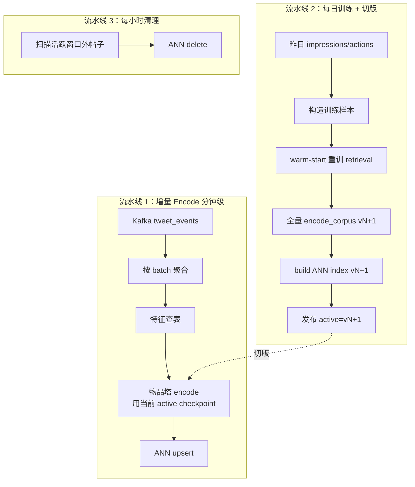

# 数据持续更新运维手册（Runbook）

状态：`runbook`

本文档是 [../training/data_preparation.md](../training/data_preparation.md) 的**操作层姊妹篇**：前者讲"为什么这样设计"，本文讲"具体怎么做"。

面向读者是数据/ML 平台工程师，拿到这份文档应该能直接照着搭出一套可持续运行的网内 + 网外数据管道。

---

## 目录

- [0. TL;DR 速查](#0-tldr-速查)
- [1. 网内持续更新（Thunder 链路）](#1-网内持续更新thunder-链路)
  - [1.1 准备工作](#11-准备工作)
  - [1.2 首次部署步骤](#12-首次部署步骤)
  - [1.3 日常运维动作](#13-日常运维动作)
  - [1.4 故障处理](#14-故障处理)
- [2. 网外持续更新（Phoenix 召回链路）](#2-网外持续更新phoenix-召回链路)
  - [2.1 准备工作](#21-准备工作)
  - [2.2 首次部署步骤](#22-首次部署步骤)
  - [2.3 持续运行的三条流水线](#23-持续运行的三条流水线)
  - [2.4 版本切换操作](#24-版本切换操作)
  - [2.5 故障处理](#25-故障处理)
- [3. 精排模型链路](#3-精排模型链路)
- [4. 定时任务汇总](#4-定时任务汇总)
- [5. 发布前检查清单](#5-发布前检查清单)

---

## 0. TL;DR 速查

| 链路 | 需要持续做的事 | 频率 | 执行主体 |
| :-- | :-- | :-- | :-- |
| **网内** | Kafka 消费 + 进程健康 | 实时 | `thunder` 进程 |
| **网外-增量 encode** | 新帖过物品塔 → ANN upsert | 分钟级 | 流式 Job |
| **网外-重训 retrieval** | 用最近 30–60 天样本重训双塔 | 每日/每周 | 离线任务 |
| **网外-全量 re-encode** | 用新 checkpoint 重算 corpus | 跟随重训 | 离线任务 |
| **精排-重训** | 用最近 30–60 天样本重训 ranker | 每日 | 离线任务 |
| **精排-热加载** | retrieval/ranker service 加载新 checkpoint | 跟随发布 | 服务滚动重启或热加载 |

---

## 1. 网内持续更新（Thunder 链路）

### 1.1 准备工作

**外部依赖：**

| 组件 | 要求 | 备注 |
| :-- | :-- | :-- |
| Kafka 集群 | topic `tweet_events` 或 `in-network-events`（v2 管道） | 分区数与 `--tweet-events-num-partitions`（默认 64）匹配 |
| Kafka 保留期 | ≥ Thunder 保留期 + 安全冗余 | 建议 **≥ 3–4 天**（Thunder 默认 2 天） |
| Strato（或替代） | 提供 `fetch_following_list(user_id)` | 仅在请求未带 `following_user_ids` 时回退使用 |

**Topic schema 约束：**

- 消息 payload 为 protobuf（见 [../../proto/definitions/in_network.proto](../../proto/definitions/in_network.proto)）。
- v1 消费原始 `TweetCreateEvent / TweetDeleteEvent`（[../../thunder/kafka/tweet_events_listener.rs](../../thunder/kafka/tweet_events_listener.rs)）。
- v2 消费已经筛选好的 `InNetworkEvent`（[../../thunder/kafka/tweet_events_listener_v2.rs](../../thunder/kafka/tweet_events_listener_v2.rs)），订阅固定 topic `in-network-events`。

**容量规划：**

| 指标 | 估算方式 |
| :-- | :-- |
| Thunder 内存 | `日均新帖数 × 保留天数 × LightPost 字节数 + 索引开销` |
| Kafka 单分区吞吐 | 按 "日均新帖数 / 86400 / 分区数" 估算 peak QPS，留 3–5 倍冗余 |

### 1.2 首次部署步骤

```bash
# 1. 确认 Kafka topic 已创建并有足够保留期
kafka-topics --describe --topic tweet_events
kafka-configs --describe --entity-type topics --entity-name tweet_events \
  | grep retention.ms   # 期望 >= 259200000 (3天)

# 2. 起 Thunder 进程（典型生产参数）
cargo run --release -p thunder -- \
  --grpc-port 50051 \
  --http-port 8080 \
  --post-retention-seconds 172800 \
  --kafka-brokers kafka-1:9092,kafka-2:9092,kafka-3:9092 \
  --kafka-group-id thunder-prod \
  --kafka-num-threads 8 \
  --kafka-batch-size 1000 \
  --tweet-events-num-partitions 64 \
  --auto-offset-reset earliest \
  --is-serving true
```

**启动过程关键路径**（见 [../../thunder/main.rs](../../thunder/main.rs)）：

1. `kafka_utils::start_kafka` 拉起 N 个 consumer 线程。
2. 每个线程 replay 到最新 offset 后向 `mpsc::channel` 发送"初始化完成"信号。
3. 主线程等 N 个信号到齐 → 调用 `post_store.finalize_init()` → 启动 stats logger 和 auto-trim 任务（每 2 分钟）。
4. `Server ready` 日志出现后才允许接外部流量。

**冷启动时长估算**：`Kafka replay 速度 ≈ Deserialized msgs/sec 日志` × 保留期内消息总数。典型值：千万级消息、8 线程、几分钟到十几分钟。

### 1.3 日常运维动作

| 动作 | 触发条件 | 操作 |
| :-- | :-- | :-- |
| **重启 Thunder** | 内存溢出 / 代码发布 | 滚动重启；靠 Kafka replay 自动恢复 |
| **扩容分区** | 高峰期 lag 持续 | 新增 Kafka 分区 → 重启 Thunder 让 group rebalance |
| **调整保留期** | 内存压力或召回不足 | 改 `--post-retention-seconds` → 滚动重启 |
| **清缓存重启** | schema 变更 | 用新 `--kafka-group-id` 重启（强制从头重放） |

### 1.4 故障处理

| 现象 | 根因排查顺序 | 处理 |
| :-- | :-- | :-- |
| `GetInNetworkPosts` 返回空 | 1. Kafka lag 2. PostStore size 3. following 列表是否为空 | 查 metrics `POST_STORE_TOTAL_POSTS` / `KAFKA_PARTITION_LAG` |
| 启动慢 | Kafka 消息堆积、replay 瓶颈 | 临时调大 `--kafka-num-threads` / 用 `--skip-to-latest=true` 跳过历史（代价是召回不足直到稳态） |
| 内存飙升 | 保留期过长 / 某作者异常高产 | 先降 `--post-retention-seconds`，再看 `MAX_*_POSTS_PER_AUTHOR` 是否需要收紧 |
| 老帖召回不到 | `MAX_POST_AGE = 48h` 过滤 | 这是预期行为，老帖属于网外链路 |

**一条黄金法则**：Thunder 出问题**优先滚动重启**，Kafka replay 是最可靠的自愈机制。

---

## 2. 网外持续更新（Phoenix 召回链路）

### 2.1 准备工作

**上游数据（来自业务）：**

| 数据 | 形态 | 时效 | 用途 |
| :-- | :-- | :-- | :-- |
| 曝光日志 `impressions` | 按日分区 Parquet | T+1 | 训练样本 |
| 互动日志 `action_log` | 按日分区 Parquet | T+1 | 训练标签 |
| 用户行为序列 `user_action_sequence` | 在线可查 | 请求时拉最近 300 条 | 用户塔输入 |
| 帖子事件流 `tweet_events` | Kafka | 实时 | 增量 encode 触发源 |
| 帖子元数据 | 每日快照 or 实时查询 | T+1 或实时 | 物品塔输入 |
| 用户 / 作者 embedding 特征 | 特征表 | T+1 | 双塔输入 |

字段定义见 [../training/training_data_spec.md](../training/training_data_spec.md) §2。

**基础设施：**

| 组件 | 用途 |
| :-- | :-- |
| Parquet 存储（S3 / HDFS / 本地） | 训练样本 + 模型产物 + 向量索引 |
| 调度器（Airflow / cron / Flyte / …） | 跑每日重训和 encode |
| 流式执行器（Flink / 自研 / 普通 Kafka consumer） | 增量 encode job |
| ANN 引擎（FAISS / Milvus / Vespa） | 向量索引 |
| Model Registry（可用 [../../phoenix/services/model_registry.py](../../phoenix/services/model_registry.py) 扩展） | checkpoint 版本管理 |
| GPU / TPU（训练用） | 训练任务 |

**目录约定**（强烈建议照抄，下游脚本依赖）：

```text
s3://your-bucket/
├─ training_data/date=YYYY-MM-DD/*.parquet
├─ checkpoints/
│  ├─ retrieval/vYYYYMMDD/{model_params.npz, config.json, _SUCCESS}
│  └─ ranker/vYYYYMMDD/{model_params.npz, config.json, _SUCCESS}
├─ vector_index/retrieval/vYYYYMMDD/{embeddings.npy, post_ids.npy, ann.index, _SUCCESS}
└─ registry/retrieval_active.txt   # 单行，内容是当前生产版本号
```

### 2.2 首次部署步骤

```bash
# —— 离线一次性准备 ——

# 1. 用最近 30–60 天业务日志构造训练样本
uv run scripts/build_training_samples.py \
  --start-date 2026-03-01 --end-date 2026-04-22 \
  --output s3://your-bucket/training_data/

# 2. 从零训练召回模型（首次全量新训练）
cd phoenix
uv run scripts/train_retrieval.py \
  --data s3://your-bucket/training_data/ \
  --output s3://your-bucket/checkpoints/retrieval/v20260422/ \
  --from-scratch

# 3. 从零训练精排模型
uv run scripts/train_ranker.py \
  --data s3://your-bucket/training_data/ \
  --output s3://your-bucket/checkpoints/ranker/v20260422/ \
  --from-scratch

# 4. 离线 encode 活跃窗口内所有帖子
uv run scripts/encode_corpus.py \
  --checkpoint s3://your-bucket/checkpoints/retrieval/v20260422/ \
  --posts "created_at >= now() - 14d" \
  --output s3://your-bucket/vector_index/retrieval/v20260422/

# 5. 构建 ANN 索引（以 FAISS 为例）
uv run scripts/build_ann_index.py \
  --input s3://your-bucket/vector_index/retrieval/v20260422/

# 6. 切流：将 v20260422 设为 active
echo "v20260422" > s3://your-bucket/registry/retrieval_active.txt

# —— 启动在线服务 ——

# 7. 启动 retrieval_service
PHOENIX_CHECKPOINT_PATH=s3://your-bucket/checkpoints/retrieval/v20260422/ \
PHOENIX_VECTOR_INDEX_PATH=s3://your-bucket/vector_index/retrieval/v20260422/ann.index \
uv run scripts/run_services.py --service retrieval

# 8. 启动 ranker_service
PHOENIX_CHECKPOINT_PATH=s3://your-bucket/checkpoints/ranker/v20260422/ \
uv run scripts/run_services.py --service ranker

# 9. 启动增量 encode job（见 §2.3）
```

> 注：步骤 1、4、5、9 中的脚本名是**建议命名**，仓库里目前只有 `scripts/train_retrieval.py`、`scripts/train_ranker.py`、`scripts/run_services.py`，其他脚本属于生产化时需要补齐的工程资产，文档这里先留出接口。

### 2.3 持续运行的三条流水线

网外链路稳态运行期间，**同时有三条管道在跑**，缺一不可：



#### 2.3.1 流水线 1：增量 encode（持续运行）

**执行方式**：长期运行的服务进程（类似 Thunder，但职责是"事件 → 向量 → 索引"）。

**伪代码**：

```python
consumer = KafkaConsumer("tweet_events", group_id="phoenix-indexer")
runner = RecsysRetrievalInferenceRunner.load(active_checkpoint_path)
ann = AnnIndex.connect(active_index_path)

buffer = []
while True:
    event = consumer.poll(timeout=1)
    match event:
        case TweetCreateEvent(post_id, author_id, ...):
            buffer.append(fetch_features(post_id))
        case TweetDeleteEvent(post_id):
            ann.delete(post_id)

    if len(buffer) >= BATCH or time_since_last_flush > 60s:
        batch, embeddings = assemble_batch(buffer)
        vectors = runner.encode_candidates(batch, embeddings)
        ann.upsert(buffer.post_ids, vectors)
        buffer.clear()

    if detect_active_version_changed():
        runner.reload(new_active_checkpoint)
        ann = AnnIndex.connect(new_active_index_path)
```

**关键点**：
- 必须监听 `registry/retrieval_active.txt` 版本变化，**切版后立刻停写旧索引、开始写新索引**（或停几分钟让离线流水线 2 完整覆盖）。
- batch 大小建议 1000，flush 间隔 ≤ 60s。
- encode 失败的帖子进死信队列，别阻塞主流。

#### 2.3.2 流水线 2：每日训练 + 切版（调度器触发）

**Airflow DAG 示意**：

```python
with DAG("phoenix_retrieval_daily", schedule="0 2 * * *") as dag:
    t1 = BashOperator("build_samples",
        bash_command="uv run scripts/build_training_samples.py --date {{ ds }}")

    t2 = BashOperator("retrain_retrieval",
        bash_command="""uv run phoenix/scripts/train_retrieval.py \
            --data s3://.../training_data/ \
            --warm-start s3://.../checkpoints/retrieval/$(cat active.txt)/ \
            --output s3://.../checkpoints/retrieval/v{{ ds_nodash }}/""")

    t3 = BashOperator("encode_corpus",
        bash_command="""uv run scripts/encode_corpus.py \
            --checkpoint s3://.../checkpoints/retrieval/v{{ ds_nodash }}/ \
            --output s3://.../vector_index/retrieval/v{{ ds_nodash }}/""")

    t4 = BashOperator("build_ann",
        bash_command="uv run scripts/build_ann_index.py \
            --input s3://.../vector_index/retrieval/v{{ ds_nodash }}/")

    t5 = BashOperator("publish_active",
        bash_command="""echo "v{{ ds_nodash }}" > s3://.../registry/retrieval_active.txt""")

    t1 >> t2 >> t3 >> t4 >> t5
```

**硬性顺序**：`retrain → encode → build_ann → publish`，一步不能跳。发布 active 之前 ANN 索引必须 ready。

#### 2.3.3 流水线 3：每小时清理（调度器触发）

```python
with DAG("phoenix_ann_cleanup_hourly", schedule="0 * * * *") as dag:
    BashOperator("cleanup",
        bash_command="""uv run scripts/cleanup_stale_ann.py \
            --window-days 14""")
```

### 2.4 版本切换操作

这是最容易出事故的环节，单独列出操作步骤：

**原子切换（推荐）**：

```text
1. 流水线 2 完成 vN+1 的 checkpoint + corpus + ANN index，写入 _SUCCESS
2. 更新 registry/retrieval_active.txt 为 vN+1
3. retrieval_service 监听版本变化（轮询或 watch），检测到后：
   a. 加载 vN+1 checkpoint（params）
   b. 加载 vN+1 ANN index（corpus_embeddings）
   c. 原子替换内部状态 (params, corpus) → 新版本
4. 增量 encode job 同样检测到版本变化，切换到 vN+1 写入路径
5. 保留 vN 资源 1–2 个周期供回滚
```

**服务侧实现对应位置**：
- [../../phoenix/services/retrieval_service.py](../../phoenix/services/retrieval_service.py) 现在是启动期一次性 `_init_model + vector_index.load + set_corpus`，生产化时需要把这三步包成"原子重新加载"函数并定期调用或响应信号。
- [../../phoenix/services/model_registry.py](../../phoenix/services/model_registry.py) 已经是独立的 registry 抽象，可以在此基础上加版本监听。

**两个铁律**：
- **checkpoint 和 ANN index 成对切**：绝不允许 "新 params × 旧 corpus"。
- **先 ready 再 publish**：active 文件只在所有产物有 `_SUCCESS` 后更新。

### 2.5 故障处理

| 现象 | 根因 | 处理 |
| :-- | :-- | :-- |
| 新帖子召回不到 | 增量 encode job 挂了 | 查 job 日志；短期内旧 ANN 仍可用，恢复后自动追上 |
| 召回质量突降 | 新 checkpoint 质量差 | 回滚 `active.txt` 到上一版本；所有服务自动加载旧索引 |
| retrieval_service OOM | corpus 太大 / embedding 维度过高 | 收紧活跃窗口天数；或切分片部署 |
| ANN 增量 lag | 流水线 1 吞吐不够 | 扩 encode worker；或者加大 batch |
| corpus 和 index 版本不一致 | 切版流程中断 | 重跑流水线 2 的 t3–t5 |
| 新帖子 embedding 用了错误的物品塔 | 切版时增量 job 没停 | 回滚 active，重跑 re-encode |

---

## 3. 精排模型链路

精排相对简单，因为**没有向量索引这个副产物**，只有 checkpoint。

**持续需要做的事：**

1. **每日重训 ranker**（流水线与 §2.3.2 类似，但不需要 encode + ANN 步骤）。
2. **ranker_service 热加载**新 checkpoint。

**Airflow DAG 示意：**

```python
with DAG("phoenix_ranker_daily", schedule="0 3 * * *") as dag:
    t1 = BashOperator("retrain_ranker",
        bash_command="""uv run phoenix/scripts/train_ranker.py \
            --data s3://.../training_data/ \
            --warm-start s3://.../checkpoints/ranker/$(cat ranker_active.txt)/ \
            --output s3://.../checkpoints/ranker/v{{ ds_nodash }}/""")

    t2 = BashOperator("publish_active",
        bash_command="""echo "v{{ ds_nodash }}" > s3://.../registry/ranker_active.txt""")

    t1 >> t2
```

**ranker_service 热加载对应位置**：[../../phoenix/services/ranker_service.py](../../phoenix/services/ranker_service.py) + [../../phoenix/services/model_registry.py](../../phoenix/services/model_registry.py)。同样推荐监听 `active.txt`，发现变化后原子替换 params。

精排重训频率**可以高于召回**（小时级也可行），因为不涉及 corpus 重算，代价小得多。

---

## 4. 定时任务汇总

| 任务 | 调度 | 时长参考 | 依赖 |
| :-- | :-- | :-- | :-- |
| `thunder` 主进程 | 常驻 | — | Kafka |
| 增量 encode job（流水线 1） | 常驻 | — | Kafka + active checkpoint + ANN |
| `build_training_samples` | 每日 02:00 | 30min–2h | 昨日 impressions / actions |
| `train_retrieval` | 每日 02:30 | 1–6h | 训练样本 |
| `encode_corpus` | 跟随 train_retrieval | 30min–2h | 新 checkpoint + 活跃窗口帖子 |
| `build_ann_index` | 跟随 encode_corpus | 5–30min | corpus embeddings |
| `publish_retrieval_active` | 跟随 build_ann | 秒级 | — |
| `train_ranker` | 每日 03:00 | 1–6h | 训练样本 |
| `publish_ranker_active` | 跟随 train_ranker | 秒级 | — |
| `cleanup_stale_ann` | 每小时 | 分钟级 | 活跃窗口配置 |

**调度器选择建议**：
- 非常小规模：cron + systemd。
- 中等规模：Airflow 或 Prefect。
- 大规模：Flyte / Kubeflow Pipelines。

---

## 5. 发布前检查清单

每次发布**新 retrieval 版本**到生产前，手动或自动化走一遍：

- [ ] checkpoint 目录下有 `_SUCCESS` 文件。
- [ ] corpus embeddings 文件大小与预期数量相符（`N × D × 4 bytes`）。
- [ ] `post_ids.npy` 数量 = `embeddings.npy` 第一维。
- [ ] ANN index 构建日志无 error。
- [ ] Shadow 流量测试：用 10% 请求对比 vN 和 vN+1 的召回重合度（通常 > 70%）。
- [ ] 离线评估指标（Recall@K、NDCG@K）不差于 vN。
- [ ] 回滚方案确认：上一版本资源未被清理。

每次发布**新 ranker 版本**：

- [ ] checkpoint `_SUCCESS` 存在。
- [ ] 离线评估 AUC / NDCG 不劣化。
- [ ] Shadow 对比：10% 流量下 top-K 排序的 Kendall tau 合理。
- [ ] 回滚方案确认。

---

## 参考文档

- [../training/data_preparation.md](../training/data_preparation.md)：数据生命周期和架构设计
- [../training/training_data_spec.md](../training/training_data_spec.md)：训练样本字段规格
- [../phoenix/03-retrieval-pipeline.md](../phoenix/03-retrieval-pipeline.md)：召回链路内部结构
- [../phoenix/06-training-and-data.md](../phoenix/06-training-and-data.md)：训练侧现状与缺口
- [../../thunder/main.rs](../../thunder/main.rs)：Thunder 启动流程
- [../../phoenix/services/retrieval_service.py](../../phoenix/services/retrieval_service.py)：召回服务入口
- [../../phoenix/services/model_registry.py](../../phoenix/services/model_registry.py)：checkpoint 注册表
