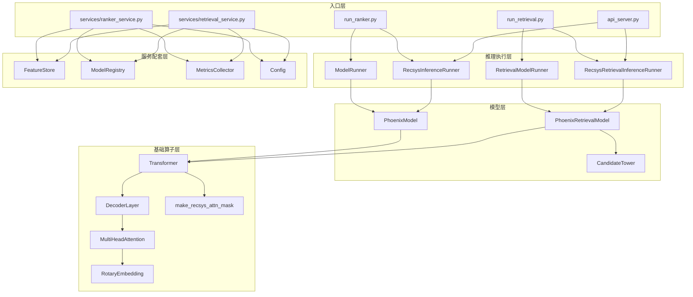
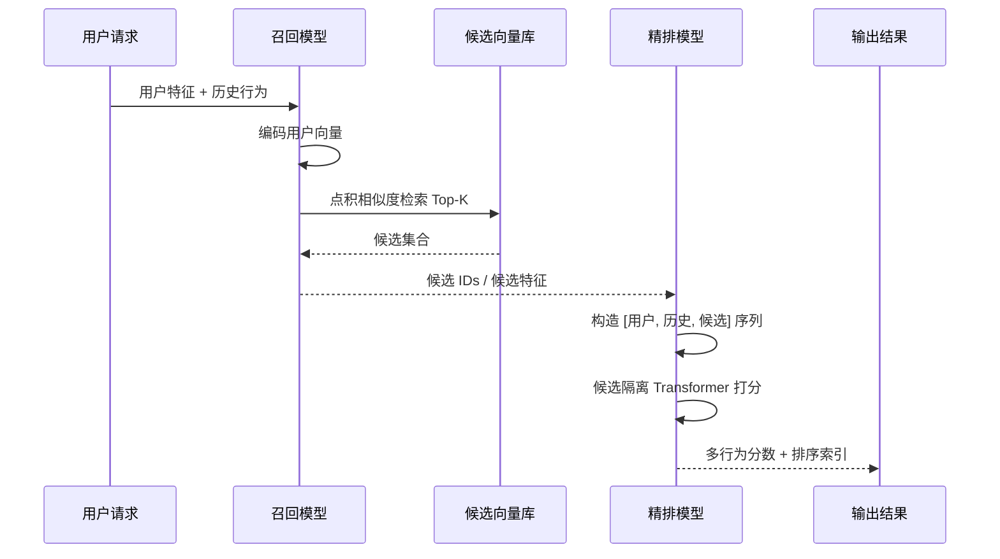
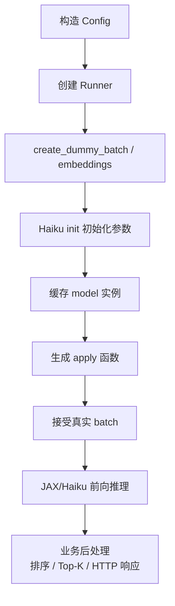

# Phoenix 系统总览

## 1. Phoenix 是什么

Phoenix 是一个两阶段推荐系统样例：

- 第一阶段做召回，从大规模候选池中取出少量高相关候选。
- 第二阶段做精排，对已召回候选进行更细的多目标打分与排序。

它不是一个“只有模型文件”的仓库，而是一个从模型、推理器、演示脚本到 HTTP 服务都具备的最小闭环。

## 2. 模块分层



## 3. 端到端业务流



## 4. Phoenix 里的核心数据结构

| 类型 | 位置 | 作用 | 关键形状 |
| --- | --- | --- | --- |
| `HashConfig` | `recsys_model.py` | 定义用户、物品、作者各用多少个哈希 embedding | 用户/物品/作者哈希数 |
| `RecsysBatch` | `recsys_model.py` | 承载原始离散特征、动作特征、场景特征 | 用户 `[B, H_u]`，历史 `[B, S, ...]`，候选 `[B, C, ...]` |
| `RecsysEmbeddings` | `recsys_model.py` | 承载特征查表后的 embedding | 用户 `[B, H_u, D]`，历史/候选 `[B, T, H, D]` |
| `PhoenixModelConfig` | `recsys_model.py` | 精排模型配置 | `emb_size`、`num_actions`、`history_seq_len`、`candidate_seq_len` |
| `PhoenixRetrievalModelConfig` | `recsys_retrieval_model.py` | 召回模型配置 | `emb_size`、`history_seq_len` |
| `RankingOutput` | `runners.py` | 精排后的概率与排序索引 | `scores [B, C, A]`、`ranked_indices [B, C]` |
| `RetrievalOutput` | `recsys_retrieval_model.py` / `runners.py` | 召回结果 | 用户向量 `[B, D]`、Top-K 索引 `[B, K]` |

## 5. 代码主路径

### 5.1 精排主路径

```text
run_ranker.py
  -> RecsysInferenceRunner.initialize()
  -> PhoenixModel.__call__()
  -> PhoenixModel.build_inputs()
  -> Transformer.__call__(candidate_start_offset != None)
  -> logits -> sigmoid -> argsort
```

### 5.2 召回主路径

```text
run_retrieval.py
  -> RecsysRetrievalInferenceRunner.initialize()
  -> PhoenixRetrievalModel.build_user_representation()
  -> PhoenixRetrievalModel._retrieve_top_k()
  -> Top-K 索引和分数
```

## 6. 初始化和推理生命周期



这里的关键点是：

- Phoenix 先用 dummy batch 触发 Haiku 参数创建。
- 然后把 `apply` 函数缓存起来，后续只喂真实数据。
- 当前仓库默认是“随机初始化参数 + 演示推理”，checkpoint 属于可选能力。

## 7. 当前系统边界

Phoenix 现在更像“推理框架样例 + 服务原型”，而不是完整生产系统：

- 没有训练入口、损失函数和数据管道。
- 没有真实 embedding lookup 服务，`services/feature_store.py` 主要是 mock。
- 没有真实 ANN 检索集成，`retrieval_service.py` 中 FAISS 仍是预留接口。
- 服务接口是可运行原型，但还不是生产级请求协议。

这些边界不是缺陷描述，而是阅读后续文档时必须带着的前提。
