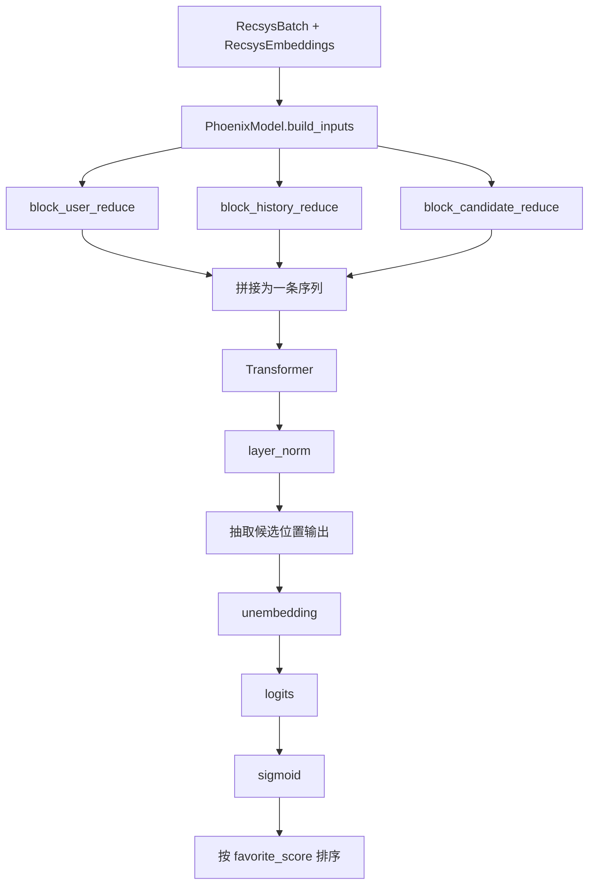
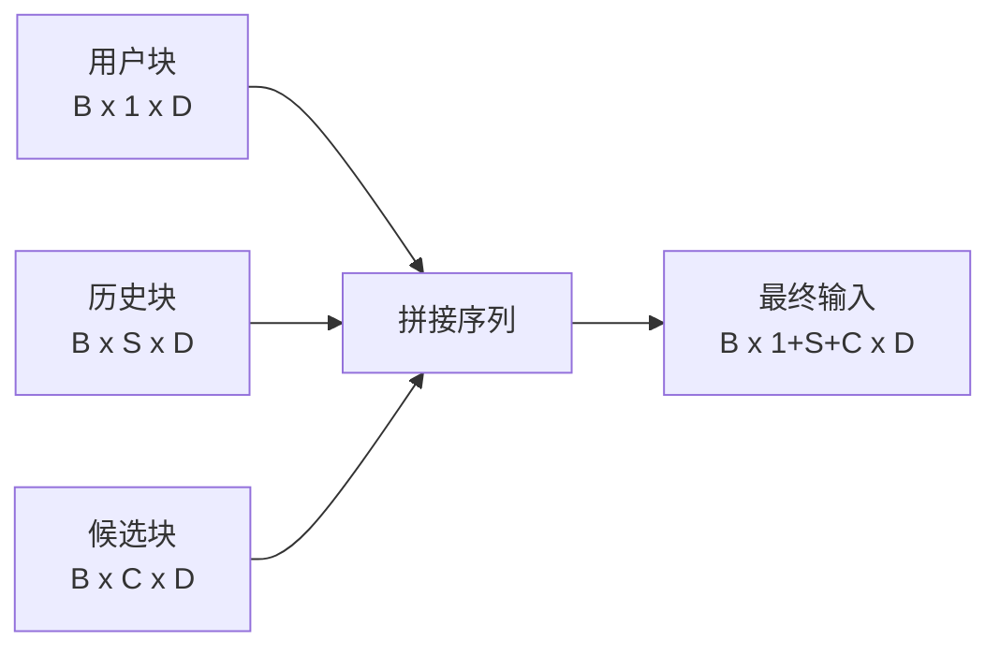
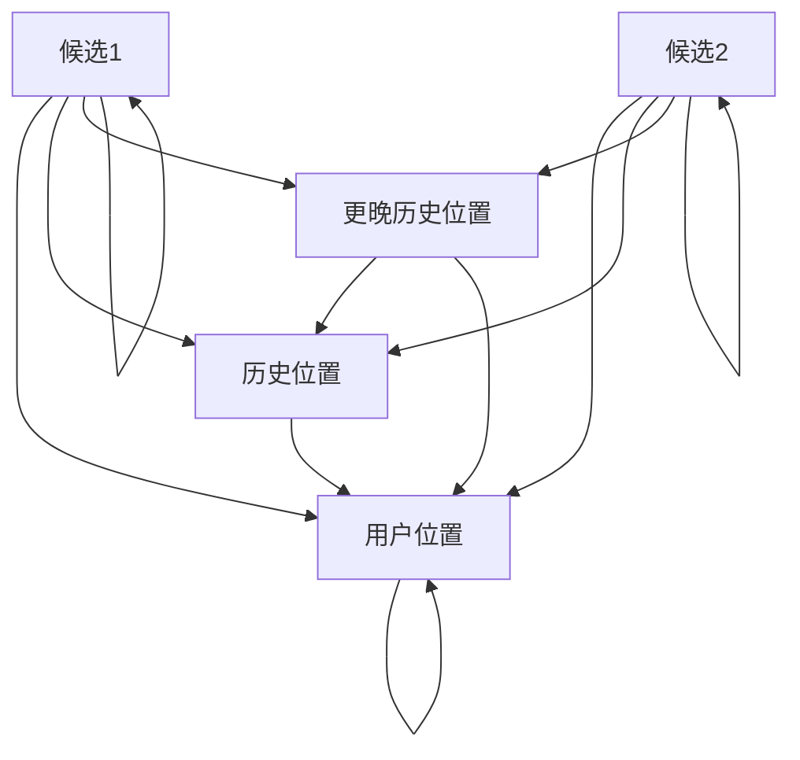
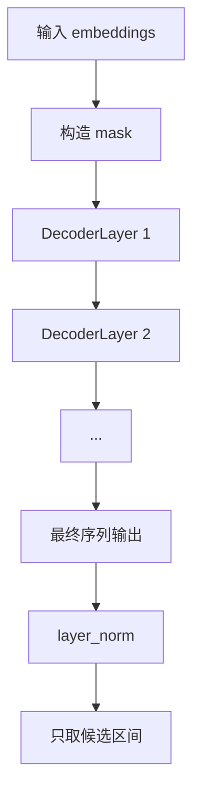

# Phoenix 精排链路分析

## 1. 精排要解决什么问题

精排阶段面对的是“已经召回出来的一小批候选”。它要解决的不是“从全库找谁”，而是：

- 如何把用户、历史、候选一起建模。
- 如何让一个候选的得分不受同批其他候选干扰。
- 如何一次前向同时输出多种行为分数。

Phoenix 的答案是：把用户、历史、候选拼成一条序列，再用一个带特殊 mask 的 Transformer 对候选逐个打分。

## 2. 代码结构



## 3. 输入组织方式

精排模型的输入不直接查 embedding，而是假设 embedding 已经准备好，因此输入拆成两部分：

- `RecsysBatch`：原始离散特征和动作特征。
- `RecsysEmbeddings`：外部查好的 embedding。

这两部分分别承担不同职责：

| 组件 | 典型字段 | 作用 |
| --- | --- | --- |
| `RecsysBatch` | `user_hashes`、`history_actions`、`candidate_product_surface` | 决定哪些位置有效，以及动作/场景等离散特征值 |
| `RecsysEmbeddings` | `user_embeddings`、`history_post_embeddings`、`candidate_author_embeddings` | 提供已经查好的连续向量 |

## 4. 三段特征归约

### 4.1 用户块

`block_user_reduce` 做三件事：

1. 把多个用户哈希 embedding 从 `[B, H_u, D]` 展平为 `[B, 1, H_u * D]`。
2. 用 `proj_mat_1` 投影回 `[B, 1, D]`。
3. 用 `user_hashes[:, 0] != 0` 生成 padding mask。

它要解决的是“多哈希 embedding 需要压成单个用户向量”的问题。

### 4.2 历史块

`block_history_reduce` 把下面几类特征拼在一起：

- 历史 post embedding
- 历史 author embedding
- 历史 action embedding
- 历史 product surface embedding

然后用 `proj_mat_3` 投影到 `[B, S, D]`。

### 4.3 候选块

`block_candidate_reduce` 与历史块近似，但少了动作特征，因为候选尚未发生互动。最终得到 `[B, C, D]`。

## 5. 最终序列是如何构造的



序列顺序固定为：

```text
[用户] + [历史1 ... 历史S] + [候选1 ... 候选C]
```

这个顺序非常关键，因为后续 attention mask 完全依赖 `candidate_start_offset = 1 + S`。

## 6. Phoenix 真正使用的注意力规则

这组文档讲的是演示链路 `grok.py`，不是生产 `xrex/`。

演示 `make_recsys_attn_mask` 的规则：

- 用户和历史部分使用下三角因果 mask。
- 候选能看到所有更早位置，也就是用户和全部历史。
- 候选之间互相看不到，只能看自己。

生产引擎 `xrex` 的 ranker attention 是 user+history 双向、明确不支持因果 mask。不要把下面这张图当成两套栈的共同事实。



上图省略了一条规则：`C1` 不会指向 `C2`，`C2` 也不会指向 `C1`。

## 7. 为什么要做候选隔离

如果候选之间能互相注意，那么同一个候选的分数会受“同批另外放了哪些候选”影响，导致：

- 在线结果不稳定。
- 排名不可解释。
- 批处理方式改变时分数漂移。

Phoenix 的解决方式是“共享上下文，不共享候选内部信息”：

- 候选共享同一个用户画像和历史上下文。
- 候选不共享彼此特征。

这让一次前向同时打多个候选成为可能，同时维持单候选评分的一致性。

## 8. Transformer 内部怎么工作

精排主干来自 `grok.py`：

- `RotaryEmbedding`：给 Q/K 注入相对位置信息。
- `MultiHeadAttention`：做注意力计算，支持 GQA 风格的 `num_q_heads` / `num_kv_heads`。
- `DenseBlock`：门控前馈层。
- `DecoderLayer`：Pre-Norm + Attention + FFN + 残差。
- `Transformer`：堆叠多层 Decoder。



## 9. 输出层和排序逻辑

精排模型本体 `PhoenixModel.__call__` 的输出是：

```text
logits: [B, C, num_actions]
```

之后 `RecsysInferenceRunner` 做了业务后处理：

1. `sigmoid(logits)` 转概率。
2. 取 `probs[:, :, 0]` 作为主排序分数。
3. 对该分数做降序排序，得到 `ranked_indices`。

这意味着当前代码中的“主排序行为”是 `favorite_score`，不是多目标融合结果。

## 10. 精排输出包含什么

`RankingOutput` 里除了总的 `scores` 和 `ranked_indices`，还展开了 19 个行为字段，例如：

- `p_favorite_score`
- `p_reply_score`
- `p_repost_score`
- `p_click_score`
- `p_dwell_score`

这样服务层可以直接把指定行为暴露给调用方，不必再做字段拆解。

## 11. 数值和实现细节

Phoenix 在实现上做了几件偏工程化的处理：

- 推理主 dtype 默认是 `bfloat16`，但 softmax、RMSNorm 关键步骤切回 `float32`。
- 注意力 logits 做了 `tanh` 截断，抑制极大值。
- padding 判断统一使用“首个哈希是否为 0”。
- 用户、历史、候选的多哈希 embedding 都用线性投影压回统一维度。

这些手段共同处理的是“混合精度推理稳定性”和“离散特征规模过大”的问题。

## 12. 当前精排链路的优点与边界

### 优点

- 能在一次前向里对多个候选并行打分。
- 候选互不干扰，便于部署。
- 一个模型同时输出多种行为目标。

### 边界

- 当前排序逻辑只用 `favorite_score`。
- 没有完整精排前向单元测试，主要只测了 attention mask。
- 训练期的 label 定义、损失函数和多目标融合方式见 `scripts/train_ranker.py` 的 `loss_fn`（前 18 个行为 BCE + dwell_time MSE）与 `docs/training/training_data_spec.md`。
