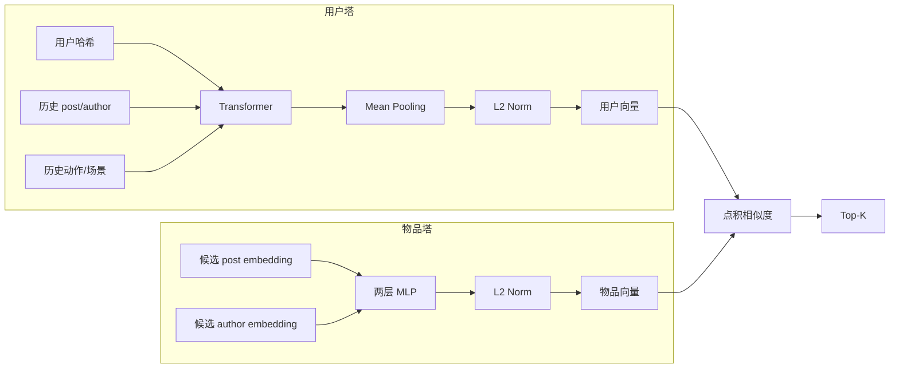
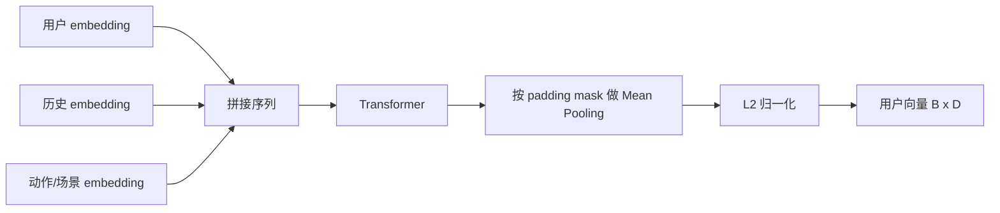
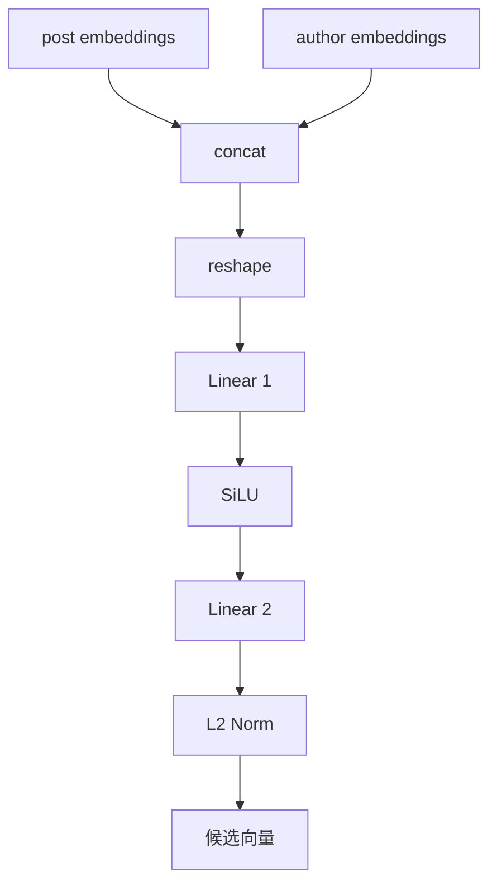
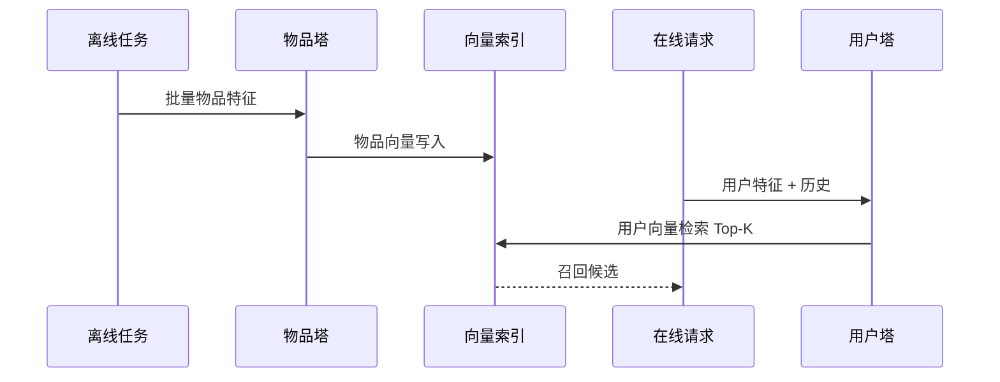
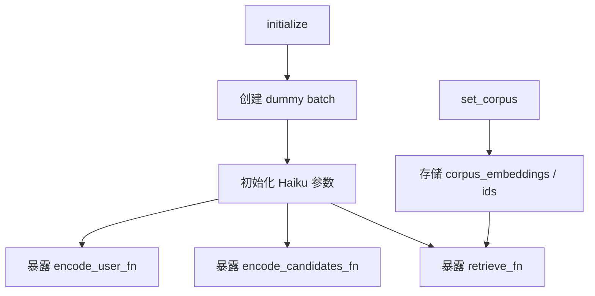

# Phoenix 召回链路分析

## 1. 召回要解决什么问题

召回阶段要解决的是规模问题：

- 候选池可能很大，不能直接把全量物品送进精排。
- 在线时延要低，不能每次请求都重算全量物品表示。

Phoenix 的做法是双塔：

- 用户塔在线编码用户向量。
- 物品塔离线编码物品向量。
- 在线用点积做 Top-K 检索。

## 2. 双塔结构



## 3. 用户塔流程

Phoenix 召回里的用户塔并不是另一套模型，而是复用了精排里的大部分输入组织方式。

它的步骤是：

1. `block_user_reduce` 聚合用户 embedding。
2. `block_history_reduce` 聚合历史 post / author / action / surface。
3. 拼接为 `[用户] + [历史]`。
4. 送入 `Transformer(candidate_start_offset=None)`。
5. 对有效位置做 Mean Pooling。
6. 做 L2 归一化。



这里有一个关键事实：召回用户塔沿用标准因果 mask，而不是精排里的候选隔离 mask，因为这条链路根本没有候选段。

## 4. 物品塔流程

物品塔由 `CandidateTower` 实现，结构比用户塔简单很多：

1. 把 `candidate_post_embeddings` 和 `candidate_author_embeddings` 拼在一起。
2. 展平成一个长向量。
3. 经过两层线性层，中间用 `SiLU` 激活。
4. 输出后做 L2 归一化。



这个设计体现了召回阶段的典型非对称性：

- 用户塔更重，负责建模时序兴趣。
- 物品塔更轻，便于离线批量编码。

## 5. 检索阶段怎么做 Top-K

`PhoenixRetrievalModel._retrieve_top_k` 的逻辑非常直接：

```text
scores = user_representation @ corpus_embeddings.T
top_k_scores, top_k_indices = jax.lax.top_k(scores, top_k)
```

如果传入 `corpus_mask`，还会先把无效位置分数置成极小值。

这里依赖一个前提：用户向量和物品向量都已经做过 L2 归一化，因此点积等价于余弦相似度。

## 6. 在线和离线边界



Phoenix 当前代码把这件事拆成两类能力：

- `encode_user`：在线用户编码。
- `encode_candidates`：离线候选编码。
- `retrieve`：给定用户向量和 corpus 向量后做在线检索。

## 7. Runner 层如何支持召回

`RecsysRetrievalInferenceRunner` 提供了三种调用方式：

- `encode_user(batch, embeddings)`：拿用户向量。
- `encode_candidates(batch, embeddings)`：拿候选向量。
- `retrieve(batch, embeddings, top_k)`：直接召回。

它还支持 `set_corpus(corpus_embeddings, corpus_post_ids)`，把全局候选池挂到 runner 上。



## 8. 召回服务里的实现状态

`services/retrieval_service.py` 中已经把“服务化接口”搭起来了，但当前状态仍是原型：

- `VectorIndex` 支持 mock 和预留的 FAISS 路径。
- 默认加载的是 `create_example_corpus` 生成的 mock corpus。
- `/v1/retrieve` 和 `/v1/encode_user` 仍使用 `create_example_batch` 构造演示 batch。

换句话说，服务骨架已经存在，但真实线上所需的三部分尚未接齐：

1. 真正的用户特征来源。
2. 真正的物品向量索引。
3. 真正的 checkpoint 管理策略。

## 9. 召回链路的优点与边界

### 优点

- 结构清晰，在线与离线边界明确。
- 用户塔复用精排的时序建模能力。
- 物品塔简单，适合离线大规模编码。

### 边界

- 当前没有真实 ANN 引擎接入。
- 当前候选池是随机生成，不代表真实内容分布。
- 当前测试覆盖了召回前向、归一化和 runner 调用，但没有服务级集成测试。
