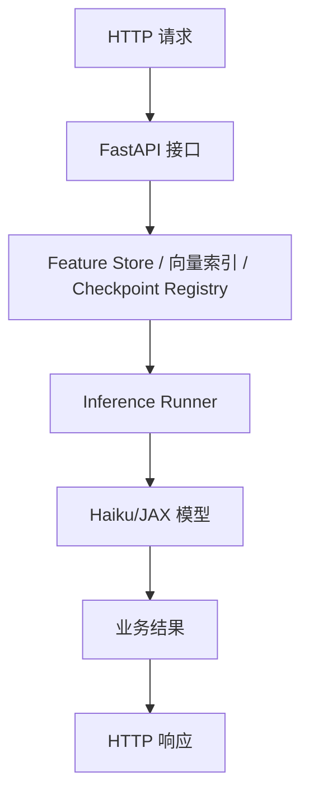
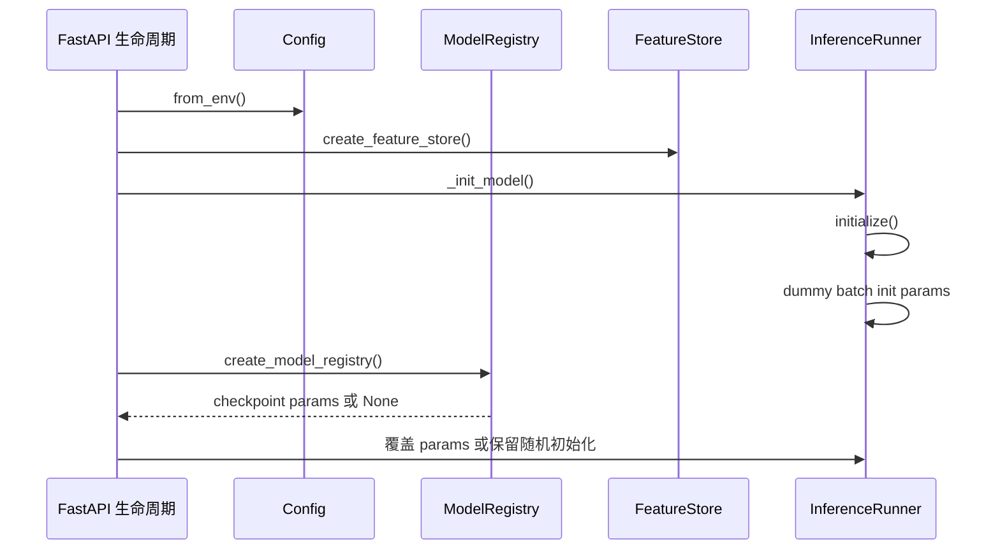
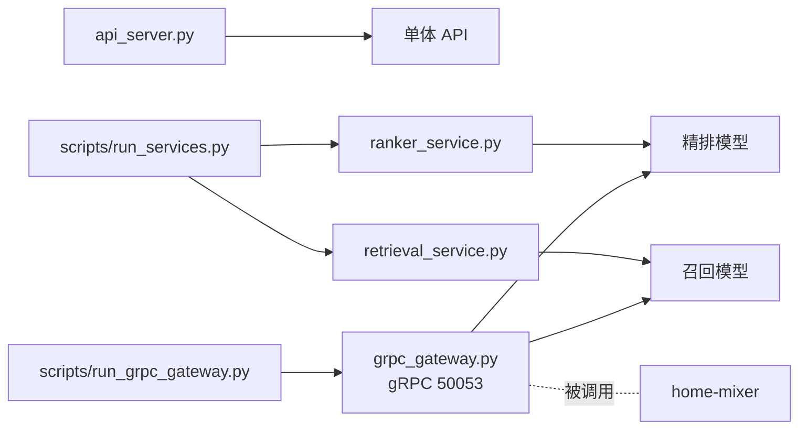
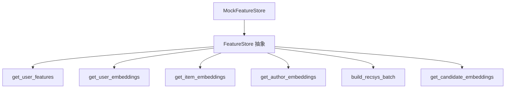
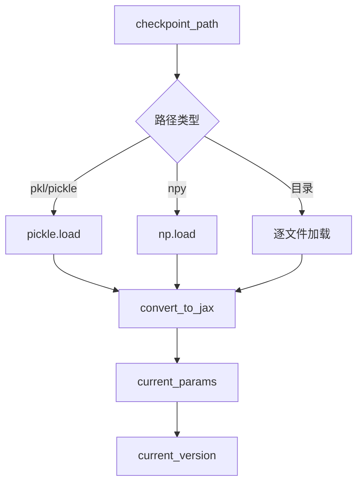
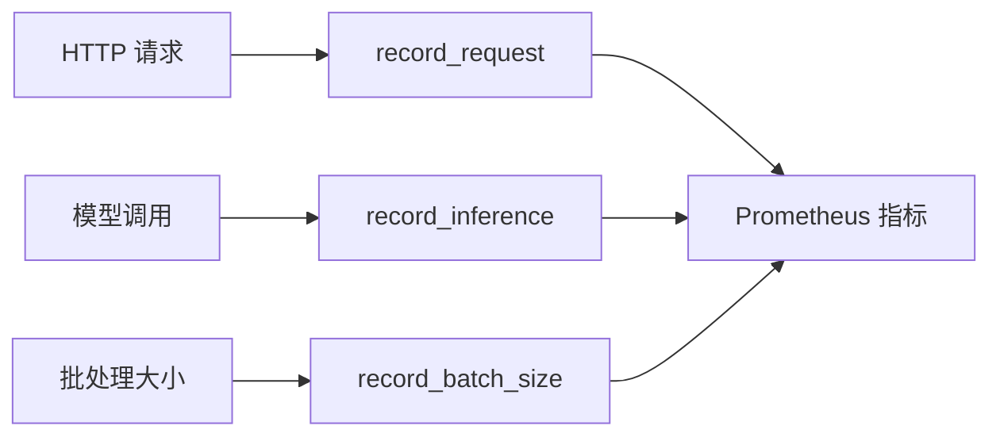
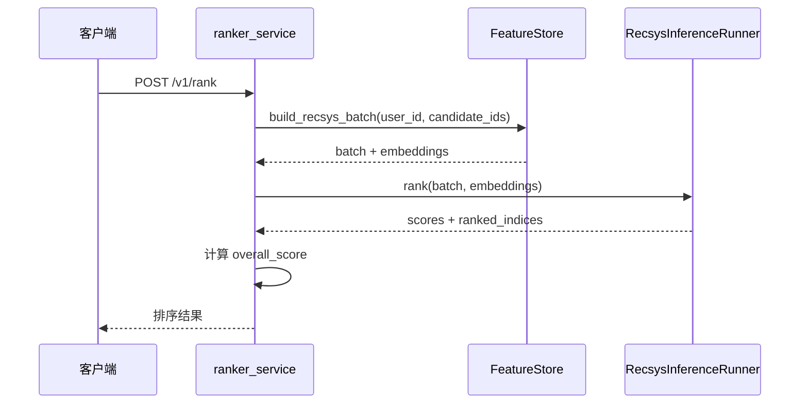
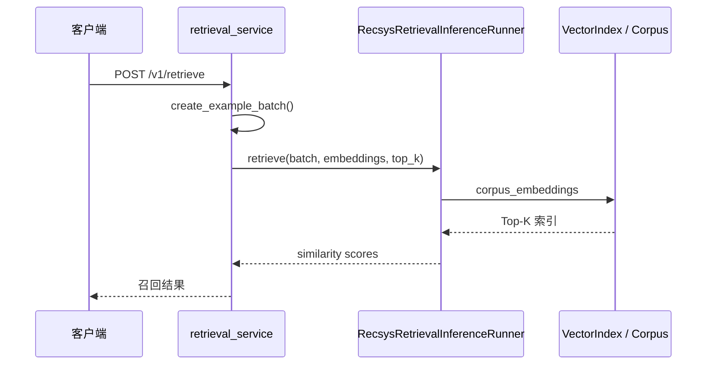

# Phoenix 服务化与运行时分析

## 1. Phoenix 如何从模型变成服务

Phoenix 的服务化不是直接把模型函数暴露出去，而是分成四层：

这个结构把“业务输入处理”和“模型推理”隔开了。

## 2. Runner 为什么存在

`runners.py` 的核心职责是把 Haiku 的 `init/apply` 生命周期管理起来。

如果没有 runner，服务层就需要自己处理：

- dummy 输入初始化参数
- `hk.transform` / `without_apply_rng`
- 参数缓存
- corpus 缓存
- 输出后处理

Phoenix 把这些统一收口在 runner 里，服务只关心：

- 用什么配置初始化模型
- 如何拿输入特征
- 如何返回 HTTP 响应

## 3. 初始化流程

当前召回服务（`retrieval_service.py`）走这个套路；精排服务（`ranker_service.py`）在策略模式重构后改为由 `create_strategy()` 装配 `RankingStrategy`（策略内部再完成 runner 初始化与 checkpoint 加载），切换策略只需设置 `RANKER_STRATEGY` 环境变量。

## 4. 两种 API 形态

Phoenix 里实际上存在两套 API 形态。

### 4.1 单体示例

`api_server.py` 同时挂了：

- `/v1/rank`
- `/v1/retrieve`
- `/health`

适合本地快速演示。

### 4.2 拆分服务

`services/` 下把精排和召回拆开：

- `services/ranker_service.py`：精排 HTTP 服务（FastAPI，8081）。
- `services/retrieval_service.py`：召回 HTTP 服务（FastAPI，8082）。
- `services/grpc_gateway.py`：gRPC 网关（50053），实现 `proto/definitions/recsys.proto` 的 `PhoenixPredictionService` / `PhoenixRetrievalService`，是 home-mixer 调用 Phoenix 的实际入口；与 HTTP 服务的区别是它真正消费请求里的用户行为序列来构造模型输入。生产 Rust 引擎用的是另一套 proto（`phoenix/crates/serving/xai-recsys-proto`），不要和演示网关混用。

适合生产化部署时分开扩容和隔离资源。

## 5. 配置体系

`services/config.py` 提供四类配置：

- `ModelConfig`：模型结构参数。
- `RankerServiceConfig`：精排服务配置。
- `RetrievalServiceConfig`：召回服务配置。
- `FeatureServiceConfig`：特征服务配置（含 Redis 后端参数）。

配置来源是环境变量，例如：

- `RANKER_PORT`
- `RETRIEVAL_PORT`
- `RANKER_CHECKPOINT_PATH`
- `FAISS_INDEX_PATH`
- `ENABLE_METRICS`

这样做的意义是把“模型结构”和“部署行为”分开管理。

## 6. 特征服务抽象

`services/feature_store.py` 定义了 `FeatureStore` 抽象层，当前唯一实现是 `MockFeatureStore`。

它承担的职责是把“原始业务 ID”转成模型需要的：

- `RecsysBatch`
- `RecsysEmbeddings`

当前它的定位是开发模拟，不是生产实现。

## 7. Checkpoint 与版本管理

`services/model_registry.py` 做了一个轻量注册表：

- 支持 `.npz`（训练脚本标准产物）、`.pkl`、`.pickle`、`.npy`、目录格式。
- 能把 `numpy` 参数转成 `jax` 参数。
- 支持按文件修改时间检查热更新。

需要注意两点：

- 没提供 checkpoint 时，系统允许随机初始化继续运行。
- 当前 health 和请求处理中会重新 `create_model_registry(...)` 取版本，属于简化实现，不是高效实现。

## 8. 监控体系

`services/metrics.py` 使用 Prometheus 客户端，当前支持：

- 请求延迟
- 请求计数
- 推理延迟
- batch size 分布
- 服务信息

如果没安装 `prometheus_client`，会退化为 `NoOpMetricsCollector`。

## 9. 精排服务请求路径

当前 `overall_score` 是服务层手工加权：

- `favorite * 0.4`
- `reply * 0.2`
- `repost * 0.2`
- `click * 0.1`
- `dwell * 0.1`

也就是说，服务层已经引入了一个“展示用综合分”，而模型层本身没有内建这个融合逻辑。

## 10. 召回服务请求路径

这里能看出一个重要现状：召回服务还没有真正从 `FeatureStore` 获取用户输入，而是仍在用示例 batch。

## 11. 为什么要拆分成两个服务

拆分服务的核心收益不是代码风格，而是运行时特性不同：

| 维度 | 精排服务 | 召回服务 |
| --- | --- | --- |
| 计算特征 | 对少量候选做重模型打分 | 对大候选池做快速检索 |
| 资源倾向 | 更可能吃 GPU/高算力 | 更可能吃 CPU/内存/索引 |
| 扩容方式 | 按请求复杂度扩 | 按 QPS 和索引规模扩 |
| 状态依赖 | 模型参数 | 模型参数 + 向量索引 |

Phoenix 的 `run_services.py` 已经把这个拆分思路体现出来了。

## 12. 当前服务化程度评价

### 已具备

- 服务边界明确。
- 配置、特征、checkpoint、监控都有独立模块。
- 精排和召回可分开启动。

### 还缺少

- 真正的外部特征服务接入。
- 真正的向量索引接入和热刷新。
- 服务级测试、并发测试、压测数据。
- 更严格的模型版本与发布策略。
