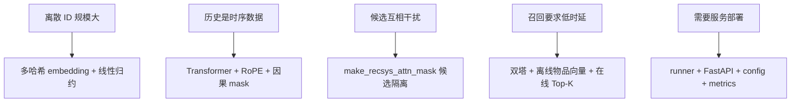
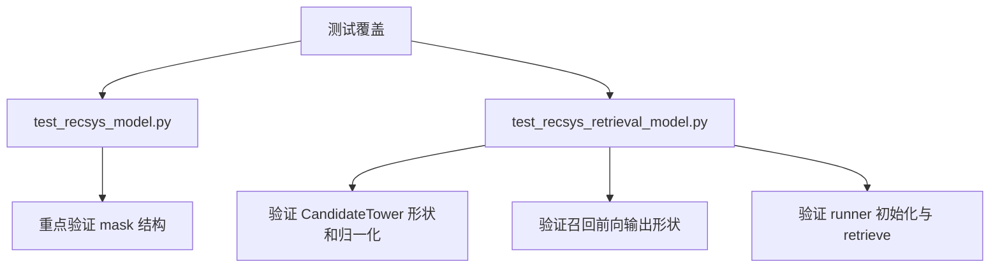

# Phoenix 处理的问题、实现手段与当前风险

## 1. Phoenix 主要在处理哪些问题

Phoenix 当前代码针对的是推荐系统里最典型的五类问题：

1. 大规模离散 ID 无法直接做全量 embedding。
2. 用户历史是序列，顺序和上下文都很重要。
3. 多候选并行评分时会出现候选相互污染。
4. 召回阶段必须把在线时延压到很低。
5. 模型要能被服务化，而不是只能离线脚本调用。

## 2. 问题与实现的对应关系

## 3. 逐项展开

### 3.1 大规模离散特征问题

问题本质：

- 用户 ID、物品 ID、作者 ID 的空间很大。
- 直接维护巨大的独立 embedding 表成本高。

Phoenix 的处理方式：

- 对用户、物品、作者分别使用多个 hash embedding。
- 在 `block_user_reduce`、`block_history_reduce`、`block_candidate_reduce` 中把多哈希结果展平后再投影回统一维度。

这样做的收益是：

- 控制参数规模。
- 让多来源 embedding 最终落到统一维度。

代价是：

- 会引入哈希碰撞。
- 需要投影层去吸收碰撞和特征混合带来的噪声。

### 3.2 用户兴趣时序建模问题

问题本质：

- 历史行为不仅是集合，更是带顺序的序列。
- 旧行为和新行为对当前兴趣的影响不同。

Phoenix 的处理方式：

- 召回和精排都复用 `Transformer`。
- Q/K 使用 `RotaryEmbedding` 注入相对位置信息。
- 非候选区段使用因果 mask，确保位置只能看见过去。

这使得模型不是简单平均历史，而是在顺序约束下建模兴趣演化。

### 3.3 多候选并行评分问题

问题本质：

- 把多个候选一起送进一个 Transformer 很高效。
- 但如果它们能互相注意，单个候选得分会依赖同批其他候选。

Phoenix 的处理方式：

- 在 `make_recsys_attn_mask` 中保留候选对用户和历史的可见性。
- 把候选区块的相互注意清零，只保留对角线自注意。

这是 Phoenix 在精排设计里最关键的工程点。

### 3.4 大规模检索时延问题

问题本质：

- 召回必须从非常大的候选池里快速找出少量候选。
- 不可能在线逐个跑复杂交叉模型。

Phoenix 的处理方式：

- 用户塔在线编码用户向量。
- 物品塔离线编码物品向量。
- 在线只做向量相似度和 Top-K。

这正是双塔架构存在的原因。

### 3.5 模型落地问题

问题本质：

- 研究代码和服务代码之间常有鸿沟。
- 模型如果不能被初始化、加载、监控、暴露接口，就很难落地。

Phoenix 的处理方式：

- 用 `runners.py` 收口模型初始化和前向调用。
- 用 `services/config.py` 管环境配置。
- 用 `services/model_registry.py` 管 checkpoint。
- 用 `services/metrics.py` 管监控。

这让模型、服务、配置三层关系变得明确。

## 4. 当前测试覆盖情况

### 已覆盖

- `make_recsys_attn_mask` 的结构和边界情况。
- 召回模型输出 shape。
- 用户向量、候选向量的 L2 归一化。
- 召回 runner 的初始化与调用。

### 未充分覆盖

- 精排模型完整前向。
- 精排 logits 到 `RankingOutput` 的行为字段映射。
- 服务层接口和异常路径。
- checkpoint 加载与热更新。
- 真实 feature store / vector index 集成。

## 5. 当前最值得关注的风险

## 5.1 文档与代码认知偏差

仓库里已有部分旧文档把“用户+历史区段”描述成全双向注意力，但实际代码是因果 mask。  
这类偏差会直接影响对模型行为的理解，尤其是训练/推理一致性分析。

## 5.2 精排测试不足

当前精排最关键的候选隔离已经有 mask 测试，但没有完整的模型前向测试去验证：

- 输入 shape 是否稳定。
- 候选区间切片是否正确。
- `favorite_score` 作为主排序依据是否符合预期。

## 5.3 服务层仍偏原型

尤其是召回服务，当前仍有明显原型特征：

- 用 `create_example_batch` 代替真实用户特征。
- `VectorIndex` 默认回退 mock corpus。
- 没有完整 ANN 检索闭环。

## 5.4 训练闭环缺失

当前代码能说明“推理时怎么做”，但还不能完整说明：

- 参数如何训练得来。
- 多目标 loss 如何定义。
- 负采样、召回训练、精排训练如何配合。

这意味着 Phoenix 目前更适合做推理结构分析，而不是训练策略分析。

## 5.5 默认随机初始化导致结果只具备演示意义

当前 runner 和服务都允许在没有 checkpoint 的情况下直接随机初始化运行。  
在实际运行 `run_ranker.py` 时，可以观察到所有行为概率接近 `0.5`，这说明：

- 链路是通的。
- 输出 shape 和后处理逻辑是通的。
- 但结果本身不具备业务判断价值。

因此 Phoenix 当前默认演示更适合拿来解释结构，不适合拿来评估排序效果。

## 6. 对 Phoenix 当前成熟度的判断

可以把 Phoenix 看成三层成熟度的混合体：

| 层次 | 当前状态 |
| --- | --- |
| 模型结构 | 清晰，核心想法完整 |
| 推理执行 | 完整，runner 封装较好 |
| 生产对接 | 骨架已搭好，但外部系统多为 mock |

## 7. 推荐后续补强方向

1. 给精排补完整前向和排序结果测试。
2. 给服务层补 API 集成测试。
3. 接入真实特征服务和真实向量索引。
4. 明确训练流程、loss、样本构造和 checkpoint 契约。
5. 把旧文档中与代码不一致的 attention 描述统一修正。

## 8. 总结

Phoenix 当前最有价值的部分，不是“功能特别多”，而是它把推荐系统最核心的结构问题已经明确表达出来了：

- 精排为什么需要候选隔离。
- 召回为什么必须做双塔。
- 多哈希 embedding 如何收口。
- 模型怎样通过 runner 和服务层暴露出去。

如果按代码事实来读，Phoenix 是一个很适合做推荐系统推理结构学习和原型扩展的基座。
