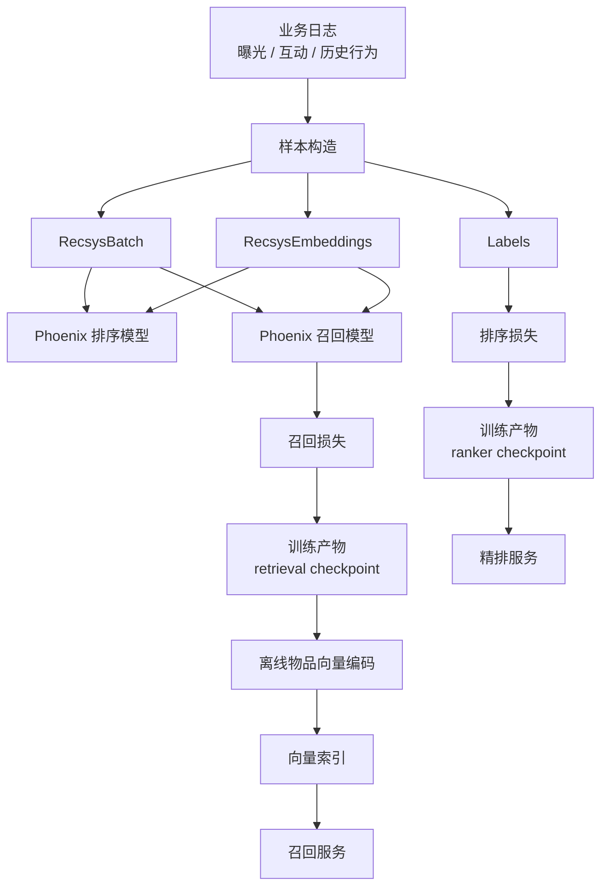
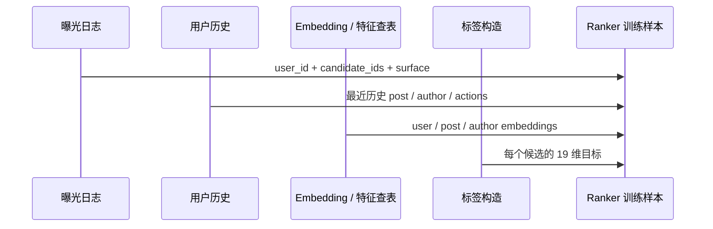
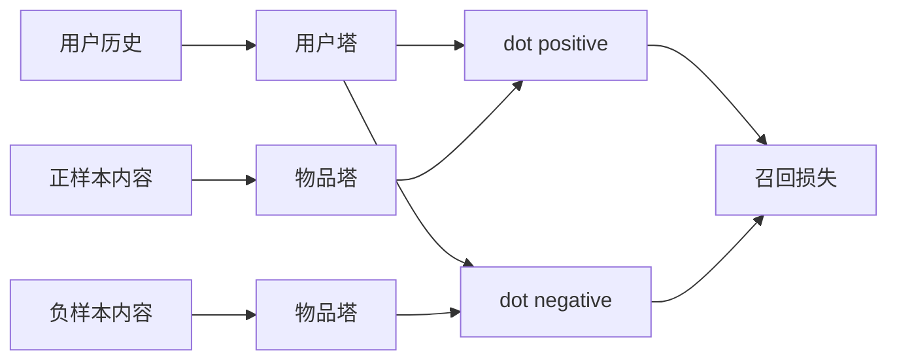
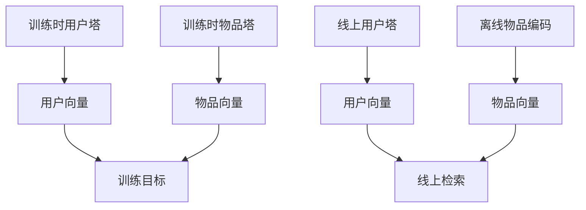
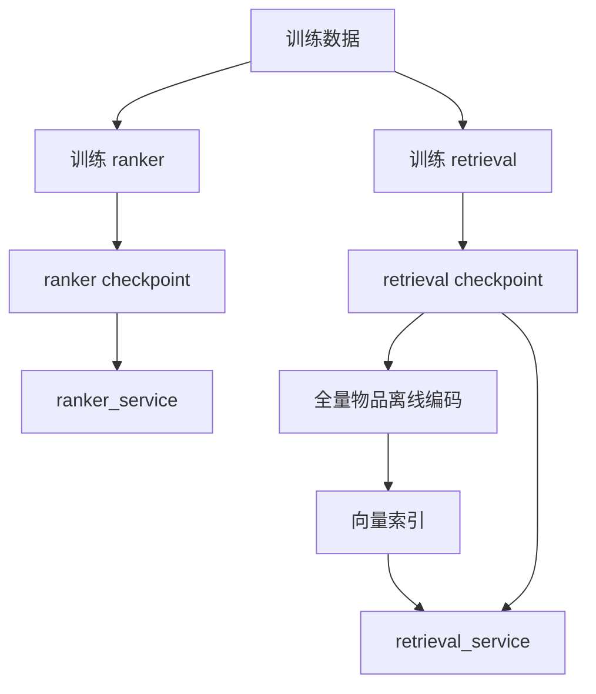

# Phoenix 训练侧分析

## 1. 这篇文档的边界

> 更新说明：训练脚本现已落地——`phoenix/scripts/train_ranker.py`（精排）和 `phoenix/scripts/train_retrieval.py`（召回）实现了训练循环、损失函数、Parquet 数据加载和 checkpoint 保存。**怎么跑训练**请看 [phoenix/docs/训练指引.md](../../phoenix/docs/训练指引.md) 和 [getting-started 第三步](../getting-started/04-第三步-训练自己的模型.md)。本文保留的价值是从模型接口出发解释训练契约的"为什么"。

这篇文档分成两层事实：

- 代码已明确表达的训练输入契约：来自 `RecsysBatch`、`RecsysEmbeddings`、模型输出形状。
- 结合现有规格文档描述的训练闭环：主要参考仓库中的 [../training/training_data_spec.md](../training/training_data_spec.md)。

凡是属于第二类内容，本文都会明确标注为“推断”。

## 2. 训练侧总图



## 3. 训练输入契约来自哪里

Phoenix 的训练输入契约虽然没有被训练代码消费，但已经被模型结构固定下来了。

### 3.1 排序模型输入契约

`recsys_model.py` 给出了排序模型最核心的三个契约：

- 原始离散特征通过 `RecsysBatch` 进入模型。
- 连续 embedding 通过 `RecsysEmbeddings` 进入模型。
- 输出是 `[B, C, num_actions]` 的多目标 logits。

### 3.2 召回模型输入契约

`recsys_retrieval_model.py` 固定了：

- 用户塔输入仍是 `RecsysBatch + RecsysEmbeddings`。
- 用户塔输出是 `[B, D]` 的归一化用户向量。
- 物品塔输出是 `[B, C, D]` 的归一化候选向量。

因此，即使训练代码缺失，训练数据格式已经被模型接口约束住了。

## 4. 排序模型应该如何构造训练样本

这一部分与 [../training/training_data_spec.md](../training/training_data_spec.md) 一致，也和当前模型接口完全兼容。

### 4.1 一条排序样本是什么

一条排序样本可以理解为一次曝光事件：

- 某个用户
- 在某个时刻
- 看到一组候选内容
- 之后对这些候选产生或未产生若干互动



### 4.2 排序标签的自然形状

对照当前 `PhoenixModel` 的输出，排序训练标签最自然的形状是：

```text
labels: [B, C, num_actions]
```

这和 [../training/training_data_spec.md](../training/training_data_spec.md) 中的 `labels [B, 8, 19]` 是一致的。

### 4.3 当前代码暗示的目标语义

从 `ACTIONS` 常量可见，排序模型同时预测 19 类目标，其中包含：

- 二分类行为：如 `favorite_score`、`reply_score`、`repost_score`
- 连续值行为：如 `dwell_time`

这意味着训练时大概率不是单一损失，而是多目标组合损失。

## 5. 召回模型应该如何构造训练样本

这里需要区分代码事实和训练推断。

### 5.1 代码事实

召回模型当前支持的两个中间产物是：

- 用户表示 `user_representation`
- 物品表示 `candidate_representation`

两者都做了 L2 归一化，因此训练目标一定会围绕“拉近正样本、推远负样本”的相似度学习展开。

### 5.2 训练推断

在没有显式训练代码的情况下，最合理的召回训练方式是双塔常见范式：

- 正样本：用户真实互动过的内容。
- 负样本：同曝光未互动内容、随机内容或 hard negatives。
- 损失：点积相似度上的 softmax / 对比学习 / sampled softmax。



## 6. 排序训练与召回训练的区别

| 维度 | 排序训练 | 召回训练 |
| --- | --- | --- |
| 目标 | 精确预测多种互动概率 | 快速学到可检索的匹配向量 |
| 输入 | 用户 + 历史 + 候选组 | 用户 + 正负候选 |
| 模型交互 | 候选共享上下文但互相隔离 | 用户塔与物品塔独立编码 |
| 典型损失 | 多任务 BCE / regression 组合 | 对比损失 / sampled softmax |
| 输出产物 | ranker checkpoint | retrieval checkpoint + item embeddings |

## 7. 训练与推理如何保持一致

这是 Phoenix 训练侧最关键的设计问题之一。

### 7.1 排序一致性

排序训练如果要和推理一致，必须遵守下面几条：

- 样本中的候选顺序和 `candidate_start_offset` 逻辑一致。
- padding 规则和推理一致，0 必须保留为 padding hash。
- 动作 embedding、product surface embedding 的编码方式保持一致。
- attention mask 必须用当前代码中的候选隔离逻辑，而不是文档误读出的“双向注意力”版本。

### 7.2 召回一致性

召回训练和推理的一致性主要体现在：

- 用户塔结构和在线编码结构一致。
- 物品塔结构和离线编码结构一致。
- 训练期相似度定义与线上 Top-K 检索一致。



## 8. 现有训练数据规格能支持到什么程度

仓库内的 [training_data_spec.md](../training/training_data_spec.md) 已经提供了较完整的数据规格，包括：

- 曝光事件表
- 行为日志表
- 用户历史序列表
- 哈希计算方法
- `dwell_time` 归一化方法
- 推荐的 Parquet 结构

它解决的是“训练样本怎么抽、字段怎么落”的问题，但还没有解决：

- 损失函数怎么写
- 优化器怎么配
- 多目标权重怎么调
- retrieval 的负采样怎么做

## 9. 可以推断出的训练产物链路



这条链路和当前 `services/model_registry.py`、`services/retrieval_service.py` 的接口设计是匹配的，说明服务层已经为“未来接入真实训练产物”预留了位置。

## 10. 当前训练侧缺口

Phoenix 离完整训练闭环还差几块核心模块：

1. 训练入口脚本。
2. 排序损失函数与指标。
3. 召回损失函数与负采样实现。
4. 数据加载器和 batch 组装器。
5. checkpoint 保存与恢复策略。
6. 离线物品向量导出任务。

## 11. 对当前仓库最合理的训练侧判断

Phoenix 目前不是“训练框架”，而是“训练接口已经隐含在推理结构里的模型原型”。  
它已经把训练时最难改的几件事固定住了：

- 输入张量契约
- 模型结构契约
- 排序与召回的职责边界
- 服务侧产物消费方式

但它尚未把训练程序本身实现出来。

## 12. 如果继续补到可训练，优先级应该是什么

1. 先补排序训练，因为排序输出和标签定义最明确。
2. 再补召回训练，因为召回需要额外定义正负样本与评估集。
3. 最后把 checkpoint、离线编码、向量索引串成离线任务。

这是因为当前仓库里排序模型的目标定义已经最完整，召回部分还需要更多训练策略决策。
