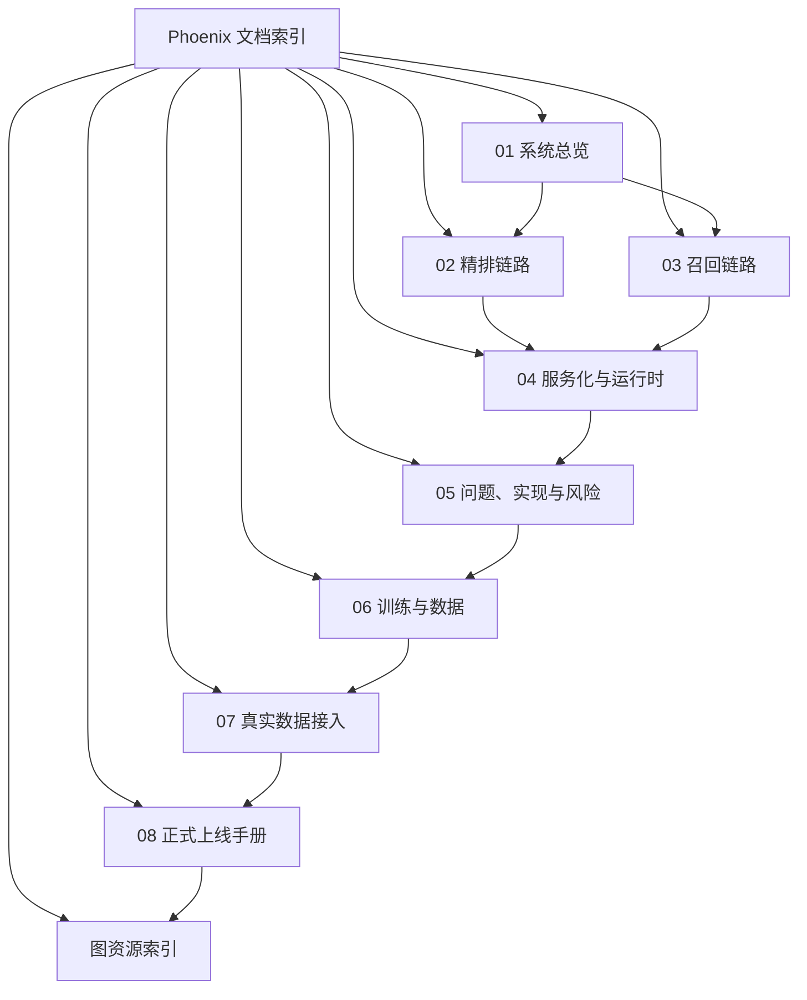
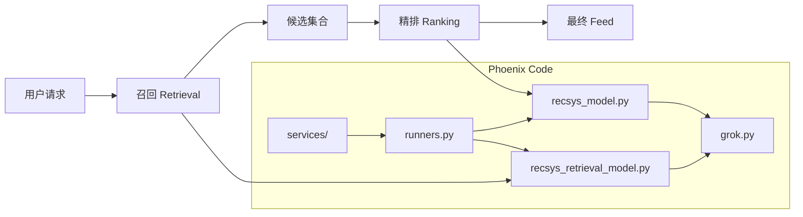

# Phoenix 系统分析文档

本文档组面向 `phoenix/` 子项目，定位是**代码导读**——把 Phoenix 推荐系统拆成一组可以连续阅读的文档，重点回答三个问题：

1. 系统整体是怎么组织的。
2. 排序、召回分别在处理什么问题，流程如何展开。
3. 当前代码已经实现了什么，还缺什么。

**想动手操作**（跑演示、训练、接真实数据、起服务）请直接看 [getting-started](../getting-started/) 和 [phoenix/docs/](../../phoenix/docs/) 里的操作手册，那里的命令是唯一事实源。

## 阅读顺序

1. [01-system-overview.md](01-system-overview.md)：先建立总图，理解模块和数据结构。
2. [02-ranking-pipeline.md](02-ranking-pipeline.md)：看精排链路和候选隔离机制。
3. [03-retrieval-pipeline.md](03-retrieval-pipeline.md)：看双塔召回和向量检索。
4. [04-serving-and-runtime.md](04-serving-and-runtime.md)：看 runner、API、配置、监控、checkpoint。
5. [05-problems-implementation-and-risks.md](05-problems-implementation-and-risks.md)：看 Phoenix 在解决什么问题、如何解决，以及当前风险。
6. [06-training-and-data.md](06-training-and-data.md)：看训练侧闭环、样本构造、标签与产物。
7. [07-real-data-integration.md](07-real-data-integration.md)：看真实业务数据如何映射到当前模型输入。
8. [08-production-handbook.md](08-production-handbook.md)：按生产主线准备数据、训练、评估、部署和上线。
9. [assets/README.md](assets/README.md)：看导出的 Mermaid 图资源索引。

## 文档地图



## Phoenix 在仓库里的位置

`phoenix/` 里有两套代码：

- **演示链路**（getting-started 和 home-mixer 演示走这条）：`grok.py`、`recsys_model.py`、`recsys_retrieval_model.py`、`runners.py`、`scripts/`、`services/`。macOS 可跑，gRPC 网关实现仓库根上的 `proto/definitions/recsys.proto`。
- **生产引擎**（Linux + CUDA）：`xrex/`、`python/`、`crates/serving/`。自己的 proto 在 `phoenix/crates/serving/xai-recsys-proto`。入口见 [`phoenix/README.md`](../../phoenix/README.md) 和 `QUICKSTART.md`。

下面这组文档主要讲演示链路。生产引擎以 `phoenix/README.md` 为准。

## 一张总图



## 事实边界

这组文档严格以当前代码为准，因此有几个判断需要提前说明：

- 当前仓库覆盖推理、服务封装、样例数据和基础训练（`scripts/train_*.py`）；持续训练、评估与发版的例行化仍需自建。
- 当前精排排序依据是 `favorite_score` 的 Sigmoid 概率，不是学习到的最终融合分。
- 当前召回服务默认使用 mock corpus 和 mock 特征，不是外部真实向量索引。
- 未加载 checkpoint 时，演示结果主要用于验证链路是否跑通，不代表有效排序质量。
- 当前测试覆盖最充分的是召回主链路和注意力 mask；精排完整前向测试明显不足。

## 代码阅读主线

如果只看最短路径，建议按下面的调用链读：

```text
scripts/run_ranker.py / scripts/run_retrieval.py
    -> runners.py
        -> recsys_model.py / recsys_retrieval_model.py
            -> grok.py
```

服务化路径则是：

```text
api_server.py、services/*_service.py 或 services/grpc_gateway.py
    -> runners.py
        -> recsys_model.py / recsys_retrieval_model.py
            -> grok.py
```
