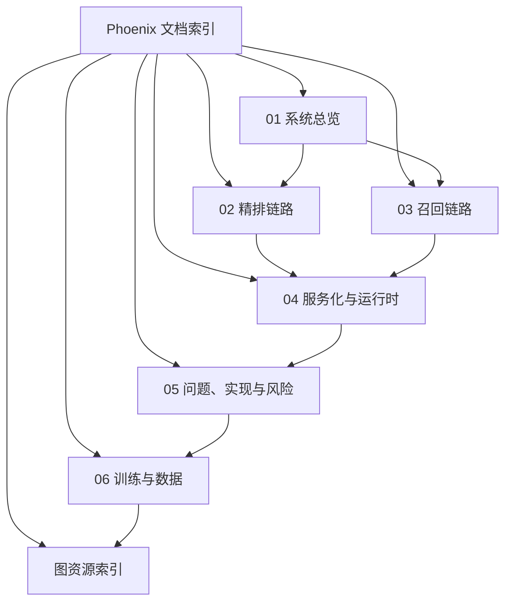
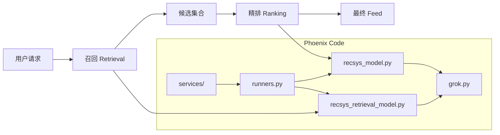

# Phoenix 系统分析文档

本文档组面向 `phoenix/` 子项目，目标是把代码里的 Phoenix 推荐系统拆成一组可以连续阅读的文档，重点回答三个问题：

1. 系统整体是怎么组织的。
2. 排序、召回分别在处理什么问题，流程如何展开。
3. 当前代码已经实现了什么，还缺什么。

## 阅读顺序

1. [01-system-overview.md](01-system-overview.md)：先建立总图，理解模块和数据结构。
2. [02-ranking-pipeline.md](02-ranking-pipeline.md)：看精排链路和候选隔离机制。
3. [03-retrieval-pipeline.md](03-retrieval-pipeline.md)：看双塔召回和向量检索。
4. [04-serving-and-runtime.md](04-serving-and-runtime.md)：看 runner、API、配置、监控、checkpoint。
5. [05-problems-implementation-and-risks.md](05-problems-implementation-and-risks.md)：看 Phoenix 在解决什么问题、如何解决，以及当前风险。
6. [06-training-and-data.md](06-training-and-data.md)：看训练侧闭环、样本构造、标签与产物。
7. [assets/README.md](assets/README.md)：看导出的 Mermaid 图资源索引。

## 文档地图



## Phoenix 在仓库里的位置

Phoenix 是一个独立的 Python 3.11/JAX 子项目，核心文件集中在 `phoenix/`：

- `grok.py`：Transformer 基础实现。
- `recsys_model.py`：精排模型。
- `recsys_retrieval_model.py`：召回模型。
- `runners.py`：把 Haiku/JAX 模型封装成可初始化、可调用的推理器。
- `run_ranker.py` / `run_retrieval.py`：本地演示入口。
- `api_server.py`：单体 API 示例。
- `services/`：拆分后的精排服务、召回服务及其配套组件。
- `test_recsys_model.py` / `test_recsys_retrieval_model.py`：当前测试。

## 一张总图



## 事实边界

这组文档严格以当前代码为准，因此有几个判断需要提前说明：

- 当前仓库主要覆盖推理、服务封装和样例数据，不包含完整训练流水线。
- 当前精排排序依据是 `favorite_score` 的 Sigmoid 概率，不是学习到的最终融合分。
- 当前召回服务默认使用 mock corpus 和 mock 特征，不是外部真实向量索引。
- 未加载 checkpoint 时，演示结果主要用于验证链路是否跑通，不代表有效排序质量。
- 当前测试覆盖最充分的是召回主链路和注意力 mask；精排完整前向测试明显不足。

## 代码阅读主线

如果只看最短路径，建议按下面的调用链读：

```text
run_ranker.py / run_retrieval.py
    -> runners.py
        -> recsys_model.py / recsys_retrieval_model.py
            -> grok.py
```

服务化路径则是：

```text
api_server.py 或 services/*.py
    -> runners.py
        -> recsys_model.py / recsys_retrieval_model.py
            -> grok.py
```
